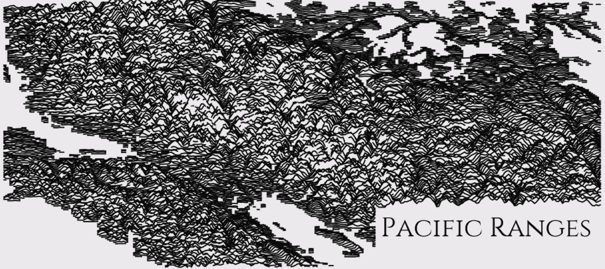
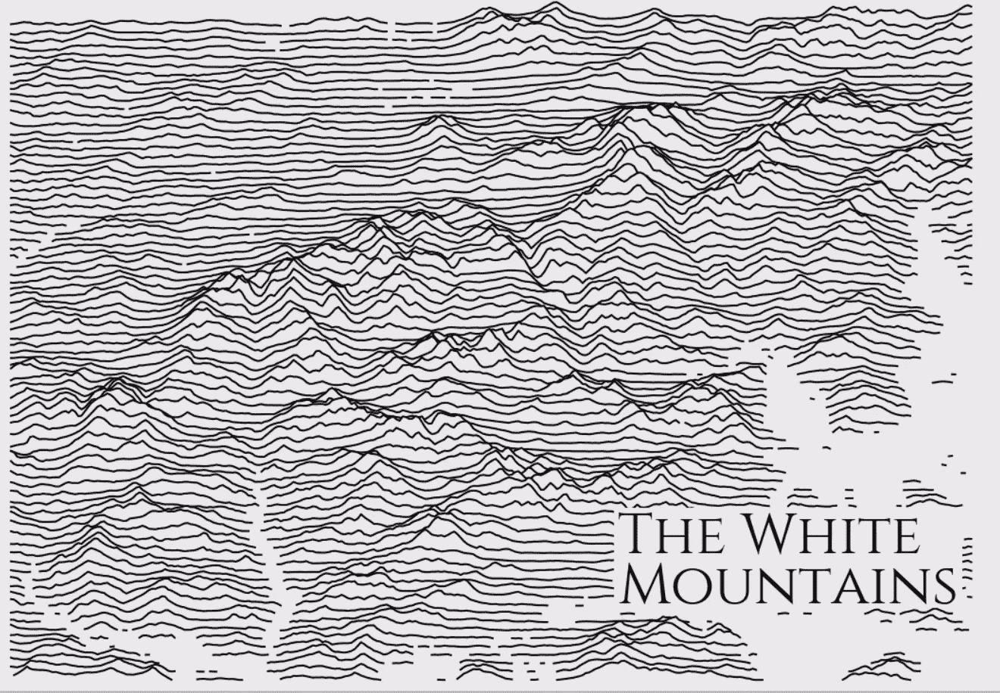
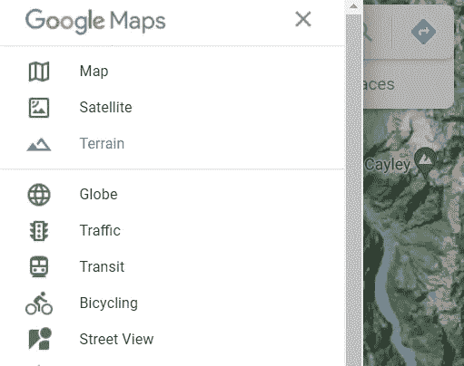
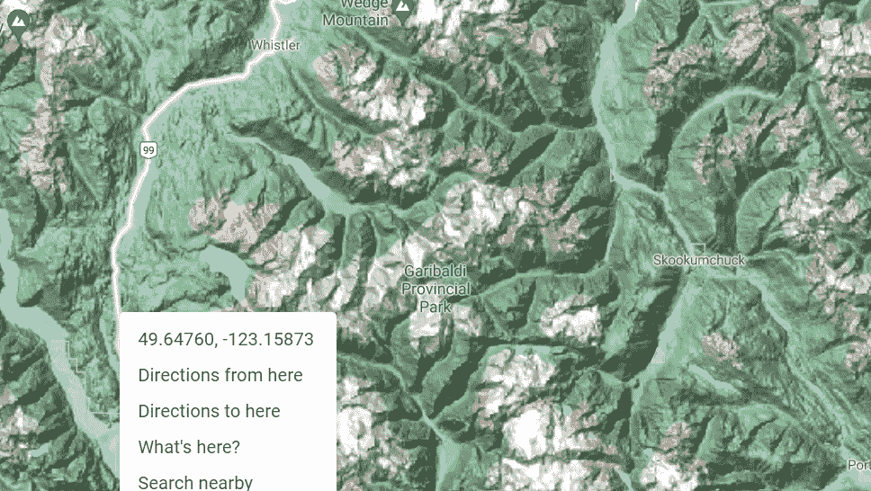
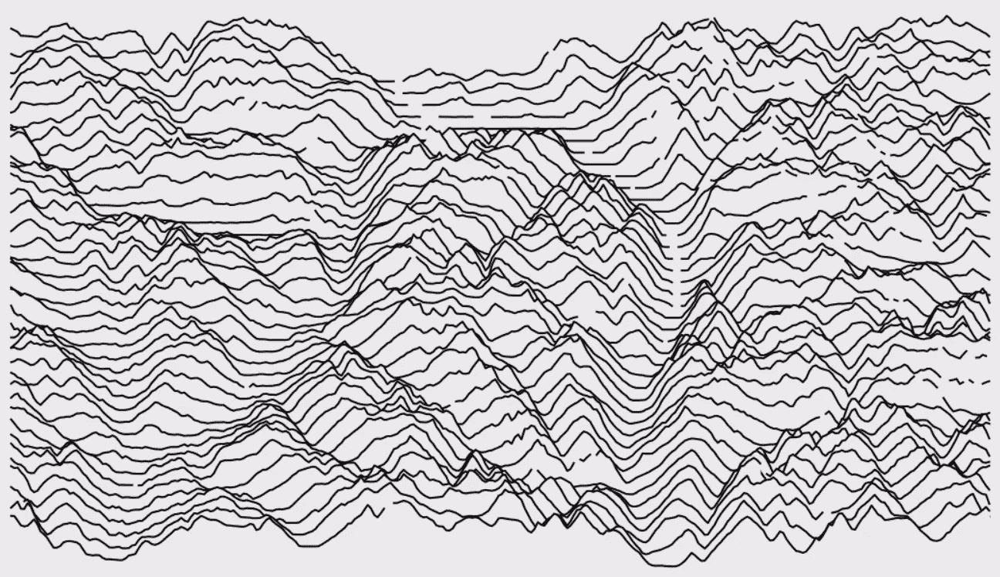
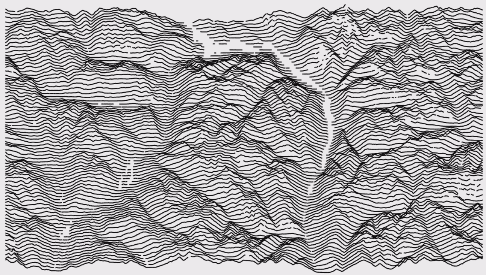
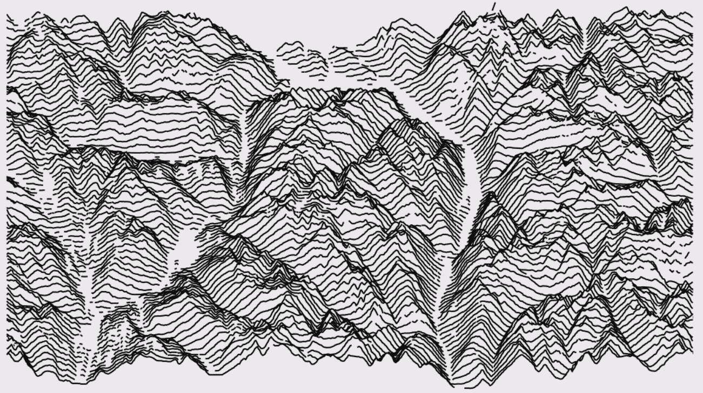
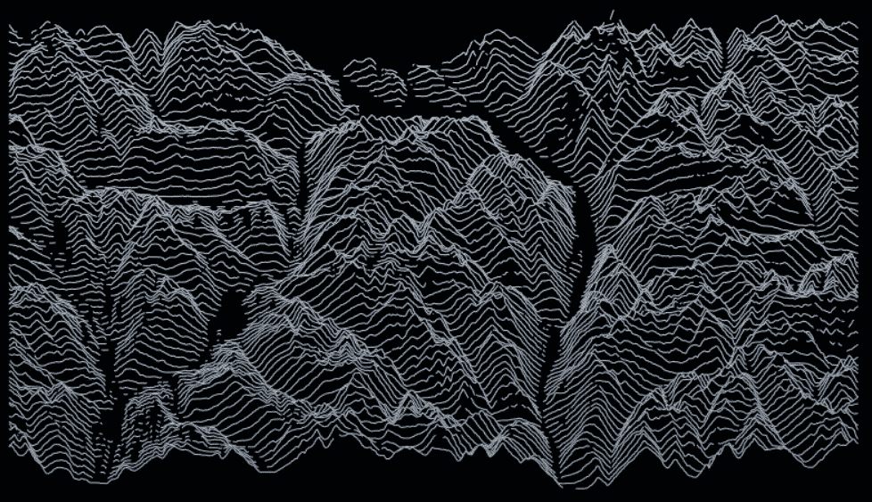
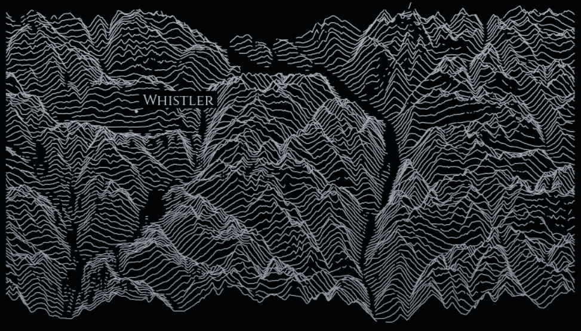

# 用 Python 制作的美丽山脊图

> 原文：<https://towardsdatascience.com/beautiful-ridge-maps-with-python-640906a30e10?source=collection_archive---------32----------------------->

## 如何用 Python 快速绘制酷炫的立面图



这种视觉效果是海拔图和山脊图巧妙结合的结果。

它使用多条水平线来表示地形的高程，就像跟踪各个纬度的峰值，一条在另一条之上。


结果是一个看起来非常酷的地图，它塑造了特定区域的山脉和不同的海拔高度。

我不确定这种可视化的实际应用，除了为一份报告制作一个好看的首页或让区域分析 PowerPoint 发光。但它们是一些非常吸引人的地图，值得一些关注。

## 山脊图

为了快速创建我们的可视化，我们可以使用 [ridge_map](https://github.com/ColCarroll/ridge_map) 。

该软件包使用来自[【SRTM】](https://www2.jpl.nasa.gov/srtm/)、Matplotlib 的高程数据来绘制图表，甚至用 Scykit 和 Numpy 检测湖泊。

安装后，我们可以通过导入 ridge_map，运行 plot_map，不需要任何参数来测试。我们应该弄一张白山的地图。

```
from ridge_map import RidgeMapRidgeMap().plot_map()
```



酷毙了。现在让我们尝试一个不同的位置。

## 自定义地图

首先，我们需要一些坐标。我用谷歌地图找到了它们。你也可以将地图显示为“地形”,这样你就可以知道最终的可视化效果会是什么样子。

一旦你找到你想要的，你可以在地图上点击鼠标右键来获得坐标。



山脊图将需要两组坐标，一组用于左下角，另一组用于右上角。

> *(-123.2510，49.6902，-122.1194，50.3446)
> (左下 Long，左下 Lat，右上 Long，右上 Lat)*

Google 的坐标顺序相反，Lat/ Long，所以我们需要反过来。

```
# coordinates
bl = [49.6902343443372, -123.25105812920076][::-1]
tr = [50.34462404053542, -122.11945787458642][::-1]rm = RidgeMap(bl + tr)
values = rm.get_elevation_data()
rm.plot_map(values=rm.preprocess(values=values), label=None)
```



我们首先定义 RidgeMap 并将坐标传递给构造函数。

## 获取高程数据

然后，我们使用 get_elevation_data 检索一个带有我们的规范的 NumPy 数组。这里我们有三个方便的论据。让我们试试它们。

```
# coordinates
bl = [49.6902343443372, -123.25105812920076][::-1]
tr = [50.34462404053542, -122.11945787458642][::-1]rm = RidgeMap(bl + tr)
values = rm.get_elevation_data(**num_lines=160, 
                               elevation_pts=800, 
                               viewpoint="south"**)
rm.plot_map(values=rm.preprocess(values=values), label=None)
```



那更好！

get_elevation_data 方法允许我们选择视点以及可视化的详细程度。

## 预处理

预处理方法将使我们能够配置高程比以夸大丘陵和山脉，并配置水检测。其中`water_ntile`删除基于海拔百分比的数据，而`lake_flatness`删除三个方块内的变化。

```
# coordinates
bl = [49.6902343443372, -123.25105812920076][::-1]
tr = [50.34462404053542, -122.11945787458642][::-1]rm = RidgeMap(bl + tr)values = rm.get_elevation_data(num_lines=160, 
                               elevation_pts=800, 
                               viewpoint="south")rm.plot_map(values=rm.preprocess(values=values, 
                                 **water_ntile=0, 
                                 lake_flatness=8,
                                 vertical_ratio=80**), 
            label=None)
```



来自 get_elevation_data 和预处理的所有这些参数都是有益的，但有时使用起来很棘手。

## 绘图地图

对于更加美观的定制，我们有 plot_map 方法。在那里我们可以配置颜色、线宽和标签。

```
**import seaborn as sb
cmap = sb.light_palette("#69d", as_cmap=True)**# coordinates
bl = [49.6902343443372, -123.25105812920076][::-1]
tr = [50.34462404053542, -122.11945787458642][::-1]rm = RidgeMap(bl + tr)values = rm.get_elevation_data(num_lines=160, 
                               elevation_pts=800, 
                               viewpoint="south")rm.plot_map(values=rm.preprocess(values=values, 
                                 water_ntile=0, 
                                 lake_flatness=8, 
                                 vertical_ratio=80), 
          **  label=None,
            line_color=cmap,
            kind="gradient",
            linewidth=1,
            background_color='black',
            size_scale=15**)
```



山脊图允许我们进行大量的定制。对于所有其他的，我们也有 Matplotlib。

## Matplotlib

plot_map 方法返回轴，所以我们可以根据自己的需要进行修改。

```
import seaborn as sb
**import matplotlib.pyplot as plt**cmap = sb.light_palette("#69d", as_cmap=True)# coordinates
bl = [49.6902343443372, -123.25105812920076][::-1]
tr = [50.34462404053542, -122.11945787458642][::-1]
**whistler = [50.11262255339053, -122.96522325554356][::-1]**rm = RidgeMap(bl + tr)# convert annotation coordinates
**whistler_coords = ((whistler[0] - rm.longs[0])/(rm.longs[1] - rm.longs[0]),(whistler[1] - rm.lats[0])/(rm.lats[1] - rm.lats[0]))**values = rm.get_elevation_data(num_lines=160, 
                               elevation_pts=800, 
                               viewpoint="south")**ax =** rm.plot_map(values=rm.preprocess(values=values, 
                                 water_ntile=0, 
                                 lake_flatness=8, 
                                 vertical_ratio=80), 
            label=None,
            line_color=cmap,
            kind="gradient",
            linewidth=1,
            background_color='black',
            size_scale=15)**ax.plot(*whistler_coords, '.',
        color='white',
        transform=ax.transAxes,
        zorder=len(values)+10)****ax.text(whistler_coords[0]+0.01, 
        whistler_coords[1]+0.02, 
        'Whistler',
        fontproperties=rm.font,
        size=20,
        color="white",
        backgroundcolor='black',
        transform=ax.transAxes,
        verticalalignment="bottom",
        zorder=len(values)+10)**
```



总的来说，根据我的经验，这种可视化需要大量的实验。因为它更具艺术性而非分析性，你需要测试不同的变量，看看会发生什么，直到你找到你喜欢的东西。

尽管我不需要这样的地图，但我从这些可视化中获得了很多乐趣，并将再次使用它们来美化我的演示。

我用[山脊图](https://github.com/ColCarroll/ridge_map)创建了这篇文章中的所有图像。你可以随意使用它们。

感谢阅读。希望你喜欢:)

[更多 Python DataViz 教程](https://linktr.ee/admin/settings#Settings--SocialLinks)。

【参考文献:】
[https://github.com/ColCarroll/ridge_map](https://github.com/ColCarroll/ridge_map)；
[https://github.com/tkrajina/srtm.py](https://github.com/tkrajina/srtm.py)；