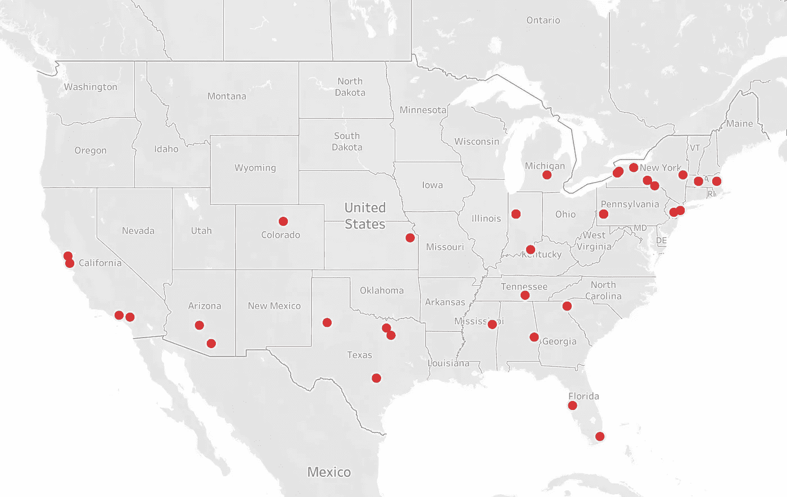
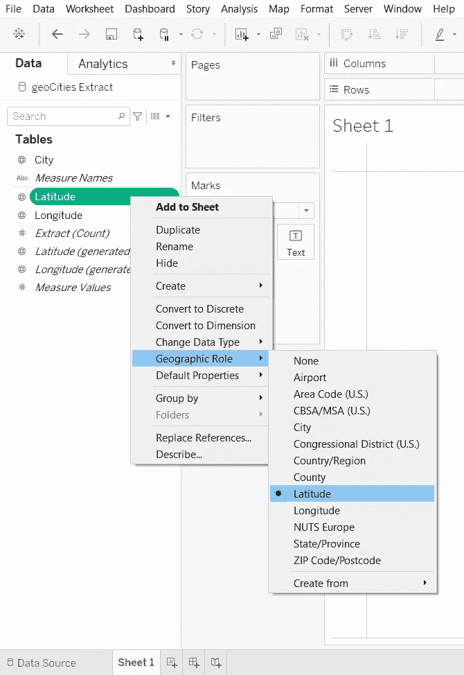
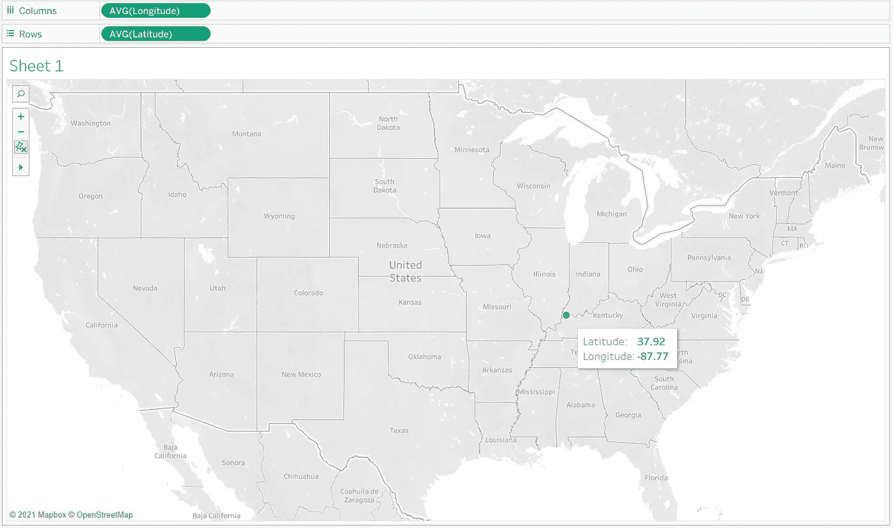
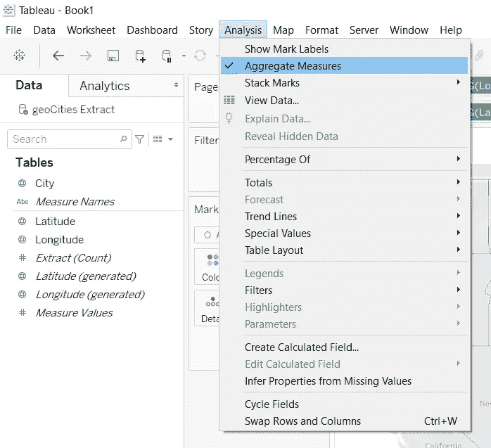

# 带有 Tableau 和 Google Maps API 的简单精美的地图

> 原文：<https://towardsdatascience.com/beautifully-simple-maps-with-tableau-and-the-google-maps-api-6eeb89263c52?source=collection_archive---------21----------------------->

## 轻松地将*任何*城市名称转换成可映射的地理位置。

由[梅丽莎·施密茨](https://public.tableau.com/profile/melissa.schmitz#!/) | [制作的图形在 Tableau Public](https://public.tableau.com/profile/melissa.schmitz#!/vizhome/SimpleScriptsHowcanIproducecleanmapdataforgeodatavisualizations/MapPlot) 上直播

Tableau 有一个内置函数，可以识别主要城市的名称。但是，如果 Tableau 不能自动识别可视化所需的城市，该怎么办呢？

如果只有少数几个城市，手动搜索纬度和经度值并将其添加到数据表中可能会更快。但是除此之外，你肯定想用脚本来节省时间。

这个 [Python 脚本](https://github.com/schmitzmelissa/geocoding-script)是通用的，所以你可以在任何需要地理定位的项目中反复使用它，而不仅仅是上面的 Tableau visual 。

另外，内置的安全性可以防止意外的 API 密钥泄漏。

# 你需要什么

*   安装了[请求、json 和 pandas 库的 python 3](https://stephenjoel2k.medium.com/how-to-install-python-packages-using-pip-2019-33c665ac342)
*   [您自己的谷歌地图 API 密钥](https://medium.com/superkoders/ultimate-guide-to-google-maps-d86ad945636a)
*   答。带有“城市”列的 csv 文件(参见下面的示例)
*   Tableau 桌面([免费试用](https://www.tableau.com/trial/tableau-software)可用)

> 在本文中，我将重点关注 [Python 脚本](https://github.com/schmitzmelissa/geocoding-script/blob/master/geoScript.py)和 Tableau 中的[地图。关于安装 Python 库和获取 Google Maps API 密钥，网上有很多其他教程，所以如果你需要帮助，我在上面提供了链接。](https://public.tableau.com/profile/melissa.schmitz#!/vizhome/SimpleScriptsHowcanIproducecleanmapdataforgeodatavisualizations/MapPlot)

照片由[安德鲁·尼尔](https://unsplash.com/@andrewtneel?utm_source=unsplash&utm_medium=referral&utm_content=creditCopyText)在 [Unsplash](https://unsplash.com/s/photos/map?utm_source=unsplash&utm_medium=referral&utm_content=creditCopyText) 上拍摄

# 准备您的数据

对于这个项目，您的输入数据非常简单:一个. csv 文件，其中有一个名为“city”的列，包含您希望绘制地图的所有城市。这里有一个例子，用[一个随机城市生成器](https://www.randomlists.com/random-us-cities)制作:

Google Maps [地理定位 API](https://developers.google.com/maps/documentation/geolocation/overview) 足够灵活，可以识别州和国家的各种文本表示。我特意包括了上面的例子，以表明即使你不使用缩写，这也是可行的。

> 提示:确保你的。csv 文件没有用`,`分隔，否则您可能会遇到由于城市、州对中的`,`而导致的解析错误。

# 代码:将城市名称转换成地理位置

首先，我们从导入语句开始:

然后，我们为。csv 文件和您的谷歌地图 API 密钥:

> **注意:**这不是传入此信息的唯一方式，但这是*的一种方式，有助于确保您不会意外地通过硬编码或在存储库中留下包含您的 API 密钥的文件而暴露 API 密钥。*

接下来，我们将定义一个调用 Google Maps [地理位置 API](https://developers.google.com/maps/documentation/geolocation/overview) 的函数，将每个城市转换为地理位置(即纬度和经度元组):

这里面有很多东西，所以让我们稍微分解一下。

*   ***函数变量:***`geo`变量是您稍后将在脚本中调用的城市列的占位符。`api_key`不言自明。
*   ***API 请求***:`payload`遵循 Google Maps [地理定位 API](https://developers.google.com/maps/documentation/geolocation/overview) 接受请求参数的格式，在下一行填入`params`。在这种情况下，`geo`将指城市。
*   ***JSON 数据角力:*** `rLocation`将原始的 JSON 位置数据收集到一个变量中，然后用这个变量通过解析 JSON 结果找到`latitude`和`longitude`。
*   ***错误处理:*** 如果你不熟悉`try`和`except`关键字，这是 Python 中的[基本错误处理。这里我们通过传递`None`值来处理任何`IndexError`。](https://medium.com/technofunnel/exception-handling-in-python-fc71497e0d18)
*   ***返回:*** 最后，我们以`latitude, longitude`元组的形式返回数据。

> **提示:**如果这是您第一次使用 Google Maps [地理定位 API](https://developers.google.com/maps/documentation/geolocation/overview) ，我建议在您的 web 浏览器中单独调用该 API，这样您就可以自己查看原始的 JSON 结果，并理解上面完成的复杂解析(特别是如果该 API 在将来更新的话)。

现在我们已经定义了这个函数，我们可以开始使用我们的数据了。

从这里开始，我们来读你的原著。csv 文件转换成 DataFrame，并创建一个空列表，我们将在下一步填充它。

然后我们将遍历`city`列的每一行，用每个城市填充我们的列表。

还记得在我们的`geoGoogle()`函数中，我们如何将`latitude, longitude`作为一个元组返回吗？我们也为此做了准备，创建了`latList`和`lonList`来存储这些值作为 DataFrame 新列。

现在我们开始这个脚本的核心部分:使用在`geoGoogle()`中返回的元组将城市名转换成它们的`latitude, longitude`对。这些然后被存储在我们上面创建的列表中，然后使用`pd.Series`转换成我们的数据框架`df`中的新列。

> 如果您想自己确认生成的纬度和经度是正确的，您会注意到我包含了一个可选的打印语句。

然后我们将这个最终数据集导出到一个新的。csv 文件，确保使用`;`分隔符，以避免由于城市的`city, state`文本格式导致的解析错误:

最后，作为最后一笔，我们可以添加一条打印消息来通知用户脚本已经运行完毕，以及生成的新数据文件的名称(将在原始文件名的基础上添加一个前缀`geo`):

丹尼斯·库默在 [Unsplash](https://unsplash.com/s/photos/map-data?utm_source=unsplash&utm_medium=referral&utm_content=creditCopyText) 上拍摄的照片

# 在 Tableau 中创建最终的地图可视化

现在我们已经准备好了数据，我们可以[导入新的。csv 文件作为 Tableau](https://help.tableau.com/current/pro/desktop/en-us/basicconnectoverview.htm) 中的数据源。

这一步的关键是确保 Tableau 正确解释数据类型。具体来说，我们希望检查`Latitude`和`Longitude`列是否被解释为[地理数据类型](https://kb.tableau.com/articles/howto/plotting-geographic-data-using-custom-longitude-and-latitude)并被赋予适当的[地理角色](https://kb.tableau.com/articles/howto/plotting-geographic-data-using-custom-longitude-and-latitude)。

为您的地图创建新图纸。在`Data`侧边栏的`Measures`部分，右击`Latitude`并导航至`Geographic Role > Latitude`。

这将把数据类型符号从`#`变为一个地球，代表一个地理数据类型。对`Longitude`做同样的操作。

从这里开始，您就可以绘制地图了。您可以通过将`Longitude`拖动到列，将`Latitude`拖动到行来实现这一点，如下所示。

但是这件事有点奇怪。我们的原始数据集中有许多数据点。那么为什么我们在这里只看到一个呢？

如果你仔细观察，你会发现，在默认情况下，Tableau 创建了一个[集合度量](https://help.tableau.com/current/pro/desktop/en-us/calculations_aggregation.htm)，这次是以平均值的形式。你看到的这个点是你所有地理位置的平均值。

幸运的是，修复非常简单。导航至`Analysis > Aggregate Measures`并取消勾选`Aggregate Measures`。这将为我们提供每个地理位置数据点的预期结果。

这样，我们就得到我们想要的输出，一个简单明了的地图，将每个位置显示为下面地图上的一个单独的点。

由[梅丽莎·施密茨](https://public.tableau.com/profile/melissa.schmitz#!/) | [制作的图形在 Tableau Public](https://public.tableau.com/profile/melissa.schmitz#!/vizhome/SimpleScriptsHowcanIproducecleanmapdataforgeodatavisualizations/MapPlot) 上直播

从那里，您可以做自己的 Tableau 魔术自定义颜色，大小，标签，工具提示，等等。在上面的图形中，我改变了颜色以匹配我的客户的红色营销，并放大了圆圈的大小，以便作为一个小图形更容易查看。

想要展示的不仅仅是地点吗？只需添加更多数据。

但是，如果你的目标只是显示一个最小的，干净的地图，每个位置都有统一的点，那就完成了！

# 感谢阅读！

我希望这篇教程能帮助你发现一种新的方法来使用你的其他技能解决 Tableau 中的问题！

我怀疑在 Tableau 中可能有一个更优雅的方法来解决这个问题(或者甚至是一个更简化的 Python 脚本)，我鼓励你在评论中提出建设性的质疑。通过这篇文章，我想展示的是，你不必成为每一种工具的大师，或者作为纯粹主义者，只用一种工具解决每一个问题。利用你所掌握的工具有助于全面提高你解决问题的能力。不要害怕尝试。

与任何类型的编程一样，通常有多种方法来解决同一个问题。这就是我选择如何解决我的问题。

如果你想看本教程中使用的完整的原始脚本，你可以在 GitHub [这里](https://github.com/schmitzmelissa/geocoding-script)查看它:

<https://github.com/schmitzmelissa/geocoding-script>  

或者，如果您想在 Tableau Public 上开始示例可视化，您可以在此处[进行操作](https://public.tableau.com/profile/melissa.schmitz#!/vizhome/SimpleScriptsHowcanIproducecleanmapdataforgeodatavisualizations/MapPlot):

  

谢谢你的来访！

> 知道更好的直接在 Tableau 解决这个问题的方法吗？在评论中分享你的专业知识吧！