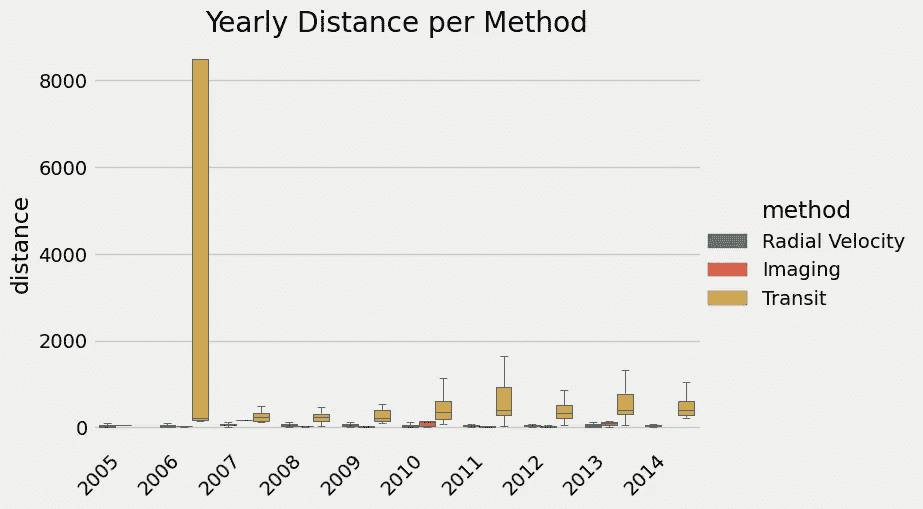

# 美化 Python 中杂乱的情节&解决 Seaborn 中常见的问题

> 原文：<https://towardsdatascience.com/beautifying-the-messy-plots-in-python-solving-common-issues-in-seaborn-7372e6479fb?source=collection_archive---------9----------------------->

## 让我让你的生活更轻松…


用 Python 创建可展示的情节可能有点令人生畏。如果你习惯于使用其他 BI 软件甚至 R 来制作你的可视化效果，尤其是这样，因为大多数的图形已经为你美化过了。另一个问题是，事情可能会以多种方式出错，解决问题的方法将取决于你对剧情的选择。在这里，我将演示几种在 Python 中为各种场景轻松创建绘图的方法，并向您展示如何解决每种情况下可能出现的一些问题。

在这篇文章中，我将重点关注效率，并分享一些将使创建视觉上吸引人的情节快速的花絮。

# 基本设置

*Matplotlib*中的 Pyplot 是 Python 中绘图的必备。其他库很可能都使用 Matplotlib 作为后端。Seaborn 就是一个例子。Seaborn 增加了一些不错的功能，但是这些功能有时会造成混乱。让我们先导入所有的包。

```
**import** pandas **as** pd **
import** matplotlib.pyplot **as** plt
**import** seaborn **as** sns
%matplotlib inline 
```

如果您使用允许您在前端显示图的 iPython 平台，如 Jupyter Notebook，使用`%matplotlib inline`显示图。

# 添加样式

如果你只是想要一些像样的东西快速运行，我强烈推荐分配一个**的剧情风格**。剧情风格瞬间将多种风格元素应用到你的剧情中，省去一些麻烦。提前指定样式的另一个原因是保持整体外观的一致性。如果在文档中使用不同的绘图方法(`sns, plt, pd`)，可能会导致不一致的绘图。

```
**plt.style.use**('plot-style-name-goes-here') 
```

## 哪种风格是最好的？

我特别喜欢`fivethirtyeight`的知名度和简单性。学术界的观众可能更熟悉`ggplot` style，因为它是 r 中的一个流行库。参见下图来比较一些风格。

`seaborn`很棒，但是它有太多的选择，可能超过了我们现在想要的。如果您想查看可用样式完整列表，请运行`plt.style.available`。展望未来，我将使用`fivethirtyeight`来风格化我所有的情节。


作者图片

## 问:我必须使用 Matplotlib 绘图吗？

如果你用的是 Pandas，它还附带了一些绘图功能(但它的后端是 Matplotlib)。如果您只想快速查看分布(直方图或密度图)或两列之间的一对一直接关系(折线图或散点图)，这将非常方便。

请注意，熊猫绘图不会自动找到最佳绘图类型。默认始终是线形图。

```
# Pandas plot example - df is a Pandas dataframedf.*column_name*.**plot**(**title** = '*Title*', **kind** = '*hist*')# Above is identical to below using Matplotlib.pyplot ...plt.**hist**(df.*column_name*)
plt.**title**('*Title*')
plt.**ylabel**('*Frequency*')
plt.**show**()# You can also plot relationship between variablesdf.**plot**(**x** = '*column1_name*', **y** = '*column2_name*', **kind** = '*scatter*')
```

现在我们有了基本的设置，让我们看看不同的场景。

# 绘制频率/计数数据


Seaborn 的 Countplot 提供了一种快速显示每个值出现频率的方法。

```
sns**.countplot**(df.*column_name*)# to group
sns.**countplot**(**x** = '*column1*', **hue** = '*column2*, **data** = *df2*)
```

但是有时事情会变得很糟糕…


我们在这里看到了一些问题，我们在 x 轴上的刻度标签重叠，图例框在一个不太理想的位置。让我们看看如何解决这些问题。

## 问:如何旋转标签？

我们可以使用 Matplotlib 覆盖 x 刻度的设置。`rotation`表示旋转文本的角度，`ha`(水平对齐)移动标签，使其在右侧对齐。

```
sns.countplot(x = '*method*', hue = '*number*, data = *df2*)
**plt.xticks(rotation = 45, ha = 'right')**
```


## 问:如何将图例移出？

要移动图例的位置，我们需要指定图例的位置。我们可以使用 Matplotlib 覆盖图例设置。`bbox_to_anchor`允许您手动设置图例的位置。如果你只是想把这个放在图的右上角，我们也可以添加位置信息`loc = ‘upper right'`。

```
sns.countplot(x = '*method*', hue = '*number*, data = *df2*) plt.xticks(rotation = 45, ha = 'right')
**plt.legend(title = '*Number*', bbox_to_anchor = (1, 1))**
```


## 问:我如何堆叠酒吧？

剧情看起来比较好，但是读起来有点吃力。如果每个方法都堆叠了这些条，就更清楚了。`countplot`有一个名为`dodge`的参数，默认设置为 True。如果我们将其设置为 False，它将堆叠条形图。

```
sns.countplot(x = '*method*', hue = '*number*, data = *df2,* **dodge = *False***) 
plt.xticks(rotation = 45, ha = 'right')
plt.legend(title = '*Number*', bbox_to_anchor = (1, 1))
```


## 问:顺序似乎是随机的？我如何能改变顺序？

我们的情节看起来更好，但整体顺序似乎非常随机。我们也可以使用`countplot`手动设置绘图顺序。这个功能也可以作为一个过滤器。(当我们这样做的时候，让我们去掉 x 标签并把它也设置为一个标题。)

```
sns.countplot(x = '*method*', hue = '*number*, data = *df2,* dodge = *False,* **order = ['Radial Velocity', 'Transit', 'Imaging',         
                       'Microlensing', 'Eclipse Timing Variations'**]) 
plt.xticks(rotation = 45, ha = 'right')
plt.legend(title = '*Number*', bbox_to_anchor = (1, 1))
plt.xlabel('')
plt.title('Method')
```


太好了！现在我们的频率图看起来好多了。

# 绘制分类 x 定量

使用 Seaborn 的`catplot`，您可以很容易地尝试许多不同的选项来绘制类别的值。默认情况下， *Catplot* 是一个带状图，但是您可以通过将`kind`参数分配给不同的图类型来更改选项，例如`box`或`violin`。只是为了让大家更加迷惑，您也可以通过直接调用它们(例如`sns.boxplot`或`sns.violinplot`)来绘制这些分类图，并且可用的参数会有所不同。让我们试着修复一个混乱的 catplot。

```
# first using catplot
sns.**catplot**(**x** = '*year*', **y** = '*distance*', **hue** = '*method*', 
            **data** = df, **kind** = '*box*')
```


哦，不！这一次，它确实将图例放在了外面，但是 x 刻度再次重叠。对于箱线图来说，线条似乎也太粗了，异常值标记非常大。最后，剧情有点太窄了。我们知道如何修复 x 记号，现在让我们修复其他问题。

## 问:箱线图周围的线条看起来很奇怪，它们太粗了。

为了优化线宽，我们可以手动设置绘图的线宽。

```
sns.catplot(x = '*year*', y = '*distance*', hue = '*method*', 
            data = df, kind = '*box*', **linewidth = 0.5)**
plt.xticks(rotation = 45, ha = 'right')
```


## 问:箱线图上的异常值标记太大。

现在，与我们漂亮的新系列相比，离群值似乎不成比例。让我们也把它们变小。如果你想完全删除它们，你可以使用`showfliers = False`。

```
sns.catplot(x = '*year*', y = '*distance*', hue = '*method*', 
            data = df, kind = '*box',* linewidth = 0.5, **fliersize = 1**)
plt.xticks(rotation = 45, ha = 'right')
```


## 问:我的情节太狭窄了。怎么才能改变剧情的比例？

最后，整个情节看起来太狭窄了。所以我们试着通过改变长宽比来扩大绘图区域。坡向值改变宽度，保持高度不变。

```
sns.catplot(x = '*year*', y = '*distance*', hue = '*method*', 
            data = df, kind = '*box',* linewidth = 0.5, fliersize = 1, **aspect = 1.5**)
plt.xticks(rotation = 45, ha = 'right')
```



如果你直接使用`sns.boxplot`，它将没有`aspect`参数，我们将需要通过使用 Matplotlib 设置图形大小来改变纵横比。`fig = plt.figure(figsize = (w, h))`

## 问:我的绘图在保存到本地时会被切断。

最后，在本地保存时，有时图的标题或图例可能会被裁剪。为了防止这个问题，在保存情节之前调用`plt.tight_layout()`。

今天，我们简要地看了一些使用 *Matplotlib* 和 *Seaborn* 在 Python 中设置情节的技巧，以及如何解决使用 *Seaborn* 时的一些常见问题。如果你经常遇到任何其他问题，请留下评论，我可以添加到帖子中！

# 新年快乐


[真诚媒体](https://unsplash.com/@sincerelymedia?utm_source=medium&utm_medium=referral)在 [Unsplash](https://unsplash.com?utm_source=medium&utm_medium=referral) 上拍摄的照片