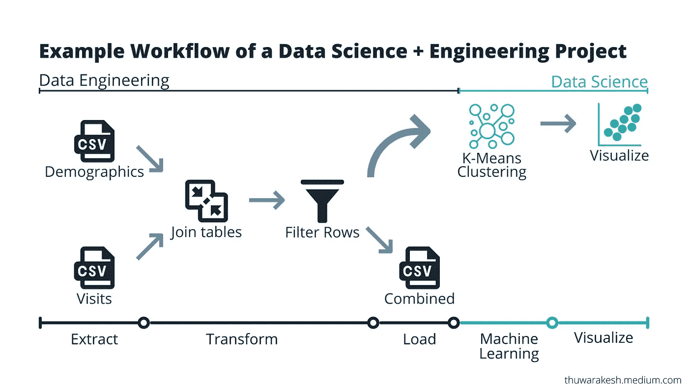
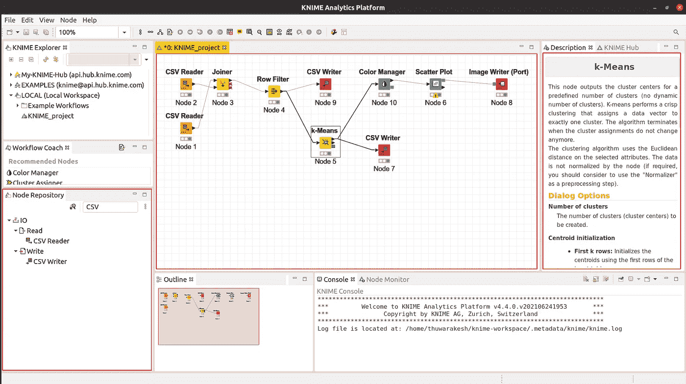
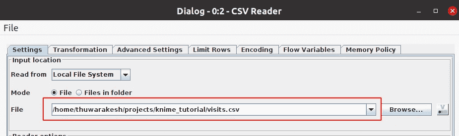
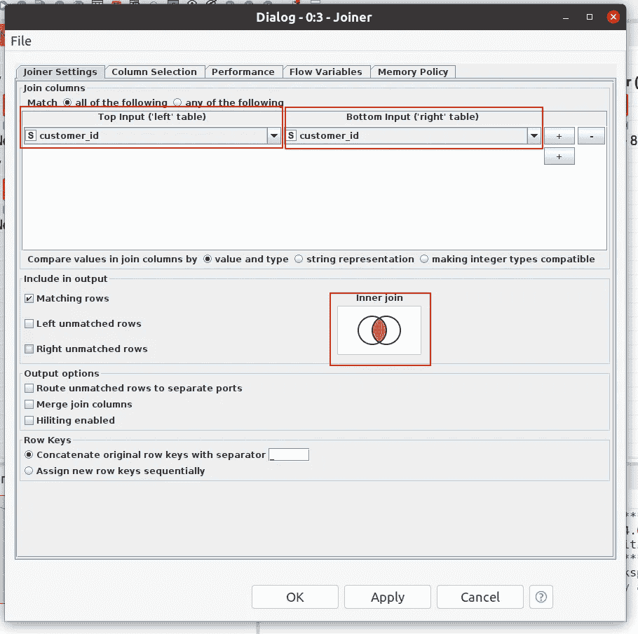
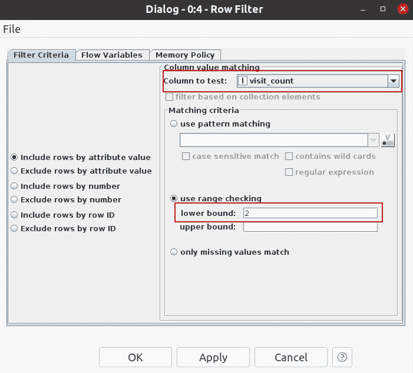
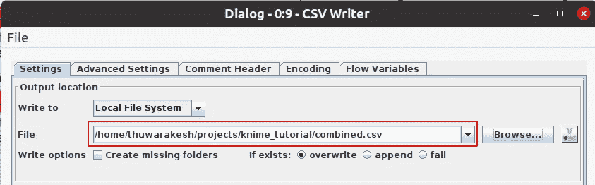
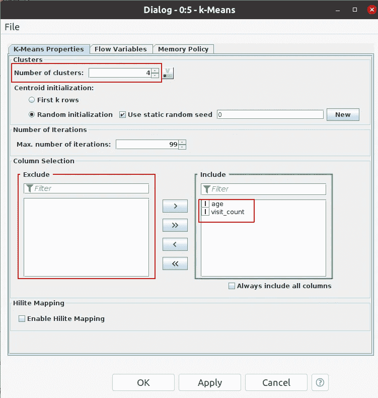
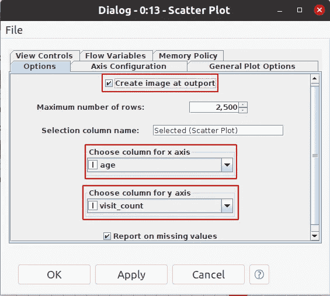
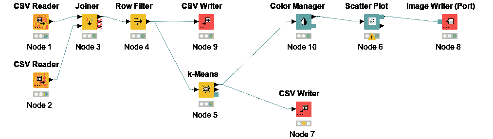

# 如何在不编码的情况下成为一名出色的数据科学家(+工程师)

> 原文：<https://towardsdatascience.com/become-a-data-scientist-or-data-engineer-without-coding-skills-fbf11ac8e278?source=collection_archive---------2----------------------->

## 从数据中获得意义是常识。编码技能不是数据科学家或数据工程师的超能力。

数据科学家和数据工程师不需要编码技能。——照片由 [Pexels](https://www.pexels.com/photo/person-near-apple-keyboard-and-cup-with-coffee-beans-1419929/?utm_content=attributionCopyText&utm_medium=referral&utm_source=pexels) 的 [Lukas](https://www.pexels.com/@goumbik?utm_content=attributionCopyText&utm_medium=referral&utm_source=pexels) 拍摄

如果你梦想成为一名 ***数据科学家或数据工程师*** ，你可能会在那个梦里看到一个充满代码的*黑屏。打磨你的编码技能可能是你在这个旅程中得到的流行建议。然而，令人惊讶的是，它 ***与编程无关。****

> 数据科学是从原始记录集合中获取意义的过程。编程语言只是一种工具。它就像一个用来做饭的容器。但是容器本身并不是食物。

人们对数据科学失去兴趣是因为有些人不擅长编程。他们甚至无法理解像 Python 这样直观的语言。然而，对其他人来说，这很自然。但这些不是能力，而是不同的能力。

这个故事会改变你的视角。即使你不会或不想编程，你也可以成为一名杰出的数据科学家。 ***批判性思维和一些数据素养*** 会让你甚至有能力管理一个数据项目。

今天我们有 ***不需要编码技能的技术*** 开始数据科学。他们还有 ***几个程序员没有*** 的好处。由于它们的直观性和较少的依赖性，我向所有渴望成为数据科学家的人推荐它们。

我们将在本帖中讨论 ***KNIME*** 分析平台。只需要常识就能理解数据。另一个流行的替代是[***rapid miner***](https://rapidminer.com/)。两者都已经存在了一段时间，许多公司也在生产中使用它们。然而，在我看来，他们仍然被低估了。

在继续之前，我们先让你成为一名数据科学家和数据工程师。

# 用 KNIME 启动数据科学，无需编写任何代码。

你可以[下载](https://www.knime.com/downloads)并像其他应用程序一样在你的电脑上安装 ***KNIME*** 。该软件是免费和开源的。 你可以用它来搭建 ***数据管道，数据角力，训练机器学习模型，实时预测。这几乎是大多数数据科学家和数据工程师的工作。***

假设您正在为一家零售连锁店创建一个 ***客户细分引擎*** 。您从两个不同的系统接收数据。一个是包含客户人口统计信息的表，另一个是关于他们购买模式的表。您的任务是每天在收到新数据时更新分类表示。

数据科学和数据工程项目的工作流程—由作者[创建的图像。](https://thuwarakesh.medium.com)

这个 ***的第一部分是一个 ETL。*** 就是我们例子中的数据工程部分。我们从不同的数据源中读取数据(提取、连接它们、过滤(转换)并保存(加载)数据以备将来参考。

在 ***的第二部分，我们创建了一个 K 均值聚类引擎。*** 这是我们例子中的数据科学部分。它从保存的路径中读取数据，执行聚类，并输出一个表。输出表包含每个客户的分类标签。

## 关于 KNIME 的界面需要了解什么？

该界面有许多令人难以置信的功能。然而，对于这个介绍性的练习，我们只对两个组件感兴趣。节点存储库在左下角，工作流编辑器在中间。编辑器右侧的描述小部件也很有帮助。

截图来自[作者。](https://thuwarakesh.medium.com)

KNIME 背后的工程团队完成了一项了不起的工作。他们已经为数据科学家将执行的几乎每一项活动创建了节点。我们可以从节点库中搜索任何节点。

您可以将这些节点中的任何一个拖到编辑器中。双击任意节点；您会看到一个配置窗口。您可以在此窗口中进行活动运行所需的所有设置。

您可以通过单击任何节点来调出它的即时文档。它将解释所有的输入要求和节点将返回什么。

## 从数据源读取数据-提取。

在 KNIME 中，有几种方法可以从数据源中提取数据。您可以读取文件、查询数据库、调用 REST 端点等。

在本例中，我们从本地文件系统中读取了几个 CSV 文件。您可以在节点存储库中搜索 CSV reader 节点，并将其拖到编辑器中。

当你把它拖到主窗口时，你会看到红色的交通灯在节点的下面。说明我们还没有配置。您可以双击它并将其配置为从文件路径中读取。

作者[截图。](https://thuwarakesh.medium.com)

你可以看到指示器现在是黄色的。这意味着该节点已准备好执行。右键单击节点并选择执行。现在指针变成绿色。节点执行成功。

您可以通过右键单击并选择列表中的最后一个元素来查看结果。在 KNIME 中，最后的几个选项总是该节点的输出。CSV reader 节点只输出一项——文件表本身。

在本例中，我正在读取两个 CSV。你可以从这个 [Git 库](https://github.com/ThuwarakeshM/knime-tutorial)下载它们。

## 执行连接、过滤等。—转换。

KNIME 有直观的节点来执行各种数据争论任务。在这个例子中，我们使用了其中的两个——连接和行过滤器。您可能需要执行宁滨、规范化、删除重复和空值等操作。

转换一个变量并聚合它是一种常见的任务。这种技术通常被称为 map-reduce 操作。

它们都是 KNIME 中的另一个节点。

我从存储库中取出了 joiner 节点。使用鼠标，我将 CSV 节点的输出(右)与 joiner 节点的输入(左)连接起来。您可以通过选择每个表的列来执行连接操作，从而配置该节点。

作者[截图。](https://thuwarakesh.medium.com)

与 CSV 阅读器节点不同，连接器节点有三个输出。如果您将鼠标悬停在它们上面，工具提示会解释它们是什么。第一个是连接结果。在我们的例子中，我们不使用第二个(左不匹配)和第三个(右不匹配)。

接下来，让我们提取行过滤器节点，并将其与 joiner 节点的输出连接起来。我们可以将其配置为删除一次性购买的客户。将 visit_count 变量的下限设置为 2。

作者[截图。](https://thuwarakesh.medium.com)

## 保存输出—加载。

ETL 管道的最后一部分是将数据加载到持久存储中。我们不想让这个例子变得复杂。因此我们将其写入 CSV。但是，在实际项目中，您可能必须将其加载到数据库或数据仓库中。不用担心；KNIME 在任何情况下都有帮助。

我抓取了 CSV writer 节点，并以与 CSV reader 非常相似的方式对其进行了配置。

[作者截图。](https://thuwarakesh.medium.com)

这最后一部分总结了 ETL 管道。这是数据工程师的一项重要任务。在 LinkedIn 上找一些职位描述，自己看看。

## 无需编码即可执行机器学习任务。

我们有干净的数据，并准备好建立令人兴奋的东西。在这个例子中，我们提出了一个市场细分问题。为此，我们将使用 [K-Means](/running-election-campaigns-with-k-means-clustering-ecc40a91135a) 聚类算法。同样，您可以在 KNIME 中执行几乎任何机器学习算法，而无需编写一行代码。

K-Means 根据客户属性的相似性创建客户群。除了使用哪些属性，我们还可以指定需要多少个组。

让我们从存储库中取出 k-Means 节点，并将其与行过滤器节点的输出连接起来。我们可以配置它，根据客户的年龄和访问次数将客户分成四个集群。

作者[截图。](https://thuwarakesh.medium.com)

执行节点后，您可以检查输出。您将获得每个客户的分类标签和每个分类的摘要。

我在这个例子中选择 K-Means 是因为它简单。对于大多数机器学习应用程序，您有几个其他任务要执行。重新训练一个模型也很重要。

[KNIME 的 youtube 频道](https://www.youtube.com/channel/UCRbKmV_XYB7C12SPBokLVHQ)有许多有见地的视频来帮助你的数据科学之旅。

## 在 KNIME 中可视化您的分析。

大多数数据科学项目的最后部分是可视化见解。Tableau 等商业智能(BI)平台专门研究这一领域。你可以[连接 KNIME](https://www.knime.com/node/20440) 与他们进行高级分析。然而，场馆本身支持基本的可视化。商业智能平台对更广泛的受众来说是极好的。但是对于数据科学家来说，KNIME 的可视化节点已经足够了。

我们将使用散点图节点在用于聚类的两个变量之间创建一个图表。但在此之前，让我们在工作流中放置一个颜色管理器节点。

与其他可视化工具不同，我们需要在绘制记录之前对其进行着色。

您可以选择颜色和用于颜色选择的变量。然而，在这个例子中，我们对缺省值很满意。颜色管理器为它选择聚类标签，默认颜色也很好。

[作者截图。](https://thuwarakesh.medium.com)

我们现在可以将散点图节点添加到工作流中。让我们将其配置为使用 x 轴中的年龄和 y 轴中的访问计数。此外，请确保您勾选了“在输出时创建图像”复选框。

现在，您可以执行散点图节点并调出图像输出。您也可以使用图像写入器节点将结果导出到文件中。

如果你需要参考，下面是最终的工作流程。

[作者截图。](https://thuwarakesh.medium.com)

# 最后的想法

非常好。我们建立了一个完整的数据管道，没有一行代码。它涵盖了 ETL，这是数据工程师的一项重要工作。此外，我们还建立了机器学习模型，并将它们的输出可视化。

非常好。我们建立了一个完整的数据管道，没有一行代码。它涵盖了 ETL，这是数据工程师的一项重要工作。此外，我们还建立了机器学习模型，并将它们的输出可视化。

编程对于数据科学是必不可少的是一个神话。这两者是相关的。但它们并不相互依赖。

我不主张完全避免编程。在某些时候，你需要它。例如，数据科学中的一项最新发现可能还没有出现在 KNIME 中。这个平台可以很好地执行已经存在并受欢迎的内容。

还有，如果你是数据科学研究者，KNIME 只有一点用处。你需要用你自己的代码来构建你自己的算法。

由于这个原因，KNIME 本身为程序提供了灵活性。标准安装已经有了 Java 和 JavaScript 节点来完成这项工作。还可以扩展使用 [Python](https://docs.knime.com/2018-12/python_installation_guide/index.html#quickstart) 等语言。

重点是，你不需要每次都编码。

> 谢谢你的阅读，朋友。看来你和我有许多共同的兴趣。也一定要看看我的[个人博客](https://www.the-analytics.club/)。
> 
> ***在[LinkedIn](https://www.linkedin.com/in/thuwarakesh/)[Twitter](https://twitter.com/Thuwarakesh)[Medium](https://thuwarakesh.medium.com/subscribe)上跟我打招呼*。我会为你打破僵局。**

还不是中等会员？请使用此链接 [**成为会员**](https://thuwarakesh.medium.com/membership) 因为我为你免费推荐赚取佣金。