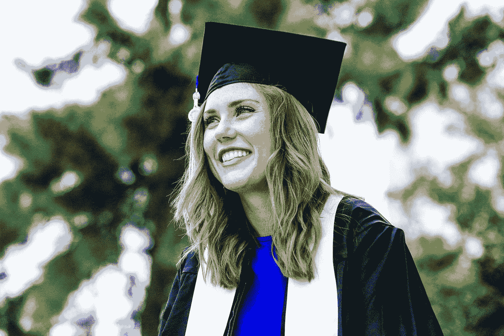
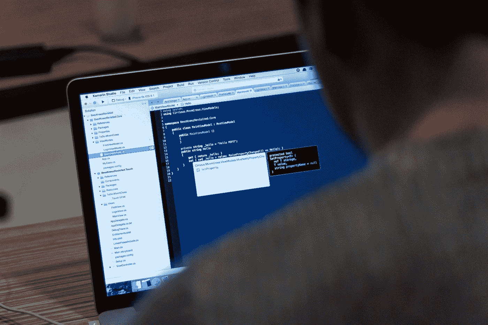

# 成为一名没有编码和技术知识的数据科学家

> 原文：<https://towardsdatascience.com/becoming-a-data-scientist-without-prior-coding-and-technical-knowledge-3d2deea1daa8?source=collection_archive---------47----------------------->

## 通往数据科学的非编码、非技术之旅

照片由 [Unsplash](https://unsplash.com?utm_source=medium&utm_medium=referral) 上的 [Dmitry Ratushny](https://unsplash.com/@ratushny?utm_source=medium&utm_medium=referral) 拍摄

如果你在这里，你可能会好奇一个没有编码、没有软件工程经验(来自一个完全不相关的领域)的人是如何进入数据科学的。

只是为了让你知道你是否想留下来，我希望为你回答这些问题:

1.  我如何准备好过渡到数据科学？
2.  我现在必须开始培养的必备技能是什么？
3.  我如何开始学习？
4.  数据科学的研究生学习适合我吗？
5.  作为一名非技术出身的数据科学家在科技公司工作是什么感觉？

在本文中，我不会与您分享学习数据科学的确切课程或途径。

已经有很多关于这方面的文章了。我不认为这些年来学习的基本领域发生了变化。

可能会有新的技术栈，或尖端的图书馆，或新的训练营或课程发布，但*实用*数据科学所立足的基础保持不变。

我能提供的更详细的信息是我阅读和参加的向数据世界过渡的书籍、课程和程序，以及我为进入数据科学领域所做的准备。

如果它对我有效，谁知道它*可能对你也有效。*

# 我如何准备好过渡到数据科学？

弗朗西斯·达·席尔瓦在 [Unsplash](https://unsplash.com?utm_source=medium&utm_medium=referral) 上的照片

*一个小小的背景故事。*

我曾经梦想发明新的神奇材料。我一生中花了相当多的时间在实验室里接受培训，以成为一名化学家(和一名材料工程师)。

我喜欢把东西放在一起创造更好的，潜在的更有用的东西的想法。六年来，我正式接受训练，成为我所在领域的专家(包括在美国的研究生学习)，在实验室内外度过时光。

然而，在我作为本领域学生的某个时候，我意识到我创造新的、有用的东西的愿望并没有被限制在实验室里。大约在 2016 年末的这个时候，我了解了数据科学。

巧合的是，也是在那个时候，我决定要温习一些几乎没什么用的高中编码知识，作为一种爱好，我必须学习一些新的东西。

*转折点。*

随着我对数据科学的了解越来越多，我了解到它并不像我想象的那么陌生。这是解决问题的同一种科学方法——但不是使用不同种类的*化学品*和*处理技术*来获得想要的输出，而是使用*数据*和*统计数据*。

当我知道如何编写代码，如何使用我在大学学到的现有统计和数学知识，以及我过去学到的研究和实验方法，并在特定的商业环境中使用它来解决问题时，我的内心感到不安——几乎与我最初追求成为一名研究科学家时的感觉一样。

就在那时，我决定温习编码技能，不是为了爱好，而是为了学习如何用它来解决数据问题。

要过渡到像数据科学这样的新领域，请记住以下几点:

*   **有很多东西要学**——就像很多*很多*。没有捷径可走。即使是现在，我几乎每天都在学习。
*   你需要学会如何学习。知道哪种学习媒介适合你。虽然，我现在告诉你，没有逃避的书，阅读大量的文本。(我提到阅读和编写文档了吗？)学习如何学得最好是一种可以帮助你更快积累知识的技能。
*   **要成为数据科学家，你需要了解你将做出的取舍。这可能意味着你需要连续几个小时学习，一些周末计划被取消，一些深夜会议处理你的文件夹，等等。— *你知道程序*。**
*   请记住，没有人天生就是数据科学家。当你不明白某件事时，不要轻易不知所措。伟大的人曾经也很糟糕。

此外，要准备过渡，尽可能熟悉话题是很重要的。

我推荐阅读关于数据科学的文章、书籍、研讨会和会议。

我建议你先阅读商业应用，以便在这个领域获得更多的立足点，并对它有更多的了解。

这里有一些很好的书籍可供阅读:

 [## 2021 年你应该阅读的 21 本数据科学书籍

### 最新的最佳数据科学书籍集，值得立即阅读

towardsdatascience.com](/21-data-science-books-you-should-read-in-2021-db625e97feb6) 

我可能会将我对数据科学的热情归因于从我阅读的早期书籍中了解到的公司如何利用数据来做令人惊讶的事情(不要忽视对数据的一些边缘道德使用，这是另一个话题)

谢天谢地，现在的在线资源比五年前丰富多了，更不用说很多都是免费的。

所以，坐下来，上谷歌，做一块海绵，尽可能多地吸收。

# 我现在必须开始培养的必备技能是什么？

韦斯·希克斯在 [Unsplash](https://unsplash.com?utm_source=medium&utm_medium=referral) 上的照片

数据科学有三大支柱，即:**编程**、**统计**和**业务(领域专长)**。通常，我们参考这三个领域的维恩图来定义什么是数据科学家。*你可能已经看到了。*

简而言之，要开始学习数据科学，您需要掌握三大主题的工作和实践知识。

要知道从哪里开始，我建议直接从你的**最薄弱的**环节开始。

> 如果你在大学里已经知道一点数学和统计学，但是从来没有写过一行代码，那就去学编程吧。
> 
> 如果你是一个业余编程爱好者，但几乎不知道什么是正态分布，那就去查阅和学习统计学吧。

> 要快速学习，重要的是学习要尽可能直接，尽可能投入。

至于商业，除非你有自己的企业，否则你最好读一些商业书籍和一些不错的老哈佛商业评论。

> 对我来说，我已经开始描绘我知道的和不知道的。

我确定了编程、统计和商业中对实用数据科学至关重要的哪些子主题是我已经熟悉的，而不是一无所知的。作为我第一次尝试转行的一部分，我决定我需要学习 Python 编程。

然而，就像任何其他具有潜在陡峭学习曲线的学科一样，对我来说，学习我的舒适区之外的东西是一场斗争。

我知道我需要以一种有趣和可以忍受的方式学习。就在那时，我偶然发现了这本书:*如何用 Python 自动化枯燥的东西，作者是 Al Sweigart* 。

 [## 用 Python 自动化枯燥的东西

### “编程最好的部分是看到机器做一些有用的事情的胜利。用…自动化枯燥的工作

automatetheboringstuff.com](https://automatetheboringstuff.com/) 

顾名思义，这本书不是正式文本。它试图取笑我们每天做的许多平凡的任务，并取笑我们以前没有做任何事情来自动化这些任务。

所以我从那本书开始。

此外，我开始在数据科学的背景下审视我的研究生课程。我选修了一门关于高级回归方法的额外课程，以更多地了解高级统计学如何在研究中用于预测事物。

此外，我开始研究人工智能是如何在我的领域中创新的(并了解到我的导师在他的论文中已经做了很多这样的事情！)

就主题而言，重点关注三大领域:

*   编程；编排
*   统计数字
*   商业

如果可能的话，试着由内而外地工作，看看你现在在做什么，看看你可以通过写代码、用统计数据更好地分析数据，以及在你目前的工作中应用一些好的商业或领导实践来改进什么。

你会惊讶地发现，通过首先在内部学习和思考这些主题，你在任何其他背景下学习数据科学都会变得更加容易。

# 我如何开始学习？

照片由 [Siora 摄影](https://unsplash.com/@siora18?utm_source=medium&utm_medium=referral)在 [Unsplash](https://unsplash.com?utm_source=medium&utm_medium=referral) 上拍摄

现在学习的方法太多了，可能会让人不知所措。

除了书籍和正规教育，你现在有了 [Youtube 视频](https://www.youtube.com/results?search_query=data+science)，像 [Udemy](https://www.udemy.com/courses/search/?src=ukw&q=data+science) 、 [EdX](https://www.edx.org/search?q=data%20science) 和 [Coursera](https://www.coursera.org/search?query=data%20science&) ，像 [Datacamp](https://www.datacamp.com/) 和 [Dataquest](https://www.dataquest.io/) 这样的互动教育平台，甚至还有关于数据科学的[播客](/5-data-science-podcasts-you-should-be-listening-to-72d8efd0b9ec)。

> 现在，对数据科学一无所知是一种罪过。

我敢肯定，如果你之前问过谷歌关于数据科学的问题，你很可能会被你必须利用的课程和订阅广告轰炸。

不过，棘手的是:

> 每个人的学习方式不同。

这就是为什么学习如何学得最好很重要。

> 至于我，我从一个全面结构化的自定进度在线计划开始。

我从微软教授的 EdX 学习课程开始了我的旅程。那时，Udemy 上没有很多高质量的课程，我发现 Youtube 太过杂乱，无法成为一个有效的学习工具。

此外，我还不想从约翰霍普金斯大学的热门课程中学习 R。我想建立在我现有的 Python 知识的基础上，所以参加微软的课程对我来说是有意义的。

我花了一些时间完成所有 10 门课程。它不同于正规学校教育，非常实用。没有人强迫我完成这个项目，所以对我个人来说回报更大。

# 数据科学的研究生学习适合我吗？

由[琪琪·奥尼肯](https://unsplash.com/@chichi1813?utm_source=medium&utm_medium=referral)在 [Unsplash](https://unsplash.com?utm_source=medium&utm_medium=referral) 上拍摄的照片

开门见山地说，是的，我的确上过数据科学的研究生课程。

我这样决定并不是因为我参加的 MOOCs 没有帮助，而是因为我只是渴望*结构*。更重要的是，我把研究生学习看作是我进入一个充满活力的社区的跳板，这个社区对我想要成长的领域充满热情。

正如我提到的，很多在线学习是分散的，高质量的材料很难找到。有时候，我们不承认我们没有从刚买的课程中得到实惠，因为我们已经为它支付了 xxx 美元。

虽然正式的校内项目也是如此，但是很难犯错误，特别是如果你看看外面的优秀项目。

如果符合以下条件，您可能希望进行数据科学方面的研究生学习:

*   你想要结构化的学习。
*   你需要一些外部的学习动力，而不是完全自发的。
*   你会发现额外的凭证很有价值。
*   你想建立关系网。
*   如果你以前尝试过自定进度的学习，想要更多的挑战。
*   如果你有一些经验，只是想在大学环境中提高技能。

> 对我来说，我发现数据科学的研究生课程非常有价值。

这让我对数据的肤浅理解更加严谨。它帮助我接触到所有其他相关主题，包括软技能培训，如果没有这个项目，我不会有这些培训。

我可以说我在研究生院度过了比以前任何时候都要艰难的几个月。因为同样的研究生项目，我得以在我现在工作的公司获得面试机会。

这并不是说你需要一个数据科学硕士学位才能成为一名数据科学家。这当然不是一个要求。

我认识的很多从事数据工作的了不起的人都没有高学历，但他们是有能力的数据专业人士，能产生影响。

# 作为一名数据科学家是什么感觉？

蒂尔萨·范·迪克在 [Unsplash](https://unsplash.com?utm_source=medium&utm_medium=referral) 上拍摄的照片

三年过去了，我终于完成了从非技术职业到数据科学领域的转变。

如果我在脑子里讨论作为一名数据科学家是什么样的，这篇文章会太长，但我可以说:

*   **数据科学是一个令人兴奋的领域，涉及大量的学习、解决问题和打破常规的思考。**如果你想要挑战，每次都想做不同的事情，那么数据科学就是你的职业。我几乎从不长时间做同样的事情。
*   真如他们所说: [**数据科学家花很多时间清理数据，只有很少一部分时间创建模型**](https://hbr.org/2018/08/what-data-scientists-really-do-according-to-35-data-scientists) **。**在理想世界中，我们希望我们的科学家 100%地实施尖端算法。然而在现实中，这种情况很少发生。
*   不要低估更简单的模型而忽视更复杂的模型。通常情况下，非线性模型能够以比复杂模型更低的开销提供相同的价值。有时候，这正是业务所需要的，这很好。
*   **如果和数据打交道，需要学习 SQL。**以前不关心 SQL，从来没有这么错过。我曾经相信我可以用 *Pandas* 和 *Numpy* 来处理我的数据。不幸的是，我得到了惨痛的教训。如果你打算加入一家大公司，他们的数据很有可能是巨大的，而且他们正在使用 SQL 的某种变体。知道如何查询数据是一项非常强大的技能，你应该花时间去掌握。这将为您的数据职业生涯带来巨大回报。
*   **数据科学家是一个不断发展的角色。**你具体做什么，你如何定义成功，取决于你的组织和你所处的商业环境。众所周知，公司和他们对数据科学的期望之间存在脱节。公司仍在尝试组织结构和有效的方式来部署他们的 DS 人才。
*   对于公司来说，在整个组织内实现数据民主化和分析数据的技能有很大的价值。如果少数数据科学家能够对公司产生巨大影响，想象一下如果每个人都足够精通数据。
*   数据科学有时会令人沮丧。有时数据中断，有时您的代码中断。有时候你不知道到底发生了什么。有时候你不得不从头再做一遍。

# 结束语

**数据科学是一个令人兴奋的领域。这不仅仅是一些炒作。这是一个为选择投资 It 的企业带来真正价值的领域。虽然，这需要掌握一些硬技能，并倾向于自主学习(无论你是否选择为此接受正规学校教育)。**

有了对组件技能的关注和足够的实践，即使没有以前的编码或技术经验，也一定可以过渡到这个领域。

你打算进军数据科学吗？请在评论中告诉我！🙌

如果你喜欢这个，比如说👋在[推特](https://twitter.com/tristanjalba)上关注我！