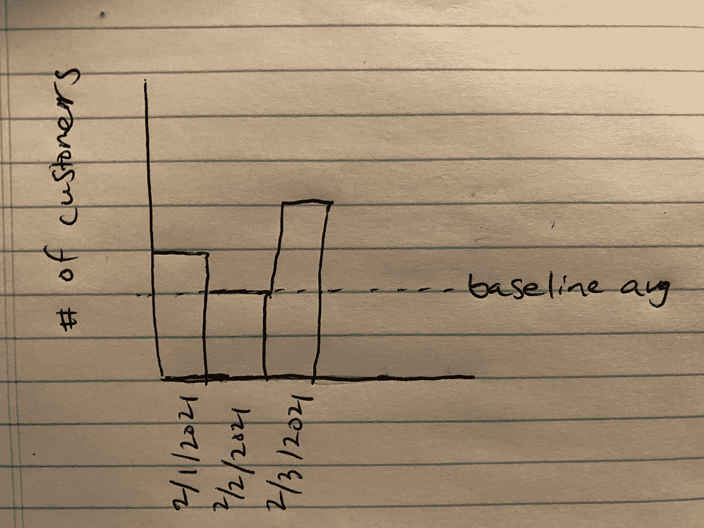
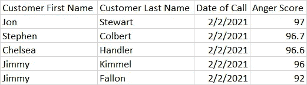
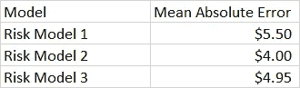

# 在你开始一个数据科学项目之前，问你的用户一个问题

> 原文：<https://towardsdatascience.com/before-you-start-a-data-science-project-ask-your-users-this-one-question-c0b1159f79df?source=collection_archive---------38----------------------->

## [行业笔记](https://towardsdatascience.com/tagged/notes-from-industry)

低保真度原型草图

一个好的数据科学家会问用户很多关于他们可能构建的产品的(商业)目的的问题。通过在执行任何技术工作之前与最终用户交谈，我已经能够在一些项目上节省数周的时间。

在数据准备、数据工程或模型建立之前，问你的用户**“你将如何处理最终的输出？”**更进一步，向他们展示带有虚假数据或可视化效果的低保真度输出原型。

愤怒客户拓展项目的低保真度原型

我将给出我参与的一个示例项目的概要。该企业有一个模糊的想法，即拓展到客户有一个未解决的愤怒的电话。企业希望用户满意，客户满意度是一个关键的绩效指标，可能会对下游收入和奖金产生影响。此外，如果客户提出正式投诉，则需要提交法规文档，这将自动让公司付出 100 美元的成本以及更多员工时间的成本。

一些同事立即开始了一些复杂的数据工程，以获取大量的呼叫中心记录，并将呼叫与我们数据仓库中的客户信息联系起来。我们开始讨论自然语言处理(NLP)步骤的效果如何，并手动检查通话记录，看看 NLP 摘要是否恰当地将通话标记为愤怒；一些电话开始时很生气，但后来客户看起来很好。但在我们进一步深入之前，我们会见了我们的同事，他们将主动接触这些愤怒的客户，这是他们以前没有做过的任务。当展示低保真度原型时，他们有许多问题和需求。

*   我如何知道客户为什么生气？
*   我能看看他们最近的通话记录吗？
*   我可以查看客户的订单历史吗？
*   我需要客户的电话号码、电子邮件地址、联系地址和账单地址
*   我怎么知道别人是否没有给他们打电话？这些数据会与呼叫中心运营团队协调吗？
*   你能优先考虑金钱数额和愤怒分数较高的人吗？
*   这个报告每天都会来吗？我们将如何接收它？在内部应用程序中？在 Excel 中？
*   每天有多少人会出现在这个名单上？我们认为，在我们习惯这种方式之前，我们不会有时间每天联系 10 个以上的人。

最终，我们为我们的同事在输出中添加了一些东西，而不太关注自然语言处理的性能。

金融风险模型低保真度原型

对于另一个项目，公司希望我们根据自己的历史数据样本评估一些供应商财务风险模型。我们已经有了其中一个模型的基础设施和合同；企业希望判断是否值得努力潜在地转换模型。我们向他们展示了一个带有假数据的表格，显示了输出的样子(即低保真度原型)。这引发了一些问题和评论:

*   这个分析的时间段是什么？
*   什么是人口纳入和排除？
*   我们更换供应商的标准是什么？我们能否将平均绝对误差的差值乘以我们的总体，以获得潜在的节约金额？
*   平均绝对误差最合适吗？难道我们对异常值不敏感吗，均方差会更合适吗？或者，我们是否应该在评估中包括多个指标，例如还包括 r 的平方和实际正负 5%以内的人员百分比？
*   我们是否应该提前与 IT 部门沟通，询问他们实施新的财务风险模型可能需要多少工作和时间？
*   我们今天如何使用金融风险模型？它的性能有多重要？我们是否只需要一个“在大概范围内”的模型？
*   这些供应商的未来改进路线图是什么样的？所有的供应商似乎都准备在未来几年取得成功吗？

原型帮助我们数据科学家巩固了我们的方法，并帮助经理们更多地考虑他们所要求的。

尝试为你的下一个项目创建一个低保真度的原型。保真度低意味着你应该能很快做到；它可能看起来不太好，但用户应该有一个好主意。我喜欢在纸上做可视化草图，或者用一些假数据在 Excel 或 r 中创建表格和图表。