# 数据转换的初级解释

> 原文：<https://towardsdatascience.com/beginner-explanation-for-data-transformation-9add3102f3bf?source=collection_archive---------11----------------------->

## 数据转换的基本概念


克里斯·劳顿在 [Unsplash](https://unsplash.com?utm_source=medium&utm_medium=referral) 上的照片

> 如果你喜欢我的内容，并想获得更多关于数据或作为数据科学家的日常生活的深入知识，请考虑在这里订阅我的[时事通讯。](https://cornellius.substack.com/welcome)

# 介绍

什么是数据转换？—我很确定任何学习数据和统计学的人都会在某个时候碰到这些术语。数据转换是一个概念，指的是应用于数据集中每个值的数学函数，将该值替换为新值。在数学方程式中，我们可以用下图来表示。

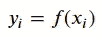

作者图片

如果我用更简单的解释来说，**数据转换是通过数学方程式**将你的数据转换成另一种数据的过程。

为什么我们需要做数据转换？转换数据有什么好处吗？从统计学的角度来看，原因是:

*   转换数据允许您满足某些统计假设，例如，正态性、同质性、线性等。
*   数据转换将不同列中的值进行缩放以进行比较，例如，以美元为单位的薪金(范围从 100 到 10000)和以千克为单位的体重(范围从 20 到 100)。

数据转换有助于获得新的见解并清除数据中的干扰。但是，使用数据转换方法需要您根据转换后的数据理解转换效果、含义和结论。在我看来，只有在必要的情况下，并且你明白你的转换目标时，你才进行数据转换。

数据转换的方法有哪些？根据 McCune 和 Grace (2002)在他们的[生态群落分析书](http://www.umass.edu/landeco/teaching/multivariate/readings/McCune.and.Grace.2002.chapter9.pdf)中所述，这些方法是:

*   单调变换
*   关系化(标准化)
*   概率变换(平滑)

如果上面的术语对你来说很陌生，没关系。让我们更深入地探索所有这些方法！

我要说的一个免责声明是，在进行数据转换时，您需要非常小心，因为您最终会得到一个转换后的数据，它不再是您的原始数据。了解数据转换的目的是什么，并报告您已经完成的任何数据转换。

# 单调变换

什么是单调变换？这是一种数据转换方法，它将数学函数应用于每个独立于其他数据的数据值。单词 monotonic 来自方法 procedure，它转换数据值而不改变它们的等级。用一个更简单的术语来说，**单调变换改变了你的数据而不依赖于其他数据，并且不改变它们在列中的排名。**

著名的单调变换函数的一个例子是**对数变换**或**对数变换**。顾名思义，对数转换通过对每个数据值应用对数函数，将数据值转换为对数值。许多变量遵循对数正态分布，这意味着值在对数变换后将遵循正态分布。这是对数变换的好处之一——遵循正态假设，或者至少接近正态假设。

在数学术语中，对数变换用下面的等式表示。

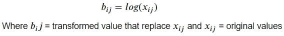

作者图片

让我们用样本数据试试对数变换法。我会使用来自 [Kaggle](https://www.kaggle.com/manishkc06/engineering-graduate-salary-prediction) 的关于工科毕业生薪水的数据。首先，将数据读入数据框。

```
import numpy as np
import pandas as pd
import seaborn as snsdata = pd.read_csv('Engineering_graduate_salary.csv')
```

该数据集中有 33 个要素，但我不会使用所有可用的数据。这个数据是为了知道是什么影响了工资，那么我们就试着把工资数据分布可视化吧。

```
sns.distplot(data['Salary'])
```

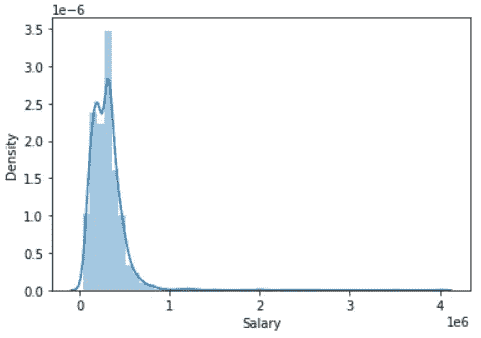

作者图片

正如我们在上面的图像中所看到的，工资特征不是正态分布的。让我们应用对数变换将数据转换为正态分布。

```
#Salary Log Transformation with base 10
data['log10_Salary'] = data['Salary'].apply(np.log10)
```

通过一行代码，我们将数据转换为以 10 为底的对数值。让我们再一次想象它。

```
sns.distplot(data['log10_Salary'])
```

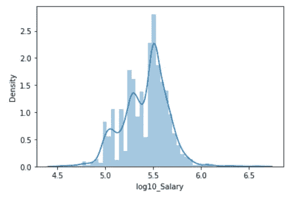

作者图片

工资数据现在更接近正态分布。我们可以尝试使用正态性检验来检验正态性，比如夏皮罗检验，但我不会在本文中解释这个概念。

数据转换的另一个目的是从数据关系中获得更好的洞察力。比如我只对大学的 GPA 和工科毕业生的工资之间的关系感兴趣。让我们试着用散点图把它形象化。

```
sns.scatterplot(x = 'Salary', y = 'collegeGPA', data = data)
```

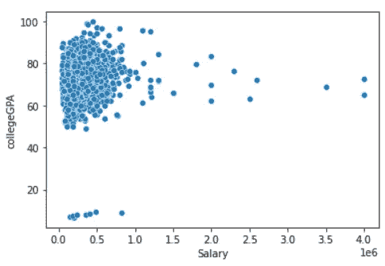

作者图片

我正试图将薪水和大学 GPA 之间的关系可视化，结果我得到了一个没有太多洞察力的数据集群。这是我们可以应用对数变换来重新调整数据以获得更好清晰度的时刻之一。

```
sns.scatterplot(x = 'log10_Salary',y = 'collegeGPA', data = data)
```

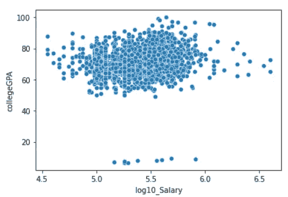

作者图片

薪水和大学绩点的关系现在清晰多了，绩点和薪水之间没有太大的关系。尽管如此，我们现在做的是可视化日志值与未缩放特征之间的关系。让我们试着把大学的 GPA 特征也转换一下，并把这种关系形象化。

```
data['log10_collegeGPA'] = data['collegeGPA'].apply(np.log10)
sns.scatterplot(x = 'log10_Salary',y = 'log10_collegeGPA', data = data)
```

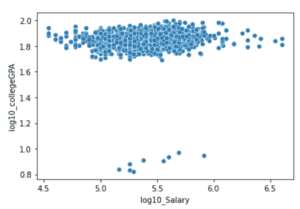

作者图片

与我们在没有任何数据转换的情况下将其可视化时相比，现在这种关系非常明显。这是进行数据转换的另一个好处。

这是有益的，特别是当您需要向业务用户展示数据关系时，但是您的数据是聚集的，因此很难获得任何洞察力。

单调变换有许多方法。不过，我不会在本文中解释它们，因为我计划撰写另一篇文章来概述其他单调转换方法。重要的是你明白什么是单调变换。

# 关系化(标准化)

相对化或标准化是一种数据转换方法**，其中列或行标准转换数据值**(例如，最大值、总和、平均值)。它不同于单调变换，在单调变换中，标准化不是独立的，而是依赖于另一个统计量。

当出现不同单位的属性时，您通常需要标准化，并且您的分析需要具有相似单位的数据。分析示例是聚类分析或降维，它们依赖于数据距离。

著名的标准化方法是 **Z 分数标准化，**通过特征的平均值和标准偏差将数据转换成比例。转换后的特征均值约为 0，标准差约为 1。Z 得分标准化转换后，转换后的数据本身将被称为 Z 得分。在数学符号中，它用下面的等式表示。

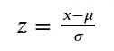

作者图片

其中 x =特征值，μ =特征均值，σ =特征标准差。

需要记住的一点是，尽管 Z 分数标准化将您的数据转换为遵循正态分布标准，但要素分布本身并不一定遵循正态分布。毕竟，Z 值标准化的目的是重新调整要素的比例。

让我们用一个数据集示例来尝试 Z 分数标准化。首先，我们需要导入我们想要使用的包。

```
#Import Z-Score Standard Scaler from the Sklearn package
from sklearn.preprocessing import StandardScaler
scaler = StandardScaler()
```

比方说，我想重新调整上一个例子中的工资数据。这是我们的原始数据和统计。

```
data['Salary'].head()
```

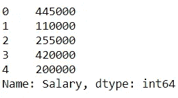

作者图片

```
data['Salary'].agg(['mean', 'std'])
```

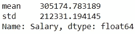

作者图片

我们的数据单位是万，工资平均值如上图所示。然后，我们使用之前导入的缩放器将数据转换为 Z 分数，但首先，我们需要拟合缩放器(这是获取特征的平均值和标准差的过程)。

```
scaler.fit(np.array(data['Salary']).reshape(-1, 1))
```

如果您想再次检查我们的定标器是否获得了正确的平均值和标准偏差，我们可以使用下面的代码访问该值。

```
print('Salary Mean', scaler.mean_)
print('Salary STD', np.sqrt(scaler.var_))
```

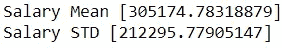

作者图片

结果略有不同，但几乎可以忽略不计。让我们将工资数据转换成 Z 分值。

```
data['Z_Salary'] = scaler.transform(np.array(data['Salary']).reshape(-1, 1))data[['Salary', 'Z_Salary']].head()
```

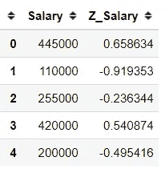

作者图片

我们现在可以看到原始数据和转换后的数据之间的差异。当您的数据小于平均值时，Z 得分为负值，反之亦然。让我们检查一下转换后的数据统计。

```
data['Z_Salary'].agg(['mean', 'std'])
```

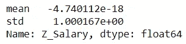

作者图片

可以看到，转换后的数据均值接近 0，标准差接近 1。使用 Z 分数标准化进行缩放的每个要素都将遵循相同的标准。

Z 分数标准化还有另一个好处，那就是**异常值检测**。我不会详细解释，但基本上，离群点检测概念与[经验法则](https://en.wikipedia.org/wiki/68%E2%80%9395%E2%80%9399.7_rule)有关。任何大于 3 或小于 3 的 Z 值都被视为异常值。

像单调转换一样，关系化或标准化也有许多方法，但这将是另一篇文章来详细讨论它。

# 概率变换(平滑)

概率变换或平滑是一种数据变换过程，用于消除数据中的任何噪声，以增强数据中最强的模式。

这种转换对异类或有噪声的数据特别有效。平滑过程允许您看到以前看不到的数据模式。尽管在解释平滑过程的结果时需要小心，但它可以向您显示一个趋势，即使是从随机数据看也是可靠的。

常用的平滑技术是[核密度估计(KDE)](https://en.wikipedia.org/wiki/Kernel_density_estimation) 平滑。这种技术基本上是通过估计基于有限数据样本的总体随机变量的数据概率函数来平滑数据。

让我们尝试平滑数据样本以获得数据模式。例如，我想看看计算机编程数据的分布。

```
sns.distplot(data['ComputerProgramming'], kde = False)
```

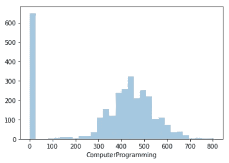

作者图片

这里可以看到宁滨数据模式，但是我们可能希望消除任何可能会分散我们对真实模式的注意力的干扰。让我们使用 KDE 平滑来获得该模式。

```
sns.distplot(data['ComputerProgramming'], hist = False)
```

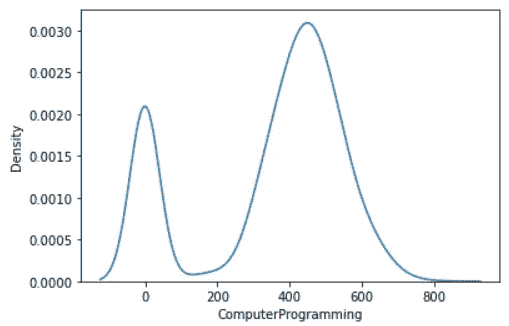

作者图片

通过平滑技术，我们使用数据的概率函数估计将数据转换成密度值。正如我们所看到的，我们的数据中有两个峰值，一个在 0，另一个在 500 附近，后者的峰值最高。

这种模式只有在我们平滑数据时才能看到。你可能会问，平滑模式似乎显示了不同于宁滨模式的模式。还记得平滑的目的吗？就是消除数据中的噪声，增强最强的模式。此外，KDE 根据样本数据估计人口中的概率函数，这意味着平滑模式是对人口中可能发生的情况的估计。

仍然有许多概率变换或平滑方法可以学习，但我会把它留到下一次。平滑的重点是转换数据以消除任何噪声并增强模式。

# **结论**

数据转换是数据科学家应该知道的一项技术，因为它有好处。根据 McCune 和 Grace (2002)在他们的[生态群落分析书](http://www.umass.edu/landeco/teaching/multivariate/readings/McCune.and.Grace.2002.chapter9.pdf)中所述，有 3 种数据转换方法。它们是:

1.  **单调变换**
2.  **关系化(标准化)**
3.  **概率变换(平滑)**

希望有帮助！

访问我的[**LinkedIn**](https://www.linkedin.com/in/cornellius-yudha-wijaya/)**或 [**Twitter**](https://twitter.com/CornelliusYW) 。**

> **如果您没有订阅为中等会员，请考虑通过[我的介绍](https://cornelliusyudhawijaya.medium.com/membership)订阅。**