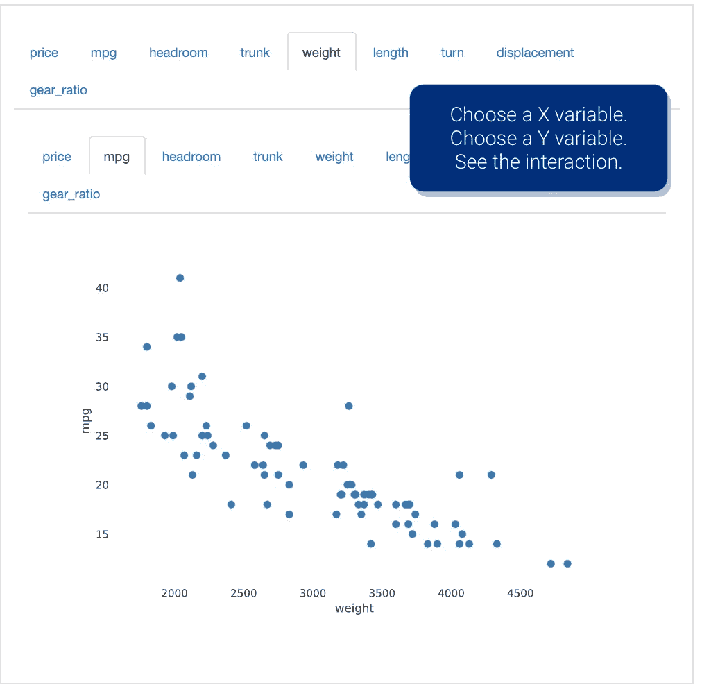

# 初学者友好的数据科学项目接受贡献

> 原文：<https://towardsdatascience.com/beginner-friendly-data-science-projects-accepting-contributions-3b8e26f7e88e?source=collection_archive---------33----------------------->

弗雷迪:维克多·福加斯在 [Unsplash](https://unsplash.com/photos/LNwIJHUtED4) 上拍摄的照片。

## 想为开源软件做贡献吗？这里有几个地方可以开始。

TLDR:看看支持数据科学家的四个开源软件项目，包括广受欢迎的**熊猫**，新兴的**数据分析师**，被称为**人物分析数据**(技术上是开放数据)的 R 包，以及**熊猫概况**。还讨论了支持开源软件项目的原因，包括让世界变得更美好的机会以及增强或构建知识和技能的机会。

更新:本文的更新版本(2022 年 5 月)现已发布:

 [## 接受社区贡献的数据科学项目

### 通过为开源软件做贡献来培养你的技能和帮助他人。

towardsdatascience.com](/data-science-projects-accepting-community-contributions-662e724ba110) 

# 简介和动机

成为数据科学家的最佳方式是成为一名数据科学家。提高数据科学水平的最好方法是练习、练习、再练习。

为开源软件项目做贡献至少有三个明智的理由:

1.  你可以为他人创造一个更美好的世界。
2.  为开源项目做贡献将有助于你学习。
3.  为开源项目做贡献也是扩展你的专业组合的好方法。

开源软件项目是那些向公众开放代码的项目。每个项目的具体工作方式是不同的。

例如，Python 是在开放软件倡议(OSI)下许可的开源编程语言。Python 软件基金会管理 Python 的开发。**为 Python 做贡献不是初学者的命题。**

数据科学家熟悉的另一个开源项目是 Pandas。熊猫的作者在 GitHub 上解释说，“欢迎所有的贡献、错误报告、错误修复、文档改进、增强和想法。”

如果你是一名数据科学家，并且希望让世界变得更美好，我建议你考虑为开源项目做一点或多点贡献。

本文确定了四个开源软件项目，它们为初级和中级数据科学家提供了机会。这些项目包括广受欢迎的**熊猫**，一个新兴的**数据列表**，一个被称为**人物分析数据**(技术上公开的数据)的 R 包，以及**熊猫档案。**

# 熊猫

一想到要为一个像熊猫这样突出和广泛使用的项目做贡献，可能会令人生畏。不要烦恼。熊猫的贡献者和维护者是受欢迎的人群。

因为有很多用户贡献和报告熊猫的问题，所以有一些不需要写代码的“贡献”方式。

例如，你可以在 GitHub 上浏览问题跟踪器。找到一个你感兴趣的问题。看看您能否重现该问题。无论您能否重现该问题，请务必在问题跟踪器上发布您的努力和结果。

重现问题时，您可能会发现原因。您可能不知道如何消除原因，但如果您发布您所了解的内容，将有助于其他人纠正问题。[要了解更多关于为 Pandas 做贡献的信息，请参阅 Pandas project GitHub repository 的 ReadMe.md.](https://github.com/pandas-dev/pandas#contributing-to-pandas-)

> 成为数据科学家的最佳方式是成为一名数据科学家。

# 数据列表

根据其 twitter 简介，Datasist 是一个“用于简单数据分析、可视化和建模的开源 Python 库。”[这个项目有投稿指南。](https://risingodegua.gitbook.io/datasist-doc/contributing)瑞星奥德瓜(Twitter 上的)是这个项目最初和主要的编码者。

在投稿指南中，Datasist 强调了文档的重要性。如果你相信高质量文档的重要性，并且你也对编写文档感兴趣，这个项目将欢迎你的贡献。通过增强或改进文档来为项目做贡献也算贡献。文档贡献和贡献新的代码或特性一样重要——这两种贡献类型以不同的方式计算，但是它们确实很重要。

如果您不熟悉 Datasist，它是一个可以让您更快地进行数据探索和建模的库。例如，下面的代码显示了如何将第 4–7 行(四行)重构为第 13–14 行(两行):

# 人员分析数据

这个项目是一个特例。它不是一个软件项目。相反，它是公开可用的数据。数据科学家可以将这些数据用于测试、培训和其他项目，这些项目可以从备用数据集的使用中受益。

数据来源于 [*人物分析*](http://peopleanalytics-regression-book.org/) 中的回归建模手册。作者通过可从[综合 R 档案网](https://cran.r-project.org/web/packages/peopleanalyticsdata/index.html) (CRAN)获得的 R 包提供该书的数据。R 包使得在 R 中加载这些数据变得很容易。

这个 R 包已经成熟，可以移植到 Python、Stata、Julia、SAS、Matlab 等。也许用一个宏来抓取数据并把它放入 MS Excel 将是聪明而有用的。这是一个良好的开端。把下面变成一个包。

如果你捡到这个，请告诉我。我愿意合作。我还建议在继续之前和作者基思·麦纽提([在 LinkedIn 上](https://www.linkedin.com/in/keith-mcnulty))聊一聊。得到他的祝福是有意义的。他已经公开讨论了移植该作品的前景。

# 熊猫-侧写

这个项目很好地利用了 GitHub 的赞助计划。至少有七个赞助商，这个项目得到了很好的维护。为了支持贡献者，这个项目有一个组织良好的贡献指南。该项目还有一个经常光顾的松弛频道。

初学者或中级数据科学家可以做的贡献的一个例子就是这个，它需要更新包的教程。starter 的另一个贡献是解决这个问题，其中[包括添加参数来调整饼图的颜色](https://github.com/pandas-profiling/pandas-profiling/issues/571)。

如果您还不熟悉这个包，它可以减少您花费在探索性数据分析上的时间。实现只需要五行代码(如下所示)。这五行代码的输出摘录见下文。

图片鸣谢:作者实现熊猫——剖析报告(节选)。

对熊猫概况的深思熟虑的贡献将有可能改善你和他人的工作。保证。

 [## 加入我的介绍链接媒体-亚当罗斯纳尔逊

### 作为一个媒体会员，你的会员费的一部分会给你阅读的作家，你可以完全接触到每一个故事…

adamrossnelson.medium.com](https://adamrossnelson.medium.com/membership) 

# 感谢阅读

如果你喜欢我要说的话，可以在:[adamrossnelson.medium.com](https://twitter.com/adamrossnelson)找到更多。

感谢阅读。把你的想法和主意发给我。你可以写信只是为了说声嗨。如果你真的需要告诉我是怎么错的，我期待着尽快和你聊天。推特:[@ adamrossnelson](https://twitter.com/adamrossnelson)| LinkedIn:[亚当·罗斯·纳尔逊](http://www.linkedin.com/in/arnelson) |脸书:[亚当·罗斯·纳尔逊](http://www.facebook.com/adamrossnelson)。