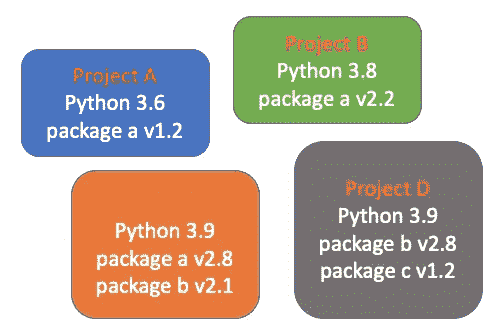
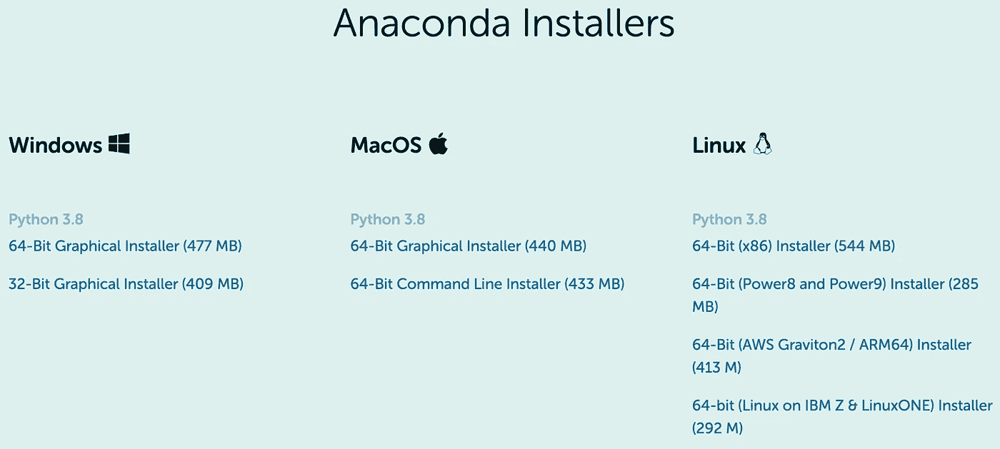
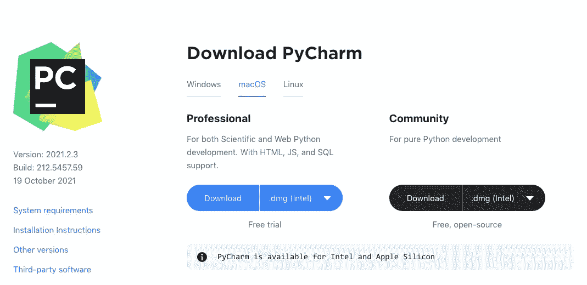
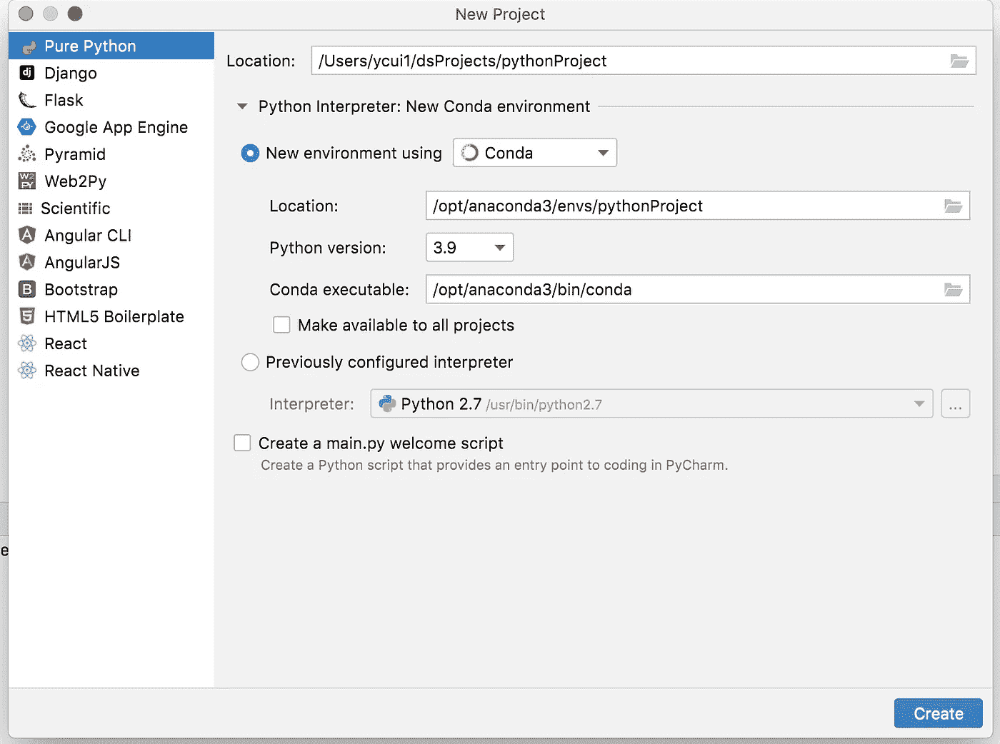
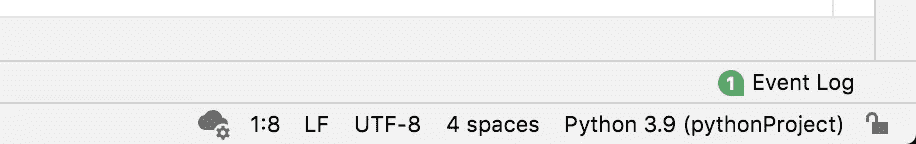
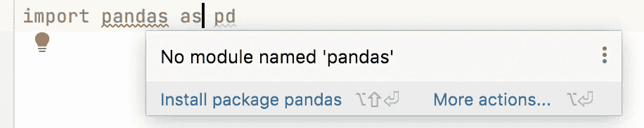
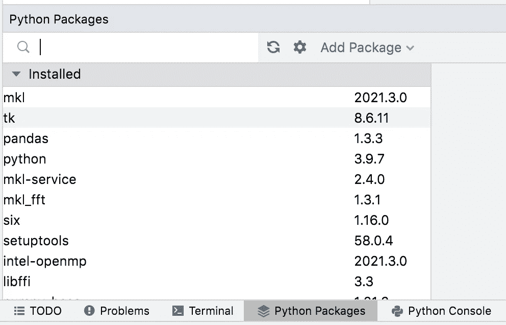
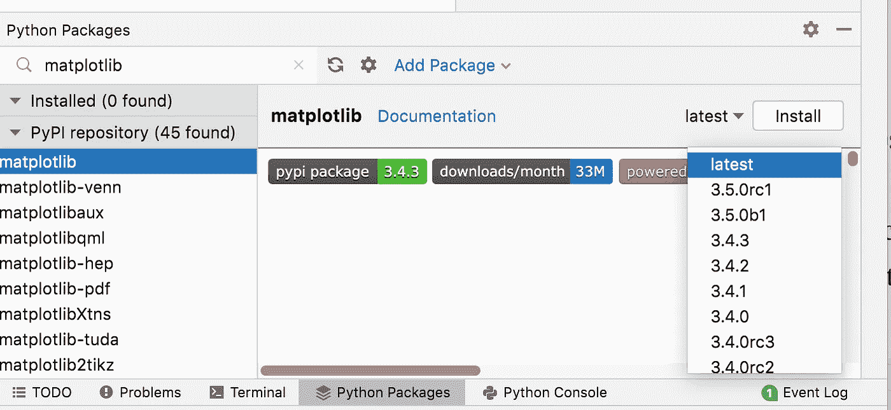
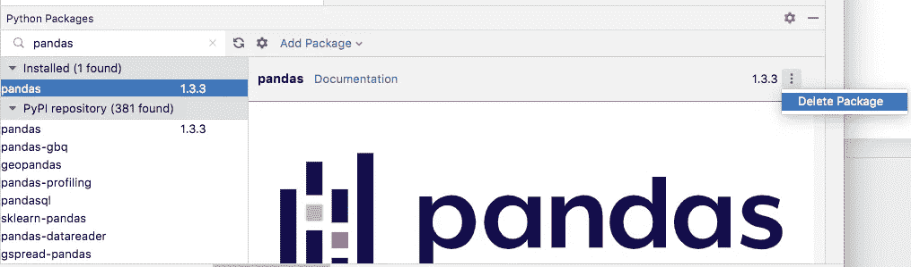

# 初学者友好的虚拟环境管理— Anaconda + PyCharm

> 原文：<https://towardsdatascience.com/beginner-friendly-virtual-environment-management-anaconda-pycharm-36178e20129f?source=collection_archive---------22----------------------->

## 轻松设置您的第一个虚拟环境


杰西卡·路易斯在 [Unsplash](https://unsplash.com?utm_source=medium&utm_medium=referral) 上的照片

Python 是趋势语言，因为它是几个专业领域中最流行的选择，如数据科学和机器学习。因此，许多人选择 Python 作为他们学习的第一门编程语言。对于初学者来说，虚拟环境是一个让他们相当困惑的概念。在这篇文章中，我想以初学者友好的方式回顾一下它是什么以及如何设置它。

## 虚拟环境

Python 是开源的，允许整个社区开发和发布他们的 Python 程序，通常是以框架、库或包的形式。Python 发展很快，从 2 到 3，已经看到了几周前正式发布的 3.10。Python 的第三方包也发展得非常快。原因很简单——越来越多的人在使用 Python，他们正在努力开发有益于其他 Python 程序员的工具。

然而，这是有代价的——用最新的 Python 和第三方包来保持项目的进度是很昂贵的。它们并不总是向后兼容的。例如，您的项目 A 使用 Python 3.6 和包 v1.2 版)。但是，你有另一个项目 B，它使用 Python 3.8 和包 a (v2.2)。很显然，如果两个项目都想留在同一台电脑上，你就不能在你的电脑系统上使用默认的 Python，还有其他的包，都是设置成某个版本的。

因此，您必须适应这些具有冲突的 Python 和包需求的项目。这是为您的项目创建虚拟环境的简单原理。



项目之间的冲突需求(图片由作者提供)

本质上，每个虚拟环境都可以被概念化为你的计算机系统中的一个独立的盒子，如上图所示。在这个框中，您有了所需的 Python 版本和项目所需的包。这些框是独立的，这样您在一个项目中所做的不会影响其他项目。

我们总是建议您为您的项目创建不同的虚拟环境，即使目前不同的项目可能共享一个 Python 版本和包。然而，当您想更新 Python 版本和一个项目的一些包，而不是其他项目时，机会就来了。不兼容将会发生，您将不得不再次重新配置项目。因此，我们应该从正确设置的虚拟环境开始我们的任何项目。

## Anaconda 用于虚拟环境管理

我希望你现在明白什么是虚拟环境，以及为什么你想为你的项目创建一个虚拟环境。现在，问题来了，我们如何管理虚拟环境。对于初学者，我认为使用命令或终端不是您最喜欢的选择。因此，我将为您提供一个点击式解决方案。我使用最多的工具是 [Anaconda](https://www.anaconda.com/) ，这是数据科学和机器学习社区中虚拟环境管理最常见的选择。



蟒蛇安装者(链接:[https://www.anaconda.com/products/individual#Downloads](https://www.anaconda.com/products/individual#Downloads)

如图所示，Anaconda 支持主要的操作系统，您应该能够找到您需要的操作系统。完成下载后，只需按照提示进行安装，这应该很简单。

## py charm——最大化生产力的 Python 编辑器

Python 编程有多个编辑器，比如 Visual Studio Code，Vim，Jupyter Notebook，当然还有 PyCharm。在这些选择中，PyCharm 是我的最爱，因为它几乎不需要设置。



下载 PyCharm(链接:[https://www.jetbrains.com/pycharm/download/#section=mac](https://www.jetbrains.com/pycharm/download/#section=mac))

您选择与您的操作系统相匹配的安装程序。社区版免费使用。值得注意的是，如果你在教育或学术机构工作，你也可以自由使用专业版。对我来说，因为我在一所非营利性的州立大学工作，所以我可以自由使用专业版。

我认为在您的计算机上安装 PyCharm 应该没有问题。所以，我们继续吧。

## 使用 Conda 虚拟环境的新项目

在您能够运行 PyCharm 之后，您可以创建一个项目，您将看到如下所示的内容:



皮查姆的新项目

你要注意的一件事是，你要用 Conda 创建一个新的环境，尽管还有其他一些选项。如您所见，您可以自由选择想要的 Python 版本。有一个复选框“对所有项目都可用”，通过检查您可以使用哪个解释器(您可以认为它是您的项目运行的 Python 版本)。

在项目中，右键单击项目目录，选择 New，从这里可以创建一个新的 Python 文件，假设它的名字是`test_file.py`。需要注意的一点是，在右下方，你会看到我们项目的解释器被设置为 Python 3.9 (pythonProject)。



显示解释器设置

## 安装/删除软件包—点击

对于初学者来说，一个方便的特性是 PyCharm 会通过提供适当的提示来尝试安装缺失的包。假设我们想在 Python 文件中使用熊猫。因为我们还没有安装它，您应该会看到一个错误，如下所示。



导入丢失的包时出错

你移动你的鼠标到软件包上，弹出菜单可以建议你安装软件包。你只需点击“安装包熊猫”并等待一会儿，你会看到熊猫安装，没有更多的错误指示。

要查看安装了哪些包，可以点击底部的“Python 包”标签。你会发现熊猫现在确实在名单上。



Python 包

在搜索框中，可以输入想要安装的 Python 包，比如 matplotlib。您将看到显示了可用的选项。你可以选择正确的安装。此外，您可以选择不同于最新版本的版本。



手动安装软件包

另一方面，你也可以删除一个包，通过输入包来显示它的信息，正如你在下面的截图中看到的。



手动删除包

## 使用终端

当您熟悉终端时，您可能会发现使用终端安装软件包更容易。用 PyCharm 也很方便。您只需点击底部的终端选项卡。应该引起您注意的一件事是，您会注意到在提示符前面的括号中有一个名称。

```
(pythonProject) computer_name:pythonProject ycui1$
```

如果你记得的话，那是现任翻译的名字。在 conda 的术语中，它是虚拟环境的名称。因此，您所做的一切(例如，软件包的安装)都将发生在虚拟环境中。

一些常用命令如下所示。

```
**Installation**
*# use conda*
conda install package_name
*# use pip*
pip install package_name**Deletion**
# use conda
conda remove package_name
# use pip
pip uninstall package_name
```

当然，使用终端还可以做许多其他事情。关于使用终端进行虚拟环境管理的详细说明，请参考我以前的文章:

</8-essential-commands-to-get-started-with-conda-environments-788878afd38e>  

## 结论

在本文中，我们学习了如何使用 Anaconda 和 PyCharm 为我们的项目建立一个虚拟环境，并学习了最基本的操作，比如在环境中安装和删除包。

最后提醒一下，为每个项目建立一个单独的虚拟环境总是一个好的做法。

感谢阅读这篇文章。通过[注册我的简讯](https://medium.com/subscribe/@yong.cui01)保持联系。还不是中等会员？通过[使用我的会员链接](https://medium.com/@yong.cui01/membership)支持我的写作(对你没有额外的费用，但是你的一部分会费作为奖励由 Medium 重新分配给我)。