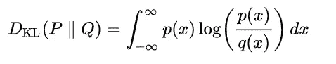

# 使用 PyTorch Lightning 的可变自动编码器(VAE)初学者指南

> 原文：<https://towardsdatascience.com/beginner-guide-to-variational-autoencoders-vae-with-pytorch-lightning-13dbc559ba4b?source=collection_archive---------5----------------------->

凯利·西克玛在 [Unsplash](https://unsplash.com?utm_source=medium&utm_medium=referral) 上的照片

这篇博客文章是一个迷你系列的一部分，该系列讨论了使用可变自动编码器构建 PyTorch 深度学习项目的不同方面。

> [第 1 部分](/beginner-guide-to-variational-autoencoders-vae-with-pytorch-lightning-13dbc559ba4b):数学基础与实现
> [第 2 部分](/beginner-guide-to-variational-autoencoders-vae-with-pytorch-lightning-part-2-6b79ad697c79):用 PyTorch Lightning
> [增压第 3 部分](/beginner-guide-to-variational-autoencoders-vae-with-pytorch-lightning-part-3-9d686d0d85d9#1921-b4c73b02c87):卷积 VAE、继承与单元测试
> [第 4 部分](/building-a-vae-playground-with-streamlit-aa88a3394c04) : Streamlit Web App 与部署

autoencoder 是一种无监督的神经网络架构，旨在寻找数据的低维表示。在这篇博客文章中，我将介绍 variable Autoencoder 的一个简单实现，它是 auto encoder 的一个有趣的变体，允许生成数据。

> 我不能创造的东西，我不理解——理查德·费曼

当我开始这个项目时，我有两个主要目标:

**1。** **练习将数学概念翻译成代码**
使用预先构建的模型和常用的神经网络层只能做到这一步。将数学方程翻译成可执行代码是一项重要的技能，在学习如何使用深度学习库时，这是一个非常好的实践。实现像 VAE 这样的简单架构对于理解实验室新出的最新模型大有帮助！

**2。** **学习 PyTorch 闪电**
PyTorch 闪电一直是我想学很久的东西。它是 PyTorch 的一个非常有用的扩展，极大地简化了训练模型所需的大量过程和样板代码。利用这个项目作为学习 PyTorch Lightning 的平台，帮助我在实习中有信心将其应用到其他项目中。

**变分自动编码器和表示学习**

在浏览代码之前，我们首先需要了解自动编码器是做什么的，以及为什么它非常有用。自动编码器通过学习数据的低维表示来工作，并尝试使用该低维数据来重新创建原始数据。

对于这个项目，我们将使用 MNIST 数据集。每个图像为 28×28 像素宽，可以表示为 784 维向量。正如大多数图像所预期的那样，许多像素共享相同的信息，并且彼此相关。这也意味着这些像素中的信息在很大程度上是冗余的，可以压缩相同数量的信息。数据的这种压缩形式是相同数据在更小的向量空间中的表示，该向量空间也称为潜在空间。给定一个特定的数据集，自动编码器试图找到最能反映底层数据的数据的潜在空间。

自动编码器架构—作者图片

1.  **编码器**
2.  **解码器**
3.  **潜在空间/瓶颈**
4.  **重建损失**

让我们看看自动编码器是如何为单个数据点工作的。首先，编码器部分试图将图像中的信息强行送入瓶颈。从数学上讲，这可以看作是从 R⁷⁸⁴到 r·⁴(瓶颈维度)的一个非常复杂的函数。维度低得多的瓶颈确保了信息将被压缩。接下来，解码器尝试使用该压缩信息来重建原始数据。根据压缩的潜在表示，解码器试图重建原始数据点。正如预期的那样，重建将不会是相同的，并且模型将基于原始数据和重建数据之间的差异而受到惩罚。对于普通的自动编码器，损失函数将是 L2-诺姆损失。最终，经过训练后，编码器应该能够将信息压缩成仍然有用的表示形式，并保留原始数据点的大部分结构。

# 可变自动编码器

既然我们已经了解了自动编码器是做什么的，让我们看看它们不太确定的表亲变分自动编码器(VAE)。vae 通常用于数据生成，而不是数据压缩。由于这一关键差异，架构和功能与普通的自动编码器略有不同。普通自动编码器的问题是数据可能被映射到一个不规则的向量空间。不规则的潜在空间降低了模型很好地推广到看不见的例子的能力。做到这一点的一种方法是执行正则化，这可以防止过度拟合，并在模型具有异常结构时惩罚模型。这平衡了模型压缩信息的能力和生成新数据的能力。

不规则的概率分布可能包含解码器性能较差的“口袋”,因为很少有例子被映射到该区域——按作者的图像

VAEs 不是将信息编码成向量，而是将信息编码成概率空间。这意味着，我们假设数据是从一个先验概率分布中产生的，然后尝试学习如何从这个概率分布中推导出数据。这个概率分布将是一个没有协方差的多元正态分布(N~(μ，σ))。这允许潜在的概率分布由 2 个 n 大小的向量来表示，一个用于平均值，另一个用于方差。

VAE 建筑——作者图片

我们先来看一下前传。数据点通过编码器，但现在将被编码成两个矢量，而不是一个。这两个向量定义了一个概率分布，我们可以从这个概率分布中取样。从这个分布中取样给我们一个数据点的潜在表示。然后，该表示通过解码器获得重新创建的数据点。

# VAE 正规化

如前所述，VAE 的另一个重要方面是确保潜在空间的规律性。在此之前，让我们先定义一些术语:

*   **先验— P(Z)** 先验表示所有数据的底层分布。先验通常是标准正态分布 N(0，I ),因为它简单且高度规则。
*   **后验— P(X|Z)** 后验表示给定特定数据点的条件分布**，**本质上，这是数据点被编码成的分布。后验是 N(μ，σ)的正态分布，其中σ是对角协方差矩阵。

为了正则化后验分布，我们分配一个代价函数，惩罚模型偏离先验分布。这个成本函数是 Kullback-Leibler 散度(KL-Divergence ),它度量两个概率分布之间的差异。

连续概率分布的 KL 散度—维基百科

对于许多分布，积分可能难以求解，但对于一个分布(先验)是**标准正态**而另一个分布(后验)有一个**对角协方差矩阵**的特殊情况，KL-散度损失有一个闭合解。

高斯和标准高斯之间的 KL 散度—维基百科

当训练 VAE 时，损失函数由**重建损失**和 **KL 发散损失组成。**KL-Divergence 的正则化确保后验分布始终是正则的，并且从后验分布进行采样允许生成有意义和有用的数据点。

# 代码段

现在让我们进入代码，看看 PyTorch 中的一切是如何组合在一起的！

## 初始化

初始化相当简单，编码器和解码器本质上与普通自动编码器的架构相同。主要区别在于，有两个额外的层将瓶颈转化为μ和σ向量。在这种情况下，这一层没有压缩，但这是一个可以调整的设计选择。

## 重新参数化技巧

实施 VAE 模型的另一个基本步骤是重新参数化技巧。如果仔细观察架构，从μ和σ向量生成潜在表示涉及采样操作。采样操作的问题在于，它是一个随机过程，梯度不能反向传播回μ和σ矢量。

将 x 解构为确定性部分μ和σ以及随机部分 z

⊙ —逐元素乘法运算符

为此，我们利用了重新参数化技巧，它允许我们**分离操作**的随机和确定部分。其工作原理是，我们从标准正态分布 N(0，I)中进行采样，并使用μ和σ矢量对其进行变换。

总的来说，这允许对μ和σ向量进行梯度更新，这将允许 VAE 的编码器层从训练过程中学习。

## 把所有的东西放在一起！

正向传递现在只是编码和解码步骤，其间有重新参数化/采样操作。

需要注意的一件重要事情是，数据被编码为`log_var`而不是`variance`。`log_var`矢量是由许多线性图层生成的，因此，矢量的值将从[-∞，∞]开始。由于方差不能为负，我们取指数，这样方差将有一个合适的范围[0，∞]。

在下一部分，我们将看看 PyTorch Lightning 如何简化整个过程，并更详细地探索模型及其输出(插值)!

请随意查看 GitHub 上的完整代码，非常感谢您的任何反馈！

**VAEs 入门指南** [**第二部分**](/beginner-guide-to-variational-autoencoders-vae-with-pytorch-lightning-part-2-6b79ad697c79)

github:[https://github.com/reoneo97/vae-playground](https://github.com/reoneo97/vae-playground)
领英:[https://www.linkedin.com/in/reo-neo/](https://www.linkedin.com/in/reo-neo/)

# **有用链接:**

(1)了解变分自动编码器(VAEs)

非常有用的资源，尤其是如果你想深入研究 VAEs 的数学方面。

 [## 了解变分自动编码器(VAEs)

### 逐步建立导致 VAEs 的推理。

towardsdatascience.com](/understanding-variational-autoencoders-vaes-f70510919f73) 

(2)变型自动编码器——Arxiv 洞察

精心制作的视频介绍了 VAE 的基本知识和机制，同时在结尾部分介绍了许多关于 VAEs 的最新研究。

[https://www.youtube.com/watch?v=9zKuYvjFFS8](https://www.youtube.com/watch?v=9zKuYvjFFS8)