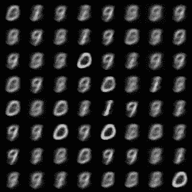
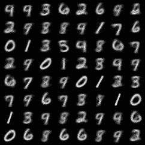

# 使用 PyTorch Lightning 的可变自动编码器(VAE)初学者指南(第 2 部分)

> 原文：<https://towardsdatascience.com/beginner-guide-to-variational-autoencoders-vae-with-pytorch-lightning-part-2-6b79ad697c79?source=collection_archive---------14----------------------->

由[马克-奥利维尔·乔多因](https://unsplash.com/@marcojodoin?utm_source=medium&utm_medium=referral)在 [Unsplash](https://unsplash.com?utm_source=medium&utm_medium=referral) 上拍摄的照片

这篇博客文章是一个迷你系列的一部分，该系列讨论了使用可变自动编码器构建 PyTorch 深度学习项目的不同方面。

> [第 1 部分](/beginner-guide-to-variational-autoencoders-vae-with-pytorch-lightning-13dbc559ba4b):数学基础与实现
> [第 2 部分](/beginner-guide-to-variational-autoencoders-vae-with-pytorch-lightning-part-2-6b79ad697c79):用 PyTorch Lightning
> [增压第 3 部分](/beginner-guide-to-variational-autoencoders-vae-with-pytorch-lightning-part-3-9d686d0d85d9#1921-b4c73b02c87):卷积 VAE、继承与单元测试
> [第 4 部分](/building-a-vae-playground-with-streamlit-aa88a3394c04) : Streamlit Web App 与部署

在第 1 部分的[中，我们看了变分自动编码器，这是一个基于自动编码器的模型，但允许数据生成。我们了解了整体架构和实现细节，使它能够成功地学习。在这一节中，我们将讨论 PyTorch Lightning (PL)，它为什么有用，以及我们如何使用它来构建我们的 VAE。](/beginner-guide-to-variational-autoencoders-vae-with-pytorch-lightning-13dbc559ba4b)

# PyTorch 闪电是什么，为什么要用？

简而言之，PyTorch lightning 是 PyTorch 的一个附件，它使得训练模型更加简单。PyTorch Lightning 模块具有默认的类方法，可以减少训练模型时所需的不必要的样板代码。在进行实验时，我们通常想做一些小的改变，这对于大的模型来说是非常困难的。除了简化代码，Pytorch Lightning 还包含许多有用的功能，例如自动学习率查找。让我们看看如何将 Pytorch 代码翻译成 Pytorch Lightning。

# 培训和验证步骤

在一个标准的 PyTorch 类中，只有 2 个方法必须被定义:定义模型架构的`__init__`方法和定义向前传递的`forward`方法。所有其他操作(如数据集加载、训练和验证)都是在类外部运行的函数。

在 PyTorch Lightning 中，我们使用`training_step`来定义训练步骤中发生的操作。这可能包括日志记录、损失计算和反向传播等操作。然而，当使用 PyTorch Lightning 时，所需的代码大大减少了，重用已经定义的类方法相当简单。

PL 将调用`training_step`方法。基于在`training_step`中计算的损失，PL 将反向传播损失，并计算梯度和优化模型权重。在上面的代码中，我们看到有一个`configure_optimizers`方法，这是一个简单的类方法，它返回将用于模型训练的优化器。与需要`optimizer.step()`和`loss.backward()`的普通 PyTorch 不同，这些步骤被抽象出来，作为`training_step`方法的一部分自动运行。

执行验证步骤几乎是相同的代码。函数反向传播将计算并返回验证损失，并且不会进行参数更新。

# PL 培训师

了解如何使用 PyTorch Lightning 的另一个重要补充是训练师课程。这个类对于将任何数据拟合到模型中是必不可少的。使用`trainer.fit(model,dataloader)`我们指定训练模型的数据。在实例化 trainer 对象时，我们还可以传递一些不同的参数来定义培训过程。

*   训练参数
*   时代数
*   用于训练的 GPU 数量
*   auto _ lr _ find 自动确定要使用的学习率。在不需要任何额外实验的情况下，快速建立基线和训练模型非常有用。

使用 PyTorch 闪电训练器拟合模型

# 数据集加载

例如，用于训练、验证和测试的数据源是固定的，我们可以通过在类中定义 DataLoaders **来进一步扩充 LightningModule。** PyTorch Lightning 将自动从相应的数据加载器获取数据，并将其用于模型训练。

注意，我们可以简单地使用`trainer.fit(model)`，而不必为训练或验证指定数据加载器。在这种情况下，由于 MNIST 是一个公共数据集，`train_dataloader`的代码相对较短，但对于更复杂的例子，在将数据加载器转换成适合训练的格式之前，该步骤可能包括几个预处理操作。

# 其他方法和回调

现在你可能会想。

“我试图解决的问题并不简单，如果我需要解决该怎么办？”

*   每个历元改变数据集
*   降低学习率
*   保存一些输出

幸运的是，`pl.LightningModule`基类有许多额外的方法来帮助执行任何可能有助于训练神经网络的操作。这里我们将实现`validation_epoch_end`。这将在每个时期后保存图像样本，以便我们验证我们的 VAE 模型是否训练正确。

`validation_epoch_end`接收`validation_step`的所有输出。在`validation_step`中，前向调用的输出与损失一起返回。我们可以简单地从`x_out`中提取一个样本，将其重新整形为合适的大小，并将数组保存为图像。

除了使用额外的类方法，另一种定制训练过程的方法是使用回调。与类函数相比，回调包含非常相似的方法，但是更具可配置性。如果在整个训练周期的多个不同点调用回调，应该使用回调来防止重复相同的代码块。还有一些预构建的回调函数，可以执行常见的操作，比如保存模型检查点或执行提前停止。

# 张量板跟踪

如果您之前注意到了，对于训练和验证步骤，我们使用`self.log()`。PyTorch Lightning 使记录训练期间的不同指标变得极其容易，并且可以使用 TensorBoard 轻松访问这些数据。训练循环期间记录的所有值将存储在`lightning_logs`中。

使用张量板跟踪损失函数

通过在终端中运行`tensorboard --logdir lightning_logs/`，可以可视化和监控记录的所有指标/损失。这有助于您跟踪不同的实验，并调整正在使用的一些超参数。

# 最终输出

比较第一个时期(左)和最后一个时期(右)期间的图像样本

比较第一个和最后一个时期的图像，我们可以看到模型已经成功地从图像中学习。在左图中，大多数项目是模糊的，而右图中的数字明显更清晰。值得注意的一点是，图像仍然很模糊。关于 VAEs 的一个有趣的事情是，它们可以与更适合该任务的特性选择架构一起使用。在这个例子中，我们使用 MNIST 数字的扁平矢量表示，但这肯定不是最好的方法。对于计算机视觉任务，使用几个卷积层将允许更好的特征提取，并帮助模型获得明显更好的结果。在这种情况下，我们仍然能够获得不错的性能，因为 MNIST 是一个“简单”的数据集。使用卷积 VAE 将获得明显更好的娱乐损失性能，因为从瓶颈中提取的特征将更有用。

构建图像的 VAE，可以从几层卷积步骤开始，取特征 max 展平矢量，用这个矢量获得瓶颈中的μ和σ矢量(参考 [Part 1](/beginner-guide-to-variational-autoencoders-vae-with-pytorch-lightning-13dbc559ba4b) )。为 VAE 执行正则化的神经网络架构仅出现在瓶颈处，并且该组件可以用于其他神经网络架构中。

除了图像之外，VAEs 还被成功地应用于许多不同的数据集，并且在自然语言处理(NLP)任务中取得了非常显著的效果。最近对 VAEs 的研究也产生了新的架构，如 MMD-VAE 和 VQ-VAE，它们实现了更好的性能。有关不同 VAE 架构的更多信息，请查看下面的链接。

请随意查看 GitHub 上的完整代码，非常感谢您的任何反馈！

github:【https://github.com/reoneo97/pytorch-lightning-vaeT2
LinkedIn:[https://www.linkedin.com/in/reo-neo/](https://www.linkedin.com/in/reo-neo/)

# 有用的资源

**(1)不同 VAE 架构的 PyTorch 实现**

<https://github.com/AntixK/PyTorch-VAE>  

不同 VAE 架构的有用汇编，显示了各自的 PyTorch 实现和结果。

**(2)神经离散表示学习**

  

关于矢量量化 VAE (VQ-VAE)的论文。关于如何进一步改进离散数据的 VAEs 的有趣论文。强调 VAEs 存在的一些问题以及 VQ-VAEs 如何解决这些问题

**(3) MMD-VAE**

<https://ermongroup.github.io/blog/a-tutorial-on-mmd-variational-autoencoders/>  

一篇有趣的博文，讲述了一种不依赖 KL 散度损失函数来正则化潜在概率分布的不同方法。