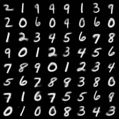

# 使用 PyTorch Lightning 的可变自动编码器(VAE)初学者指南(第 3 部分)

> 原文：<https://towardsdatascience.com/beginner-guide-to-variational-autoencoders-vae-with-pytorch-lightning-part-3-9d686d0d85d9?source=collection_archive---------22----------------------->

## 用最少的额外代码构建新模型

[亚历山大·奈特](https://unsplash.com/@agk42?utm_source=medium&utm_medium=referral)在 [Unsplash](https://unsplash.com?utm_source=medium&utm_medium=referral) 上拍照

这篇博客文章是一个迷你系列的一部分，该系列讨论了使用可变自动编码器构建 PyTorch 深度学习项目的不同方面。

> [第 1 部分](/beginner-guide-to-variational-autoencoders-vae-with-pytorch-lightning-13dbc559ba4b):数学基础与实现
> [第 2 部分](/beginner-guide-to-variational-autoencoders-vae-with-pytorch-lightning-part-2-6b79ad697c79):用 PyTorch Lightning
> [增压第 3 部分](/beginner-guide-to-variational-autoencoders-vae-with-pytorch-lightning-part-3-9d686d0d85d9#1921-b4c73b02c87):卷积 VAE、继承与单元测试
> [第 4 部分](/building-a-vae-playground-with-streamlit-aa88a3394c04) : Streamlit Web App 与部署

在这一节中，我们将看看如何使用上一节中编写的代码来构建卷积 VAE。这种 VAE 能更好地识别图像中的重要特征，从而生成更好的图像。

最好的部分是，由于 PyTorch 模块和类继承，这个新模型可以用最少的额外代码来构建。

# **什么是卷积 VAE？**

卷积是图像处理中常用的一种操作，用于提取特定图像的特征。图像通常充满了不必要的信息，放大任何像素，周围的像素很可能有非常相似的颜色。在卷积神经网络(CNN)中，许多卷积滤波器被自动学习以获得在分类和识别图像时有用的特征。我们简单地借用这些原理来使用卷积层来构建 VAE。

通过构建卷积 VAE，我们旨在获得更好的特征提取过程。即使我们不执行任何分类/回归任务，我们也希望潜在的表示尽可能地丰富信息。通过更强大的特征提取，解码器可以生成更有说服力的数据点。

即使这个新模型使用了新的架构，我们也希望高效地编写代码。好的高效的代码使用**干**(不要重复自己)原则。为了避免不必要的重复代码，我们将使用继承这一强大的概念来构建我们的模型。

# **什么是继承？**

继承是面向对象编程(OOP)语言中一个非常强大的概念。它允许用户定义对象，然后构建新对象，同时保留原始对象的一些功能。继承是一个非常广泛的话题，有些事情，比如多重继承，我就不详细介绍了。有关 Python 和继承中 OOP 编程的更多信息，请查看本文。

<https://realpython.com/inheritance-composition-python/>  

实际上，继承是如此普遍，以至于我们已经在[第 1 部分](/beginner-guide-to-variational-autoencoders-vae-with-pytorch-lightning-13dbc559ba4b)中使用了继承。甚至在不知道的情况下，继承在 PyTorch 中被广泛使用，其中每个神经网络都从基类`nn.Module`继承。

因此，我们只需要定义`__init__` 和`forward`方法，剩下的工作由基类来完成。我们将要构建的模型将进一步推进这一步，并建立在上一节构建的 VAE 的基础上。

继承允许我们在不同的阶段建立复杂的模型。我们之前建立的 VAE 模型充当了骨架。它执行重新参数化并实现 KL-散度损失。

然后我们可以继承这个类，创建一个更好的模型，使用一个更适合这个任务的架构。

conv·VAE 继承了 VAE 的所有方法，然后改写了编码器和解码器。作者图片

然后可以通过改变编码器和解码器来修改该模型。编码器简单地进行表示学习，解码器进行生成。这些子网可以是简单的线性层，也可以是复杂的网络。

在我们的卷积 VAE 中，我们希望改变这些组件，同时保持所有其他组件不变。使用继承可以很容易做到这一点

这允许我们避免重复大量的代码。像`forward`、`training_step`、`train_loader` 这样的类方法将保持完全相同，继承允许我们自动复制它们。

# **代码重构**

照片由 [Garett Mizunaka](https://unsplash.com/@garett3?utm_source=medium&utm_medium=referral) 在 [Unsplash](https://unsplash.com?utm_source=medium&utm_medium=referral) 上拍摄

如果你仔细观察，在之前的模型中。向前的步骤包括在将向量送入编码器之前将其展平。对于卷积 VAE，我们不想做这种展平，因为它会阻止我们 2D 卷积。

似乎要使继承工作，我们需要做一些代码重构！

从本质上讲，代码重构是在保持外部功能不变的情况下对代码进行一些修改。这意味着代码在输入和输出方面仍然具有相同的行为。重构可以使代码运行得更快，或者在我们的例子中，简化代码，以便我们可以在其他地方重用它。

我们可以重构我们的代码，而不是重写整个前进步骤，这样输入张量的展平和将其整形回 28 x 28 发生在`self.encoder`和`self.decoder`内，而不是在前进函数内。

这使得该模型更加通用，因为它可以适应不同的编码器，例如卷积，其中我们不想平坦化输入向量。

# **单元测试**

但是坚持住！我们先不要做重构。您希望发生的最糟糕的事情是，当您更改代码时，您的模型会崩溃。我们希望确保 VAE 模型在重构后仍然做完全相同的事情。

确保您的项目在更改后仍然可用的一个好方法是编写单元测试。

单元测试是简单的脚本，您可以运行它来确保您的代码正常工作。在我们的模型中，这是为了确保我们建立的模型仍然能够训练，梯度仍然能够很好地反向传播。

为此，我们将使用 pytest，这是一个用于编写单元测试的强大库，它还包含有用的调试工具来找出测试失败的原因。

首先，我们在目录中创建一个名为`tests`的文件夹。在这个文件夹中，我们创建了一个名为`test_model.py`的文件。这将存储所有需要的单元测试。

让我们定义一个简单的测试:

pytest 的另一个很酷的特性是它会自动搜索包中的测试函数。只要函数名以`test`开头，pytest 就会相应地运行测试。

通过在命令行中运行`pytest`，我们可以确认测试通过。

# **Pytorch 模块化**

现在有了合适的测试系统，我们可以开始修改代码了。

关于 PyTorch 模块，需要理解的一件重要事情是，它们基本上是函数。当一个输入被传递给任何 PyTorch 模块时，它只是运行一些操作，然后将渐变反向传播。

这意味着即使简单的整形操作也可以初始化为 PyTorch 对象。

展平模块

我们简单地将旧的 forward 函数的第一行作为一个模块添加进去。通过这种方式，将`Flatten()`作为一个模块放在编码器中可以实现同样的目的。

现在让我们为堆栈模块编写代码。对于 MNIST 数据集，该模块将张量整形回其原始形状(1，28，28)

在我们的例子中，因为图像是黑白的，所以只有一个通道，但是让我们构建一个堆栈模块，它也可以处理彩色图像。

为此，我们必须将关于数据集的信息存储到模型本身中。这是通过将数据的原始形状作为参数传递给模块来实现的。这些参数是通道、高度和宽度。前进操作将是一个类似于展平模块的`view`操作。

为了存储这些参数，我们需要使用 **__init__** 函数。这允许我们将这些参数存储为类变量。为此，我们首先将其初始化为 PyTorch 模块，这是通过调用`__init__`函数中的`super(self,Stack).__init__()` 来完成的。

堆栈模块

既然我们已经将这些整形函数抽象成它们自己的对象，我们可以使用`nn.Sequential`将这些操作定义为编码器和解码器模块的一部分。

新 VAE 法典

就像整形操作是`self.encoder`和`self.decoder`的一部分一样

让我们运行单元测试来检查代码是否有效。

作者图片

不错！测试通过，代码按预期运行。

<https://docs.pytest.org/en/6.2.x/>  

**构建卷积编码器**

有了这些改动，我们就可以开始建造 VAE conv 了。让我们从编码器开始。

conv·VAE 的编码器和 __init__ 函数

编码器的第一部分是`Conv2d`层的连续步骤以及`ReLU`激活和`BatchNorm2d`以帮助加速训练。该步骤在降低维度的同时执行特征提取。

下一步是展平步骤，将矢量转换回一维。VAE 中的潜在代表是一个单一的向量，我们需要得到相同形状的输入。这可以使用我们之前定义的`Flatten()`模块来完成。只要从 VAE 文件中导入它，我们就可以在编码器中使用它。

继续看解码器

conv·VAE 的解码器网络

解码器的架构非常相似。基本上是一样的，只是方向相反。

1.前馈层`(nn.Linear)`

2.`Stack`将线性层转换为带通道的 2d 形状的模块

3.`ConvTranspose2d`对图像进行增采样并生成具有更大高度和宽度的图像的图层。(与 Conv2d 相反)

4.`Conv2d`层清理最终输出

最终层应该输出与原始形状具有相同尺寸的东西，并且 MSE 损失可以很容易地应用。

信不信由你，我们结束了！默认情况下，Python 类将继承所有的方法，因此除了`__init__` 之外的所有其他函数都不必重新定义。这意味着从培训、验证甚至`save_images`的一切都将自动呈现在新的 Conv VAE 中使用。

# 结果！

图片来自香草 VAE(左)和卷积 VAE(右)。作者图片

卷积 VAE 产生的图像似乎更清晰，图像中有更多的可变性。尽管使用相同的潜在空间维度，新模型能够捕捉和重建显示更多变化的图像。这显示了改进的编码器-解码器网络的能力，并且当应用于彩色图像时，这种差异将更加显著。

在下一节(也是最后一节),我将着眼于将模型完全部署到 Heroku 上所需的步骤，并创建一个与它们交互的平台！