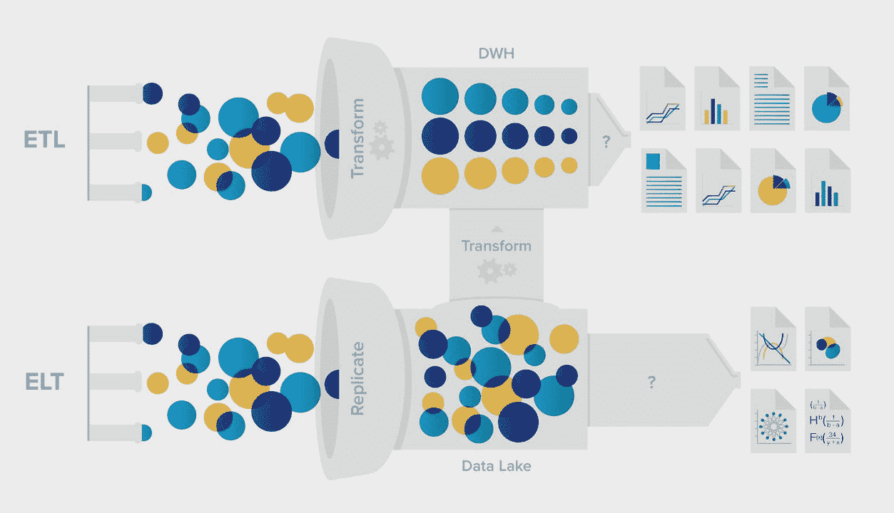

# 初学者指南:提取、转换、加载(ETL)

> 原文：<https://towardsdatascience.com/beginners-guide-extract-transform-load-etl-49104a8f9294?source=collection_archive---------27----------------------->

## 了解数据分析中的大数据原理

照片由[法比奥](https://unsplash.com/@fabioha?utm_source=unsplash&utm_medium=referral&utm_content=creditCopyText)在 [Unsplash](https://unsplash.com/s/photos/data-analytics?utm_source=unsplash&utm_medium=referral&utm_content=creditCopyText) 上拍摄

提取、转换、加载过程(简称:ETL)描述了从各种来源收集数据到最终存储在[数据仓库](https://databasecamp.de/en/data/data-warehouses)解决方案中的步骤。当需要可视化大量数据时，各个阶段就开始发挥作用了。

# 什么是 ETL？

公司和组织面临着必须处理越来越大的数据量的挑战。这些信息也来自许多不同的系统，它们有自己的数据结构和逻辑。这些数据应该尽可能统一地存储在中央数据仓库中，以便用于[数据挖掘](https://databasecamp.de/en/data/data-minings)或数据分析。

为了保证这些信息的可靠性和弹性，必须从不同的源系统中提取、准备这些信息，然后加载到目标系统中。所有这些都发生在 ETL 过程中。

# ETL 过程步骤

为了更好地理解提取、转换和加载过程，有必要详细了解一下各个阶段:

## ETL 提取

提取是从各种来源检索数据并集中存储的过程步骤。在这个步骤中，除了其他事情之外，还执行数据质量检查以确保数据仓库中的干净状态。这些检查可以包括，例如，匹配[数据类型](https://databasecamp.de/en/data/data-types)或寻找缺失值。例如，可以检查是否所有表示价格的项目都用美元标记。如果数据有严重的质量缺陷，也可以在这个阶段被拒绝。如果没有或只有少量缺陷，数据将被传递到下一阶段，在那里进行必要的更改。

提取步骤包括从各种来源加载信息。其中包括:

## ETL 转换

在这个阶段，所有数据都被转换成与数据仓库或应用程序的数据模型相匹配的结构。如果仍然有数据质量问题，现在已经处理了。例如，这包括填充缺失值或纠正错误。此外，这里已经进行了基本计算，可以用这些计算来汇总或准备数据。这可能包括，例如，营业额已经按日累计，如果需要，不是每个订单都单独保存。

## ETL 加载

我们在前面步骤中准备的数据现在可以加载到数据仓库或目标数据库中。如果那里已经有较旧的同类型信息，这必须相应地补充，甚至交换。这通常是通过使用唯一的 ID 或输入信息保存的时间来完成的。通过这种方式，可以对数据进行比较，并有针对性地删除过时的信息。

# ETL 应用程序

ETL 过程主要用于当您希望将数据集中存储在公司或组织的数据仓库中时。为此，必须从各种数据存储中收集数据并进行合并。信息具有完全不同的数据结构并不少见，这需要在转换步骤中做一些工作。

当信息要在商业智能解决方案中显示时，ETL 过程用于确保数据以这样一种方式存储，即它可以尽可能容易地在图中显示并且没有错误。

提取、转换和加载过程步骤可用于多种应用。其中包括:

*   数据仓库中信息的集中存储。
*   借助商业智能实现数据可视化
*   合并来自不同系统的数据

# ETL 挑战

当要迁移许多非常不同的系统及其数据时，ETL 阶段可能会带来最大的挑战。然后，数据模型完全不同的情况并不少见，必须对它们进行大量的转换工作。

否则，如果数据质量存在必须首先纠正的缺陷，转换步骤的成本也会很高。在某些应用程序中，丢失值根本无法避免，仍然必须进行相应的处理。例如，如果我们在测量装配线上的组件的生产线上有测量数据，但维护是在 2021 年 5 月 30 日和 2021 年 6 月 1 日之间执行的，因此在此期间没有收集数据。因此，我们在此期间丢失了所有记录的零件长度测量值。我们现在可以忽略该期间的记录，或者，例如，用前后几天的测量平均值替换缺失的字段。

# ETL 与 ELT

ETL 过程已经建立了几年甚至几十年。然而，在同一时期，许多应用程序中积累的数据量也显著增加。因此，直接构造所有结果数据并将其存储在数据仓库中是一件非常昂贵的事情。相反，在大多数情况下，非结构化数据首先存储在所谓的[数据湖](https://databasecamp.de/en/data/data-lakes)中。在那里，数据以原始格式存储，直到特定应用程序需要它。

为此，ETL 过程被修改为所谓的 ELT 过程。正如字母的排列已经表明的，填充数据湖的第一步是“装载”步骤。在数据湖中，数据仍然是非结构化的、未排序的和未更正的。

ETL vs. ELT |来源: [LinkedIn](https://media-exp1.licdn.com/dms/image/C5612AQGYkLLT_jRG7A/article-cover_image-shrink_720_1280/0/1555330740270?e=2147483647&v=beta&t=kkswCmAGKAbVW-lUAZ-gkhNxbkIbbVAHJ8b-nq_R8vE)

一旦特定用例需要这些信息，并且已经定义了目标数据格式，就开始准备数据的“转换”过程。[例如，Hadoop](https://databasecamp.de/en/data/hadoop-explained) 可以作为数据湖的技术。

# 这是你应该带走的东西

*   ETL 包含从不同系统收集数据、准备数据并将其存储在目标系统中的重要过程步骤。
*   各个阶段确保信息与数据模型保持一致，并符合特定的质量标准。
*   ETL 主要用于将数据存储在数据仓库中或显示在 BI 应用程序中的时候。

*如果你喜欢我的作品，请在这里订阅*<https://medium.com/subscribe/@niklas_lang>**或者查看我的网站* [*数据大本营*](http://www.databasecamp.de/en/homepage) *！此外，媒体允许你每月免费阅读* ***3 篇*** *。如果你想让***无限制地访问我的文章和数以千计的精彩文章，不要犹豫，通过点击我的推荐链接:*[https://medium.com/@niklas_lang/membership](https://medium.com/@niklas_lang/membership)获得会员资格，每个月只需支付 ***5*****

***</learn-coding-13-free-sites-to-help-you-do-it-9b2c1b92e573>  </using-convolutional-neural-network-for-image-classification-5997bfd0ede4>  </introduction-to-random-forest-algorithm-fed4b8c8e848> ***