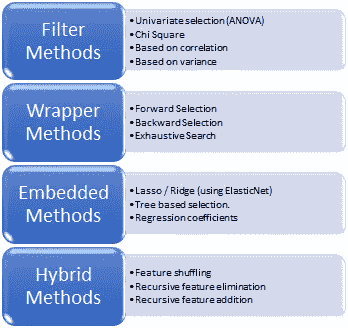
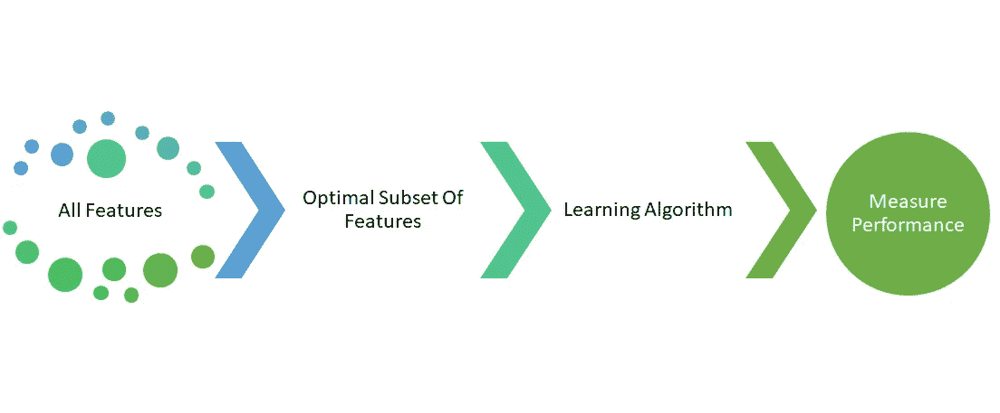
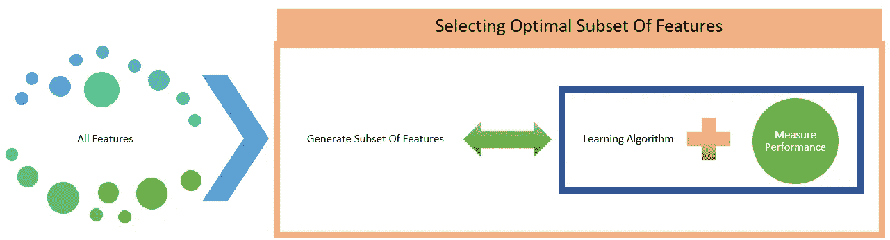
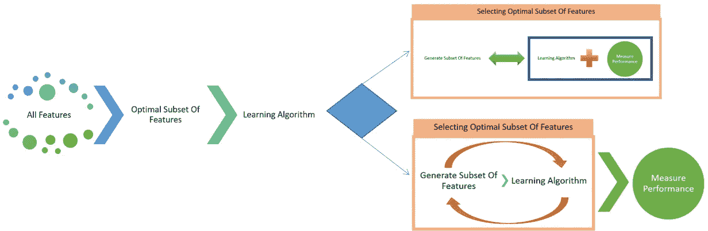
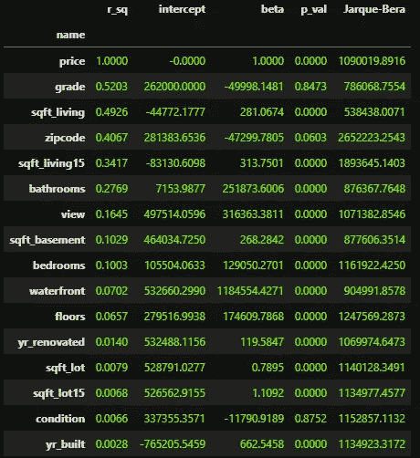
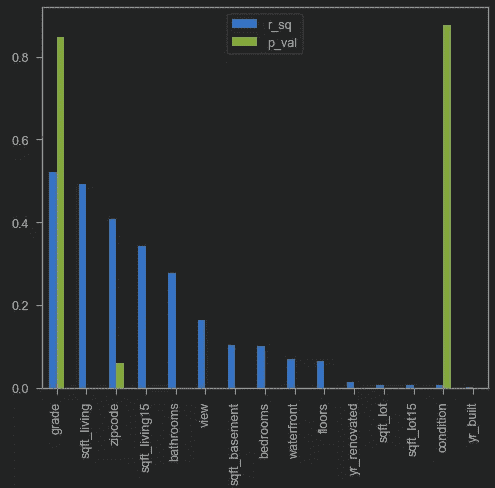
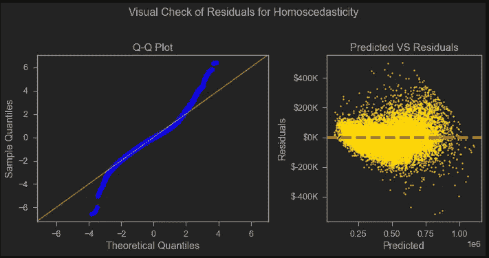

# 功能选择初学者指南

> 原文：<https://towardsdatascience.com/beginners-guide-for-feature-selection-by-a-beginner-cd2158c5c36a?source=collection_archive---------15----------------------->

## 特征选择的不同方法以及为什么每个人都要为特征选择而烦恼；通过比较不同的方法来选择最优的特征选择方法。

处理大型数据集时，由于存在大量要素，建模运行起来可能会非常耗时。一个模型有数百个特征并不罕见。那么剔除不相关的和不合格的特征就很关键了。这就是特征选择的概念发挥作用的时候了。在本文中，我将尝试介绍一些广泛使用的特性选择技术，并演示其中的一些。

特征选择对于建立计算高效的模型是极其重要的步骤。这方面有很多技巧。让我们从定义特征选择的过程开始。

> 特征选择是选择最相关的预测特征的子集用于机器学习模型建立的过程。

> 特征消除通过剔除冗余特征和不能提供太多洞察力的特征来帮助模型更好地执行。它在计算能力上是经济的，因为需要训练的功能更少。结果更易于解释，并且通过检测共线要素减少了过度拟合的机会，如果方法使用得当，还可以提高模型的准确性。

***特征选择方法:***



特征选择方法的亮点，按作者分类的图片

# *1。过滤方式:*

*探测能力:★☆☆|速度:★★★★*


从可用的布景中挑选最好的，照片由 [UX 印度尼西亚](https://unsplash.com/@uxindo?utm_source=medium&utm_medium=referral)在 [Unsplash](https://unsplash.com?utm_source=medium&utm_medium=referral) 上拍摄

这不是机器学习方法。它根据要素的属性过滤要素。这种方法是“模型不可知”的，即性能不依赖于所用的模型。

这种方法应该用于初步筛选。它可以检测恒定的、重复的和相关的特征。通常在减少功能方面不是最好的表现。也就是说，这应该是减少要素的第一步，因为它根据所使用的方法来处理要素的多重共线性。



使用过滤方法的特征选择过程，按作者分类的图像

这方面的几个例子:

1.  *单变量选择(ANOVA:* 方差分析 *)*
2.  *卡方*
3.  *基于皮尔森相关性*
4.  *线性判别分析(LDA):* 线性判别分析用于寻找特征的线性组合，其表征或分离两个或更多类别的分类变量

# *2。包装方法:*

*探测能力:★★★☆ |速度:★☆☆☆*


机器学习的胜利，照片由[附身摄影](https://unsplash.com/@possessedphotography?utm_source=medium&utm_medium=referral)在 [Unsplash](https://unsplash.com?utm_source=medium&utm_medium=referral)

这种方法使用机器学习算法。这种方法的性能取决于所选的模型和底层数据。通常可以建议最佳的特征子集。尝试不同的功能子集以找出最佳功能。通常计算量非常大。可以检测特征之间的相互作用。

在特征消除方面可能是最好的性能。对于大型数据集，包装器非常慢。


使用包装方法的特征选择过程，由作者创建的图像

这方面的几个例子:

1.  *正向选择*
2.  *向后选择*
3.  *穷举搜索*

# ***3。嵌入方法:***

*探测能力:★★★☆☆ |速度:★★★☆☆*


人机协同工作，图片来自 [pixabay](https://pixabay.com/photos/connection-hand-human-robot-touch-3308188/)

构建模型时执行特征选择。通常比包装方法的计算成本低。通常提供两全其美的结果，通常是更现实的方法。



使用嵌入式方法的特征选择过程，按作者排序的图像

这方面的几个例子:

1.  *拉索*
2.  *带脊套索(使用 ElasticNet 规则化特征)*
3.  *基于树的选择。*
4.  *回归系数(特征必须标准化)。*

超参数调整对于该方法非常重要，这是该方法的人工干预部分。

# *4。混合方法:*

*探测能力:★★★☆☆ |速度:★★★☆*

上述所有技术的融合。这种方法比包装器方法计算量少，并且具有良好的性能。



使用混合方法的特征选择过程，按作者排序

这方面的几个例子:

1.  *功能洗牌*
2.  *递归特征消除*
3.  *递归特性添加*

**带走消息:**

1.  过滤方法通过特征相对于目标变量的相关性基于特征的相关性对特征进行排序，而包装方法通过实际训练特征子集上的模型来测量特征子集的有用性。
2.  与包装器方法相比，过滤器方法要快得多，因为它们实际上并不训练模型。而包装器方法则不然，这使得它们计算量很大，有时甚至无法执行。
3.  过滤方法使用选定的统计方法进行特征选择，而包装方法执行交叉验证以确定特征的最佳子集。
4.  由于要素的属性，过滤方法可能无法找到要素的最佳子集，但是包装方法通常可以更经常地提供要素的最佳子集。
5.  包装器方法倾向于使模型更容易过度拟合，对于那些方法，测试训练分离是必须的。

为了演示这些技术，我对“金县住房数据集”执行了基于特征间相关性的特征选择、方差分析、正向选择、RFE 和套索技术。

为了使这篇文章简短，不偏离主题，我将简要介绍一下我为准备数据所采取的步骤。

1.  分类特征是 OneHotEncoded。
2.  我从“id”栏中删除了重复项。

2.在 NaN 中填入 0，并在“waterfront”、“view”、“yr _ renovated”和“sqft_basement”功能中将其他错误输入填入 0。

3.转换适当的数据类型。

4.从数据中剔除异常值。

5.将数据缩放至最小最大缩放器(此缩放器单独缩放和转换每个要素，使其位于数据集的给定范围内，例如，介于 0 和 1 之间)以用于 lasso。

包含这部作品的笔记本可以在 GitHub 上的`Feature_Selection.ipynb`找到[这里的](https://github.com/tamjid-ahsan/beginners-guide-for-feature-selection)。

1.  过滤方法:

*   *基于皮尔森相关性*

我使用这个函数来获得相关的特征

在清理的数据集上运行时，结果如下:

```
correlated features:  1
correlated features:  {'sqft_above'}
```

这意味着“sqft_above”功能与其他功能相关，应该删除。

*   *单变量选择(ANOVA)*

我使用这一行代码来执行 ANOVA。

我根据 r 的平方对结果进行了排序。结果如下。



作者图片

由此，我对模型中包含的最重要的特性有了一个想法。如`grade`、`sqft_living`、`zipcode`等。



作者图片

绘制时，我也能根据它们的 p 值感觉到它们的重要性。`grade`和`condition`具有很高的 p 值。

2.包装方法:

*   预选

我在 OneHotEncoded 数据帧上使用这个函数进行前向选择。

然后我运行了下面的代码。

```
model = forward_selected(df_model_processed_ohe, 'price')
print(model.model.formula)
print(model.rsquared_adj)
model.summary()
```

结果给出了从最重要到最不重要的特性。

```
price ~ sqft_living + yr_built + sqft_lot + sqft_living15 + zipcode_98004 + grade_9 + grade_8 + grade_10 + grade_7 + zipcode_98023 + zipcode_98033 + zipcode_98040 + zipcode_98092 + zipcode_98042 + zipcode_98003 + zipcode_98058 + zipcode_98038 + zipcode_98030 + zipcode_98031 + zipcode_98055 + zipcode_98002 + zipcode_98198 + zipcode_98032 + zipcode_98178 + zipcode_98168 + zipcode_98022 + zipcode_98112 + view_4 + zipcode_98199 + zipcode_98115 + zipcode_98103 + zipcode_98117 + zipcode_98119 + zipcode_98105 + zipcode_98107 + zipcode_98109 + zipcode_98116 + zipcode_98102 + zipcode_98122 + zipcode_98052 + zipcode_98006 + zipcode_98005 + zipcode_98053 + zipcode_98136 + zipcode_98144 + zipcode_98008 + zipcode_98029 + condition_5 + view_2 + zipcode_98188 + view_3 + zipcode_98027 + zipcode_98007 + zipcode_98074 + zipcode_98075 + zipcode_98034 + zipcode_98125 + zipcode_98039 + zipcode_98126 + zipcode_98177 + grade_11 + zipcode_98133 + zipcode_98118 + sqft_basement + condition_4 + yr_renovated + view_1 + zipcode_98155 + waterfront_1 + zipcode_98072 + zipcode_98011 + zipcode_98065 + zipcode_98028 + bathrooms + zipcode_98106 + floors + zipcode_98108 + zipcode_98077 + zipcode_98146 + zipcode_98056 + zipcode_98059 + zipcode_98045 + zipcode_98019 + zipcode_98166 + zipcode_98014 + zipcode_98024 + zipcode_98010 + condition_3 + zipcode_98148 + zipcode_98070 + grade_5 + bedrooms + sqft_lot15 + 1r_sq: 0.8315104663680916
```

这还会返回用于检查同质性的图。



作者图片

我可以看到，残差图远非完美，模型中有明显的偏差。

3.嵌入式方法:

我为这个演示表演了套索。使用 sklearn.linear_model 中的 LassoCV

一开始有 95 个特征。上面代码的结果是:

```
Model r squared 0.8307881074614486
Number of Selected Features: 91
```

Lasso 将特征集减少到 91。这些功能已被删除- `sqft_lot15 ' 、` zipcode_98070 ' 、` zipcode_98148 '、` grade_8 '。

4.混合方法:

为了演示这一点，我使用了来自 scikit-learn、sklearn.svm 和 sklearn.feature_selection 模块的 SVR 和 RFE。如果在 RFE“n _ features _ to _ select”中没有传递任何内容，则选择一半的特征。我为这个特性选择使用了下面的代码。

这样的结果是:

```
Model r squred: 0.776523847362918
number of selected feature 47
```

为模型选择特征更像是一门艺术，其中使用的判断力很重要。建模中经常用到的一句话是*垃圾输入垃圾输出*。对于特征选择也是如此。我们在根据选定的特性建模时必须小心，因为*有时候越少越好*。

在上面的演示中，他们中的一些人表现良好，而一些人表现不佳。这取决于数据科学家根据分析的目标为他们的模型选择最佳数字。也就是说，这些技术对于任何一个高效的数据科学家来说都很方便。

另一种方法是用于降维的主成分分析。它在保留属性的同时减少了特征，但是牺牲了模型的推理。

今天到此为止。下次见！