# Google Data Studio 数据可视化初学者指南

> 原文：<https://towardsdatascience.com/beginners-guide-on-data-visualization-with-google-data-studio-3c0c26c3bff4?source=collection_archive---------8----------------------->

## 使用 Data Studio 更好地可视化和理解数据的初学者教程

艾萨克·史密斯在 [Unsplash](https://unsplash.com?utm_source=medium&utm_medium=referral) 上拍摄的照片

## 介绍

数据科学就是处理数据，其中一个重要的分支是数据可视化，您可以通过交互和可视化的方式交流和呈现最终结果的信息。除了使用数据可视化将结果呈现给最终用户，我还经常在数据科学流程的不同步骤中使用数据可视化，例如在数据预处理之前让我更好地理解数据，以及在建模步骤中，我在不同的图表中可视化我的预测结果，以查看模型如何再次执行历史结果(*，尤其是对于时间序列预测*)。

## 关于谷歌数据工作室

Google Data Studio 于 2016 年首次推出测试版，并成为数据可视化的常用工具——为什么？

*   方便用户的
*   兼容多种数据源(如:MySQL、Google Analytics、Google BigQuery、PostgreSQL、Youtube、excel 文件等。)
*   实时数据连接器—与多个数据源无缝集成，并刷新您的报告
*   价格——每个用户都可以免费使用！
*   个性化—根据您选择的图表、颜色和指标定制您的控制面板
*   共享和协作—您可以与其他人或所有人共享您的报告！

让我们开始学习如何用 Google Data Studio 构建交互式可视化。

## 入门指南

首先，使用谷歌账户[https://datastudio.google.com/](https://datastudio.google.com/)登录 Data Studio，你将会直接进入 Data Studio 主页:

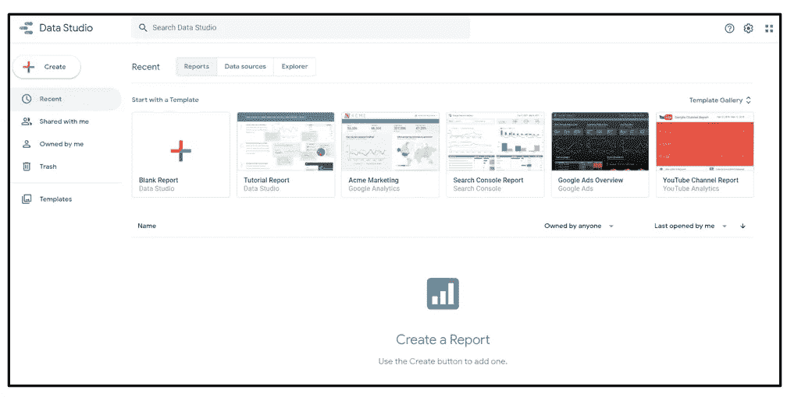

Data Studio 主页(图片由作者提供)

在主页上，请注意 Google Data Studio 提供了各种各样的模板来启动您的过程。从模板中，您可以根据个人喜好定制图表、字体和颜色。(*如果你要选择一个模板开始——根据你的主题选择一个相关的模板！*)

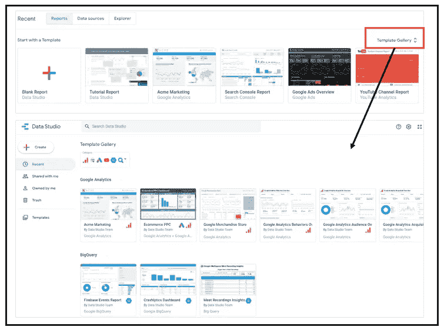

谷歌数据工作室——模板库(图片由作者提供)

对于本教程，我们将从一个空白报表开始，以便更好地理解如何从头开始构建您自己的仪表板。首先选择:(+)空白报告。

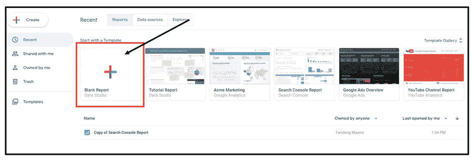

从空白报告开始(图片由作者提供)

## 添加数据源

打开一个空白报告后，要做的第一件事是连接到一个数据源，它也是仪表板的构建块。Google Data Studio 会提示您一个选项:向报告添加数据。Google Data Studio 提供了各种各样的连接器，让我们连接一个来自 Google Big Query 的公共数据集。

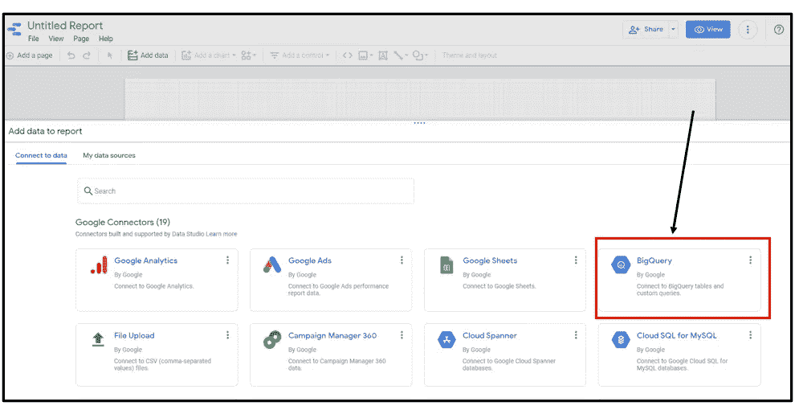

将数据添加到报告中(图片由作者提供)

我们将在本教程中使用的公共数据集是——伦敦自行车租赁，可在[谷歌大查询公共数据集](https://console.cloud.google.com/bigquery(cameo:product/greater-london-authority/london-bicycles)?project=bigquery-public-data) ( [来源:data.london.gov.uk](https://data.london.gov.uk/))中找到。该数据集包含伦敦桑坦德循环雇佣计划的雇佣人数信息。

添加来自 Google Big Query 的数据(图片由作者提供)

在将数据添加到报告中后，Google Data Studio 会根据对所提供数据集的理解自动制表。

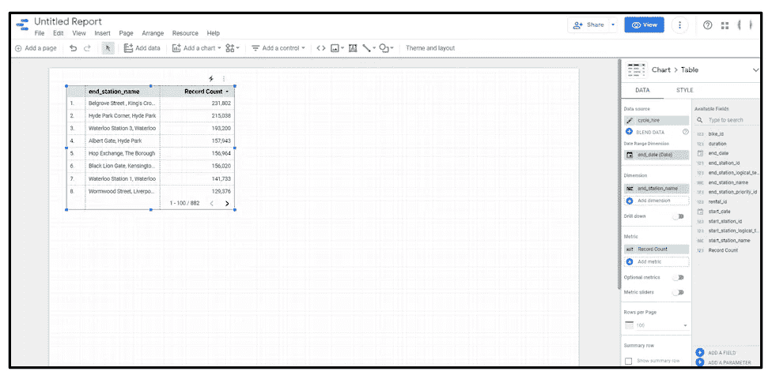

谷歌数据工作室-编辑视图(作者图片)

让我们删除创建的表，因为我们想从头开始构建—右键单击“删除”。

## 指标和维度

在开始构建可视化之前，需要理解两个重要的术语，即术语“度量”和“维度”。

指标—是数据中的数字测量值，以数字形式表示。(比如销售价值、时间、持续时间等。)

维度-是数据中的分类值。(例如性别、国家、城市等。)

因此，在构建图表时，维度用于分解指标值。例如:

*   销售值 ***(公制)*** 按城市分解 ***(维度)***
*   按性别细分的子女数量 ***(公制)******【维度】***

## 添加“条形图”

现在让我们添加第一个视觉效果——一个条形图。从工具栏中，单击“添加图表”和一个下拉列表，该列表包含不同的图表，您可以从中选择您想要的图表。在这里，我将选择一个水平条形图。

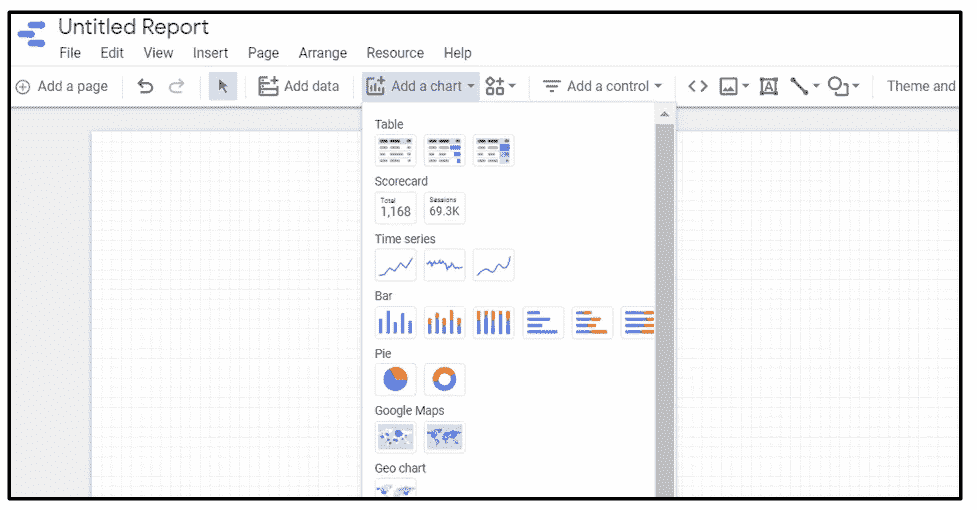

添加图表选项(图片由作者提供)

从下拉菜单中选择后,“条形图”将添加到报告中。选择条形图，您会发现可以从右侧窗格配置条形图上显示的数据。在这里，我选择可视化出租次数最多的前 10 个站点。

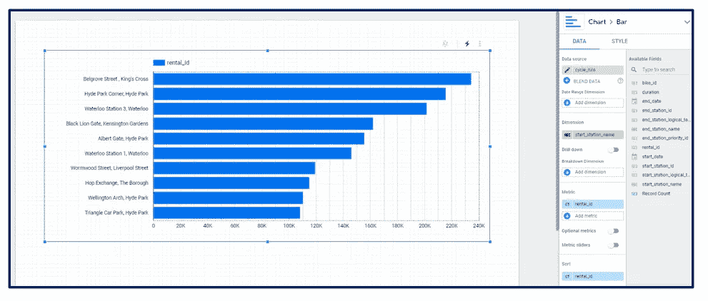

添加“条形图”(图片由作者提供)

在右侧窗格中，配置以下选项:

*   尺寸:起点站名称
*   指标:计数(租赁标识)
*   排序:计数(租赁标识)，降序

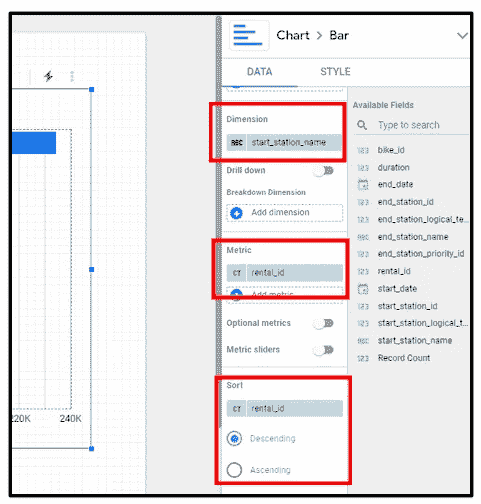

选择“条形图”的维度和度量(图片由作者提供)

接下来，由于我们的数据集中总共有 880 个不同的“起点站名称”，让我们选择可视化骑手经常乘坐的前 10 个最受欢迎的车站。我们可以在右侧窗格—“Style”选项卡下进行配置，并将条形数量限制为“10”。

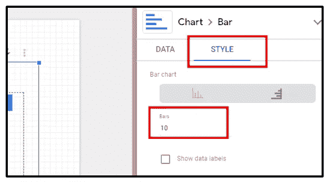

设置“条”的数量(图片由作者提供)

## 定制您的“条形图”

当构建仪表板时，这是我最喜欢的部分，即根据我个人的喜好改变条形图的颜色。在 Google Data Studio 中，这可以在右边的“风格”选项卡上完成。

自定义“条形图”颜色(图片由作者提供)

在右侧窗格—“样式”选项卡上，根据您自己的偏好配置以下选项:

*   颜色依据:选择您喜欢的颜色
*   参考行:metric:rental _ id；计算:平均值
*   您选择的字体
*   您选择的图表背景和边框颜色

## 添加“折线图”

除了条形图之外，现在让我们添加一个“折线图”来显示一段时间内的租赁总数。折线图有助于了解成交量在一段时间内的波动情况。同样，从工具栏中，单击“添加图表”,并从下拉菜单中选择“折线图”。

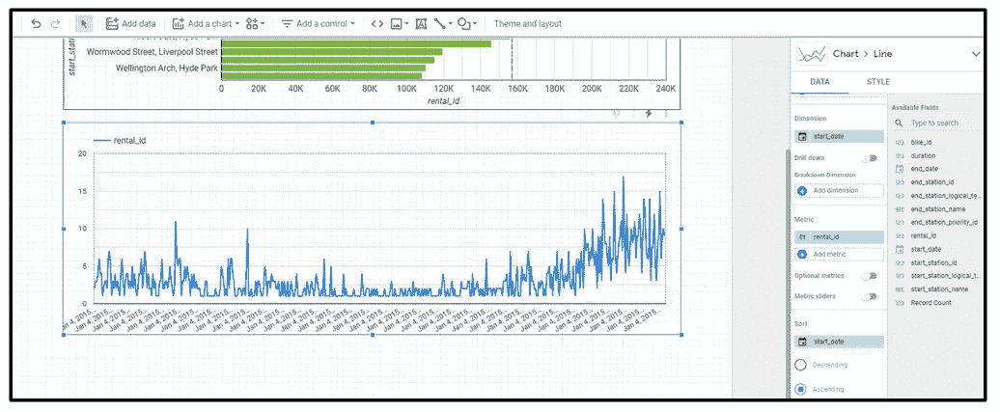

添加“折线图”(图片由作者提供)

在右侧窗格中，配置以下选项:

*   维度:开始日期
*   指标:计数(租赁标识)
*   排序:开始日期，升序

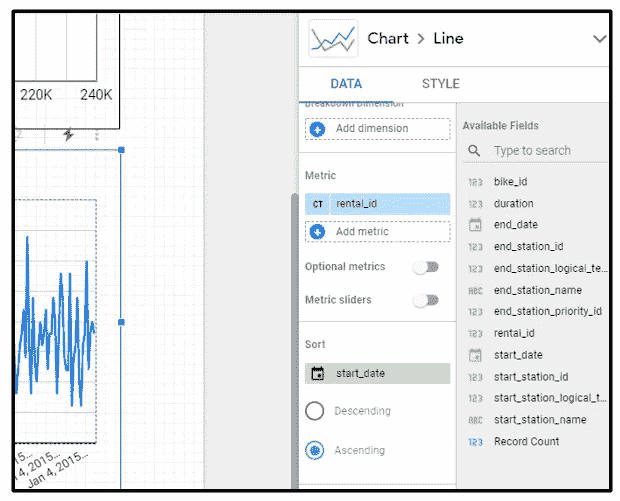

选择“折线图”的维度和度量(图片由作者提供)

## 创建“双轴折线图”

从我们当前的折线图继续，让我们通过添加另一个指标来创建一个双轴图。双轴图表通常用于可视化两个不同度量标准之间的关系。

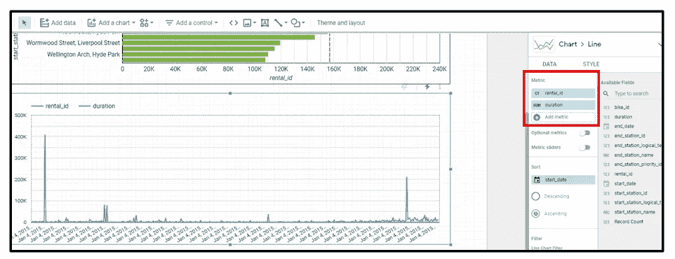

向当前“折线图”添加第二个指标(图片由作者提供)

选择折线图，并在右侧窗格中添加以下指标:

*   度量:sim(持续时间)

请注意，添加第二个指标后，每个日期的 total rental_id 的值不再那么明显。这是因为两条线绘制在同一轴上，并且具有不同的比例测量值。要解决此问题，请通过在右轴绘制第二个 metic 来创建双轴折线图。这可以在右侧窗格的“样式”选项卡下进行配置。

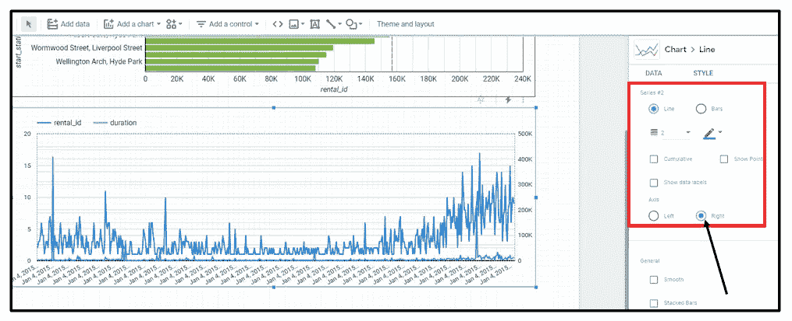

创建“双轴折线图”(图片由作者提供)

在右侧窗格—“样式”选项卡上，配置以下选项:

*   滚动到系列# 2——它代表我们的第二个指标:持续时间
*   轴:右侧

现在，在折线图上清楚地查看两条线，只是在一张图表上绘制这么多日期可能会太拥挤？让我们通过按月分组数据并添加日期范围选项来解决这个问题。

## 按月份和日期范围选项分组数据

要按月对值进行分组，请通过选择右侧窗格中“start_date”维度下的日历图标进行配置。

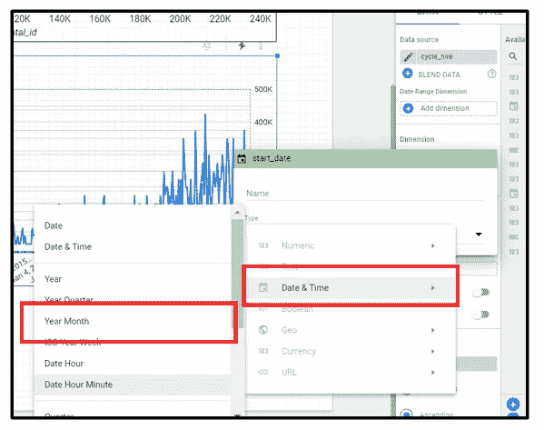

按“年/月”对日期值进行分组(图片由作者提供)

在右侧窗格—“数据”选项卡上，配置以下选项:

*   在维下—选择日历图标
*   选择日期和时间→“年月”

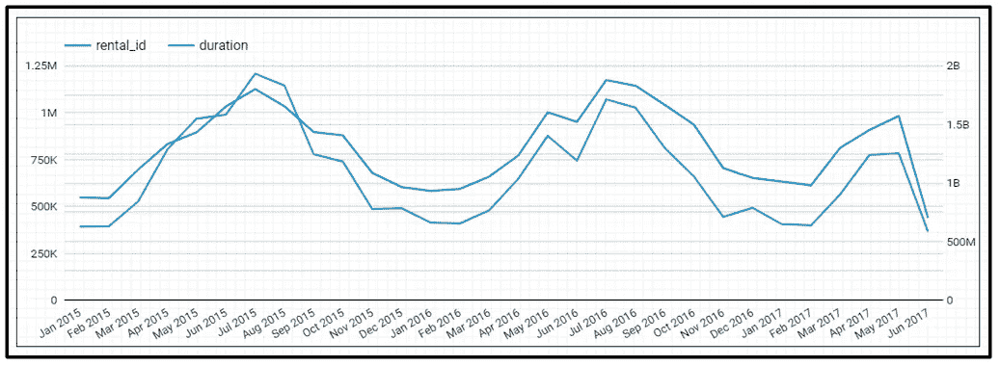

按“年/月”图表分组日期值(按作者分组的图像)

现在，我们可以更好地了解从 2015 年到 2017 年 6 月每个月的总租金和持续时间。此外，我们可以添加一个过滤器选项来选择要查看的时间段的日期范围。

在引入日期范围控制选项之前，在右侧窗格中添加“start_date”作为两个图表的日期范围维度。添加此维度后，两个图表都将根据数据范围控件选择的值进行筛选。

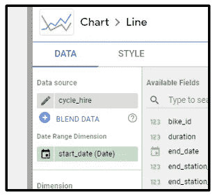

添加日期范围维度(作者图片)

接下来，从工具栏中，单击“添加控件”并选择“日期范围控件”

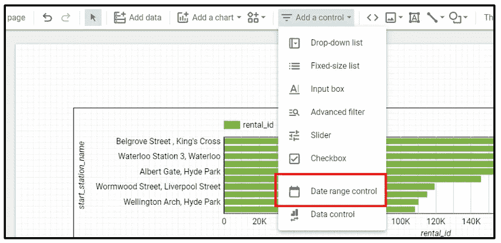

添加“日期范围控件”(图片由作者提供)

将日期范围控件属性设置为“自动日期范围”。使用此选项，用户可以从日历视图中选择他们的日期范围。

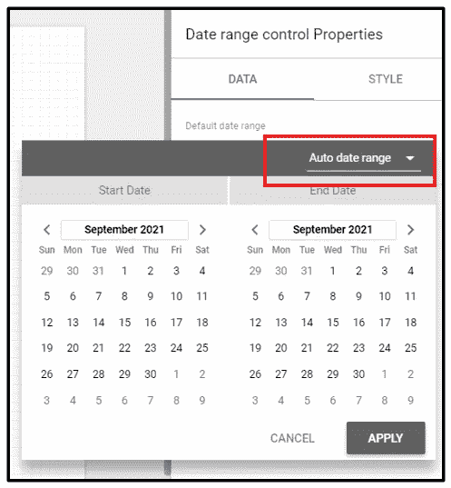

设置“自动日期范围”(图片由作者提供)

要测试“日期范围控制”过滤器，请将报告切换到“查看”模式。

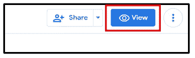

切换“查看”模式(图片由作者提供)

“查看”模式以不可编辑的形式显示仪表板，您可以在其中预览仪表板并与之交互。在“查看”模式下，通过选择一个日期范围来测试“日期范围控件”并将其应用于报告。(*这里我选择的是 2016 年 2 月—2017 年 2 月*)

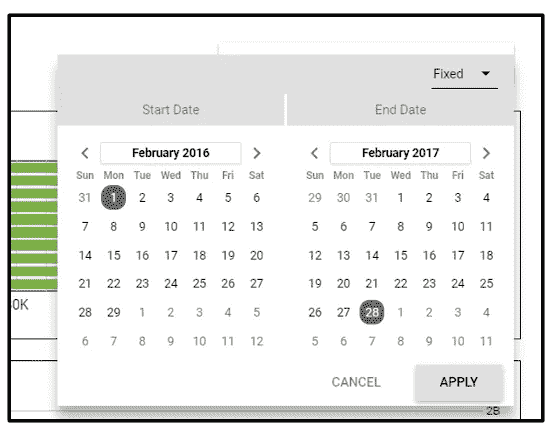

选择日期范围(按作者分类的图像)

根据所选的日期范围，观察图表中的变化。请注意，条形图值已减少，折线图日期范围基于选定的日期范围。

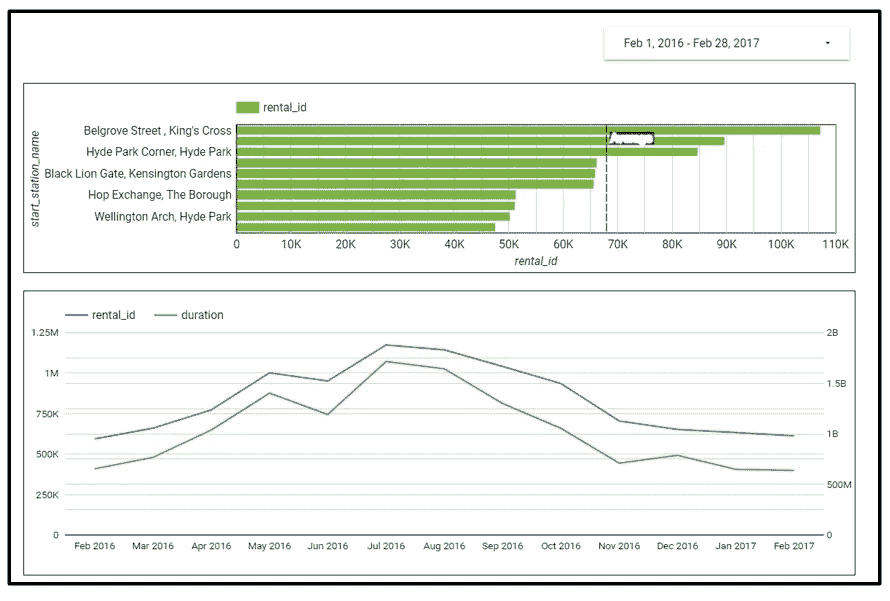

“日期范围控制”的结果(图片由作者提供)

## 添加“记分卡”

除了绘制图表，我们还可以将记分卡添加到仪表板中。记分卡显示单个指标的汇总值。记分卡的常见用途是用于查看-总销售额、总订单、平均销售额、最大值等。

要添加“记分卡”，请从工具栏中选择，单击“添加图表”并选择您选择的“记分卡”。

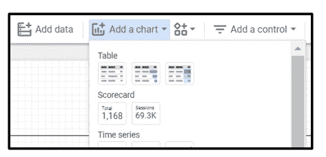

添加“记分卡”(图片由作者提供)

让我们使用记分卡来查看租赁总数。类似地，用于记分卡的数据可以在右侧窗格中配置。

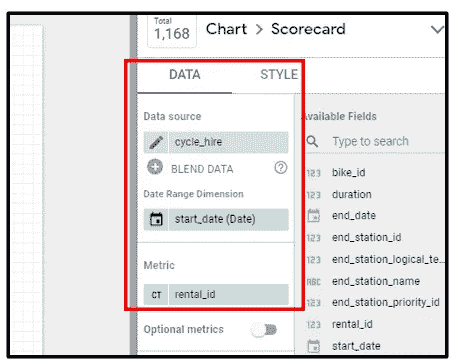

选择“记分卡”的日期范围维和度量(按作者排序的图片)

在右侧窗格中，配置以下选项:

*   日期范围维:开始日期(日期)
*   指标:计数(租赁标识)

此外，我们希望记分卡的标题是“Total Rental ”,而不是默认的列名。让我们将“租赁标识”的指标重命名为“总租赁”。

*   将鼠标悬停在 rental_id 指标选项下的“CT”指标上，可以看到一个铅笔图标。
*   点击铅笔图标，在名称部分添加“总租金”。

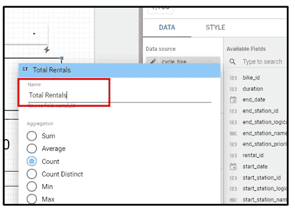

将指标重命名为“总租金”(图片由作者提供)

重命名指标后，我们的记分卡标题将基于指标提供的名称。除此之外，根据您自己的偏好调整右侧窗格“样式”选项卡上的记分卡填充。

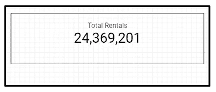

“总租金”记分卡(图片由作者提供)

重复相同的过程，使用指标:sum(duration)创建另一个记分卡，并将指标重命名为“Total Rental Duration”。

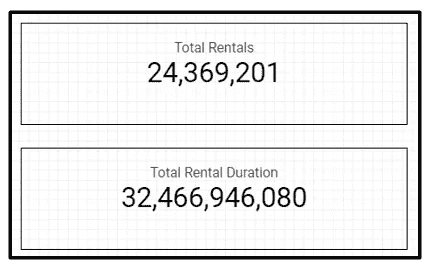

两个记分卡结果(图片由作者提供)

## 添加“文本/图表标题”

使用工具栏下的“文本框”选项，可以很容易地将文本添加到报告中。让我们快速使用“文本框”选项为条形图和折线图添加一个图表标题。

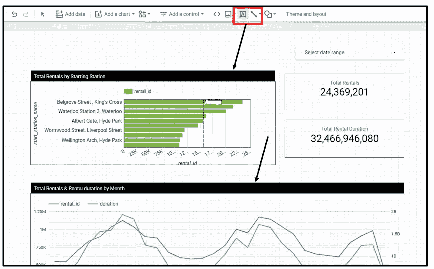

使用“文本框”添加图表标题(图片由作者提供)

添加 textbox 后，您可以根据自己选择的字体样式、字体颜色、文本对齐方式和背景颜色，从右侧窗格中配置样式。

在我们结束并完成仪表板的设计之前，让我们添加另一个过滤器选项——“滑块”。

## 添加“滑块”控件

滑块控件允许用户根据数值维的值范围进行筛选。让我们添加一个滑块，让用户根据租赁期限进行选择。

要添加“滑块”，从工具栏中选择，单击“添加控件”并选择“滑块”选项。指定用于右侧窗格“数据”选项卡上的滑块的控制字段。

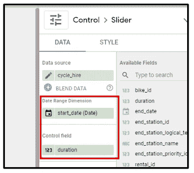

选择“滑块”的日期范围维度和控制字段(图片由作者提供)

在右侧窗格中，配置以下选项:

*   日期范围维:开始日期(日期)
*   控制字段:持续时间

此外，我们希望滑块的标题是“租赁期限”，而不是默认的列名。让我们将该指标重命名为“租赁期限”。

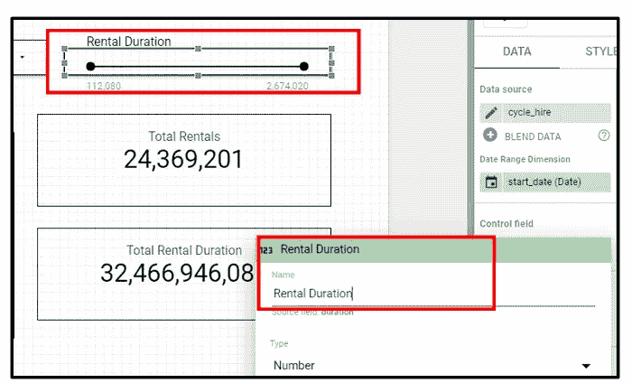

将指标重命名为“租赁期限”(图片由作者提供)

## 添加“主题和布局”

最后，我们可以将“主题和布局”应用到报告中。主题有助于根据所选主题预定义一组颜色和样式组合。

工具栏菜单中有一个“主题和布局”选项。选择了该选项，您可以在右侧窗格中选择您想要的“主题和布局”。

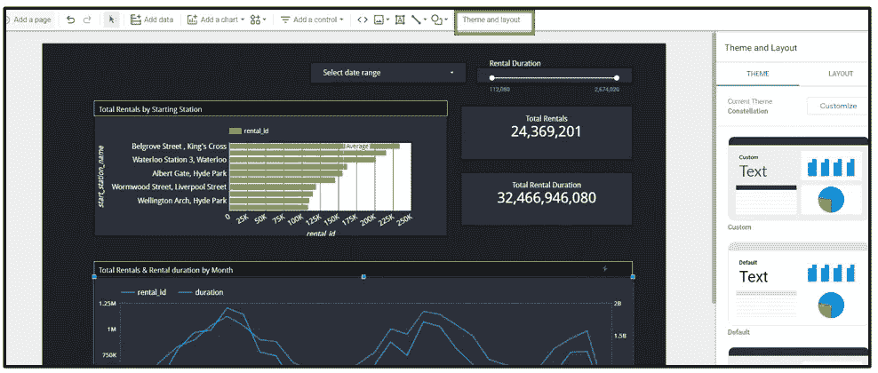

主题示例—“星座”

在选择了你喜欢的“主题和布局”之后，你的仪表板就差不多完成了。在“查看”模式下查看您的最终仪表板结果，您可以使用“共享”选项开始与他人共享您的报告，或者下载 PDF 格式的报告。

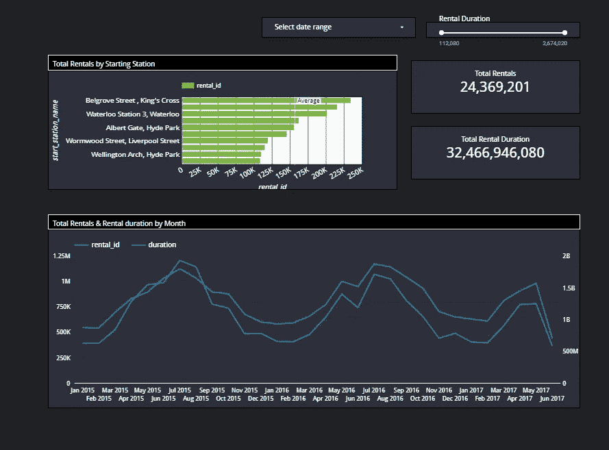

最终仪表板视图(图片由作者提供)

## 结论:

数据可视化是数据科学家的一项重要技能，因为它有助于更好地理解数据，并有效地交流结果。根据我个人使用 Google Data Studio 的经验，对于任何人来说，它都是一个非常好的数据可视化入门工具。由于界面易于导航，您可以轻松掌握这些新技能。本文中的教程是帮助您入门的基础，我建议您在 Google Data Studio 上试用并进一步探索所提供的更高级的选项。

最后，感谢您阅读这篇文章！

## 参考和链接:

[1][https://search business analytics . tech target . com/definition/data-visualization](https://searchbusinessanalytics.techtarget.com/definition/data-visualization)

[2][https://support.google.com/datastudio/answer/6283323?hl=en](https://support.google.com/datastudio/answer/6283323?hl=en)

[3]https://infogram.com/create/dual-axis-chart