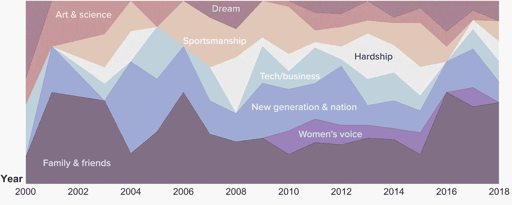

# NLP 项目初学者指南:美国毕业典礼演讲分析

> 原文：<https://towardsdatascience.com/beginners-guide-to-an-nlp-project-analysis-of-commencement-addresses-in-the-u-s-5bf228c3c5e7?source=collection_archive---------33----------------------->

汤姆·菲茨西蒙斯拍摄的照片

每年，学院或大学都会邀请著名的演讲者，如技术领袖、政治家、著名作家、学术界或娱乐界有影响力的人士等。向毕业班致辞。通过自然语言处理，该项目分析了这些振奋人心和令人心酸的演讲，确定了它们的共同特点以及是什么使它们脱颖而出。这是我在为期 12 周的 Metis 数据科学训练营中从事的第四个项目(持续时间为两周半)。

为了更好地塑造这个项目，我把它缩小到我希望从这个项目中回答的 3 个问题:什么？谁啊。又是怎么做到的？也就是说，说话者谈论什么？**谁**是观众？说话的人是如何说话的？

在这篇博客中，我将向您介绍我作为自然语言处理(NLP)初学者为这个项目所采取的步骤:

1.  数据收集
2.  数据清理和简单 EDA
3.  主题建模
4.  主题建模分析
5.  情感分析

# 数据收集

***成绩单*。**需要的主要数据是毕业典礼演讲的文字记录。谷歌了一番后，我决定从两个来源入手。第一个来自于 Charlie Harrington 在 FloyHub 上收集整理的一个数据集，可以直接下载。二是来自网站毕业智慧，可以用 BeautifulSoup 刮。在合并数据和删除重复数据后，我得到了 400 多份副本。

***演讲者和学校信息。每次演讲的演讲者和演讲发生的地点都可以和抄本一起收集。然而，为了使它们成为有用的特征，我用 Selenium 搜集了诸如年龄、每个发言者的职业和每个学校的坐标等信息。***

# 数据清理和简单 EDA

***数据清理*。为了回答第一个问题——他们谈论什么——我们需要进行主题建模。在我们开始主题建模之前，我们首先需要清理文本数据。这一步包括使所有字母小写，删除标点符号，删除数值或任何无意义的文字等。**

***包话*。在清理文本之后，我们可以为抄本和文档术语矩阵创建单词包。在这里，文档是一个演讲记录。一般来说，根据你对主题建模的需求，有两种主要的方法:来自`sklearn.feature_extraction.text`的`CountVectorizer`或`TfidfVectorizer`。**

> **计数矢量器** : *统计每个术语在每个文档中出现的频率，每个术语的权重相等。*
> 
> **TfidfVectorizer** : *简称 term-frequency 逆文档频率。使用这种方法，出现在较少文档中的术语将具有较大的权重。例如，如果大多数演讲都提到了“毕业”，那么“毕业”一词在文档-术语矩阵中的价值就会降低，在主题建模中的重要性也会降低。*
> 
> 注意，在这一步，您可以在矢量器中指定要删除的停用词(例如，`CountVectorizer(stop_words='english')`)。**停用词**是像“and”、“the”、“like”等对句子没有多大意义的词。

***探索性数据分析*** 。为了更好地理解我们正在处理的文字记录，我们可以从单词包中找出最常用的单词开始:

所有演讲中最常用的词。排在前面的是**生活、时间、思考、世界。**作者图。

从这个图表中，我们可以看到所有演讲的共同主题。但是我们仍然需要把它分解开来，看看每个演讲者在他们的演讲中到底提到了什么。这是我们分析的主要部分:主题建模。

# 主题建模

主题建模有几种方法，如 **LDA** (潜在狄利克雷分配)和 **NMF** (非负矩阵分解)。

> **LDA**是一个生成概率模型。文档由主题分布组成，主题由单词分布组成。假设每个文档都是由一个过程生成的，在这个过程中，我们从主题分布中随机选择一个主题，然后从相应的主题中随机选择一个单词。
> 
> **NMF**是一种线性代数优化算法。从上一个矢量器步骤开始，我们通过 m *构建维度为* n *的文档-术语矩阵，其中*n是文档(抄本)的数量，m是术语的数量(词汇的大小)。我们可以将 **t** *指定为主题的数量，并找到两个矩阵:文档-主题(* n *乘* t *)和主题-术语(* t *乘* m *)，这样它们的乘积就是(近似)文档-术语矩阵。*

我测试了 LDA 的`CountVectorizer`和 NMF 的`TfidfVectorizer`。在这两种方法中，您必须为模型选择主题的数量(就像一个超参数)。经过几轮的试验和比较，我选择了有 8 个主题的 NMF，因为在这种情况下，主题更容易理解，演讲的分类也更有意义。以下是我的 8 个主题和每个主题的关键词:

寻找演讲的主题。图片作者。

# 主题建模分析

确定主题后，我们现在需要分析和解释结果。就时间而言，看看演讲主题的趋势如何随时间发展会很有趣。其他方面可以是说话者的职业之间比较的主题分布。或者在不同的观众群中——这是我们最初的问题**谁**。

## A.历年话题趋势

下面的百分比堆积面积图显示了这些年来主题的趋势，每种颜色代表一个主题。这种类型的情节乍一看可能有点乱，但它有它的优点。很容易看出哪一年哪些话题在所有演讲中占了较大的比重，以及这些比重如何改变了久而久之。

百分比堆积面积图显示历年来演讲主题的趋势。作者图。

例如，它表明家庭&朋友一直是一个受欢迎的话题。另一方面，女性的声音只是在 2000 年代后期才开始出现。值得注意的是，新生代&国家话题是 2004 年最热门的话题。这可能与当年晚些时候的总统选举有关。另一个发现是，科技/商业话题在 2005 年略有增加，但随后被艰难所取代。有人可能会说，由于始于 2007 年并延续至 2008 年的全球金融危机，可能会有更多的演讲者在演讲中谈到恐惧、失败或挑战。

## B.不同演讲者职业之间的话题分布比较

基于网络搜集的数据，演讲者的职业可以大致分为 8 类:

*   艺术:艺术家、音乐家…
*   学术界:教育工作者、研究人员、科学家…
*   娱乐:电影行业的人，电视主持人…
*   医学/法律:外科医生、医生、律师、法官…
*   政治:国家领导人、参议员、市长…
*   出版:作家，诗人，记者…
*   运动:运动员
*   技术/商业:技术行业的人，首席执行官…

这些职业的主题分布显示在下面的饼图中:

话题分布因演讲者职业而异。作者图。

我们可以看到，对于艺人和运动员来说，演讲主题就没那么多样化了。艺术家谈论很多艺术和艰辛，运动员谈论最多的是体育(这并不奇怪)。虽然学术界和政界的演讲者都有很大一部分是关于新一代和国家的话题，但背景略有不同。前者从知识上讲新一代，后者讲国家和历史。娱乐业的演讲者倾向于分享故事和建议(包括在家庭和朋友的话题中)。在所有职业中，出版业(包括作家、记者等)更多的发言人(百分比)关注妇女的声音。近一半的科技或商业演讲者(47%)将梦想作为演讲主题。

## C.不同受众位置之间的主题分布比较

我们还将看看不同学校的主题分布，以回答关于**谁是观众的最初问题。**使用从谷歌地图上抓取的坐标，我们可以将学校划分为美国的三个地区，以确定观众的位置:东部、中部和西部。

不同受众的主题分布(基于位置)。图片作者。

乍一看，西部和东部地区的主题分布相似，西部地区的“艰难”和“新一代和国家”的比例略高。在东方，人们更多地谈论体育(体育精神)和艺术与科学。有趣的是，虽然西部和东部的女性声音比例相当，但在中部地区却不存在。

# 情感分析

将每份抄本分成 10 段，追溯情绪的演变。作者图。

我想找到答案的最后一个问题是**说话者如何说话。**情感分析在自然语言处理中起着重要的作用，可以用现成的软件包来完成，如`nltk`的 VADER(用于情感推理的效价感知词典)`textblob`的 TextBlob 等。在使用 VADER 的情况下， *compound* score 是一个介于 1 和-1 之间的归一化值，告诉你一段文本是正面的、中性的还是负面的。对于文本，您可以根据您希望如何执行分析，按句子、段落或任何其他方式来分隔它。我选择将每份文稿分成 10 个部分，这样我可以检查整个演讲过程中情绪的演变。

对于每个职业类别，在每个部分评估平均 VADER 分数。为不同的职业找到不同的情感特征是非常有趣的。下面是几个例子。

不同说话人职业的情感分析。作者图。

从对 4 种不同职业的情绪比较中，我们看到娱乐和科技行业的演讲者在整个演讲中倾向于保持积极的态度。然而，律师、医生或学术研究者演讲中情绪的演变显示了一种不同的模式。他们可能以积极的开头和结尾开始，但在演讲中途变得不那么积极甚至消极。

# 结论

综上所述，我从三个方面分析了 400+开始演讲的文字记录。首先，使用主题建模来确定演讲的主题，并考察主题在过去二十年中的趋势。虽然有一些冷静的观察和潜在的解释，但我们应该记住，样本量可能太小，无法得出任何可靠的结论。第二，研究不同职业的演讲者和来自美国不同地区的观众的主题分布。从观众的角度来看，未来我们可以根据演讲者的职业来猜测演讲主题，这可能会影响一个机构如何选择邀请哪个演讲者参加毕业典礼。对于演讲者来说，知道观众来自哪里，这种分析可以揭示什么主题可能更好地谈论。最后但同样重要的是，对演讲持续时间内的情绪进行分析。大部分演讲的常见套路是积极的开场和积极的结尾，中间有些起伏。然而，振动的幅度因说话者的职业而异。

请在下面留下你的问题或评论！

## **完整演示文稿**