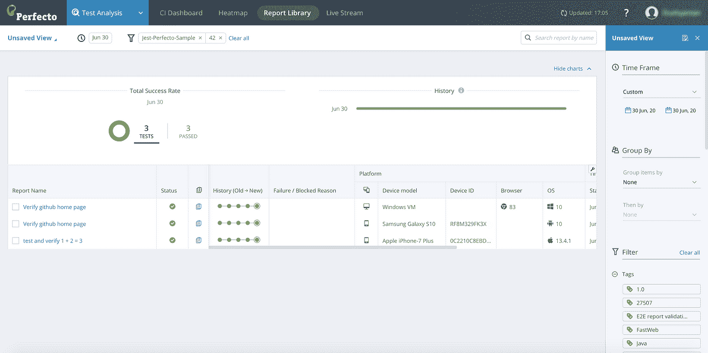
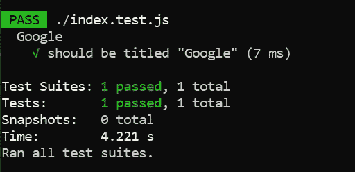
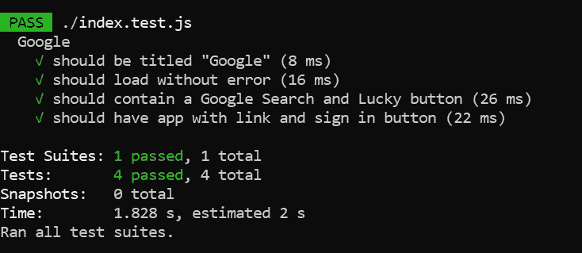

# 自动化回归测试初学者指南

> 原文：<https://towardsdatascience.com/beginners-guide-to-automating-regression-testing-5e133d1824e?source=collection_archive---------24----------------------->

## 利用 Jest 和木偶来测试你的网页


[亚历山大·奈特](https://unsplash.com/@agk42?utm_source=unsplash&utm_medium=referral&utm_content=creditCopyText)在 [Unsplash](https://unsplash.com/s/photos/automation?utm_source=unsplash&utm_medium=referral&utm_content=creditCopyText) 上拍照

回归测试检查对系统所做的更改是否负面影响或破坏了任何现有的特性。它通常在每次更新或提交代码库之后立即执行，以识别新的 bug 并确保您的系统正常工作。

它是软件测试生命周期的一个重要部分，并提供以下好处:

*   在更新后识别和检测错误。这允许团队立即修复 bug，并确保对现有客户的影响最小。
*   在项目因未检测到的错误而失控之前，减轻并降低项目的风险
*   添加新功能时过渡更顺畅，不会破坏现有功能

# 自动化回归测试

[当谈到测试时，测试自动化](https://www.perfecto.io/blog/what-is-test-automation)总是大多数组织的首选。然而，发现什么应该自动化以及如何自动化可能是一个挑战。

创建稳定和健壮的测试脚本可能相当复杂，需要经验才能做好。此外，扩展整个自动化流程也是大多数缺乏开发运维经验的组织面临的另一个障碍。

有相当多的工具可以帮助您简化整个测试过程。例如，Jest 和 Selenium 等开源模块是项目中 kickstart 自动化过程的良好选择。

事实上，您可以将它与云服务和智能报告附带的更复杂的工具相结合。其中一个工具是 [Perfecto](https://www.perfecto.io/free-trial) ，它带有免费试用版，允许您:

*   进行长达 240 分钟的实时自动测试，以及
*   通过公共云访问各种流行的真实移动设备。

此外，大多数专业工具都有自己的测试数据和环境，很容易配置。这有助于简化整个测试过程。看看下面的 Github 库，它对两者都进行了 web 测试:

*   [桌面](https://github.com/PerfectoMobileSA/Jest-perfecto-sample/blob/master/test/webdesktop.spec.js)
*   [移动](https://github.com/PerfectoMobileSA/Jest-perfecto-sample/blob/master/test/mobileios.spec.js)。

您可以轻松地在 Perfecto 中自动测试，生成智能报告，如下图所示。



图片取自 [Perfecto 的](https://developers.perfectomobile.com/display/PD/Jest)官方文档

# 设置

在本教程中，您将学习使用以下开源工具对网页进行自动化回归测试:

*   `Jest` —一个 JavaScript 测试框架，开箱即用，几乎不需要任何配置
*   `Puppeteer` —通过 DevTools 协议控制 Chromium 的 headless Node.js API。

确保你已经在本地机器上安装了`Node.js`。建议版本节点 10.18.1 或以上使用`puppeteer` 3.0.0。

## 初始化

如果你从一个空的工作目录开始。运行以下命令初始化`package.json`:

```
npm init
```

## 通过 NPM 安装软件包

接下来，运行以下命令安装所有必需的软件包:

```
npm install --save-dev jest-puppeteer puppeteer jest
```

除了 Jest 和 Puppeteer 之外，还有另一个名为`jest-puppeteer`的包，它带有用于测试这两个包的高级 API。

## 配置

打开`package.json`并添加以下配置。这允许您稍后使用`yarn test`或`npm run test`运行测试。

```
"scripts": {
  "test": "jest"
}
```

继续添加下面的代码，它代表 Jest 的配置。

```
"jest": {
  "preset": "jest-puppeteer"
}
```

你的`package.json`应该是这样的。请注意，订单和版本号可能不同。

```
{
  "name": "jest-puppet-app",
  "version": "1.0.0",
  "description": "",
  "main": "index.test.js",
  "scripts": {
    "test": "jest"
  },
  "author": "",
  "license": "ISC",
  "jest": {
    "preset": "jest-puppeteer"
  },
  "devDependencies": {
    "jest": "^26.6.3",
    "jest-puppeteer": "^4.4.0",
    "puppeteer": "^5.5.0"
  }
}
```

## 实现测试脚本

完成后，创建一个名为`index.test.js`的新 JavaScript 文件。随便起什么名字，只要以`test.js`结尾就行。Jest 将自动捕获所有文件作为测试套件的一部分。

## 加载网页

我们将使用 Google 的主页运行一个简单的网页测试。在文件中添加以下内容。

```
describe('Google', () => {
  beforeAll(async () => {
    await page.goto('https://google.com');
  });
});
```

`describe`有助于将我们所有的测试用例归为一组。另一方面，`beforeAll`负责初始化，因为它在整个测试中只被调用一次。您可以将其视为一次性的安装程序块。如果你打算在每个测试用例开始之前执行一些东西，你应该使用`beforeEach`来代替。

默认情况下，它将以无头模式运行，不涉及任何接口。对于健全性检查，我们的测试是基于谷歌的主页。

## 检查标题

让我们从一些简单的东西开始，比如网页标题上的断言。继续在`beforeAll`语句的正下方追加一个新的测试函数。我们将检查页面的标题是否与字符串`Google`匹配。`it`是内置`test`函数的别名。你可以互换使用它们。

```
describe('Google', () => {
  beforeAll(async () => {
    await page.goto('https://google.com');
  }); it('should be titled "Google"', async () => {
    await expect(page.title()).resolves.toMatch('Google');
  });
});
```

## 运行测试脚本

保存文件并在您的终端中键入以下内容来运行我们的测试脚本:

```
npm run test
```

您应该会看到以下输出:



作者图片

## 检查文本内容

事实上，您可以在断言之前为返回的响应分配一个变量。这为您想要测试的东西提供了更好的控制。例如，您可以用下面的代码检查网页的正文是否包含字符串`google`:

```
it('should load without error', async () => {
      let text = await page.evaluate(() => document.body.textContent);
      expect(text).toContain('google');
});
```

## 检查元素

`jest-puppeteer`附带以下[高级 API](https://github.com/smooth-code/jest-puppeteer/blob/master/packages/expect-puppeteer/README.md) 方便您使用。

*   `[toClick](https://github.com/smooth-code/jest-puppeteer/blob/master/packages/expect-puppeteer/README.md#toClick)` —期望一个元素在页面或元素中，然后点击它。
*   `[toDisplayDialog](https://github.com/smooth-code/jest-puppeteer/blob/master/packages/expect-puppeteer/README.md#toDisplayDialog)` —期望块函数触发一个对话框并返回。
*   `[toFill](https://github.com/smooth-code/jest-puppeteer/blob/master/packages/expect-puppeteer/README.md#toFill)` —期望页面或元素中有控件，然后用文本填充它。
*   `[toFillForm](https://github.com/smooth-code/jest-puppeteer/blob/master/packages/expect-puppeteer/README.md#toFillForm)` —期望页面或元素中有一个表单，然后填充其控件。
*   `[toMatch](https://github.com/smooth-code/jest-puppeteer/blob/master/packages/expect-puppeteer/README.md#toMatch)` —期望页面或元素中出现文本或字符串 RegExp。
*   `[toMatchElement](https://github.com/smooth-code/jest-puppeteer/blob/master/packages/expect-puppeteer/README.md#toMatchElement)` —期望页面或元素中存在元素。
*   `[toSelect](https://github.com/smooth-code/jest-puppeteer/blob/master/packages/expect-puppeteer/README.md#toSelect)` —期望页面或元素中出现选择控件，然后选择指定的选项。
*   `[toUploadFile](https://github.com/smooth-code/jest-puppeteer/blob/master/packages/expect-puppeteer/README.md#toUploadFile)` —期望输入文件控件出现在页面或元素中，然后用本地文件填充它。

有时，您可能想要检查特定的 UI 元素，比如输入或按钮。在这种情况下，您可以利用`toMatchElement`功能来帮您实现。它接受一个表示匹配元素的 CSS 选择器的字符串。下面列出了一些最常见的 CSS 选择器

*   `type selector` —代表节点名称。例如，`input`将匹配第一个`<input>`元素。
*   `class selector` —基于类别的匹配。语法以`classname`前面的点开始。例如，`.box`将匹配包含类`box`的第一个元素。
*   `id selector` —根据`id`选择元素。语法以`#`符号为前缀。例如，`#firstHeading`将匹配保存 id `firstHeading`的第一个元素。
*   `attribute selector` —选择具有给定属性的元素。例如，`input[value=”Click Me”]`将匹配第一个`<input>`元素，并将`Click Me`作为其值。

`toMatchElement`将返回第一个匹配的元素。如果没有匹配元素，它将报告一个错误。

让我们添加以下测试函数，该函数检查以下元素是否存在:

*   名为`btnK`且值为`Google Search`的输入
*   名为`btnI`且值为`I’m Feeling Lucky`的输入

```
it('should contain a Google Search and Lucky button', async () => {
      await expect(page).toMatchElement('input[name="btnK"][value="Google Search"]');
      await expect(page).toMatchElement(`input[name="btnI"][value="I'm Feeling Lucky"]`);});
```

此外，在执行匹配后，您可以利用 evaluate 函数从元素中提取信息。这允许您对提取的信息单独执行断言。

下面的例子说明了如何根据预定义的值来验证特定元素的`href`和`innerHTML`是否正确。

你可以在下面的[要点](https://gist.github.com/wfng92/05345a147b7f6e6c777686ad2942013c)中找到完整的 JavaScript 代码。

保存文件并运行以下命令再次测试它。

```
npm run test
```

最终输出应该如下所示:



作者图片

# 结论

让我们回顾一下今天所学的内容。

我们从回归测试的详细解释和自动化面临的挑战开始。

然后，我们通过`npm`安装了必要的包，并对`package.json`文件做了一些修改。

我们继续用 JavaScript 实现了一个简单的测试脚本，用于检查网页的标题。此外，我们还尝试了由`jest-puppeteer`提供的其他高级 API。

感谢你阅读这篇文章。希望在下一篇文章中再见到你！

# 参考

1.  木偶师 Github
2.  [Jest Github](https://github.com/facebook/jest)
3.  [小丑 Github](https://github.com/smooth-code/jest-puppeteer)
4.  [Jest——与木偶师一起使用](https://jestjs.io/docs/en/puppeteer)
5.  [Mozilla — CSS 选择器](https://developer.mozilla.org/en-US/docs/Web/CSS/CSS_Selectors)