# Python 正则表达式初学者指南

> 原文：<https://towardsdatascience.com/beginners-guide-to-regular-expressions-in-python-d16d2fa31587?source=collection_archive---------11----------------------->

## 关于正则表达式的简单教程，涵盖了你需要知道的所有基础知识

[真诚媒体](https://unsplash.com/@sincerelymedia?utm_source=medium&utm_medium=referral)在 [Unsplash](https://unsplash.com?utm_source=medium&utm_medium=referral) 上拍摄的照片

# 介绍

在我们当前的时代，有来自各种来源的大量数据，尤其是文本数据。在数据驱动的一代，诸如 [**机器学习**](https://en.wikipedia.org/wiki/Machine_learning) 和 [**自然语言处理**](https://en.wikipedia.org/wiki/Natural_language_processing) 等技术充分利用了自然语言数据的力量来分析和提取以前不可能的有趣见解。在分析文本数据的过程中，在将数据输入模型之前，对其进行预处理几乎是一个必要的步骤。在预处理步骤中，在输入文本中搜索特定的模式可能是有用的。

这就是正则表达式的用武之地！**正则表达式试图发现一个输入字符串中是否存在一个指定的模式，当它存在时执行一些操作。**这对于许多涉及文本分析和处理的数据科学项目非常有用。

本文将教你使用 Python 的正则表达式的基础知识。在进入本文之前，我们先来导入正则表达式库:

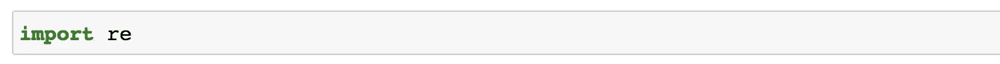

导入库

# 基本语法

基本上，正则表达式(regex)是关于在输入字符串上捕获一组文本并对它们执行一些操作。为此，我们需要一种方法来定义某些模式(例如数字、字母、标点符号)，以便我们可以在输入字符串中进行捕获或匹配。为了方便起见，regex 为我们提供了这些非常容易理解和使用的模式:

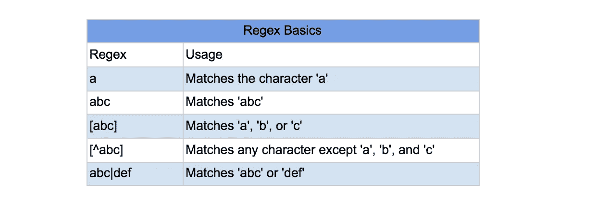

正则表达式基础

在固定字符匹配的基础上进行扩展，regex 还通过定义不同的字符集来支持更灵活的匹配，例如数字、字母数字字符等。

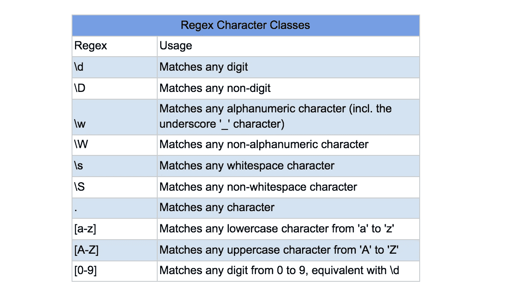

正则表达式字符类

此外，regex 还定义了一些量词，您可以将这些量词放在字符集旁边，以指示您想要捕获多少字符集:

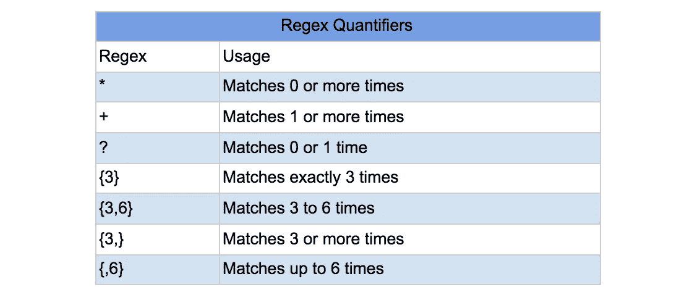

正则表达式量词

在我们熟悉了 regex 提供的模式类型之后，我们现在可以看看最常见的函数。

# 5 个最常见的正则表达式函数

这里列出了最常用的正则表达式函数，下面还提供了示例:

*   `re.match(<regex>, s)`:从输入字符串`s`的开头开始查找并返回正则表达式`<regex>`的第一个匹配项
*   `re.search(<regex>, s)`:查找并返回输入字符串`s`中正则表达式`<regex>`的第一个匹配
*   `re.finditer(<regex>, s)`:查找并返回一个迭代器，该迭代器由输入字符串`s`中正则表达式`<regex>`的所有匹配组成
*   `re.findall(<regex>, s)`:查找并返回输入字符串`s`中正则表达式`<regex>`的所有匹配列表
*   `re.sub(<regex>, new_text, s)`:查找输入字符串`s`中正则表达式`<regex>`的所有匹配，并用`new_text`替换

## 重新匹配

`re.match(<regex>, s)`匹配从句子开头开始的正则表达式模式，并返回匹配的子字符串。如果发现了什么，那么它返回一个`re.Match`对象；如果没有，则返回 none:

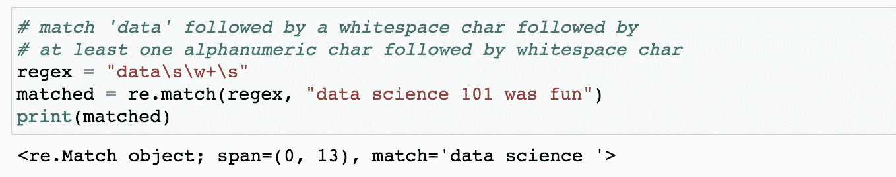

要获得匹配的子串和文本的位置，可以分别使用`.span()`和`.group()`。

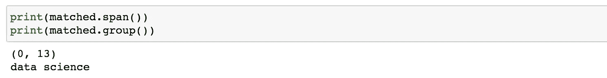

如果匹配的子字符串不是从输入字符串的开头开始，则`re.match`将返回`None`:

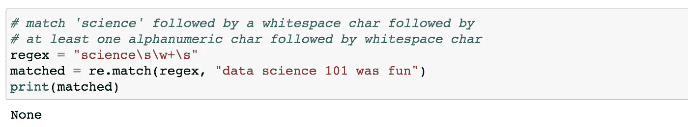

## 重新搜索

`re.search(<regex>, s)`匹配整个输入句子中的正则表达式模式，并返回匹配的子字符串的第一个匹配项。`re.search`和`re.match`的区别在于，re.search 匹配的子串不必从输入字符串的开头开始。与`re.match`一样，当找到匹配时，它也返回一个`re.Match`对象:

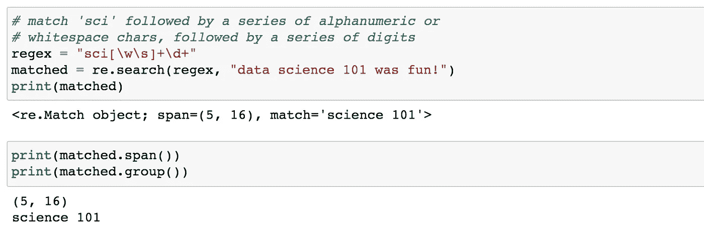

## 重新发现

`re.finditer(<regex>, s)`匹配输入字符串中的所有正则表达式模式，并返回一个迭代器，其中包含匹配子字符串的所有`re.Match`对象。与`re.match`和`re.search`类似，您可以使用`.span()`和`.group()`来获取位置和匹配的子字符串。

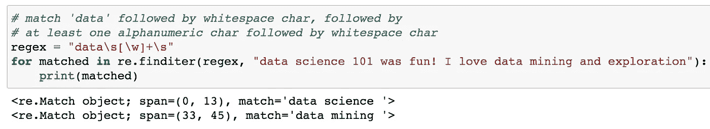

## 重新发现

`re.findall(<regex>, s)`匹配输入字符串中的所有正则表达式模式，并返回包含所有匹配子字符串的列表。`re.findall`和`re.finditer`唯一的区别是`re.findall`返回一个列表而不是一个迭代器，并且包含匹配的子字符串而不是`re.Match`对象。

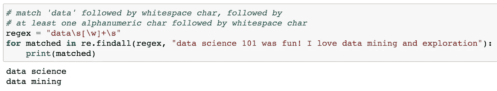

## 回复

`re.sub(<regex>, new_text, s)`匹配输入字符串中的所有正则表达式模式，并用提供的`new_text`替换它们。

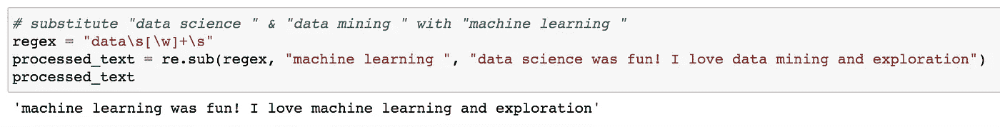

而这些都是 regex 提供的基本功能！

# 分组

到目前为止，您可能注意到所有的例子都捕获了完整的正则表达式模式。但是，您可能希望匹配一个正则表达式模式，但只捕获它的一部分(或一组)。幸运的是，regex 通过使用括号`()`提供了一种简单的方法。您可以通过在 regex 模式中用`()`将想要捕获的组括起来来定义它，如下例所示:

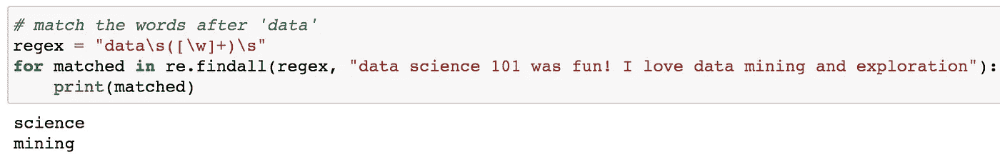

# 旁注

在处理正则表达式时，记住以下两点可能会有所帮助。

## 编译的正则表达式函数

在上面的例子中，你可能会注意到我们主要是直接使用`re`提供的模块级函数。执行正则表达式模式匹配的另一种方法是首先编译模式，然后调用编译对象上的函数:

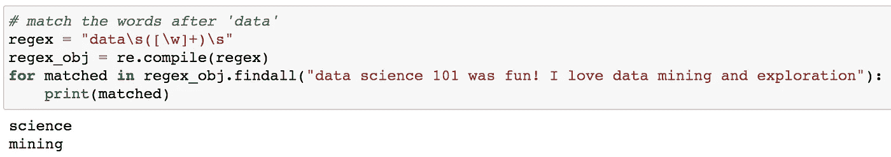

这两种方法是做同一件事的替代方法，几乎没有性能差异，所以您可以使用您喜欢的任何方法。通常，如果您打算多次使用该模式，您可以使用编译方法；否则，使用模块级函数更简单。

## Python 原始字符串' r '

每当您试图匹配输入字符串中的反斜杠`\`字符时，您可能会尝试这样做:

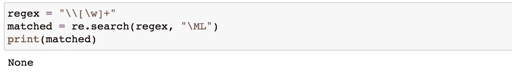

但是，如您所见，没有返回任何对象。这是因为在处理正则表达式时，模式首先被传递给 Python 字符串解释器，后者将前两个`\\`解释为`\`，然后被传递给 regex 解析器，后者将`\`视为后面的转义字符。因此，一个解决方法是使用四个反斜杠`\\\\`:

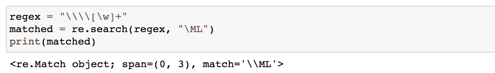

或者，更简洁方便的方法是使用 Python 原始字符串`r`跳过 Python 解释器级别，以避免重复反斜杠:

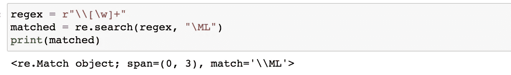

# 结论

恭喜你到达文章末尾！希望你学到了一些东西，现在更熟悉使用 Python 的正则表达式。如果你喜欢我的帖子，请随时关注我，并欢迎看看我的其他文章！

 [## 用 NLTK 进行文本预处理

### NLTK 教程 NLP 预处理:小写，删除标点，标记化，停用词过滤，词干，和…

towardsdatascience.com](/nlp-preprocessing-with-nltk-3c04ee00edc0)  [## 使用转换器的语义相似度

### 使用 Pytorch 和 SentenceTransformers 计算两个文本之间的语义文本相似度

towardsdatascience.com](/semantic-similarity-using-transformers-8f3cb5bf66d6)  [## 使用 Pytorch 的抽象摘要

### 总结任何文本使用变压器在几个简单的步骤！

towardsdatascience.com](/abstractive-summarization-using-pytorch-f5063e67510)  [## 对话式人工智能聊天机器人，带有使用 Pytorch 的预训练变压器

### 了解如何使用 Huggingface Transformers 构建一个具有 DialoGPT 功能的对话聊天机器人！

towardsdatascience.com](/conversational-ai-chatbot-with-pretrained-transformers-using-pytorch-55b5e8882fd3)  [## 为什么我选择了人工智能和数据科学的硕士而不是博士

### 选择硕士和博士的三大因素

towardsdatascience.com](/why-i-chose-masters-instead-of-ph-d-for-ai-data-science-b59f78b04661) 

# 参考

[1] [Python 官方文档关于正则表达式](https://docs.python.org/3/library/re.html)，Python

[2][Python-正则表达式](https://www.tutorialspoint.com/python/python_reg_expressions.htm)，TutorialsPoint

[3][Python Regex cheat sheet](https://www.debuggex.com/cheatsheet/regex/python)，Debuggex