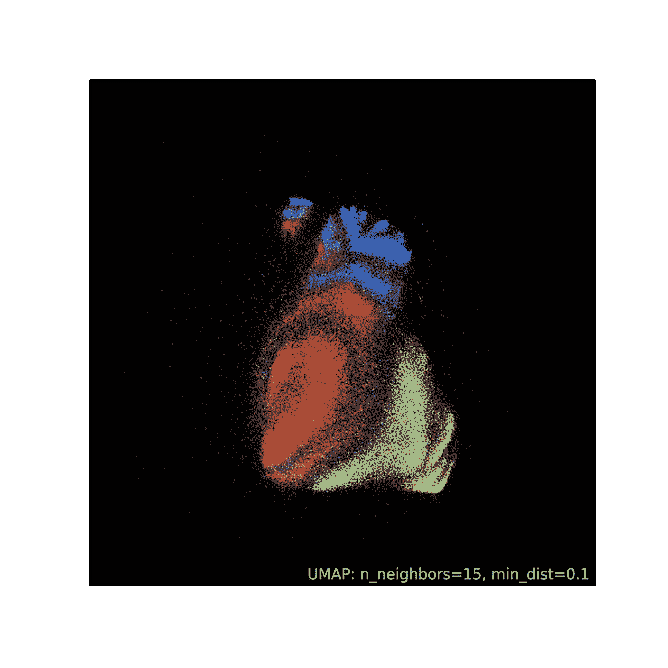

# 如何用 UMAP 以惊人的美丽方式分析 100 维数据

> 原文：<https://towardsdatascience.com/beginners-guide-to-umap-for-reducing-dimensionality-and-visualizing-100-dimensional-datasets-ff5590fb17be?source=collection_archive---------3----------------------->

## 降低维度并“看到”您的数据


**照片由** [**艺术工作室**](https://www.pexels.com/@arthousestudio?utm_content=attributionCopyText&utm_medium=referral&utm_source=pexels) **拍摄自** [**像素**](https://www.pexels.com/photo/wood-man-people-art-4905089/?utm_content=attributionCopyText&utm_medium=referral&utm_source=pexels)

# 介绍

无论机器学习模型有多强大，它们都无法击败你在“啊哈！”通过丰富的视觉效果探索数据的瞬间。但是，在你说“这真的过时了”之前，你可以创建这么多直方图、散点图、热图

在那些时刻，你需要一些东西来提醒你数据是多么的惊人和迷人。你需要从像流动数据或相关子编辑这样的杰作视觉效果中获得灵感，但你不必走那么远。最近，我很幸运地遇到了 UMAP——一个以惊人的美丽方式可视化和聚集高维数据的 Python 包。这正是我需要记住的，为什么我两年前开始学习数据科学。

今天，我们将学习如何通过使用统一流形近似和投影(UMAP)包将多维数据集投影到 2D 来分析多维数据集，如下所示:



作者图片和 UMAP 文档。

<https://ibexorigin.medium.com/membership>  

获得由强大的 AI-Alpha 信号选择和总结的最佳和最新的 ML 和 AI 论文:

<https://alphasignal.ai/?referrer=Bex>  

# 什么是 UMAP？

UMAP 是一种[降维](https://en.wikipedia.org/wiki/Dimensionality_reduction)算法，也是一种强大的数据分析工具。

就速度而言，它类似于 PCA(主成分分析),并类似于 tSNE 来降低维度，同时尽可能多地保留数据集的信息。在 2018 年推出 UMAP 算法之前，PCA 和 tSNE 有两个最显著的缺陷:

1.  主成分分析速度非常快，但代价是减少后丢失了更精细的数据细节
2.  tSNE 非常慢，尽管它保留了数据的底层结构。

我们将在后面详细讨论这些差异。现在，是时候领略一下 UMAP 的风采了，我们将立即从一个具有挑战性的数据集开始:


为 Kaggle TPS 九月竞赛生成的合成数据。

```
>>> tps.shape(957919, 119)
```

Kaggle TPS 九月数据集包含约 100 万行和约 120 个要素，目标为二进制。它们都是数值型的，我们对在这个数据集上执行适当的 EDA 很无能为力。我们的选项仅限于打印汇总统计数据和绘制每个特性的直方图。

让我们看看 UMAP 能为我们做些什么。在使用它之前，我们将对数据集进行采样以避免过度绘制，并填充缺失的值:

这里，目标表示客户是否要求他们的保险。

在[安装](https://umap-learn.readthedocs.io/en/latest/#:~:text=install%20umap-learn-,User%20Guide%20/%20Tutorial%3A,-How%20to%20Use)并导入 UMAP 后，我们初始化流形算法，并以熟悉的 Sklearn `fit/transform`模式将其拟合到`X`、`y`:

```
>>> X_reduced.shape(100000, 2)
```

默认情况下，UMAP 将数据投影到两个部分(2D)。让我们创建一个由目标类着色的散点图:

```
>>> plt.scatter(X_reduced[:, 0], X_reduced[:, 1], c=y, s=0.5);
```


尽管看起来很有趣，但情节并没有显示出任何清晰的模式。这是因为我们在拟合 UMAP 之前没有缩放特征。该算法使用距离度量对相似的数据点进行分组，并且具有较高比例的要素会对此类计算产生偏差。

因此，我们将选择分位数转换器来根据分位数和中位数缩放要素。这种缩放方法更适合数据集，因为它包含许多倾斜和双峰特征:

```
# Plot the results
plt.scatter(X_reduced_2[:, 0], X_reduced_2[:, 1], c=y, s=0.5);
```


现在，我们正在谈话！UMAP 设法完美地捕捉到了目标阶层之间隐藏的区别。我们还可以看到一些异常值(黄色斑点周围的点)。数据集毕竟没有那么有挑战性。

但是，这个情节和我给你看的一点也不接近。在每一个集群中看到结构模式仍然是多余的。为了更上一层楼，我们将使用默认的 UMAP 可视化软件包和更多的功能。我们需要一个更好的数据集。

# 与 UMAP 更好的可视化

本节将分析 Kaggle TPS 月份的竞争数据，这些数据根据大约 75 个数字质量对大约 20 万个电子商务列表进行了分类。让我们导入它并快速浏览一下:


为 Kaggle TPS 九月竞赛生成的合成数据。

目标包含九个类。

和以前一样，我们将扩展所有功能，但这次是通过简单的对数转换。然后，我们拟合 UMAP 流形:

拟合完成后，我们将导入`umap.plot`包(单独安装)并绘制一个点云:


它不像太空中的星云吗？我们可以清楚地看到，8 类主宰了空间，并聚集在中心。第 6 类也与其他类明显不同。我们看到半个圆形的混合数据点围绕着第 8 类。关于单个数据点，它们可以被归类为异常值。

> 上面关于可视化的一个注意事项——我们只是传递拟合的流形(不是转换的数据！)到`points`函数，并指定颜色编码的标签。我也选择了`fire`作为黑暗主题。

您也可以使用`umap.plot.connectivity`创建连接图，用于诊断目的，并更好地理解歧管结构。请注意，创建这些图非常耗时，而且计算/内存负担很重。


您可以从文档的本节中了解更多关于 UMAP 可视化的信息。

# UMAP 的最基本参数

潜在的减少算法具有许多参数，这些参数可以显著地影响流形，从而影响视觉效果。四个最重要的是:

*   `n_components`
*   `n_neighbors`
*   `min_dist`
*   `metric`

正如你可能已经猜到的，`n_components`控制投影后的维数。为了便于可视化，默认值为 2。但是，对于包含 100 个以上要素的数据集，2D 可能不足以完全保留数据的基础拓扑结构。我建议以 5 为步长尝试 2-20 之间的值，并评估不同的基线模型，以查看准确性的变化。

接下来，我们有`n_neighbors`。它控制着 UMAP 在构建流形时为每个样本寻找的局部邻域的面积。较小的值将关注点缩小到局部结构，考虑到特性和小模式，可能会丢失大的图片。

`n_neighbors`的值越大，灵活性越大，允许 UMAP 关注相应维度的数据的更广泛“视图”。当然，这是以失去结构的细节为代价的。该参数的默认值为 15。


将具有不同 n _ 邻域的 UMAP 流形拟合到 TPS 六月数据的样本

另一个关键参数是`min_dist`，它控制数据点之间的文字距离。您可以调整默认值 0.1 来控制不同点云的紧密度。较低的值将导致更密集的嵌入，使您更容易看到单个簇。这在聚类过程中可能很有用。相比之下，接近 1 的值给点更多的喘息空间，并使您能够看到更广泛的拓扑结构。


用不同的最小距离拟合 UMAP 流形

`metric`表示计算点与点之间距离的公式。默认是`euclidean`，但是你可以在很多其他选项中选择，包括`manhattan`、`minkowski`和`chebyshev`。

# 使用 UMAP 的最佳实践

使用 UMAP 时首先要考虑的是 RAM 消耗。在引擎盖下，UMAP 消耗了大量的内存，尤其是在拟合和创建像连通性图这样的图表时。我建议在至少有 16GB 内存的机器上运行 UMAP。

例如，在创建连通性图时，即使绘图部分中的 200k 行数据集也消耗了约 18GB 的 RAM。文档建议将`low_memory`设置为 True 作为一种可能的解决方案。此外，我建议通过使用 NumPy 将每一列转换为尽可能小的子类型来减少数据集的内存使用。我在以前的一篇文章中详细讨论了如何处理内存不足的问题:

</how-to-work-with-million-row-datasets-like-a-pro-76fb5c381cdd>  

此外，不要忘记变换/缩放数字要素，因为默认情况下它们往往具有不同的比例。我建议将 QuantileTransformer 用于双峰、三峰等疯狂分布。PowerTransformer 最适合倾斜的特征。无论您选择哪种转换器，目标始终是使特性尽可能呈正态分布。

# 摘要

今天，我们已经介绍了 UMAP 的基本知识，并且只了解了它的一小部分功能。对于进一步的阅读，我建议查看软件包的文档。在那里，你会看到 UMAP 的不同用例，以及它是如何被谷歌这样的科技巨头用在各种项目中的。

也有专门的部分比较 UMAP 与其他维数约简算法。对于一个数学爱好者来说，你也可以阅读 UMAP 是如何工作的，以及它的公式证明。感谢您的阅读！


# 您可能也会对…感兴趣

</process-10m-row-datasets-in-milliseconds-in-this-comprehensive-pandas-speed-guide-5a3125cbb78>  </how-to-write-powerful-code-others-admire-with-custom-sklearn-transformers-34bc9087fdd>  </kagglers-guide-to-lightgbm-hyperparameter-tuning-with-optuna-in-2021-ed048d9838b5> [## 2021 年使用 Optuna 调整 LightGBM 超参数的 Kaggler 指南

towardsdatascience.com](/kagglers-guide-to-lightgbm-hyperparameter-tuning-with-optuna-in-2021-ed048d9838b5) </how-to-beat-the-heck-out-of-xgboost-with-lightgbm-comprehensive-tutorial-5eba52195997>  </tired-of-cliché-datasets-here-are-18-awesome-alternatives-from-all-domains-196913161ec9> 