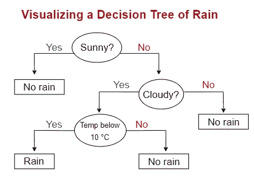

# XGBoost 分类问题入门指南

> 原文：<https://towardsdatascience.com/beginners-guide-to-xgboost-for-classification-problems-50f75aac5390?source=collection_archive---------1----------------------->

## 利用最热门的 ML 库实现一流的性能


**照片由** [**唐古尔德**](https://www.pexels.com/@dom-gould-105501?utm_content=attributionCopyText&utm_medium=referral&utm_source=pexels) **上** [**像素**](https://www.pexels.com/photo/rear-view-of-silhouette-man-against-sky-during-sunset-325790/?utm_content=attributionCopyText&utm_medium=referral&utm_source=pexels)

## XGBoost 是什么，为什么这么受欢迎？

下面给大家介绍一下 ML 社区最火的机器学习库——XGBoost。近年来，它一直是赢得大规模 ML 竞赛的算法背后的主要驱动力。它的速度和性能是无与伦比的，它始终优于任何其他旨在监督学习任务的算法。

该库是可并行化的，这意味着核心算法可以在 GPU 集群上运行，甚至可以在计算机网络上运行。这使得通过对上亿训练样本进行高性能训练来解决 ML 任务成为可能。

最初，它是作为命令行应用程序用 C++编写的。在赢得了物理学领域的巨大竞争后，它开始被 ML 社区广泛采用。结果，现在这个库有了其他几种语言的 API，包括 Python、R 和 Julia。

在这篇文章中，您将学习 XGBoost 解决分类任务的基础知识、XGBoost 的超参数的大量列表的概述以及如何调优它们。

[](https://ibexorigin.medium.com/membership) [## 通过我的推荐链接加入 Medium-BEXGBoost

### 获得独家访问我的所有⚡premium⚡内容和所有媒体没有限制。支持我的工作，给我买一个…

ibexorigin.medium.com](https://ibexorigin.medium.com/membership) 

获得由强大的 AI-Alpha 信号选择和总结的最佳和最新的 ML 和 AI 论文:

[](https://alphasignal.ai/?referrer=Bex) [## 阿尔法信号|机器学习的极品。艾总结的。

### 留在循环中，不用花无数时间浏览下一个突破；我们的算法识别…

alphasignal.ai](https://alphasignal.ai/?referrer=Bex) 

## 术语复习

在我们继续 XGBoost 的代码示例之前，让我们回顾一下我们将在本文中使用的一些术语。

**分类任务**:一个有监督的机器学习任务，通过研究一个实例的特征来预测该实例是否属于某个类别。例如，通过查看一个人的身体测量值、病史和葡萄糖水平，您可以预测一个人是属于“患有糖尿病”还是“没有糖尿病”。

**二进制分类**:一种分类类型，目标实例只能属于两个类中的一个。例如，预测电子邮件是否是垃圾邮件，客户是否购买了某种产品等。

**多类分类**:另一类分类问题，目标可以属于多个类别中的一个。比如预测一只鸟的种类，猜测某人的血型等等。

如果你发现自己被其他术语搞糊涂了，我为初学者写了一个小的 ML 字典:

[](/codeless-machine-learning-dictionary-for-dummies-fa912cc7bdfe) [## 傻瓜用无代码机器学习词典

### 编辑描述

towardsdatascience.com](/codeless-machine-learning-dictionary-for-dummies-fa912cc7bdfe) 

## 如何为 XGBoost 预处理数据集

除了基本的[数据清理](https://towardsdev.com/data-type-constraints-data-range-constraints-duplicate-data-with-pandas-44897a350b1e?source=your_stories_page-------------------------------------)操作之外，XGBoost 还需要满足一些要求才能达到最佳性能。主要是:

*   数字要素应进行缩放
*   分类特征应该被编码

为了展示这些步骤是如何完成的，我们将使用来自 Kaggle 的 [Rain in Australia](https://www.kaggle.com/jsphyg/weather-dataset-rattle-package) 数据集，我们将根据一些天气测量来预测今天是否会下雨。在本节中，我们将通过利用 Scikit-Learn 管道来关注预处理。


该数据集包含澳大利亚多个气象站 10 年来的天气测量数据。你既可以预测明天下雨，也可以预测今天下雨，所以数据集中有两个目标，名为`RainToday`、`RainTomorrow`。

由于我们将只预测`RainToday`，我们将删除另一个以及其他一些不必要的特性:

```
cols_to_drop = ["Date", "Location", "RainTomorrow", "Rainfall"]

rain.drop(cols_to_drop, axis=1, inplace=True)
```

> 删除`Rainfall`列是必须的，因为它记录了以毫米为单位的降雨量。

接下来，让我们处理缺失值，首先查看它们在每列中的比例:

如果比例高于 40%，我们将删除该列:

三列包含超过 40%的缺失值。我们将放弃它们:

现在，在我们继续讨论管道之前，让我们先将数据分成特性和目标数组:

接下来，有分类和数字特征。我们将构建两个独立的管道，稍后将它们合并。

> 接下来的代码示例将大量使用 Sklearn-Pipelines。如果你不熟悉它们，可以看看我的另一篇文章中关于它们的[完整指南](/how-to-use-sklearn-pipelines-for-ridiculously-neat-code-a61ab66ca90d)。

对于分类特征，我们将使用列的模式估算缺失值，并使用一键编码对其进行编码:

对于数字特征，我将选择平均值作为估算值和`StandardScaler`,这样特征的平均值为 0，方差为 1:

最后，我们将使用一个列转换器来组合这两个管道。要指定管道是为哪些列设计的，我们应该首先隔离分类和数字特征名称:

接下来，我们将把它们和它们对应的管道一起输入到一个`ColumnTransFormer`实例中:

完整的管道终于准备好了。唯一缺少的是 XGBoost 分类器，我们将在下一节添加它。

## 分类问题的 XGBoost 示例

要开始使用`xgboost`，只需安装`pip`或`conda`:

```
# pip
pip install xgboost

# conda
conda install -c conda-forge xgboost
```

安装完成后，可以用它的标准别名— `xgb`导入。对于分类问题，库提供了`XGBClassifier`类:

幸运的是，分类器遵循熟悉的`sklearn`拟合预测模式，这意味着我们可以自由地将其用作任何`sklearn`模型。

在训练分类器之前，我们先对数据进行预处理，并将其分为训练集和测试集:

由于目标包含`NaN`，所以我是手工估算的。此外，将`y_processed`传递到`stratify`也很重要，这样拆分在两个集合中包含相同比例的类别。

现在，我们用默认参数拟合分类器，并评估其性能:

即使使用默认参数，我们也得到了 85%的准确率，这已经相当不错了。在接下来的部分中，我们将通过使用 Scikit-learn 提供的`GridSearchCV`来进一步改进这个模型。

## XGBoost 的幕后动力是什么

与许多其他算法不同，XGBoost 是一种集成学习算法，这意味着它结合了许多模型的结果，称为**基本学习器**来进行预测。

就像在随机森林中一样，XGBoost 使用决策树作为基础学习器:



图片由作者提供。预测降雨的决策树

上面可以看到一个决策树的例子。在每个决策节点(圆圈)中，有一个问题只有两个可能的答案。在每棵树的底部，都有一个决策(矩形)。在上面的树上，第一个问题是是否是晴天。如果是的话，你马上决定不会下雨。否则，你会继续问更多的二元(是/否)问题，最终在最后一片“叶子”(矩形)上做出一些决定。

个体决策树是低偏差、高方差的模型。他们非常善于在任何类型的训练数据中找到关系，但却很难在看不见的数据上很好地概括。

但是，XGBoost 使用的树与传统的决策树有点不同。它们被称为 CART 树(分类和回归树),而不是在每个“叶”节点中包含一个决策，它们包含一个实例是否属于一个组的实值分数。在树达到最大深度之后，可以通过使用某个阈值将分数转换成类别来做出决定。

谈到 XGBoost 的内部，我绝不是专家。这就是为什么我推荐你去看看[这个完全在 XGBoost 上的超棒的 YouTube 播放列表](https://www.youtube.com/playlist?list=PLblh5JKOoLULU0irPgs1SnKO6wqVjKUsQ)和[另一个](https://www.youtube.com/playlist?list=PLblh5JKOoLUJjeXUvUE0maghNuY2_5fY6)完全针对梯度增强的播放列表，我根本没有提到它。

## XGBoost 分类器超参数概述

到目前为止，我们只使用了 XGBoost 分类器的默认超参数:

> 术语复习:模型的*超参数*是模型的设置，应该由用户提供。模型本身不能从给定的训练数据中学习这些。

如你所见，它有很多。尽管我们使用默认值取得了相当好的结果，但是调整上述参数可能会导致性能的显著提高。但是在我们开始调优之前，让我们来看一下最常调优的超参数的概述:

1.  `learning_rate`:也称为 *eta* ，它指定了通过使用额外的基本学习器，模型拟合残差的速度。

*   典型值:0.01–0.2

2.`gamma, reg_alpha`、`reg_lambda`:这 3 个参数分别指定了 XGBoost 完成的 3 种正则化类型的值——创建新分裂的最小损失减少、L1 reg 的叶权重、L2 reg 的叶权重

*   `gamma`的典型值:0 - 0.5，但高度依赖于数据
*   `reg_alpha`和`reg_lambda`的典型值:0 - 1 是一个很好的起点，但同样取决于数据

3.`max_depth` -树的决策节点可以有多深。必须是正整数

*   典型值:1–10

4.`subsample` -可用于训练每棵树的训练集部分。如果该值过低，可能会导致拟合不足；如果该值过高，可能会导致拟合过度

*   典型值:0.5–0.9

5.`colsample_bytree` -可用于训练每棵树的特征的分数。较大的值意味着几乎所有的特征都可以用于构建决策树

*   典型值:0.5–0.9

以上是人们经常调的主要超参数。如果你不完全理解它们(像我一样),这是完全可以的，但是你可以参考这篇[文章](http://www.analyticsvidhya.com/blog/2016/03/complete-guide-parameter-tuning-xgboost-with-codes-python/),它给出了上述每个参数如何工作以及如何调整它们的全面概述。

## 使用 GridSearchCV 对 XGBoost 进行超参数调优

最后，是时候给我们的 XGBoost 分类器充电了。我们将使用来自 Scikit-learn 的`GridSearchCV`类，它接受所需超参数的可能值，并为每个超参数组合的给定数据拟合单独的模型。我不会详细介绍 GridSearch 是如何工作的，但您可以查看我关于该主题的另一篇综合文章:

[](/automatic-hyperparameter-tuning-with-sklearn-gridsearchcv-and-randomizedsearchcv-e94f53a518ee) [## 使用 Sklearn GridSearchCV 和 RandomizedSearchCV 自动调整超参数

### 编辑描述

towardsdatascience.com](/automatic-hyperparameter-tuning-with-sklearn-gridsearchcv-and-randomizedsearchcv-e94f53a518ee) 

我们将在两轮中只调整几个参数，因为调整既费时又费力。让我们为第一轮创建参数网格:

在网格中，我将`subsample`和`colsample_bytree`固定为推荐值，以加快速度并防止过度拟合。

我们将从`sklearn.model_selection`导入`GridSearchCV`，实例化并使其适合我们预处理的数据:

经过漫长的折磨，我们终于得到了最好的参数和最好的分数:

这一次，我选择了`roc_auc`指标，它计算 ROC(接收机工作特性)曲线下的面积。对于不平衡分类问题，它是最受欢迎和最健壮的评估度量之一。你可以在这里了解更多[。让我们看看最好的参数:](https://www.youtube.com/watch?v=4jRBRDbJemM&t=47s)

如你所见，只有`scale_pos_weight`在它提供的范围中间。其他参数处于其范围的末端，这意味着我们必须继续探索:

我们将使用更新的参数网格为数据拟合一个新的 GridSearch 对象，并查看我们是否在最佳得分上有所改进:

看起来第二轮调优导致了性能的轻微下降。我们别无选择，只能坚持第一组参数，即:

让我们用上面的参数创建一个最终的分类器:

最后，对测试集进行预测:

## 结论

关于分类问题，我们已经在 XGBoost 的介绍性指南的末尾做了介绍。尽管我们已经介绍了很多内容，但是就 XGBoost 本身和分类主题而言，仍然有许多主题需要探索。

我强烈建议您查看我提供的链接，作为学习 XGBoost 的额外资源，并建议您阅读更多关于如何解决分类问题的内容。

[](https://towardsdatascience.com/5-step-workflow-into-the-heart-of-matplotlib-and-create-amazing-plots-7f9d2164ff2b)