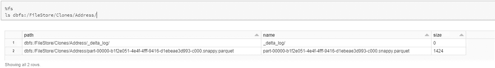
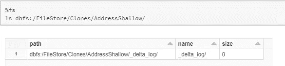
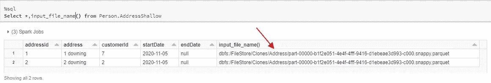
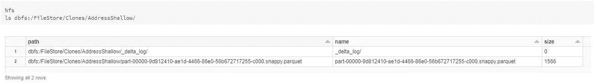
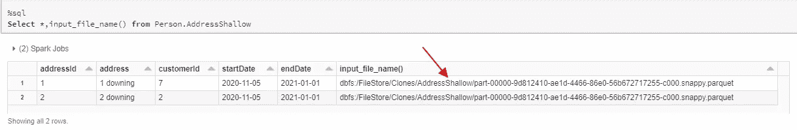
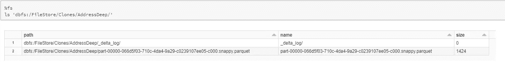

# 幕后:三角洲湖克隆

> 原文：<https://towardsdatascience.com/behind-the-scenes-delta-lake-clones-d3578cff76a9?source=collection_archive---------14----------------------->

## 如何使用 Spark 轻松克隆您的 delta lake 表？


朱迪思·普林斯在 [Unsplash](/s/photos/sheep?utm_source=unsplash&utm_medium=referral&utm_content=creditCopyText) 上的照片

## **什么是三角洲湖克隆体？**

在 Databricks delta lake 中，**克隆只是您的 delta 表在给定快照时间**的副本，它们与您的源表具有相同的模式、结构和分区。创建克隆后，对其所做的更改不会影响源表，反之亦然。这是 Databricks 7.2 中的一项功能。

Databricks Delta Lake 支持两种类型的克隆

1.  **浅层克隆**:浅层克隆是增量表的简单副本，这意味着它只是源表元数据的副本，而不是实际数据本身。正因为如此，创建一个浅层克隆是超级快速和容易的。
2.  **深度克隆**:顾名思义，它是源表的真实副本。

## **那么，克隆人的意义何在？**

克隆可以打开 Delta Lake 的许多大门，主要是克隆可以在归档数据和在数据集上运行短期测试用例中发挥重要作用，这种实验是您希望对源表保密的。

例如，您可以通过创建浅层克隆来测试生产表上的工作流，并在不破坏源数据的情况下在克隆上运行测试。由于浅层克隆是一个即时副本，您可以快速测试优化实验以提高查询的性能，并且这些更改会保留在克隆上。

浅层克隆的另一个很好的用例是，通常您会想要回填或重新计算表中的大部分历史数据。这可以使用浅层克隆轻松实现，对克隆运行回填或重新计算，然后在满意时用克隆替换原始表。

## 如何创建和管理三角洲湖克隆？

说够了！让我们开始克隆，了解幕后发生的事情。

Databricks 提供了一个免费的社区版，这是一个非常酷和强大的功能。正如作者自己所承认的，整本书“*Spark The Definitive Guide*”都是使用社区版编写的。

像大多数功能一样，你可以在社区版上免费试用 **Delta 克隆版**。如果您还没有机会设置它，请今天就[注册](https://community.cloud.databricks.com/)。注册并运行一个集群几乎不需要几分钟。

让我们为运行我们的实验设置一些样本数据。

```
%sql
Create database Person;
Drop table if exists Person.Address;
Create table Person.Address (
addressId int,
address string,
customerId int,
startDate string,
endDate string
)
USING DELTA
LOCATION 'dbfs:/FileStore/DeltaClones/Address/'
```

在表格中插入一些数据。

```
%sql
insert into Person.Address
select 1 as addressId, "1 downing" as address, cast(rand()*10 as integer) as customerId, '2020-11-05' as startDate,null as endDate
union
select 2,"2 downing",cast(rand()*10 as integer), '2020-11-05',null
```

快速查看一下文件结构，我们现在应该有一个用一些 parquet 文件创建的 delta 表来存储数据，还有一个 _delta_log 来跟踪事务日志。

```
%fs
ls dbfs:/FileStore/DeltaClones/Address/
```



增量目录的结构(图片由作者提供)

## 浅层克隆

让我们从创建示例表的浅层克隆开始。

```
%sql
Create or replace table Person.AddressShallow
SHALLOW CLONE Person.Address
LOCATION 'dbfs:/FileStore/Clones/AddressShallow/'
```

如果我们从定义中没有记错，浅层克隆只是复制了元数据，而不是实际的数据本身，让我们验证一下这个说法。

```
%fs
ls dbfs:/FileStore/Clones/AddressShallow/
```



浅层克隆增量目录(图片由作者提供)

太棒了。没有保存任何数据的文件，只有 _delta_log，让我们检查一下是否可以通过运行 select 来查询它。



在浅层克隆上选择查询(按作者排序的图像)

关上前门！我们有一个可以轻松查询的源表副本，但实际上，它只是元数据的副本。在我们的选择查询中使用 **input_file_name()** 函数，很明显克隆正在从源表中读取文件。

**浅层克隆本质上创建了一个指向原始表文件**的 new _delta_log。如果您分析浅层克隆的事务日志，您将看到所执行的操作是一个克隆，并且有指向原始表文件的文字指针。

现在，让我们测试一下关于隔离的说法。让我们更新一下我们的浅层克隆。

```
%sql
update Person.AddressShallow
set endDate = '2021-01-01'
```

查看 delta 目录，我们看到一旦您对克隆数据文件进行了更改，就会开始出现这些文件。



更新后的增量目录(图片由作者提供)

您可以通过对其运行 select 查询来验证这一点。现在，从属于克隆的文件中读取数据，而不是从源表中读取数据。



更新后选择(图片由作者提供)

这证明了隔离理论。浅层克隆是复制源表并在其上运行大量实验的最快方法，而不必担心破坏源数据。现在，去弄清楚用例吧！

## 深层克隆

让我们创建源表的深层克隆

```
%sql
Create or replace table Person.AddressDeep
DEEP CLONE Person.Address
LOCATION 'dbfs:/FileStore/Clones/AddressDeep/'
```

从我们这里得到的表的大小来看，这可能不明显，但是如果它是一个大表，则需要一段时间来进行深度克隆。

让我们做同样的例行检查，并检查了三角洲目录。



增量目录深度克隆(图片由作者提供)

您可以立即注意到浅层克隆和深层克隆之间的差异，深层克隆实质上是对源表的真实复制。嗯，技术上不是镜像拷贝，因为**深度克隆只克隆你的源增量表的最新版本**。您不会在深层克隆中获得事务的历史记录。您可以通过描述深层克隆的历史并将其与源表的历史进行比较来验证这一点。


深层克隆历史(图片由作者提供)

对于其余部分，深层克隆的行为与浅层克隆完全一样。对深层克隆所做的任何或所有更改都会被隔离。

## 结论

三角洲湖的克隆不像遗传学中的克隆那样困难或有争议。

浅层克隆有如此大的潜力，它使得处理大型数据集变得流畅、干净和经济高效。是的，深度克隆增加了一个很好的接触，但我不认为有很大的需求，特别是当你可以使用“创建选择表”操作的时候。

你对克隆人有什么看法？我很想知道您的想法和见解，尤其是关于证明使用深度克隆是合理的用例类型。

所有的源代码都可以在这个[笔记本](https://github.com/xavier211192/Databricks/blob/main/Delta%20Lake%20Cloning.py)里找到。一定要去看看！

## 参考

1.  [https://docs . databricks . com/spark/latest/spark-SQL/language-manual/delta-clone . html](https://docs.databricks.com/spark/latest/spark-sql/language-manual/delta-clone.html)
2.  [https://databricks . com/blog/2020/09/15/easy-clone-your-delta-lake-for-testing-sharing-and-ml-reproducibility . html](https://databricks.com/blog/2020/09/15/easily-clone-your-delta-lake-for-testing-sharing-and-ml-reproducibility.html)
3.  [https://www.youtube.com/watch?v=b8l107IYONM](https://www.youtube.com/watch?v=b8l107IYONM)