# 生成图嵌入的快速随机投影算法

> 原文：<https://towardsdatascience.com/behind-the-scenes-on-the-fast-random-projection-algorithm-for-generating-graph-embeddings-efb1db0895?source=collection_archive---------3----------------------->

## [思想和理论](https://towardsdatascience.com/tagged/thoughts-and-theory)

## FastRP 及其超参数的详细研究

由[克里斯·贾维斯](https://unsplash.com/@crissyjarvis?utm_source=medium&utm_medium=referral)在 [Unsplash](https://unsplash.com?utm_source=medium&utm_medium=referral) 上拍摄的照片

绝大多数数据科学和机器学习模型依赖于创建一个向量，或者嵌入你的数据。这些嵌入中的一些自然地创造了它们自己。例如，对于按列组织的数字数据，我们可以把与每一行相关的值看作一个向量。在更复杂的情况下，如自然语言处理，我们必须通过各种不同的方法从单词中生成这些嵌入，如[一键编码](https://en.wikipedia.org/wiki/One-hot)、[跳格法](https://en.wikipedia.org/wiki/N-gram#Skip-gram)，如 [word2vec](https://en.wikipedia.org/wiki/Word2vec) 等。这些向量然后被用作要被建模的数据的表示。

很容易将嵌入理解为独立的实体，其中一行的数据不会影响下一行。然而，对于网络图就不一样了。这个域中的数据点是相互关联的，它们之间的关系与单个数据点一样重要。因此，有必要找到一种方法，将图中的节点转换为嵌入，同时还保留这些节点与其邻居的关系(即上下文)。

我最初发布了一篇关于如何开始使用图嵌入的博文。这个帖子可以在[这里](https://dev.neo4j.com/intro_graph_emb_tds)找到。

 [## 图形嵌入入门

### 使用 Neo4j 图形数据科学库的机器学习管道的第一步

towardsdatascience.com](/getting-started-with-graph-embeddings-2f06030e97ae) 

还有一个由 [Tomaz Bratanic](https://medium.com/u/57f13c0ea39a?source=post_page-----efb1db0895--------------------------------) 写的很棒的帖子，展示了 FastRP 在节点分类任务中的使用，可以在这里找到[。](https://dev.neo4j.com/fastrp_nc)

 [## Twitchverse:为节点分类任务使用 FastRP 嵌入

### 通过使用 FastRP 嵌入算法提取关系值，为下游节点生成特征…

towardsdatascience.com](/twitchverse-using-fastrp-embeddings-for-a-node-classification-task-bb8d34aa690) 

这篇特别的文章建立在上面的以及我的前一篇文章的基础上，在那篇文章中，我展示了使用 Streamlit 创建一个仪表板，以及如何修改 Neo4j 生成的图形嵌入超参数。这是为 FastRP 和 node2vec 图嵌入算法创建的。我通过 [t-SNE](https://en.wikipedia.org/wiki/T-distributed_stochastic_neighbor_embedding) 提供了一种二维可视化嵌入的方法。

在这篇文章中，我们将探讨其中一种嵌入算法 FastRP 的原因和方法，另一篇文章的目标是如何优化这些超参数。

 [## 用 Python 中的 t-SNE 可视化图形嵌入

### 如何定性评估 Neo4j 图嵌入

towardsdatascience.com](/visualizing-graph-embeddings-with-t-sne-in-python-10227e7876aa) 

此外，这篇文章与托马兹·布拉塔尼克的文章[“理解 Node2Vec 算法的完全指南”是平行的](https://dev.neo4j.com/bratanic_node2vec)

 [## 理解 Node2Vec 算法的完整指南

### 理解 node2vec 算法及其超参数的深入指南

towardsdatascience.com](/complete-guide-to-understanding-node2vec-algorithm-4e9a35e5d147) 

## 警告！

数学就要来了！如果你从未尝试过在介质上正确渲染数学，那就不好看了！我会尽我所能…

照片由[this engineering RAEng](https://unsplash.com/@thisisengineering?utm_source=medium&utm_medium=referral)在 [Unsplash](https://unsplash.com?utm_source=medium&utm_medium=referral)

# FastRP 的起源:Johnson-Lindenstrauss 引理

FastRP 算法是由 H. Chen 等人创建的。al，这个你可以在[原论文](https://arxiv.org/abs/1908.11512)里详细读到。我真的推荐那篇文章，因为我会大量引用它。因为它背后的数学是 [Neo4j FastRP 算法](https://neo4j.com/docs/graph-data-science/current/algorithms/fastrp/)的基础(甚至包括变量名)，我们需要花一点时间来讨论这个数学。不要担心…我希望不要让它变得太糟糕，我对你充满信心，亲爱的读者，你会度过难关的！

约翰逊-林登斯特拉斯引理，也称为 JL 引理，是 FastRP 算法的数学核心。简而言之，它说如果向量空间中的点具有足够高的维数，那么它们可以以近似保持点之间距离的方式被投影到合适的低维空间中。如果你仔细想想，这真的是大多数降维方法的根源。

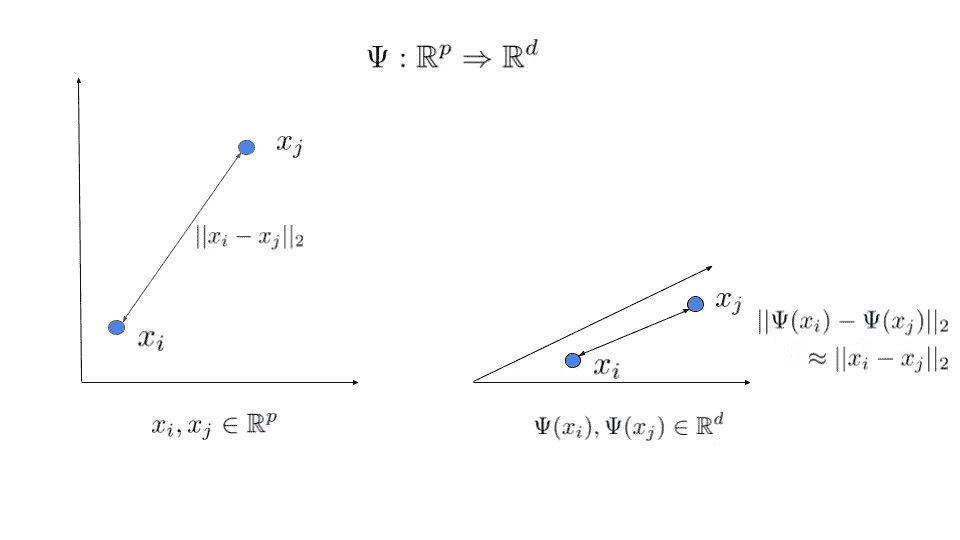

降维基础(图片由作者提供)

所以是的，我们正试图从*p*-维空间到*d*-维空间，其中 *d < p* 。给定这两个点 *xᵢ* 和*xⱼ*，我们想要创建一些映射，*ψ*，它从高维空间转换到低维空间，同时理想地近似保持这两个点之间的距离。这实质上意味着我们要求解下面的等式:

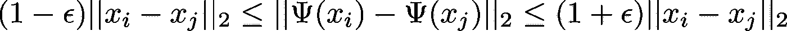

降维解决方案(图片由作者提供)

我们的目标是让ϵ尽可能小。这个等式成立的事实就是 JL 引理。

这里真正的诀窍是理解*ψ*应该是什么。D. Achlioptas 发现(并在本文中描述)你可以通过使用一个简单的二进制抛硬币，一个随机数，获得数据库友好的随机投影(实际上，这是论文的标题)。陈等。al 用这个想法实现了一个随机投影矩阵， *R* ，这将是我们最终给出的映射的要点

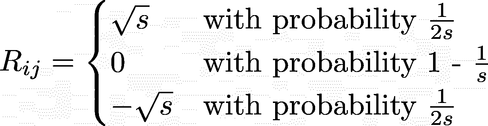

随机投影矩阵(图片作者提供)

事实上，李等人[曾报道过](https://doi.org/10.1145/1150402.1150436)只要 *R* 的均值为零，那么点与点之间的两两距离就保持不变——这就是降维的目的。此外，李表明 *s* 可被选择为与图中边数的平方根一样高， *s = sqrt(m)，*假设下游矩阵(见下文)可被认为非常稀疏。有趣的是，使用这个随机投影矩阵实际上可以比高斯随机投影快上 *sqrt(m)。*然而，根据矩阵的稀疏性，在最初的 Achlioptas 论文中发现选择 *s = 3* 是足够的。

# 那么这和图表有什么关系呢？？？

我很高兴你问了！是的，所以我们有这个矩阵可以随机化东西。很明显，我们想把它应用到其他矩阵中。但是我们有什么矩阵和图有关系呢？

邻接矩阵是一个很好的开始！实际上，我们将通过创建转移矩阵 *A* 来对其进行一点改进，如 *A = D⁻ S* 其中 *S* 是邻接矩阵， *D* 是图的度矩阵(给出每个节点度的对角矩阵)。让我们快速地将它们可视化，因为这将使后续矩阵的维度更加清晰。假设我们有一个加权的有向图，如下所示

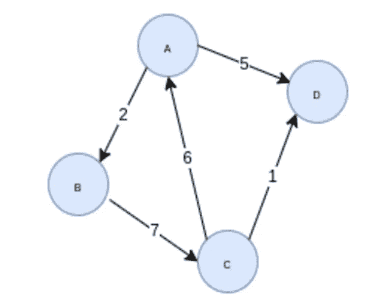

样本加权有向图(图片由 [Tomaz Bratanic](https://medium.com/u/57f13c0ea39a?source=post_page-----efb1db0895--------------------------------) 提供，经许可使用)

(注意，我们也可以用未加权和/或无向图来做这件事，但我想我会展示最复杂的例子。)因此，根据上面的图，我们将得到邻接矩阵，如下所示

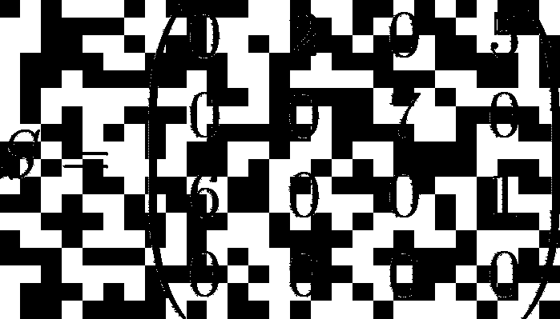

加权有向图的邻接矩阵(图片由作者提供)

我们还可以建立度矩阵:

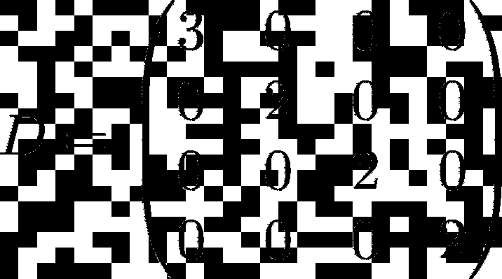

上述加权有向图的度矩阵(图片由作者提供)

因此，我们可以通过以下方式构建转移矩阵

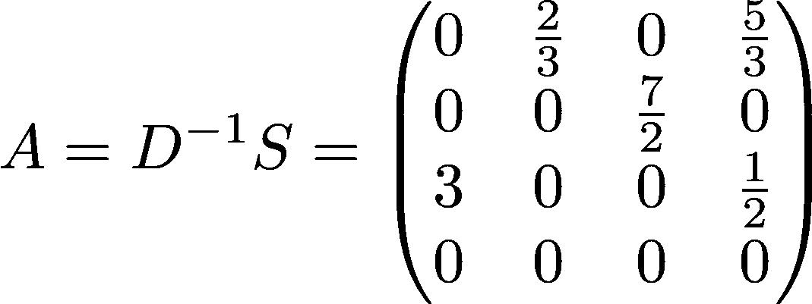

上述加权有向图的转移矩阵(图片由作者提供)

注意，上面的每个矩阵都是一个正方形，*n×n*矩阵，其中 *n* 是图中节点的数量。

现在我们开始进入 FastRP 算法的 Neo4j 实现实际使用的符号！这里是我们开始进入这些超参数的地方。

像任何嵌入的创建一样，在我们做有趣的事情之前，我们想考虑标准化我们的数据。记住，我们的一些节点可能有很高的相对度。因此，我们将创建一个归一化矩阵(对角线在 *n* 中),由下式给出

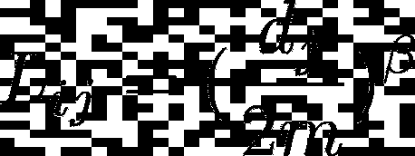

归一化矩阵(图片由作者提供)

其中 *β* 是归一化强度， *m* 是边的数量， *dⱼ* 是第 *j* 个节点的度数。所以当 *β* 趋于无穷大时，我们可以得到

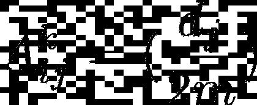

让我们思考一下这实际上意味着什么，特别是当我们将这个归一化矩阵应用于转移矩阵时。假设我们有 *A 的 *k-* 次方(*，即我们用本身 *k* 乘以 *)* 乘以 *A* 。***aᵏ的第 ij 个条目，是随机游走正好 k 步从 I 到达 j 的概率！***

是的，这是粗体和斜体，因为它真的很重要。FastRP 只是由这个抛硬币随机发生器控制的随机行走！

照片由[克里斯·布里格斯](https://unsplash.com/@cgbriggs19?utm_source=medium&utm_medium=referral)在 [Unsplash](https://unsplash.com?utm_source=medium&utm_medium=referral) 上拍摄

# 所以现在我们知道了…

我们现在把 *A* 换一种形式，这样计算效率更高，然后我们就准备写出实际的 FastRP 算法是什么了。

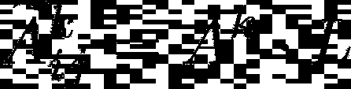

再生 Aᵏ(图片由作者提供)

现在是开始 FastRP 的时候了！

给定我们的图转移矩阵 *A* ，嵌入维数 *d* ，归一化强度 *β* ，以及一些迭代权重 *α₁ … αₖ* (稍后将详细介绍这些)，步骤如下:

1.  产生 *Rᵢⱼ* 随机投影矩阵
2.  计算矩阵嵌入的第一次迭代为 *N₁ = A ⋅ L ⋅ R*
3.  计算 *i = 2 时 *N* 的后续值..节点数*为 *Nᵢ ←一个⋅ Nᵢ₋₁*
4.  计算 *N* 的所有值的加权和

这里的最终结果是我们得到了*(n×n)⋅(n×n)*的矩阵乘法，这导致 *N* 具有维度 *(n × d)* ，这正是我们想要的(每个 *n* 节点有一个 *d* 维度嵌入)。

如果我们在 LR 引理的背景下考虑这个问题，回想一下*ψ*是把我们从ℝᵖ带到ℝᵈ.的东西因此，如果我们认为 *N = A ⋅ L ⋅ R* ，这就意味着*ψ= l⋅r*。

## 重量，重量，更多重量

是的，我们在上面的 *α* 值中有另一组权重。这些是为每个 *Nᵢ* 计算的迭代权重，它们需要自己的解释。

很明显，这些权重将控制上述每一步对最终节点嵌入的相对影响。对于 1 次迭代，我们将只获得基于每个节点的第一个邻居的嵌入，这不是很有用。因此，例如，假设我们有 4 次迭代(即 *k = 4* )。这到底意味着什么？我们之前说过(上面粗体斜体部分)Aᵏ 的第 *ij* 项表示从 *j* 到达 *i* 的概率正好是 4 步。如果在 5 步之前概率为零，那么 *Aᵢⱼ* 为零。换句话说，在 *k = 4* 的情况下，我们不能随机跳到图中的一个节点，也就是说，5 跳或更多跳。因此 *k* 告诉我们，我们在嵌入中包含了节点周围的多少局部邻域。然后，我们可以将上面的每个随机投影步骤加权为

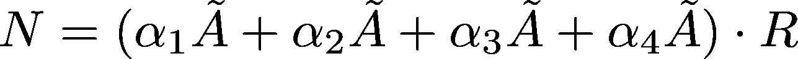

FastRP 嵌入的最终计算(图片由作者提供)

实际上，如果我们只关注任何给定节点的近邻，那么嵌入效果不会很好。因此，忽略那些小的 k 值甚至是值得的。事实上，这正是作者们最初所做的。他们观察到嵌入在 *k = 4* 并且仅使用 *A* 和 *A⁴* 的情况下是很好的。所以基于此，他们设定了权重 *(α₁，α₂，α₃) = (0，0，1)* 。在原始论文中，他们然后通过参数化调整 *α₄* 和 *β* 来优化他们的嵌入，给定一个期望值 *d* 。

照片由 [Tony Tran](https://unsplash.com/@tonny_tran?utm_source=medium&utm_medium=referral) 在 [Unsplash](https://unsplash.com?utm_source=medium&utm_medium=referral) 上拍摄

# 哇！太多了！真的值得吗？？？

TL；是的博士！

该算法既快速又简单。例如，作者报告说，使用 WWW-200k 数据集，FastRP 进行嵌入的 CPU 时间是 136.0 秒，而 node2vec 用了 63.8 天*！当与 node2vec 和另一种流行的嵌入算法 DeepWalk 进行比较时，他们观察到嵌入产生的节点分类结果至少一样准确，如果不是更准确的话！还有很多其他的图形嵌入算法，但是 FastRP 的一个优点是它非常简单。它也很容易扩展，允许您合并图的附加信息，如单个节点的属性，以进一步增强您的嵌入。*

*和任何图嵌入算法一样，所谓“魔鬼”就在细节中。如何设置每个超参数将取决于您的图表本身，并且需要相当多的实验。这将是未来博客文章的主题。敬请期待！*

**特别感谢*[*Tomaz Bratanic*](https://medium.com/u/57f13c0ea39a?source=post_page-----efb1db0895--------------------------------)*和*[*Michael Hunger*](https://medium.com/u/3865848842f9?source=post_page-----efb1db0895--------------------------------)*对本帖的建议和点评。**

# *参考*

*   *CJ Sullivan，[“图形嵌入入门”](https://dev.neo4j.com/intro_graph_emb_tds) (2021)*
*   *Tomaz Bratanic，" [Twitchverse:为节点分类任务使用 FastRP 嵌入](https://dev.neo4j.com/fastrp_nc)"(2021)*
*   *CJ Sullivan " [用 t-SNE 和 Python 可视化图形嵌入](https://dev.neo4j.com/tds_streamlit_embeddings)(2021)*
*   *托马兹·布拉塔尼克，[《理解 Node2Vec 算法完全指南》](https://dev.neo4j.com/bratanic_node2vec) (2021)*
*   *H.Chen，S.F. Sultan，Y. Tian，M. Chen，S. Skiena，[“通过非常稀疏的随机投影实现快速准确的网络嵌入”，](https://doi.org/10.1145/3357384.3357879) CIKM '19:第 28 届 ACM 信息与知识管理国际会议论文集(2019)*
*   *D.Achlioptas，“[数据库友好的随机预测:约翰逊-林登施特劳斯与二进制硬币](https://www.sciencedirect.com/science/article/pii/S0022000003000254)，”计算机系统与科学杂志(2003)*
*   *页（page 的缩写）李，T.J. Hastie，K.W. Church，“[非常稀疏随机投影](https://doi.org/10.1145/1150402.1150436)”，06:第 12 届 ACM SIGKDD 知识发现与数据挖掘国际会议论文集(2006)*