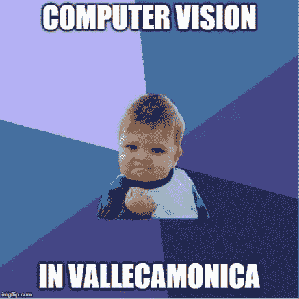

# 作为一名 COBOL 开发人员可能非常有趣

> 原文：<https://towardsdatascience.com/being-a-cobol-developer-can-be-very-fun-c0072454d75c?source=collection_archive---------3----------------------->

## 意见

## 软件公司的技术背后有更多的东西

[黄英一](https://unsplash.com/@yingone?utm_source=medium&utm_medium=referral)在 [Unsplash](https://unsplash.com?utm_source=medium&utm_medium=referral) 上拍照

开发人员在评估合作时会将公司采用的技术作为一个主要衡量标准。基于此的决定太肤浅了。我们真的害怕科技吗？或者也许我们把公司文化和它联系起来？

我想告诉你我的故事，如果我在 2010 年 25 岁的时候拒绝在 COBOL 中工作，我会失去什么。

# 大城市生活

大学毕业后，我开始在米兰的一家大公司工作。我在一个私人社交网络上工作，使用最新的 Java 技术栈。那是 2010 年:趋势市场和良好工作环境中的趋势技术。

米兰的公司总部(图片来自[街景](https://goo.gl/maps/DTuGxEwFmAUfReQYA) 2021 谷歌)

不幸的是，在我的内心，我感觉很糟糕。我出生在意大利的群山之中，大城市的生活不适合我。

我认识一位大学老同学，他在那里的一家优秀软件公司工作。我得到了一个面试机会，并接受了这份工作。他们是所在市场的领导者。只有一个缺点:他们的核心业务是基于用 COBOL 编写的软件。

我接受采访时 COBOL 公司的办公室(图片来自 [Streetview](https://goo.gl/maps/4VywHfNRoqt8o3GNA) 2021 Google)

我在米兰的一些同事说我疯了，这些年来我的市场吸引力会下降。幸运的是，我没有听他们的。

# 你想要 COBOL 上的数字吗？

我们所有人都已经意识到目前有多少 COBOL 在使用。由于疫情，我们在美国有了一个例子，这种古老的语言仍然对我们的社会有着巨大的影响。

反正这个和我想跟你说的无关。我不想说服任何人 COBOL 是一种很酷的语言，因为它不是。这可能是我用过的最糟糕的语言(从技术上来说)。

是哪些特质让它变得如此丑陋？为什么软件开发人员不喜欢和它一起工作？

# 问题

让我们试着猜测哪些是一个人可能害怕面对的问题。我将列举一些我在经历中遇到的情况:

*   源代码文件长约 70000 行。很多这样的。
*   神秘的(有时很有趣😂)变量和过程的名称。
*   混乱和过时的用户界面。
*   没有数据结构库(例如，没有动态数组)。
*   过时的 IDE
*   没有测试框架。
*   程序设计。
*   非典型数据类型(例如，无 int、float、double、string、char 等)。
*   不支持定义新的数据类型(即 C 中的 struct)。
*   没有具有本地分配范围的函数。
*   专有和过时的持久性。
*   我应该继续吗？我想你明白了😅

典型的开发者反应(图片来自 [Giphy](http://gph.is/2aWlInv)

# 改变你的视角

在问自己“我最后去了哪里？”停下来，深呼吸，从另一个角度看这个列表。

只有当它们和下面的句子一起出现时，这些才是问题:

> 在这里，我们一直是这样做的

这句话是你在工作生活中唯一不能说的话。这是害怕变化的症状。

但是如果你和那些拥抱变化的人一起工作，那列表上的点就不是问题了。那些都是机会！而且是这么多！

# 绿色的田野

由[西蒙·瓦尔蒂](https://unsplash.com/@simonwaelti?utm_source=medium&utm_medium=referral)在 [Unsplash](https://unsplash.com?utm_source=medium&utm_medium=referral) 上拍摄的照片

上面的图片代表了我如何看待一个由心态良好的人所拥有的遗留项目。一栋老房子，环境很好，你的付出会得到赏识。你有很多方法可以贡献。

没有动态数组库？你可以造一个！你们中有多少人有机会将动态数组库投入生产？我做了，它在 1918 个源文件中被引用了 23954 次(而且是[开源](https://github.com/lucapiccinelli/array))。

过时的 IDE？我的一个同事[创建了一个 VS 代码扩展](https://marketplace.visualstudio.com/items?itemName=stfcv.cobolstf)。从那以后，整个团队都采用了 VS 代码，它比官方的旧 IDE 要好得多。

我们有机会挑战的一些相关主题的列表:

*   用于动态内存作用域分配(垃圾收集)的库
*   新的高性能存储
*   错误处理设计
*   本地 API 提供者
*   网格的通用功能设计
*   采用版本控制工具，然后过渡到 git
*   向敏捷方法的过渡

我们必须时刻牢记，工具是有局限性的。不是我们的。

COBOL 的社区支持度很低。然后，不要问“我要使用哪个框架/库/工具？”，问题是“我要**构建哪个框架/库/工具**，如何构建？**”。从某种角度来说，这比在现代的框架丛林中潜水更放松。**

# 我做了一个梦

大学期间，我专攻计算机视觉。我梦想为这个领域创造产品。但我也想留在瓦尔卡莫尼卡，这里并不完全是硅谷。

图片由作者用[http://memegenerator.net/](http://memegenerator.net/)创作

好吧，最后，我就是这么做的。

图片由作者用[http://memegenerator.net/](http://memegenerator.net/)创作

我们有围绕主要 COBOL 软件的附属产品。那些大多是用 C#写的。其中一个从特定类型的扫描文档中执行自动数据输入。它一直是该公司的战略产品，但它的生产是外部的。它的成本非常高，而且供应商，比方说，“有问题”。

我的老板们决定在内部从头开始重写。这项活动是分配给我的。

那是一个难以置信的疯狂…哦，对不起…勇敢的决定。如果我们失败了，我们就会失去在市场上的战略地位。

幸运的是，我们成功了。那次行动的成功并不是因为我构建的软件足够好。如果我是一个人，我会失败的。这是团队的成果。

我们用一种识别可靠性非常高的产品来替代，即使是在文件不良的情况下。试播期间，出现了那么多问题，但是从来没有人责怪过我。我的队友吸收了外部的打击，让我一个接一个地进入解决问题的状态。对于“队友”，我指的也是经理、POs、服务台，显然还有其他开发人员。

如果我因为 COBOL 而拒绝和这些人一起工作，我就会失去做我喜欢做的事情，我喜欢生活的地方的机会。

# 结论

公司继续呈指数增长，我们有了新的闪亮的办公室，如此多的新同事，和国际合作伙伴。我在欧洲旅行，开始每天说英语，参加会议，体验许多技术领域，和同事们一起玩得很开心。

让我直截了当地告诉你，这样我就能准确无误地向你传达我心中的信息:

**不要关注技术，关注人**。你可能会惊讶！

感谢您的阅读。

附言

最后一件事…相信我…它总是比 Javascript 好🤣！(请不要有火焰🔥，这只是一个笑话。我也喜欢用 Javascript 工作😜)

# 2021 年 4 月 1 日更新

米歇尔·丽娃邀请我参加他在 youtube 上的推理直播。我们谈到了 Cobol、[数组](http://github.com/lucapiccinelli/array)库和测试驱动开发方法。好奇就去看看吧😄