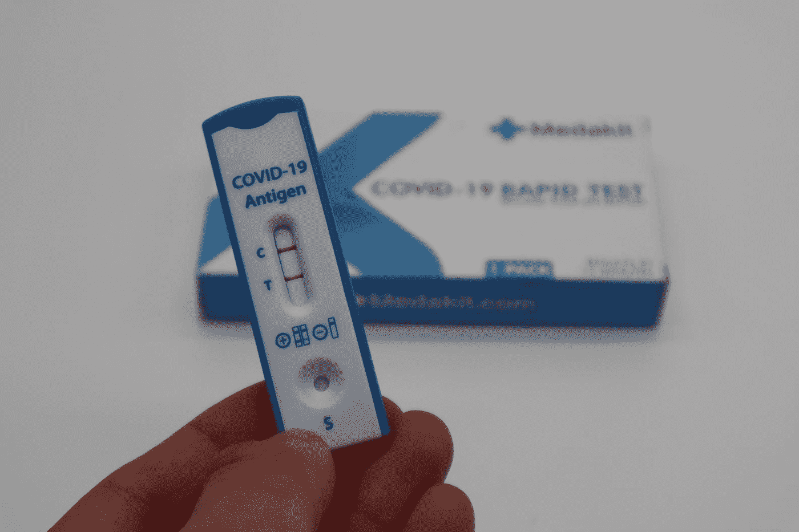
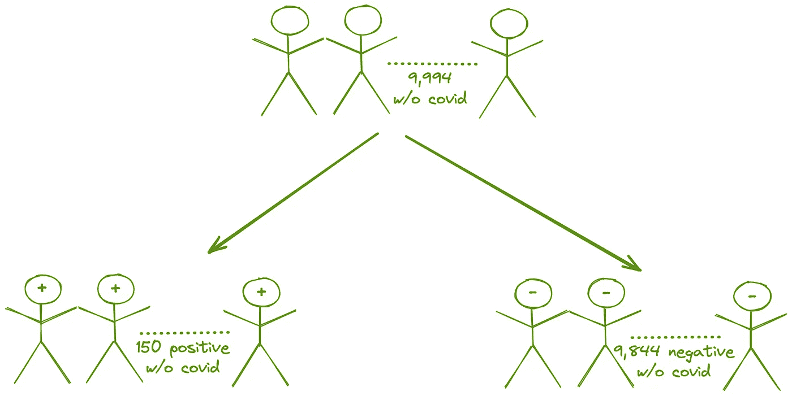
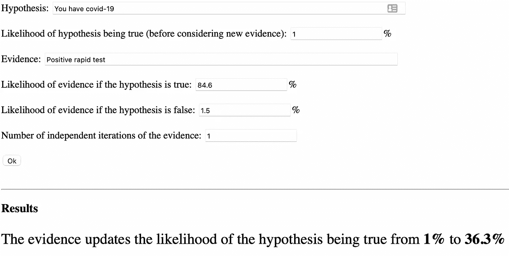
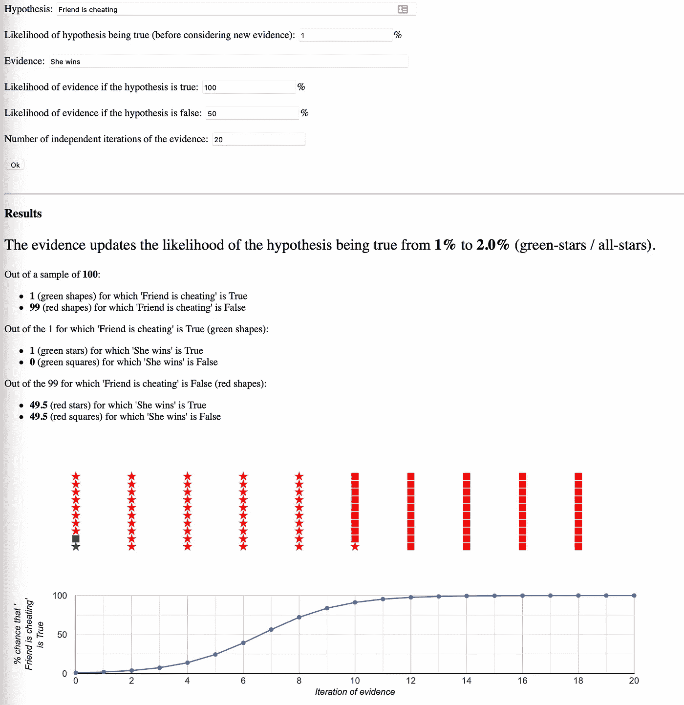
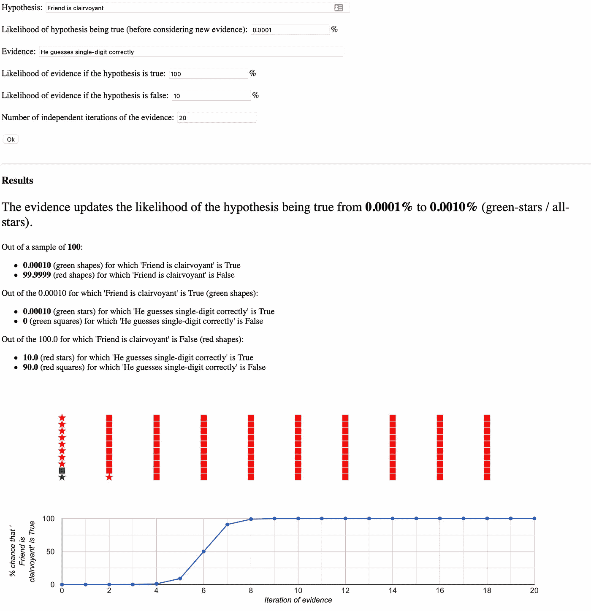
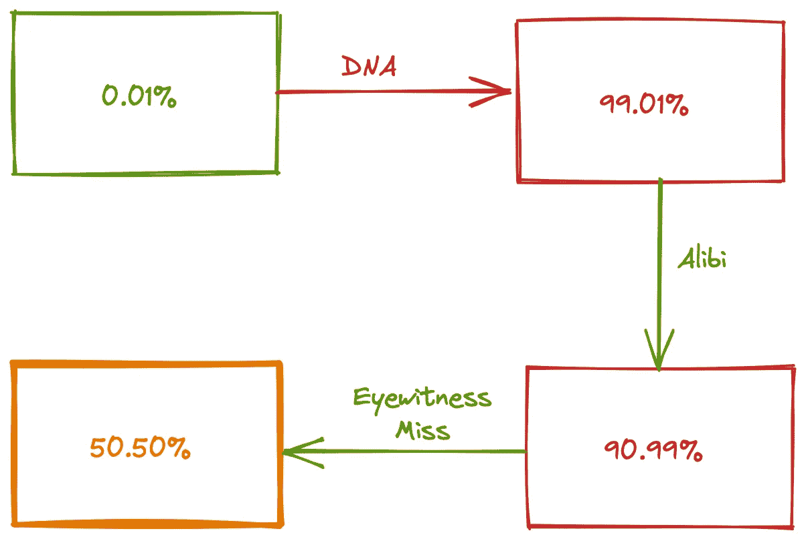

# 理性地相信

> 原文：<https://towardsdatascience.com/believe-rationally-9a5d97c377db?source=collection_archive---------7----------------------->

## 如何基于证据更新你的信念

# 你有新冠肺炎吗？

想象你做了一个快速的家庭新冠肺炎测试。如果你测试呈阳性，你应该有多担心？或者，如果您测试结果为阴性，您应该感到有多安全？

由 [Medakit 有限公司](https://unsplash.com/@medakit?utm_source=medium&utm_medium=referral)在 [Unsplash](https://unsplash.com?utm_source=medium&utm_medium=referral) 上拍摄的照片

这篇文章将用知识和工具武装你，让你正确而容易地评估这些证据，并相应地更新你对自己的信念/知识/假设的信心。毕竟，你的生活可能取决于它。

# 你应该如何评估证据？

## 假设

要评估证据，你首先要后退一步，明确证据的确切用途。有一个*假设*(或者可以称之为*信念*)有可能是真的。在这种情况下，假设是:“你有新冠肺炎”。这个假设的新证据是:“你测试呈阳性”(使用一种特殊的快速家庭测试)。

## 先验可能性

在考虑假设的任何新证据之前，您估计假设为真的*先验可能性*(如证据之前的“先验”)。很容易就能找到你所在地区当前的新发病例率。例如，在 2021 年 12 月 2 日之前的 7 天里，我所在的县(华盛顿州金县)每 10 万居民中就有 [64 例新增新冠肺炎病例](https://covid.cdc.gov/covid-data-tracker/#county-view)。如果你住在我的地区，没有症状，没有理由怀疑最近的接触，并且没有使你更易受影响的先存疾病，你合理地选择 64 / 100，000 * 100 或 *0.064%* 的基本率作为你现在患新冠肺炎的在先可能性。

这种先验可能性表明，在 10，000 人的样本中，大约 6 人患有新冠肺炎病，9，994 人没有。

按感染 covid 和未感染 covid 的样本分类(图片由作者提供)

## 后验概率

然后你考虑假设(你有新冠肺炎)的新证据(你测试为阳性)。基于新的证据，您更新了先验概率(0.064%)，从而得到假设为真的*后验概率*(后验概率是在知道证据之后)。

这需要两条信息。

[BinaxNOW 新冠肺炎 Ag 卡—使用说明 https://www . FDA . gov media 下载](https://www.google.com/url?sa=t&rct=j&q=&esrc=s&source=web&cd=&ved=2ahUKEwjHqaDLx8X0AhXLkWoFHX_fD5cQFnoECAUQAQ&url=https%3A%2F%2Fwww.fda.gov%2Fmedia%2F141570%2Fdownload&usg=AOvVaw345UEl0Qmy6yDsIaxN--cD)

1.  *如果假设是真的，证据的可能性有多大？*在这种情况下，如果您确实患有新冠肺炎，您检测呈阳性的可能性有多大？这就是*真正的正*率。从一个[常用](https://www.washingtonian.com/2021/12/02/some-maryland-and-virginia-libraries-are-giving-out-free-rapid-covid-tests/)快速检测(BinaxNow)的数据来看，真阳性率为 *84.6%* 。这意味着，每 1000 名新冠肺炎病毒携带者中，约有 846 人检测呈阳性，154 人检测呈阴性。你知道一万个样本中有六个人有新冠肺炎。因此，样本中的 6 个人或大约 5 个人中的 84.6%将患有新冠肺炎，并且正确地测试为阳性。

Covid 感染的测试结果分类(图片由作者提供)

2.如果假设是错误的，证据的可能性是什么？在这种情况下，尽管您实际上并未感染新冠肺炎，但检测结果呈阳性的可能性有多大？这是*假阳性*率。根据数据有一个 *1.5%* 假阳性率。你知道 10000 个样本中有 9994 个人没有新冠肺炎。因此，9994 人中的 1.5%或大约 150 人将没有 covid，但测试呈阳性。

根据测试结果进行的无 Covid 细分(图片由作者提供)

现在你有了真阳性率和假阳性率，你有新冠肺炎的假设的后验概率是多少？它是样本中患有新冠肺炎病毒且测试呈阳性的人数除以样本中测试呈阳性的人数，而不管他们实际上是否患有新冠肺炎病毒。用百分比表示，结果是 5 / (5 + 150) * 100 或约 4%。该证据将您患新冠肺炎的可能性从之前的 *0.064%* 更新为之后的 4 *%* 。

后验概率公式(图片作者提供)

尽管在家中的快速检测中呈阳性，但只有 4%的几率真的患有新冠肺炎病？没错。在我居住的地方，这种疾病的低发病率(降低了先前的可能性)，加上非零的，尽管很小的假阳性率，导致了非常低置信度的阳性检测。所以不要对这样的正面结果过分担心。但是也不要忽视！使用它作为一个指标，你应该用一个高特异性测试(如分子聚合酶链式反应测试)来确认结果。

你测试结果呈阴性的另一种情况呢？如果你有新冠肺炎，测试有 15.4%的机会显示阴性。这是假设为真时证据为真的可能性(证据的真实阳性率)。或者，如果你没有新冠肺炎，测试有 98.5%的机会显示阴性(证据的假阳性率)。与之前相同的 0.064%的先验概率，新冠肺炎病的后验概率为 0.010%或万分之一。你应该感到很安全。不需要任何进一步的测试，除非你有症状或怀疑最近接触。

如果先前患新冠肺炎的可能性更高呢？并不是所有的感染者都接受检测，所以报道的病例率肯定是被低估了。此外，你可能生活在高发病率地区，或有症状，或最近接触过新冠肺炎患者。那么阳性检测结果确实令人担忧，需要采取行动。即使先前的可能性适度增加到 1%，阳性检测后患新冠肺炎的后验可能性增加到更显著的 36%。

新冠肺炎的后验概率与先验概率(图片由作者提供)

关键是筛查结果并不意味着结果一定是真实的。最近电视上的一个关于家庭癌症筛查测试的广告自信地宣称“发现了 92%的结肠癌”。但是，当你正确地考虑阳性测试的证据时，不到四分之一的测试阳性的人实际上患有癌症。在你根据测试结果采取任何激烈的行动之前，正确评估结果，并根据证据权衡你的信念。

# 你如何更容易地评估证据？

不要担心，你不必每次都为一个假设评估一些证据而进行繁琐的计算。只要你清楚假设是什么，证据是什么，证据的真阳性和假阳性率是多少，你就可以简单地在工具中输入值，并获得更新的后验概率。如果你很难找到这样的工具，请随意使用我在 https://vishesh-khemani.github.io/bayesian/bayesian.html 的粗略原型。

评估阳性新冠肺炎检测结果的工具截图(图片由作者提供)

# 这可以用于什么样的场景？

## 你的朋友是靠作弊赢的吗？

想象一下，你和你的朋友玩一个基于运气的游戏，你们中的任何一方都有可能赢得一轮。例如，游戏在掷骰子时比你的对手掷得高。或者赢得掷硬币。然后你发现你的朋友一直赢。在经历了多少次损失后，你会愿意破坏你们的友谊，指责她出轨吗？

孙富在 [Unsplash](https://unsplash.com?utm_source=medium&utm_medium=referral) 上的照片

如果你已经认识你的朋友很长时间了，但从来没有找到怀疑她的诚实的理由，你对她之前出轨可能性的估计会很低，比如说 1%。如果她作弊，她赢的几率是 100%。如果她没有作弊，她赢的几率是 50%。在工具中输入这些数字，你会发现，在她第 7 次获胜后，她很有可能作弊，而在第 10 次获胜后，她最有可能作弊。我愿意用这些几率来指控她。

评估纯运气游戏胜率的工具截图(图片由作者提供)

## 你的朋友是千里眼吗？

一个朋友声称能读懂你的心思，猜出你想到的一个个位数。你不相信这种无稽之谈，并认为你朋友的说法只有 0.0001%(或百万分之一)的概率是真的。然后，让你吃惊的是，他猜出了你的号码。再一次。猜对几次后你会改变主意，相信朋友的千里眼？

由[胡尔基·奥莰·塔巴克](https://unsplash.com/@hulkiokantabak?utm_source=medium&utm_medium=referral)在 [Unsplash](https://unsplash.com?utm_source=medium&utm_medium=referral) 拍摄的照片

猜对 6 次后，胜算有利于千里眼！我个人认为这是不可能发生的，但是，请记住保持开放的心态，让你的信念与证据相称。

检查超视力证据的工具截图(图片由作者提供)

## 被告有罪吗？

你是一名被告被控抢劫案的陪审团成员。抢劫发生在一个小镇上。犯罪现场的 DNA 与被告的 DNA 相匹配。然而，被告有不在场证明。此外，抢劫案的一名目击者在警察列队指认时没有指认被告是抢劫犯。你认为被告有罪还是无罪？

[廷杰伤害律师事务所](https://unsplash.com/@tingeyinjurylawfirm?utm_source=medium&utm_medium=referral)在 [Unsplash](https://unsplash.com?utm_source=medium&utm_medium=referral) 上的照片

你从估计之前有罪的可能性开始。这起抢劫似乎是随机行为，镇上的任何人都有可能实施。该镇成年人口为 10000 人。所以你估计被告有万分之一的机会(0.01%)有罪(在考虑任何证据之前)。

然后你考虑第一个证据:DNA 匹配。如果被告有罪，DNA 肯定匹配。一名专家证人在审判中作证说，任何随机的人(包括被告)与犯罪现场的 DNA 匹配的可能性是百万分之一。所以，如果被告无罪，DNA 匹配的可能性是 0.0001%。这一证据将有罪的可能性从 0.01%更新为 99.01%。DNA 匹配非常不利于定罪。

评估 DNA 匹配证据后有罪的事前和事后可能性(图片由作者提供)

你接下来检查不在场证据。被告的妻子声称抢劫发生时他正在杂货店购物。商店的一名收银员证实在商店看到了被告。如果被告有罪，他的妻子很可能在撒谎，收银员要么弄错了，要么在撒谎。您估计妻子和商店员工提供不正确信息的可能性为 10%。另一方面，如果被告无罪，那么不在场证明很可能是真实的，比如说有 99%的把握。有了这个证据，有罪的可能性从 99.01%上升到 90.99%。

评估不在场证据后有罪的事前和事后可能性(图片由作者提供)

最后一项证据是目击者没有在警察列队指认中认出被告。如果有罪，这不太可能，但有 10%的可能性。如果无罪，这似乎是预期的结果，所以不被识别的可能性很高，比如说 99%。现在内疚的几率从 90.99%到 50.50%。

评估目击者证据后有罪的先验和后验可能性(图片由作者提供)

51%的有罪几率远低于排除合理怀疑的有罪标准。你认为被告无罪。

如果没有上述评估证据的原则性方法，你怎么会得出结论呢？你会做几乎所有陪审员都会做的事情:运用你的直觉。你知道吗？大多数人的直觉告诉他们，DNA 匹配(随机匹配的概率只有百万分之一)超出了有罪的合理怀疑。其他开脱罪责的证据会被淹没，也许不公平地归咎于人为错误或欺骗。

现在，你已经掌握了通过评估相关证据来更新信念信心的知识和工具。有先入为主的观念是可以的，只要你保持开放的心态，诚实地评估任何新数据(尤其是如果它与你的信念相反)。勇往直前，理性地相信。

# 参考

1.  关于人类理解的探究——大卫·休谟
2.  [https://en.wikipedia.org/wiki/Bayesian_inference](https://en.wikipedia.org/wiki/Bayesian_inference)
3.  [https://www . CDC . gov/corona virus/2019-ncov/lab/resources/antigen-tests-guidelines . html](https://www.cdc.gov/coronavirus/2019-ncov/lab/resources/antigen-tests-guidelines.html)
4.  https://en.wikipedia.org/wiki/R_v_Adams