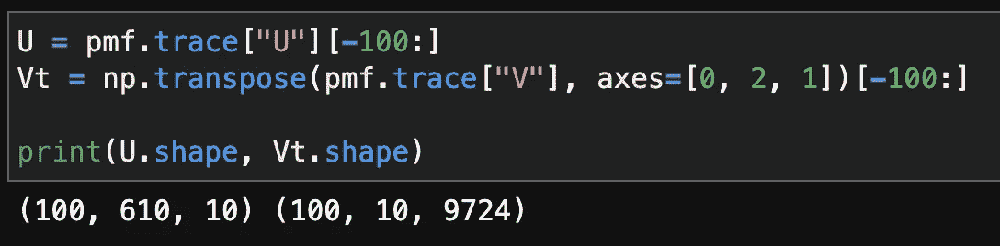
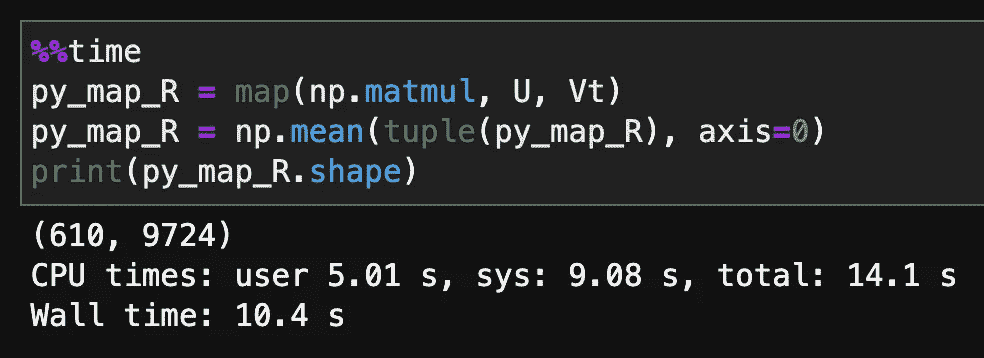
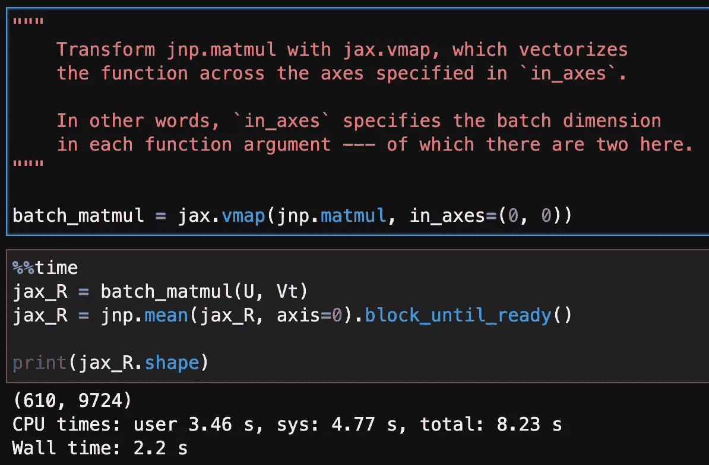

# 基准测试:用 jax 加速批量线性代数运算

> 原文：<https://towardsdatascience.com/benchmark-accelerating-batch-linear-algebra-operations-with-jax-6962cdea5011?source=collection_archive---------42----------------------->

## [理解大数据](https://towardsdatascience.com/tagged/making-sense-of-big-data)

## 代码更改最少，速度明显加快

像`numpy`这样的包是当今数据科学工作的面包和黄油。然而，我们可能会遇到`numpy`无法轻松处理或只能以次优方式处理的情况。

当你穿越到未知的领域…照片由 [Alex](https://unsplash.com/@worthyofelegance?utm_source=medium&utm_medium=referral) 在 [Unsplash](https://unsplash.com?utm_source=medium&utm_medium=referral) 上拍摄

我最近遇到过这样的情况:当实现一个概率矩阵分解(PMF)推荐系统时，我必须将许多对矩阵`U`和`V.T`相乘，当我调用`numpy.tensordot`来实现我的目标时，我的 Jupyter 内核崩溃了。

不满足于不得不在*多核*机器上一个接一个地乘以矩阵，我转向了`jax`，粗略地说就是类固醇上的`numpy`。DeepMind (cue AlphaGo music)和谷歌的研究人员在日常工作中使用这个`[jax](https://jax.readthedocs.io/en/latest/)`库— —主要是在深度学习方面— —一个丰富的[生态系统](https://deepmind.com/blog/article/using-jax-to-accelerate-our-research)已经围绕它涌现出来。

 [## 利用 JAX 加速我们的研究

### 我们发现越来越多的项目得到了 JAX 的良好服务，这是一个由…开发的机器学习框架

deepmind.com](https://deepmind.com/blog/article/using-jax-to-accelerate-our-research) 

在`jax`的优点中，我在这里关心的一个是它可以很容易地向量化([纯](https://jax.readthedocs.io/en/latest/notebooks/Common_Gotchas_in_JAX.html#pure-functions))函数，通过底层的并行化实现加速。如此加速的代码可以在 CPU、GPU 和/或 TPU 上执行，无需修改！

# 问题陈述

具体来说，这里是`U`和`Vt`的形状。它们是成批的*矩阵*，而不是成批的行，由于表格数据的流行，成批的行更常见。所以`U`和`Vt`分别包含 100 个矩阵，

U 和 Vt 的形状，我会把它们相乘。对于那些好奇的人来说，U 和 V 是 [MCMC](https://en.wikipedia.org/wiki/Markov_chain_Monte_Carlo) 的后验样本。文章作者截图。

我想将每一对对应的矩阵相乘得到`R`，其形状为(100，610，9724)。换句话说，用`Vt[0]`乘以`U[0]`，用`Vt[1]`乘以`U[1]`…,用`Vt[100]`乘以`U[100]`。

然后，我想对 0 轴(所有 100 个矩阵在`R`中)进行平均，最终得到一个 610 乘 9724 的矩阵。

# 基准

作为**基线**，让 Python 一个接一个地乘以矩阵，然后在轴 0 上平均结果。我的 2015 Macbook Pro 用了大约 10 秒，它有 16 GBs 的内存和英特尔 i7 CPUs。

顺序执行的基准。文章作者截图。

相比之下，如下图截图所示，执行同样的操作仅用了`jax` 2.2 秒！注意，我必须在`jnp.mean()`后添加`.block_until_ready()`才能获得有意义的基准，因为`jax`遵循惰性/异步评估。

使用 jax 的基准。文章作者截图。

最后但同样重要的是，当我将批中的矩阵数量从 100 增加到 150 时，上面的运行时会有不同的伸缩。朴素的顺序评价用了 50 秒，而`jax`只用了 3 秒。**换句话说，当问题需要更多内存时，使用** `**jax**` ***的好处真的*显现出来了。**

# 外卖食品

也许有一种简单的方法来完成我想在`numpy`中做的事情，但是使用`jax`也同样简单— —并且在设备类型和内存使用方面具有巨大的可伸缩性。

虽然`jax`自带数组数据类型，但[是](https://github.com/google/jax/issues/712) `[numpy.ndarray](https://github.com/google/jax/issues/712)`的子类，因此`jax`可以与现有的`numpy`工作流集成。

TL；博士--可以的话就用`jax`！