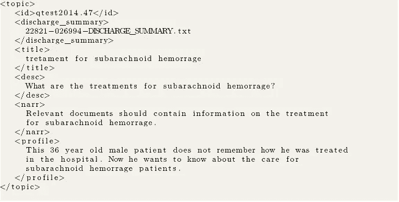
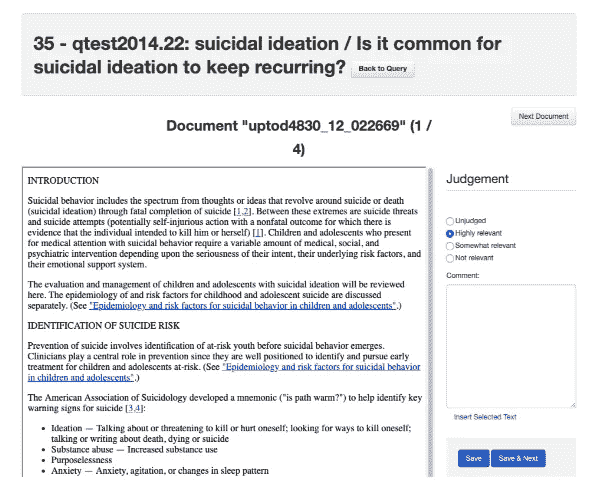
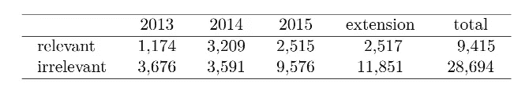

# 跨语言信息检索基准数据集(CLIR)

> 原文：<https://towardsdatascience.com/benchmark-dataset-for-cross-lingual-information-retrieval-clir-e77d75472e89?source=collection_archive---------21----------------------->

## [思想和理论](https://towardsdatascience.com/tagged/thoughts-and-theory)

## 我们展示的数据集使研究人员能够在医学领域建立和评估英语和七种欧洲语言的 CLIR 系统。

由[安东尼·马蒂诺](https://unsplash.com/@amartino20?utm_source=medium&utm_medium=referral)在 [Unsplash](https://unsplash.com?utm_source=medium&utm_medium=referral) 上拍摄

# 介绍

在这个故事中，我将介绍我们对扩展现有跨语言信息检索(CLIR)数据集的贡献，这些数据集是在 CLEF 电子健康评估实验室的信息检索(IR)任务期间发布的。所得到的数据集旨在建立和评估医学领域中的 CLIR。支持的语言有英语、捷克语、法语、德语、匈牙利语、波兰语、西班牙语和瑞典语。

# 什么是跨语言信息检索(CLIR)？

CLIR 使用户能够通过以不同于收集语言的语言提出查询来搜索信息。这有助于打破系统用户和用不同语言表示的大量数据之间的语言障碍。自 20 世纪 90 年代末以来，这项任务已经引起了国际关系研究界的关注，互联网的发展是 CLIR 系统需求的有力证据，因为全球的数字内容已经开始显著增加。

# CLIR 和 COVID19

在 COVID19 疫情期间，CLIR 变得比以往任何时候都重要，因为个人、政策制定者和医生都希望更多地了解 COVID19，并阅读来自世界各地的故事、治疗方案和抗击 COVID19 的展示。这些信息当然可以用他们可能不会说的多种语言获得。

围绕 COVID19-topic 改进搜索和信息访问的最新努力之一是 COVID19 MLIA 评估:“新冠肺炎·MLIA 评估组织了一项社区评估工作，旨在参考一般公共用例，加快创建资源和工具，以改进当前紧急情况下的多语言信息访问(MLIA)”，来源: [MLIA 网站](http://eval.covid19-mlia.eu/)。

# 接近 CLIR

CLIR 系统通常包括两个步骤，第一步是翻译步骤，包括将查询翻译成文档集合的语言，或者将文档集合翻译成查询语言。翻译完成后，任务就简化为单语的信息检索任务。

不同的方法和研究调查了 CLIR 任务中的两个主要问题:

*   查询和文档集合哪个更好翻译？或者将两者转换成一个共同的表示？
*   翻译怎么做？CLIR 的翻译任务是否类似于旨在生成人类可读翻译的正常机器翻译任务？

有关这两种方法的更多信息，我可以参考我去年在语言学协会(ACL)会议上发表的一篇论文，在这篇论文中，我对上述两种方法进行了全面的比较。

<https://www.aclweb.org/anthology/2020.acl-main.613/>  

# CLIR 和 COVID19

在 COVID19 疫情期间，医疗领域的搜索变得非常重要，因为个人、政策制定者和医生希望通过在线访问多种语言的信息来获得最新信息。实际上，[新冠肺炎多语言信息获取(MLIA)](http://eval.covid19-mlia.eu/) 计划是邀请世界各地的研究人员设计搜索引擎系统的最新活动，该系统可以帮助搜索者以多种语言在线查找 COVID19 相关信息。

# 我们的 CLIR 测试数据集

该测试数据集基于 2013-2015 年 CLEF 电子健康以患者为中心的 IR 任务期间发布的三个测试集[Goeuriot 等人，2015 年，2014 年，Suominen 等人，2013 年]。我们主要通过将查询翻译成更多的语言来扩展测试集，并将相关性评估扩展到原始评估的两倍以上。扩展的测试集可通过[LINDAT/CLARIN 知识库](https://lindat.mff.cuni.cz/repository/xmlui/handle/11234/1-2925)在线获取

测试数据集主要包含三个部分:

# 1-文档集合

我们扩展数据中的文档集合摘自 CLEF 电子健康 IR task 2015。这些文件以 HTML 格式提供。每个文档都包含 HTML 标记、CSS 和 javascript 代码。

该集合包括大约 110 万份从医学网站上抓取的文档。关于文档集合的更多信息可以在[1]中找到。

# 2-查询

本研究中的查询来自 CLEF 电子健康 CLIR 任务 2013–2015 期间发布的测试集，如下所示:

**2013 年和 2014 年的查询**在 CLEF e health IR task 2013【Goeuriot 等人，2013】和 CLEF e health IR task 2014【Goeuriot 等人，2014】中，医疗专家根据患者的出院总结生成查询。

选择医学专家(护士和临床医师)进行查询生成的动机是这些专家每天都与患者接触；因此，他们可以了解自己的信息需求。

产生的问题如下:医学专家得到出院总结，他们被要求随机选择一种疾病，然后写一个简短的问题描述它。他们假设，当患者想要找到更多关于同一种疾病的信息时，他们会使用相同的查询。让医学专家参与从出院总结中生成查询会在某种程度上影响查询的性质，因为它们包含医学术语，并且它们往往很短。

**2015 年的查询**在 CLEF eHealth Evaluation Lab 2015 中，被称为*的 IR 任务检索有关医疗症状的信息*【Palotti 等人，2015】。该任务的目标是设计红外系统，可以帮助外行人(没有医疗经验的用户)找到与他们的健康状况相关的信息，并了解是什么导致了他们的症状(自我诊断)。因此，本任务中查询的创建试图尽可能模拟真实情况。

查询创建步骤中的参与者是没有医疗经验的大学生，试图模拟普通搜索引擎用户的情况。

他们观看了包含医疗问题症状的图像和视频。然后，他们被要求为每个案例生成查询，因为他们认为这些查询将代表他们的信息需求，并最终将引导他们找到相关的文档。

**新数据拆分**如前两段所示，CLEF eHealth IR 的 2013、2014 和 2015 年实验室中的查询之间的主要差异是这些查询的来源，以及 2013–2014 年使用医学术语的趋势与 2015 年的情况相反。

我们希望设计一个对如此多样的用户查询稳定的 CLIR 系统，而不是设计一个偏向于一种类型的查询(短的有医学术语，长的没有医学术语)的系统。

为此，我们从 2013 年(50 个查询)、2014 年(50 个查询)和 2015 年(66 个查询)的每个 IR 任务中获取了测试查询。我们将它们混合在一起，以获得更具代表性和平衡的查询集，然后将这些查询分成两组:100 个用于训练的查询(33 个来自 2013 年测试集，32 个来自 2014 年，35 个来自 2015 年)和 66 个用于测试的查询(17 个来自 2013 年测试集，18 个来自 2014 年，31 个来自 2015 年)。

这两个集合根据其来源年份的分布、相关性评估信息中存在的相关/不相关文档的数量以及查询长度(标记的数量)来分层。

所有年份的查询都以 aTREC ( [TREC 是 NIST 文本检索会议](https://trec.nist.gov/)的缩写)格式表示，如下所示:

****标题*** :该字段包含查询的标题，通常称为*查询*。用户的信息需求应该在这个域中表示，这个域最终将被馈送给一个 IR 系统进行检索。*

*****D*描述**:该字段帮助描述较长句子中的标题。**

******N*arrative**:该字段向注释者描述相关文档应该包含的内容。该字段对于相关性评估过程而非检索阶段非常有用。***

******P*profile**:关于将要进行自我诊断的患者的信息，如他们的性别、年龄和其他医疗相关信息。***

******D*ischarge _ summary**:该字段包含一个文本文件的处理程序(ID)，该文件包含相应患者的出院总结。***

****

**测试查询的示例**

# **3-相关性评估**

**相关性评估是法官(在该领域有经验的人)确定每个文档是否与特定查询相关的过程。**

**我们建立了一个使用多个系统检索的排名靠前的文档池，然后评估人员查看每个文档-查询对并确定其相关程度。相关度可以是:**

*   ****不相关:**文档与信息需求完全不相关。**
*   ****有些相关:**该文档部分回答了信息需求。这意味着一些信息被遗漏了，搜索者不得不阅读更多的文档来完整地得到他们的问题的答案。**
*   ****高度相关:**该文档完全满足信息需求，无需阅读任何其他文档。**

**我们使用 [Relevation toolkit](https://vimeo.com/126208435) ，这是一个开源工具，用于为 IR 评估进行相关性评估【Koopman 和 Zuccon，2014】。**

****

**相关性评估员使用的相关 web 界面。**

**下表显示了官方评估(在 2013 年、2014 年和 2015 年完成)与我们在评估文件数量方面的扩展的统计数据。扩展后的数据集总共包含 38 个*、* 109 个文档-查询对，14 个*、* 368 个文档-查询对。**

****

**相关性评估统计**

# **结论**

**我在这个故事中介绍了我们扩展现有数据集以支持七种欧洲语言的 CLIR 的努力。数据集在这里公开[。](https://lindat.mff.cuni.cz/repository/xmlui/handle/11234/1-2925)**

**这个数据集的完整描述发表在 2019 年欧洲信息检索会议(ECIR)的一篇短文中[2]。**

**如果你对这项工作有任何问题，请不要犹豫，在评论中写下你的问题。**

# **参考**

*   **[1]帕罗蒂等人:CLEF 电子健康评估实验室 2015，任务 2:检索有关医学症状的信息，[CEUR-WS.org](http://ceur-ws.org/Vol-1391/inv-pap9-CR.pdf)**
*   **[2] Shadi Saleh 和 Pavel Pecina，医学领域跨语言信息检索的扩展 CLEF eHealth 测试集，(2019)，2019 年欧洲信息检索会议， [Springer](https://link.springer.com/chapter/10.1007/978-3-030-15719-7_24) 。**