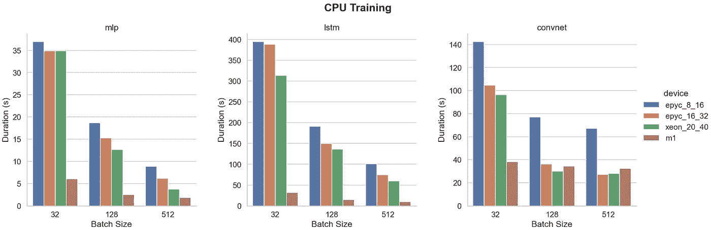
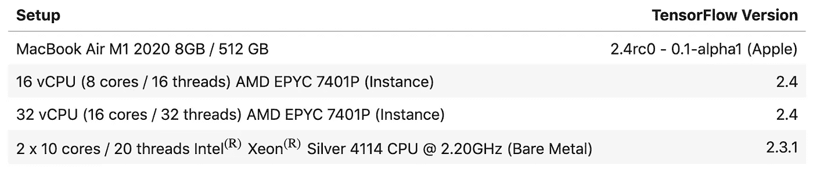
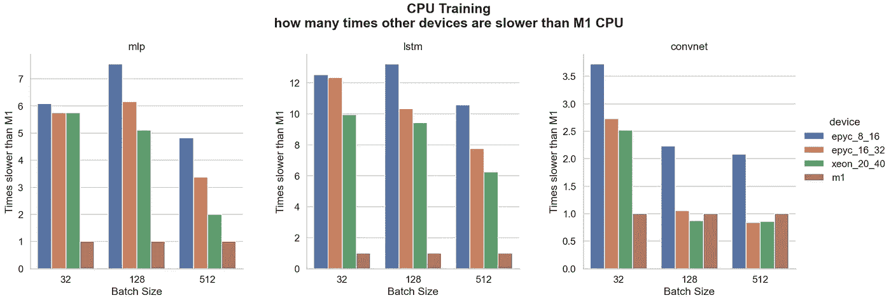
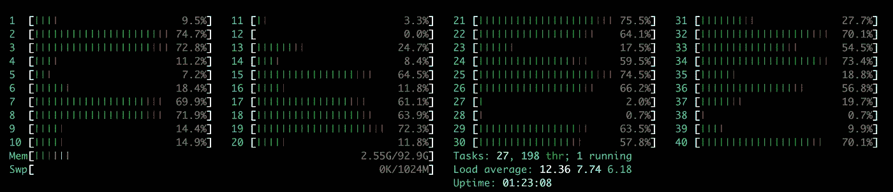
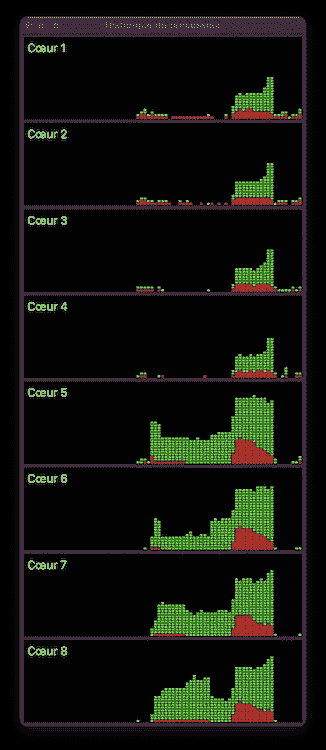

# M1 在 TensorFlow 培训上与 20 核至强竞争

> 原文：<https://towardsdatascience.com/benchmark-m1-part-2-vs-20-cores-xeon-vs-amd-epyc-16-and-32-cores-8e394d56003d?source=collection_archive---------16----------------------->

## M1 性能与 20/40 核至强银裸机和 AMD EPYC 服务器的比较



在 M1 基准测试文章 的 [**第一部分中，我在三个 TensorFlow 模型上将 MacBook Air M1 与 iMac 27 英寸酷睿 i5、8 核至强白金、K80 GPU 实例和 T4 GPU 实例进行了比较。**](/benchmark-m1-vs-xeon-vs-core-i5-vs-k80-and-t4-e3802f27421c)

虽然 GPU 没有预期的那么高效，可能是因为 TensorFlow 的早期版本还没有完全针对 M1 进行优化，但它显然显示出令人印象深刻的 CPU 性能，远远超过了 iMac 和 8 核 Xeon(R) Platinum 实例。

虽然将入门级笔记本电脑与如此高端的配置进行比较通常是不公平的，但 M1 有优势；它有 **8 个物理核心**。

iMac 27 英寸 Core i5 有 4 个内核，8 核 Xeon(R) Platinum 就像计算 vCPU 的每个实例一样，因此只有 4 个物理内核。我按照这张纸的[反复检查了`core id`、`siblings` 和`physical id`以确保无误。](https://doc.callmematthi.eu/static/webArticles/Understanding%20Linux%20_proc_cpuinfo.pdf)

## 设置

在本文中，我将 M1 与具有 8 到 20 个物理内核(16 到 40 个超线程内核)的更强大的配置进行了比较。



基准配置

AMD EPYC 配置是实例，而至强银是裸机，这意味着**真正的物理专用服务器**。

至强服务器有两个 CPU，每个 CPU 有 10 个内核(20 个线程)，因此总共有 **20 个物理内核(40 个线程)**。

它使用 TensorFlow 2.3.1 从一些编译选项中获益。启动时，它会显示以下内容:

```
This TensorFlow binary is optimized with oneAPI Deep Neural Network Library (oneDNN)to use the following CPU instructions in performance-critical operations:  AVX2 AVX512F FMA
```

我还比较了与 Anaconda 一起交付的英特尔(R) MKL。两者表现相似。

MacBook Air 正在使用能够从 M1 的全部潜力中受益的[苹果硅原生版 TensorFlow](https://github.com/apple/tensorflow_macos) (即使[第一部分文章](/benchmark-m1-vs-xeon-vs-core-i5-vs-k80-and-t4-e3802f27421c)显示 GPU 看起来尚未优化)。

提醒一下(如前一篇文章所示)，这里是 M1 的规格。

*   8 核 CPU (4 个 3.2 GHz 高性能，4 个 2.06 GHz 高效率)
*   8 核 GPU (128 个执行单元，24 576 个线程，2.6 TFlops)
*   专用于线性代数的 16 核神经引擎
*   统一内存架构 4 266 MT/s (34 128 MB/s 数据传输)

## 模型

你可以找到 [**前一篇**](/benchmark-m1-vs-xeon-vs-core-i5-vs-k80-and-t4-e3802f27421c) 中使用的模型和数据集。

## 结果

下图显示了在 **CPU** 上的训练结果。


在 CPU 培训方面，MacBook Air M1 的性能远远超过了两个 AMD EPYC 和 20/40 核英特尔至强银处理器在 MLP 和 LSTM 的性能。只有 convnet 在 128 和 512 样本批量方面比至强稍有优势，AMD EPYC 16/32 在 512 样本批量方面仅略胜一筹。

下图显示了其他设备比 M1 CPU 慢多少倍。



对于 MLP 和 LSTM 来说，M1 比 8/16 核 AMD 快 5 到 13 倍，比 16/32 核 AMD 快 3 到 12 倍，比 20/40 核 Xeon 银裸机快 2 到 10 倍。对于 CNN 来说，M1 在 32 个样本批量上大约比其他公司快 **2.5 倍**，在其他批量上比 AMD EPYC 快 **2 倍**，在 128 和 512 个样本批量上比 20/40 核 Xeon(R) Silver 仅慢**10%到 20%。**

## CPU 消耗

让我们在培训期间检查一下至强处理器的 CPU 消耗。



培训期间的至强银级 CPU 消耗

一半的内核负载约为 70%,这意味着超线程在这种情况下没有用，只使用物理内核。

现在让我们检查整个基准测试期间 M1 CPU 的历史记录。



M1 CPU 负载——MLP，CNN，LSTM

令人惊讶的是，在 **MLP** 和**美国有线电视新闻网**的培训中，只有 4 个内核被真正使用，但仅在 **50%** 时使用。最大负荷发生在 **LSTM** 训练期间；这也是其他 4 个内核负载达到 50%的唯一情况。我们可以假设负载最大的是 3.2 GHz 的“高性能”内核。

那么，M1 如何通过仅部分使用其一半的内核来实现如此卓越的性能，从而击败使用 AVX-512 指令编译的 TensorFlow 版本的 20/40 核至强银处理器呢？M1“性能”内核的频率比至强(R)内核高 50%,但这一内核有 20 个物理内核，这一频率差异不足以解释这一性能差距。

## 为什么 M1 这么快？

由于苹果从未透露其处理器设计的细节，所以很难知道 M1 不同地区的实际使用情况。无论如何，我们可以尝试制定一些假设。

*   M1 CPU 包括**【ML 加速器】**如这里提到的，它们被 [**ML Compute BNNS**](https://developer.apple.com/documentation/accelerate/bnns) 原语在 CPU 上训练**神经网络模型时使用。如果我们参考 [**这篇文章**](https://nod.ai/comparing-apple-m1-with-amx2-m1-with-neon/) 我们可以假设“ML 加速器”是 **AMX2** (苹果矩阵协处理器)的通称，所以它可能更像是一个迷你 [**NPU**](https://en.wikipedia.org/wiki/AI_accelerator) 能够加速线性代数计算，尤其是矩阵乘法。但与神经引擎不同的是，它与 CPU 一起工作，而不是作为一个独立的组件，因此减少了延迟，提高了密集矩阵计算的吞吐量。这可以解释为什么在 LSTM 上观察到最大的间隙，因为这种类型的单元不仅基于矢量，而且需要更多的迭代处理。CPU 和高吞吐量矩阵计算单元的组合对于这种模型似乎非常有效**
*   通用内存设计支持对 SoC 的每个内核和每个组件进行更快的数据访问，同时更好的 CPU 设计支持更高效的并行处理

再说一遍，这些都是假设，只有苹果能解释它到底是如何工作的。

## 结论

从这些测试来看，似乎

*   为了训练 **MLP** 和 **LSTM** ， **M1 的 CPU 比所有测试过的高端服务器都要快得多**
*   为了训练 **CNN** ， **M1 只比测试的高端服务器稍慢**

当然，这些指标只能考虑用于本测试中使用的类似神经网络类型和深度。

对于持续超过 20 分钟的大型培训和密集计算，我仍然会选择基于云的解决方案，因为它们提供了针对如此长时间的重负载而构建的卡，并且能够同时发送几个任务。但这种情况只适用于一些特定的研究，仅占我工作的 10%，主要用于一些特定业务领域的专业用途。

作为一名机器学习工程师，对于我的日常个人研究来说，M1 Mac 显然是当今最好、最具成本效益的选择。

感谢您的阅读。