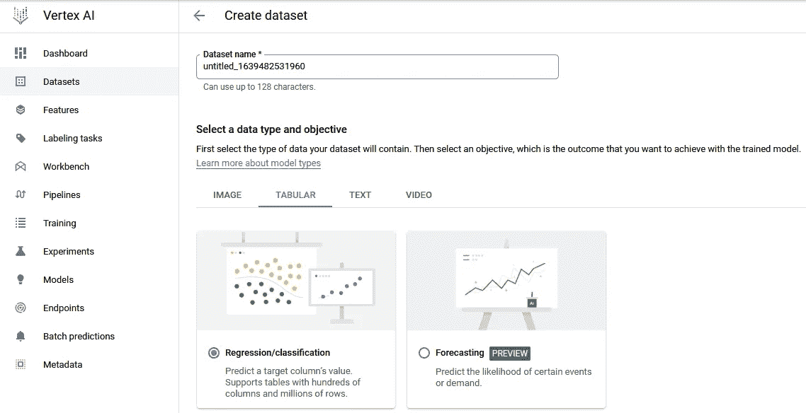
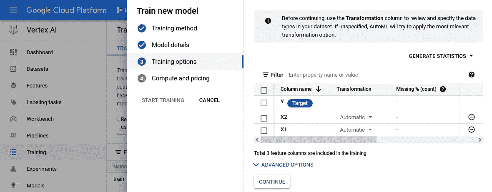
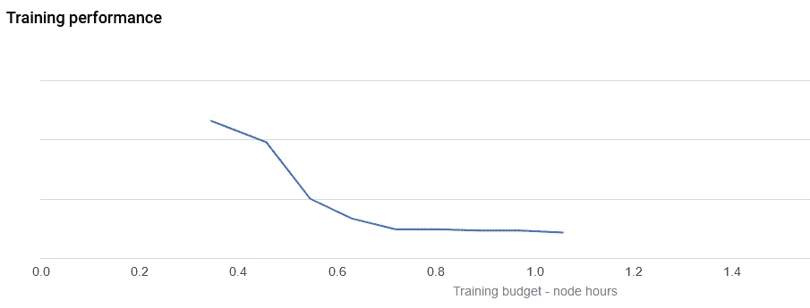
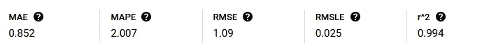

# 使用基于云的 AutoML 测试您的机器学习模型

> 原文：<https://towardsdatascience.com/benchmark-your-models-6ef942e2683f?source=collection_archive---------14----------------------->

## 开发准确的模型和工具来预测或分类数据是数据科学家工作不可或缺的一部分。构建模型需要相当多的努力，而且可能很耗时——如果你正在寻找这个过程的潜在捷径，请继续阅读。

首先，让我们假设我们获得了一个由几个预测值和一个响应变量组成的数据集，期望的结果是一个正确预测价格列的回归模型，这是一个经典的监督学习任务。在接下来的几个段落中，我将简要介绍这个问题的建模(使用与 R 相关的(伪)代码)。

在正常的工作流程中，会构建各种不同的模型，最终选择并部署最有说服力的模型。这可能不仅在模型选择方面非常耗时——关键词:数据采样、交叉验证(CV)——而且**没有为您提供可以参考的基准**。在一天结束的时候，你符合你的“最佳模型”，这可能实际上真的很好，或者在不同的场景中，根本不是。

[](/cross-validation-7c0163460ea0) [## 通过交叉验证选择合适的模型

### 交叉验证是最先进的。它不是一个有趣的任务，但对每个处理数据的人来说是至关重要的…

towardsdatascience.com](/cross-validation-7c0163460ea0) 

> 有什么方法可以快速找到我们可以参考的“默认模型”呢？绝对的！


面向 ML 的云计算—图片由 [Pero Kalimero](https://unsplash.com/@pericakalimerica?utm_source=medium&utm_medium=referral) 提供

此外，模型的性能通常不仅取决于模型训练的数据集(关键词:训练误差、随机效应)，而且在应用不同的超参数时，性能也会有很大差异——这就是组合学发挥作用并使您的生活变得更加艰难的地方。最终，数据科学家找到了“最准确”的模型，但是还有一个问题:

> 是否有任何更好的建模选项尚未解决？

“总有更大的鱼”[Qui-Gon Jinn]，或者在我们的情况下，一个模型可能比我们的实现做得更好。话虽如此，即使我们找不到更好的模型，这也是一件值得了解的好事，不是吗？这是我想介绍 AutoML 的地方。尽管在数据科学领域中有许多不同的“AutoML”实现，但我将介绍一种简单的“按需付费”方法，它不会让我们陷入无尽的设置周期。

**我将检查以下工作流程，以(1)在本地构建一个模型，以及(2)查看通过 Google 的 AutoML 实现实现的模型基准:**

```
**Local Setup:**
1\. Defining a dummy dataset
2\. Train a model and tune hyperparameters (cross validation)**Cloud Setup:**
3\. Upload a dataset Google's Vertex AI (bucket)
4\. Set up Vertex AI and build a model through AutoML
5\. Compare performance
```

本文中的示例数据集引用了一个**回归任务**，如果你的底层分析问题是一个**分类任务**，你可以在这里找到一些启发:

[](/supervised-learning-b662cb97df7) [## 数据分类算法——监督机器学习的最佳状态

### 有监督的机器学习算法已经存在了一段时间，随着机器的重新出现…

towardsdatascience.com](/supervised-learning-b662cb97df7) 

## 创建简单的虚拟数据集

在这个实验中，我使用了 X1 和 X2 的递增值(都在区间[0，1])组合成一个响应变量 Y，其中 Y 定义为:

```
Y = 100 * [ max(e^y1, e^y2, ..) / sum((e^y1, e^y2, ..)) ]
```

其中(小写) *yi* 取自多元高斯分布。*这个实现的功劳归于* ***梅亚军*** *教授，他向我介绍了这种生成随机数据的有趣方式。*

这里我们需要知道的重要一点是，响应数据显示了一个曲率，这表明线性回归可能不是最好的选择，而是局部核平滑方法或非线性模型。

## 在本地机器上构建模型

我决定使用两种不同的模型，**多元线性回归**以及 **gbm** (梯度推进机)。

(调整后的)gbm 模型的一个示例:

如上所述，拟合模型很简单，但也需要执行类似“gridsearch”的超参数调整，以获得最合理的结果。这与线性回归模型无关，但是 gbm 有多种可以修改的超参数(例如 *n.trees，shrinkage parameter，minobsinnode* )。

请记住，对于基于树的模型，我们应该始终关注过度拟合，因此应该谨慎设置和评估树的大小、节点中的最小观察值和 CV。

鉴于上述模型设置，gbm 能够在 1.11568 的 *RMSE 下进行预测，鉴于所有响应 *Yi* 的平均值约为 50，该值似乎较低。线性回归得出的 *RMSE 为 3.1846* ，该值相当大，但正如预期的那样，给出了响应数据的非线性形状。*

现在有趣的问题是:“gbm 模型与 AutoML 拟合的类似基准的模型相比如何？”

## 基准模型

为了找到上述示例模型的基准，我使用了 Google 的 Vertex AI，它提供了 AutoML 功能。事实证明，该过程允许我们将模型拟合到训练数据，而不必考虑要应用的不同模型类型及其相关的超参数。此外，还会考虑交叉验证。

首先，我们需要在云控制台中直接上传或“创建”数据集，将数据存储在一个桶中。数据类型是“表格”格式(这是一个 csv 文件),我们要执行的任务是一个回归任务。



假设我们想要预测连续值，基本任务就是回归。截图取自谷歌云平台

一旦数据被上传和设置，例如提供了正确的列名等。，导航栏中的培训部分允许我们培训模型。不需要任何编码经验，因此我们可以简单地点击添加/删除模型构建过程中的变量。



选择功能和响应—来自 Google 云平台的截图

在最后一步中，我们只需要确定我们允许模型训练的时间。我选择了两个小时，(而一个小时是选择的最小单位)——只要确保您允许该过程提前停止，如果已经实现了收敛，这可能会为您节省一些美元。

在训练模型时，您可以观察准确性度量的进度。这为您提供了一个第一印象，即您的训练模型最终可能与 AutoML 模型相比有多好。



**悬停在线上**显示当前获得的 RMSE——来自谷歌云平台的截图

在模型停止后(由于预算限制或因为模型收敛)，可以观察到最终结果指标如下:



模型收敛/停止后的结果指标—来自 Google 云平台的截图

在现实世界的场景中，我们可能希望对新的数据点进行预测。这要求用户设置接受请求的端点，并返回请求中给定数据点的预测。

尽管建立 AutoML 模型很容易，但通过局部拟合模型进行预测要容易得多，而且更重要的是，不会像请求那样产生成本。AutoML 模型既可以作为一个整体下载来进行预测，也可以通过 API 调用(演示代码由提供商提供)——这两种方法都很简单，但仍然比使用机器模型复杂。

## 比较和结论

在本例中，我们可以看到本地模型(gbm)和 AutoML 模型的结果非常接近，尽管 AutoML 的表现稍好一些。这是否意味着我们应该放弃我们的拟合模型？很可能不是。

1.  AutoML 花了 1.5 个多小时才得出合理的结果，而本地拟合的 gmb 模型只花了大约 20 分钟(包括调整超参数的 gridsearch 过程)。
2.  RMSE 中的差异约为 0.02，这对于我们的模型来说是一个很好的结果，也表明我们正处于良好的轨道上，甚至可能通过引入更多种类的可能超参数(例如，增加助推模型的相互作用深度)来改善
3.  成本与收益:赢家再清楚不过了。如果你对模型成本感兴趣，可以随便谷歌一下，但有一点可以肯定，云一点也不便宜。
4.  进行预测需要对基于云的模型进行部署和集成，而本地模型一旦适合就可以进行预测。然而，如果您正在使用一个大规模生产环境的模型，您可能仍然喜欢基于云的 AutoML 解决方案。

**我对数据科学家在这一切中的角色的看法:**

> AutoML 是否根除了数据科学职业？—很可能不是。

显然，AutoML 模型做了出色的工作，让我们有了一个好的模型**基准**。如果盲目地执行算法来衡量 AutoML 解决方案的结果，结果可能不会有很大的不同。

简单的调整会对模型结果产生难以置信的巨大影响。数据专家的主要好处之一是，这些调整来自经验和知识。例如:*在另一个不同的例子中，我可以了解到简单的数据转换可以为更简单的模型带来更好的结果—* AutoML 希望只处理结果来找到更好的拟合，这可能会带来复杂性。

一个更简单的模型不仅可以节省大量资金，还可以让我们更容易地获得可以解释和说明的结果，例如，考虑一个泊松回归模型，它允许我们解释系数，而不是“只”提供重要性度量的集合学习器。毫无疑问，后一种模式可能更难解释和证明。

{照顾好自己，如果可以的话，也照顾好别人}

*—借用史蒂芬·都伯纳*