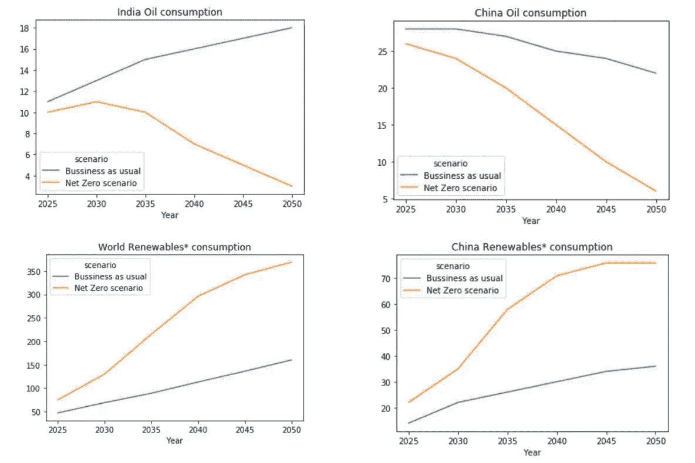
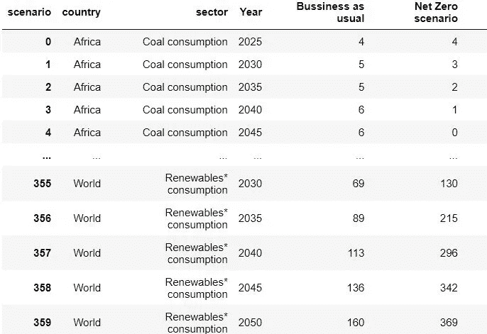
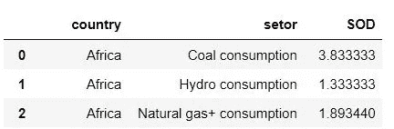
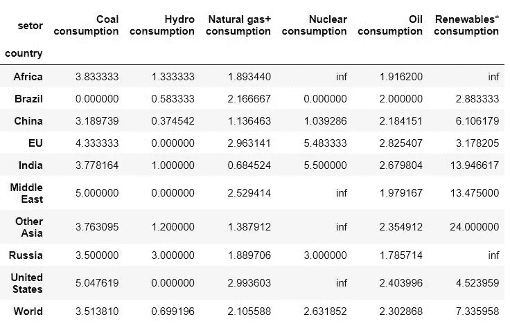
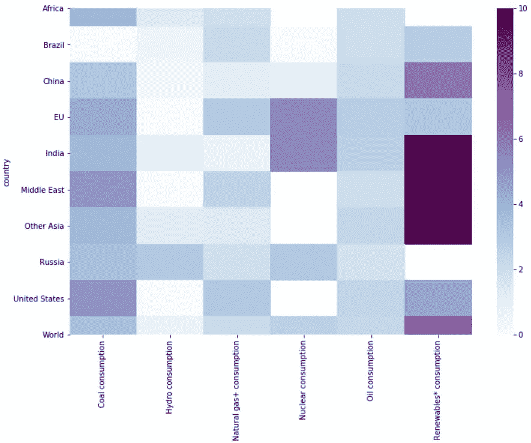
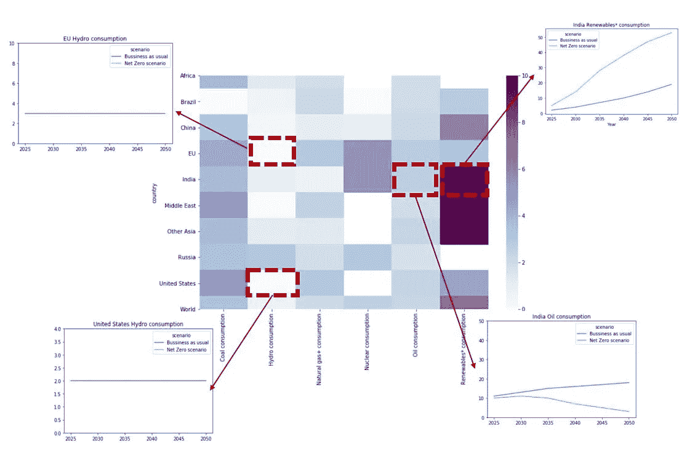

# 用风格对时间序列数据集进行基准测试

> 原文：<https://towardsdatascience.com/benchmarking-time-series-datasets-with-style-2a4e8789a965?source=collection_archive---------18----------------------->

## [行业笔记](https://towardsdatascience.com/tagged/notes-from-industry)

## 如何交叉检查/核实大型时序数据集？

我从事能源系统建模、油气井建模和油井完整性管理系统的工作。在许多情况下，基准数据集或发现来自不同来源或来自多个建模结果的时间序列数据之间的差异至关重要。

> 时间序列是一系列随时间变化的数据点。

对大型数据集进行基准测试，并快速发现差异和风格，可以为您节省推动见解的时间。

例如，在超过 100 个国家和 60 个行业的全球能源数据集中，绘制整个数据集以对两个不同的数据源进行基准测试，或者甚至在运行模型以预测不同的情景之后，这将是非常乏味的。

在英国石油公司的《世界能源统计评论》中，对不同的能源情景进行了量化，显示了英国石油公司对不同能源环境下能源未来的看法(照常营业情景和净零情景)。

这些数据是 2025 年、2030 年、2035 年、2040 年、2045 年和 2050 年主要消费国和地区的数据。

我们如何在不绘图的情况下发现时间序列预测(两种能源情景)之间的差异？我们如何跳过绘制两种能源情景之间的 60 个时间序列数据(120 条线图)来找出主要变化在哪里？

# **我们从哪里得到的数据？**

我们在构建案例时所依赖的数据是《英国石油公司 2020 年世界能源统计评论》,我们在之前的工作中向[展示了如何使用 python](https://muadelm.medium.com/how-to-extract-and-clean-data-from-multiple-excel-sheets-using-python-5d506d959a05) 以干净的形式提取数据。

# 发现时间序列数据之间差异的传统方法

我们的目标是区分不同燃料(石油、天然气、可再生能源、核能、煤炭)的预测需求，以及几个国家/地区(美国、欧盟、中国、印度等)的“一切照旧”情景和“净零”情景。).

传统的方法是在两个场景之间绘制一个线图

线形图指出两个时间序列数据之间的差异。图片作者[作者](https://www.linkedin.com/in/mustafa-adel-amer/)

**传统方法的问题？**

这将需要绘制两种能源情景之间的 60 个时间序列数据(120 个线图)，以确定主要变化在哪里。如果您有一个更大的模型或几个特征，使用绘图作为解决方案会变得更加困难。

# **如何更快发现一种风格的差异？**

能够看到不同建模场景之间的时间序列数据差异的全貌，或者检查不同数据更新之间的差异，或者在大规模的基准测试过程中，可以节省更多时间来进行高质量的分析和提供见解。

对两种能源情景结果(时间序列数据)进行基准测试的步骤如下:

1.  提取数据。
2.  以长格式重新组织数据，并有两列，每一列对应一个要进行基准测试的时间序列(能源场景)。
3.  计算两个时间序列数据集之间的**无量纲差**。

例如，2035 年非洲煤炭消费的无量纲差异为**{(5–2)/5 } = 0.6**

长格式的结构化干净数据集。图片由[作者](https://www.linkedin.com/in/mustafa-adel-amer/)

4.**求和**每个县每个部门的两个时间序列之间的无量纲差异。

两个能源情景数据集之间的差异总和(时间序列)。作者图片

5.重新构造数据帧，使两个最重要的变量是索引和列名。例如，**国家**是**指标**而**部门**是**栏目**。

图片作者[作者](https://www.linkedin.com/in/mustafa-adel-amer/)

6.使用**热图**可视化结果。

发现(基准)两种能源情景(时间序列数据)之间差异的热图。图片由[作者](https://www.linkedin.com/in/mustafa-adel-amer/)

热图将浅色显示为两个数据集匹配的区域。也就是说，两种能源方案显示了相似的结果。美国的水电消费就是一个例子。然而，中东的可再生能源消费在一切照旧情景和净零情景之间有很大差异。

下面的示例显示了生成的热图如何帮助发现不同时间序列数据之间的差异。

基准时间序列数据摘要。图片作者[作者](https://www.linkedin.com/in/mustafa-adel-amer/)

整部作品可在 [Github](https://github.com/muadelm/BP-statistical-review-2020/blob/main/BP%20statistical%20review_benchmarking.ipynb) 上获得。