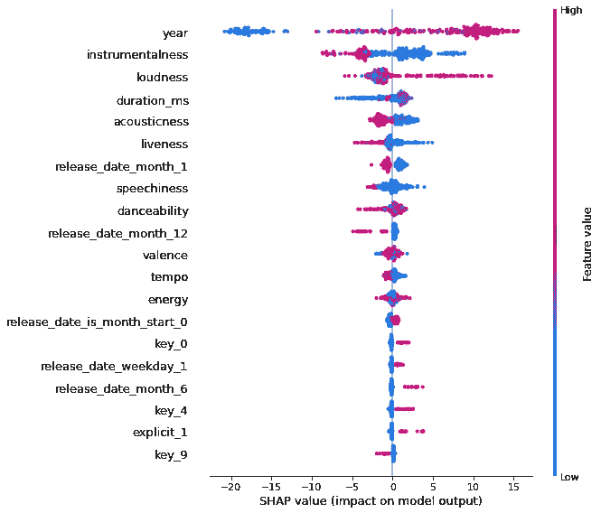

# CatBoost 机器学习算法的优势

> 原文：<https://towardsdatascience.com/benefits-of-the-catboost-machine-learning-algorithm-fcd8c1ff2a8?source=collection_archive---------7----------------------->

## 意见

## 面向数据科学家和 ML 工程师


由 [Ludemeula Fernandes](https://unsplash.com/@ludemeula?utm_source=unsplash&utm_medium=referral&utm_content=creditCopyText) 在 [Unsplash](https://unsplash.com/s/photos/cat?utm_source=unsplash&utm_medium=referral&utm_content=creditCopyText) 拍摄的照片。

# 目录

1.  介绍
2.  分类特征更强大
3.  集成绘图功能
4.  高效处理
5.  摘要
6.  参考

# 介绍

辞旧迎新。更具体地说，对于未来的许多数据科学家和 ML 工程师来说， [CatBoost](https://catboost.ai/) [2]可能会取代 XGBoost。这不仅是数据科学竞赛的一个伟大算法，而且由于各种原因，它对专业数据科学家和 ML 工程师也非常有益。通常，复杂的机器学习算法可能需要似乎永远的训练，然后缺乏关键的绘图工具，这些工具可以帮助解释特征以及模型训练本身。也许 CatBoost 最大的好处在于它的名字，我们将在下面详细阐述。话虽如此，让我们更深入地了解一下 CatBoost 的三个主要优势。

# 分类特征更强大


米哈伊尔·瓦西里耶夫在[Unsplash](https://unsplash.com/s/photos/cat?utm_source=unsplash&utm_medium=referral&utm_content=creditCopyText)【3】上的照片。

数据科学最令人沮丧的部分之一就是数据。这些数据可能包含多种形式，但可能导致所有问题的主要形式是分类特征类型。这种类型也可以更具体地描述为字符串、对象或分类`dtype`。

**当前空间/问题**

大多数(如果不是所有)其他机器学习算法的当前位置是，它们通过一次热编码摄取分类特征。这种转换意味着您将有更多的列，多达数百个甚至数千个，这些列将被赋值为 0 或 1。当然，这种方法有时很有用，比如只有两个类别时，但是当您有像 ID 这样的可以采用成千上万甚至更多独特形式的特性时，拥有稀疏数据帧只会使您的模型花费太长的时间来训练，尤其是如果它在生产环境中频繁运行的话。

> 下面是突出显示的当前空间:

*   过多的单热编码特征/稀疏
*   列太多
*   训练速度变慢
*   功能通常不太强大
*   在生产中匹配训练/测试/推断数据可能很困难

**CatBoost 空间/好处**

CatBoost 使用有序的目标编码，这实质上允许您将特征/列保持在其原始状态，从而允许您更容易地与 ml 工程师和软件工程师协作。您将不必担心匹配几个特性的“一键编码”,并按照它们的意图来解释这些特性。不仅如此，这种编码允许更重要的特性重要性。

> 下面是突出显示的 CatBoost 空间:

*   没有热编码/稀疏数据帧
*   保持数据帧的原始格式，使协作更容易
*   训练更快
*   分类特征更重要
*   模型更准确
*   现在，您可以使用以前无法使用的要素，如 ID 或具有高唯一计数的分类要素

总的来说，通过以 CatBoost 处理的方式对您的分类特征进行编码，该模型将更加准确，因为它经过了多次测试和比较，并在文档中进行了更详细的概述。因此，重要的是不仅要关注数字特征，还要关注过去的机器学习算法中经常忽略的分类特征。

# 集成绘图功能



SHAP 的 CatBoost 实现的概要图[4]。

随着新库的出现，更简单的绘图技术变得越来越普遍，CatBoost 也不例外。这个库中有几个图值得强调，包括训练图和特征重要性图。

> 训练地块

该图允许您只需在拟合方法中设置`plot=True`即可看到模型的每次迭代。您还可以看到训练与测试图，它将显示评估准确性时预期的曲线。例如，如果您使用`MAE` ( *平均绝对值*)优化您的模型，该图将显示训练和测试最终变平，但在过度拟合之前停止，因此您将知道您的模型需要的最佳迭代次数。

*   查看训练与测试迭代
*   查看每个 X 迭代的输出，以获得更具体的精度结果
*   培训的透明度和粒度

> SHAP 特征重要性

如果你已经是一名数据科学家，你会知道 [SHAP](https://shap.readthedocs.io/en/latest/index.html) [5]是评估和查看你的特性重要性的最好工具之一。比方说你想看你的模型的前 10 个特性，排名，你可以很容易地用这个库特性。我使用的主要工具是`summary plot`，它显示了你所有的特征，分类的和数字的。您可以通过增加或减少目标值来查看每个单独的数据点及其贡献。当与利益相关者分享结果和特征分析时，这个图非常强大，因为它非常用户友好且易于理解。

*   显示模型顶级特征的摘要图
*   每个模型在目标值上的排名
*   针对特定预测的个人`force_plot`(*当更深入地研究由红色和蓝色着色的特定拉动特征以获得高和低效果时非常好的粒度*)
*   简单地为涉众协作和演示解释模型特性

总的来说，当然，官方文档中包含了更多的图，但这两个图可能是最常用的，因为它们非常强大，对于您自己理解模型非常有用，对于没有数据科学背景的其他人也是如此。

# 高效处理


由 [Kurt Cotoaga](https://unsplash.com/@kydroon?utm_source=unsplash&utm_medium=referral&utm_content=creditCopyText) 在[Unsplash](https://unsplash.com/s/photos/fast?utm_source=unsplash&utm_medium=referral&utm_content=creditCopyText)【6】上拍照。

CatBoost 的最后一个好处是第一个好处的产物。因为没有稀疏数据框架，所以使用大量分类特征的模型处理速度比使用其他算法(如 XGBoost 或 Random Forest)要快得多。

> 以下是关于 CatBoost 训练和预测的其他一些更详细的效率优势:

*   分类特征处理允许更快的训练
*   过拟合检测器将在必要时自动停止模型训练
*   参数可以自我调整，因此您不必浪费时间进行调整，这可能需要几个小时甚至几周的时间——根据我的经验，CatBoost detail 总是优于手动调整或网格和随机网格搜索
*   GPU 培训

每一种新的、更受欢迎的算法都关注速度和效率，而这正是 CatBoost 做得非常好的地方。

# 摘要

在选择机器学习算法时，数据科学家需要考虑很多因素。例如，每种算法都有许多优点和缺点，每次迭代通常会使算法或库更加面向专业人员，坦率地说，CatBoost 主要是优点。

> 以下是 CatBoost 库的三大优势:

```
* Categorical Features are More Powerful* Integrated Plotting Features* Efficient Processing
```

我希望你觉得我的文章既有趣又有用。如果您同意或不同意 CatBoost 库的这些优点，请随时在下面发表评论。为什么或为什么不？你用过或听说过这个图书馆吗？关于这个库，你认为还有什么好处是必须指出的？这些当然可以进一步澄清，但我希望我能够阐明 CatBoost 的一些好处。

感谢您的阅读！

***我不属于这些公司中的任何一家。***

*请随时查看我的个人资料、* [Matt Przybyla](https://medium.com/u/abe5272eafd9?source=post_page-----fcd8c1ff2a8--------------------------------) 、*和其他文章，并通过以下链接订阅接收我的博客的电子邮件通知，或通过点击屏幕顶部的订阅图标* ***点击关注图标*** *的订阅图标，如果您有任何问题或意见，请在 LinkedIn 上联系我。*

**订阅链接:**[https://datascience2.medium.com/subscribe](https://datascience2.medium.com/subscribe)

# 参考

[1]lude meula Fernandes 在 [Unsplash](https://unsplash.com/s/photos/cat?utm_source=unsplash&utm_medium=referral&utm_content=creditCopyText) 上拍摄的照片，(2017)

[2] Yandex， [CatBoost 主页](https://catboost.ai/)，(2021)

[3]米哈伊尔·瓦西里耶夫在 [Unsplash](https://unsplash.com/s/photos/cat?utm_source=unsplash&utm_medium=referral&utm_content=creditCopyText) 上拍摄的照片，(2017)

[4] M.Przybyla，SHAP 实施 CatBoost 的概要图截图，(2021)

[5]斯科特·伦德伯格， [SHAP 文件](https://shap.readthedocs.io/en/latest/index.html)，(2018)

[6]Kurt coto aga 在 [Unsplash](https://unsplash.com/s/photos/fast?utm_source=unsplash&utm_medium=referral&utm_content=creditCopyText) 上拍摄的照片，(2018)