# 用 Python 实现伯努利和二项随机变量

> 原文：<https://towardsdatascience.com/bernoulli-and-binomial-random-variables-d0698288dd36?source=collection_archive---------11----------------------->

## 用 Python 实现大学统计

# 介绍

在一系列的每周文章中，我将涉及一些重要的统计学主题。

目标是使用 Python 来帮助我们获得对复杂概念的直觉，从经验上测试理论证明，或者从零开始构建算法。在本系列中，您将会看到涵盖随机变量、抽样分布、置信区间、显著性检验等主题的文章。

在每篇文章的最后，你可以找到练习来测试你的知识。解决方案将在下周的文章中分享。

迄今发表的文章:

*   [伯努利和二项随机变量与 Python](/bernoulli-and-binomial-random-variables-d0698288dd36)
*   [用 Python 从二项式到几何和泊松随机变量](/geometric-and-poisson-random-variables-with-python-e5dcb63d6b55)
*   [用 Python 实现样本比例的抽样分布](/sampling-distributions-with-python-f5a5f268f636)
*   [Python 的置信区间](/confidence-intervals-with-python-bfa28ebb81c)
*   [使用 Python 进行显著性测试](/significance-or-hypothesis-tests-with-python-7ed35e9ac9b6)
*   [用 Python 进行组间差异的双样本推断](/two-sample-inference-for-the-difference-between-groups-with-python-de91fbee32f9)
*   [分类数据的推断](/inference-for-categorical-data-9f3c6034aa57)
*   [高级回归](/advanced-regression-f74090014f3)
*   [方差分析— ANOVA](/analysis-of-variance-anova-8dc889d2fc3a)

像往常一样，代码可以在我的 GitHub 上找到。

# 随机变量

我们将从定义什么是随机变量(RV)开始。要考虑的第一个重要方面是，它不是一个传统变量。一个随机变量可以有不同的概率取不同的值，所以我们无法求解它们，例如，像我们在方程 *y = x + 1* 中所做的那样。相反，谈论 RV 小于或大于某个值的概率更有意义。简而言之，RV 将随机过程的结果映射到数字上。

对于我们来说，最简单的例子就是抛硬币。


图 1:抛硬币帮助我们理解房车的概念；[来源](https://unsplash.com/photos/OtfnlTw0lH4)

可能的结果是“正面”和“反面”，我们分别量化为 1 和 0。

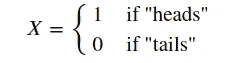

# 伯努利随机变量

随机变量可以是离散的，也可以是连续的。我们将从关注离散 RVs 开始。根据定义，离散变量只能取不同的值，比如上面掷硬币的例子。对于这些变量，你可以计算它可以取多少个不同的值。

我们上面定义的 RV *X* 实际上是一个伯努利 RV。它可以以概率 *p* 取值 1(在公平硬币的情况下， *p* 等于 0.5 或 50%)，以概率 *q = 1-p* 取值 0。其概率质量函数可以定义为:

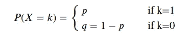

```
import matplotlib.pyplot as plt
import numpy as np
from scipy.stats import bernoulli, binom
import seaborn as sns
```

让我们从定义一个成功概率为 *p=0.3* 的伯努利 RV *X* 开始。

```
p = 0.3
X = bernoulli(p)
```

我们可以打印 0 和 1 的概率质量函数值。

```
print(np.round(X.pmf(1),2))
print(np.round(X.pmf(0), 2))0.3
0.7
```

为了帮助形象化，让我们从变量中抽取 10，000 个样本，根据经验得出相同的值。

```
X_samples = X.rvs(100000)sns.histplot(X_samples, stat="density", discrete=True, shrink=0.2);
```


图 2:RV X 的样本分布

看起来不出所料；我们有 0.3 的成功概率和 0.7 的失败概率。

让我们定义一下 RV 的均值和方差。平均值的计算方法是将每个结果的值与相应概率的乘积相加。方差是每个结果的值与平均值的平方偏差，由各自的概率加权。更正式地说:

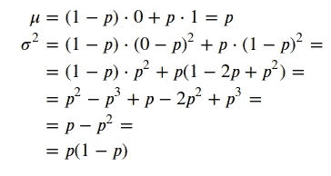

我们可以将经验计算的平均值与我们刚刚得出的理论平均值进行比较。它们确实非常接近，而且随着样本量的增加，它们会变得更接近。

```
print('Empirically calculated mean: {}'.format(X_samples.mean()))
print('Theoretical mean: {}'.format(p))print('Empirically calculated standard deviation: {}'.format(X_samples.std()))
print('Theoretical standard deviation: {}'.format((p*(1-p))**(1/2)))Empirically calculated mean: 0.30059
Theoretical mean: 0.3
Empirically calculated standard deviation: 0.45851461470709964
Theoretical standard deviation: 0.458257569495584
```

# 二项式随机变量

我们可以将二项式 RV 视为一组伯努利实验或试验。这样，我们对分布的性质是如何得到的理解就变得简单多了。

在深入定义之前，让我们先来看看将 RV 定义为二项式需要满足的主要条件:

*   审判是独立的；
*   每次试验都可以分为成功或失败；
*   有固定的试验次数；
*   每次试验成功的概率是恒定的。

让我们将 RV *Z* 定义为 *n* 次试验后的成功次数，其中每次试验的 P(成功)为 *p* 。

我们再定义 *Y* ，一个伯努利 RV，其 *P(Y=1)=p* ， *P(Y=0)=1-p* 。

*Y* 代表组成 *Z* 的每个独立试验。我们已经得到了 Y 的方差和期望值。

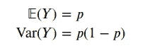

使用下面的性质 E(X+Y)=E(X)+E(Y)，我们可以导出我们的二项式 RV *Z* 的期望值:

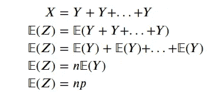

回想一下，我们有 *n* 个独立试验或 *n* RV *Y* 被求和。

在推导 VAR(Y)时，过程是相同的，因为 VAR(X+Y)=VAR(X)+VAR(Y)也成立。然后我们有:

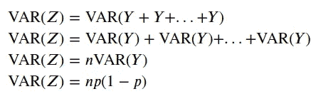

现在让我们用一个实验来测试我们的理论理解。

```
n=6
p = 0.3
Y = bernoulli(p)
```

我们定义了我们的 *Y* 变量。我们可以根据上面定义的这个 *Y* 变量来构造我们的 *X* 变量；这些是伯努利独立试验。让我们假设我们有 6 个独立的试验。

```
Y_samples = [Y.rvs(1000000) for i in range(6)]
Y_samples[array([0, 0, 0, ..., 0, 1, 1]),
 array([1, 0, 1, ..., 0, 0, 0]),
 array([0, 0, 1, ..., 1, 1, 0]),
 array([1, 0, 0, ..., 0, 0, 0]),
 array([0, 0, 0, ..., 0, 1, 0]),
 array([0, 0, 0, ..., 0, 0, 0])]Z_samples = sum(Y_samples)print('Empirically calculated expected value: {}'.format(Z_samples.mean()))
print('Theoretical expected value: {}'.format(n*p))Empirically calculated expected value: 1.800219
Theoretical expected value: 1.7999999999999998print('Empirically calculated variance: {}'.format(Z_samples.var()))
print('Theoretical variance: {}'.format(n*p*(1-p)))Empirically calculated variance: 1.2612705520390002
Theoretical variance: 1.2599999999999998
```

我们对我们的理论推导感觉更好，因为我们的实验表明我们确实在正确的道路上。

我们也可以画出二项式分布。记住这是一个离散分布。

```
sns.histplot(Z_samples, stat="density", discrete=True, shrink=0.3);
```

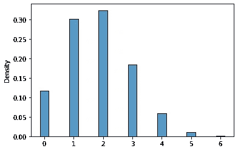

图 3:我们的 RV Z 的抽样分布，它是一个二项式 RV。

# 二项式 PMF 和 CDF

二项式概率质量函数(PMF)可以写成如下形式:

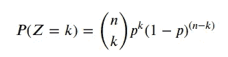

乍一看似乎有点令人生畏；让我们试着把它分解成更小的可解释的部分。

第一项仅仅是二项式系数，或者当顺序无关紧要时，我们可以从 *n* 个可能的项目中选择 *k* 个项目的不同方式的数量，即集合 ABC 与 CBA 相同。

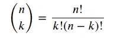

回想一下 *n！/(n-k)！*是排列的数量或不同方式的数量，当顺序重要时，我们可以从 *n* 个可能的项目中选择 *k* 个项目，即 ABC 和 CBA 算作两个不同的结果。 *k！*只是排列 *k* 项的数量方式。例如，在 3 个项目和 3 个位置的情况下，我们有以下可能性:

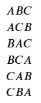

回想一下 3！=3 * 2 *1= 6.

让我们开始构建小函数来处理不同的组件，从计算输入参数的阶乘的函数开始。

```
def fact(n):
    x = 1
    for i in range(1, n+1):
        x *= i
    return x

fact(3)6
```

现在，我们可以在另一个计算二项式系数的函数中使用函数`fact()`。

```
def comb(n, k):
    x = 1
    return fact(n)/(fact(k)*fact(n-k))

comb(6, 3)20.0
```

最后，将所有东西放在一起:

```
def binompmf(prob, n, k):
    return comb(n,k)*prob**k*(1-prob)**(n-k)
```

累积分布函数(CDF)是一个有用的函数，它通常与分布的 PMF 一起出现在统计包中。这只不过是我们的 RV 取值达到 a *z* 的概率:

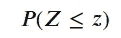

```
def binomcdf(prob, n, x):
    result = 0
    for x_ in range(0, x+1):
        result += binompmf(prob, n, x_)
    return result
```

让我们试一试。


图 4:克里斯蒂亚诺·罗纳尔多的任意球表现可以用二项分布来建模，[来源](https://unsplash.com/photos/lBhhnhndpE0)

我们想要评估模拟克里斯蒂亚诺罗纳尔多任意球得分能力的概率分布。我们将使用下表，其中显示了罗纳尔多在西甲联赛和冠军联赛中的任意球记录:


表 1:罗纳尔多的任意球记录，[来源](https://www.goal.com/en-us/news/cristiano-ronaldos-free-kick-record-penalty-record/1mxtkj4yvogun158pu2cpmpuz9)

c 罗有 0.094 的概率成功转换欧冠任意球。基于此，c 罗欧冠 7 罚 1 中的概率有多大？

```
binompmf(0.094, 7, 1)0.3639109131870316
```

得分小于 2 的概率是多少？

```
binomcdf(0.094, 7, 1)0.8649797389430357
```

# 练习:

你将在下周的文章中找到答案。

1.一家公司生产瓶装水。在其主要工厂，有缺陷的瓶子数量是 5%。质量检查包括随机选择和测试 1000 瓶。这些样品中有缺陷的瓶子数量的平均值和标准偏差是多少？

2.一家葡萄酒公司正在进行促销活动，声称每 4 箱葡萄酒中有 1 箱含有惊喜。假设你会买 5 箱这款酒，让 X 代表你在这些箱子里可以赢得的惊喜数量。假设这些盒子代表随机样本，并假设盒子之间的惊喜是独立的。你在 5 个盒子中最多赢得 1 个惊喜的概率是多少？

你能用三种不同的方法解决这个问题吗？提示:通过抽样，对个体概率求和，并使用 CDF)

3.一位数学老师正在和她的学生一起做一个活动，她给他们一个 20 题的选择题，他们一个答案也不知道。学生需要猜测每个问题，每个问题有 5 个可能的选择，其中一个是正确的。每个学生答对的问题数量的平均值和标准差是多少？

*(你能用两种不同的方法解决这个问题吗？提示:通过采样和使用我们上面做的理论推导)*

保持联系: [LinkedIn](https://www.linkedin.com/in/luisbrasroque/)