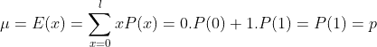
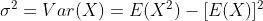

# 从零开始使用 Python 的伯努利分布

> 原文：<https://towardsdatascience.com/bernoulli-distribution-with-python-from-scratch-89fda3c822b?source=collection_archive---------9----------------------->

## 如何为好奇从头编码伯努利分布


克里斯里德在 [Unsplash](https://unsplash.com?utm_source=medium&utm_medium=referral) 上的照片

为了解决一个问题，我们使用了通用的现成库，但是我们并没有去寻找这些函数如何工作以及如何为我们的目的服务。更重要的是，如果我们需要修改一个函数，我们不知道如何去做。

因此，本文的目的是如何以简单的方式编写伯努利概率分布及其一些性质，而不使用像“SciPy”这样的现成库，并从头获得一些基本技能。

伯努利分布是一种离散分布，在执行随机实验时使用，并且只获得两个结果，如好-坏、正-负、成功-失败。那些陈述被用来描述一个事件的概率。伯努利试验是表示一个实验的简单方法，如硬币正面或反面的结果，考试通过或失败的结果等。

# 概率函数

如果 X 是随机变量，p 是具有该分布的事件的概率，则:


伯努利概率质量函数

**Python 代码:**

```
#bernoulli probability mass function:def pmf(x,p):
    f = p**x*(1-p)**(1-x)
    return f
```

# 平均

伯努利随机变量 X 的平均值或期望值 E(x)为:



**Python 代码:**

```
# expected value of x
def mean(p):
    return p
```

# 方差和标准偏差

随机变量 X 的方差为:



**Python 代码:**

```
#variance of x
def var(p):
    return p*(1-p)#standard deviation is root of variance
def std(p):
    return var(p)**(1/2)
```

# 产生随机变量

为了生成对应于伯努利分布的随机变量

**Python 代码**

```
import numpy as np#size is a parameter that how many number generates
def rvs(p,size=1):
    rvs = np.array([])
    for i in range(0,size):
        if np.random.rand() <= p:
            a=1
            rvs = np.append(rvs,a)
        else:
            a=0
            rvs = np.append(rvs,a)
    return rvs
```

让我们把它们放在一起

```
import numpy as np#created a bernoulli class

class bernoulli(): def pmf(x,p):
        """
        probability mass function        
        """
        f = p**x*(1-p)**(1-x)
        return f

    def mean(p):
        """
        expected value of bernoulli random variable
        """
        return p

    def var(p):
        """
        variance of bernoulli random variable
        """
        return p*(1-p)

    def std(p):
        """
        standart deviation of bernoulli random variable
        """
        return bernoulli.var(p)**(1/2)

    def rvs(p,size=1):
        """
        random variates
        """
        rvs = np.array([])
        for i in range(0,size):
            if np.random.rand() <= p:
                a=1
                rvs = np.append(rvs,a)
            else:
                a=0
                rvs = np.append(rvs,a)
        return rvs
```

## 例子

假设一个一级方程式赛车有 0.2 的概率发生事故。因此，如果发生事故，X = 1，否则 X = 0。求 X 的期望值、方差和标准差，并产生 10 次随机变量。

```
p=0.2 # probability of having an accidentbernoulli.mean(p) # return -> 0.2
bernoulli.var(p) # return -> 0.16
bernoulli.std(p) # return -> 0.4#each execution generates random numbers, so array may be change
bernoulli.rvs(p,size=10) 
#return-> array([0., 0., 0., 0., 1., 0., 1., 0., 0., 1.])
```

希望这篇文章有用，给你一个不一样的视角。

# 参考资料:

伯努利分布[https://www.wikiwand.com/en/Bernoulli_distribution](https://www.wikiwand.com/en/Bernoulli_distribution)

概率分布[https://www.wikiwand.com/en/Probability_distribution](https://www.wikiwand.com/en/Probability_distribution)