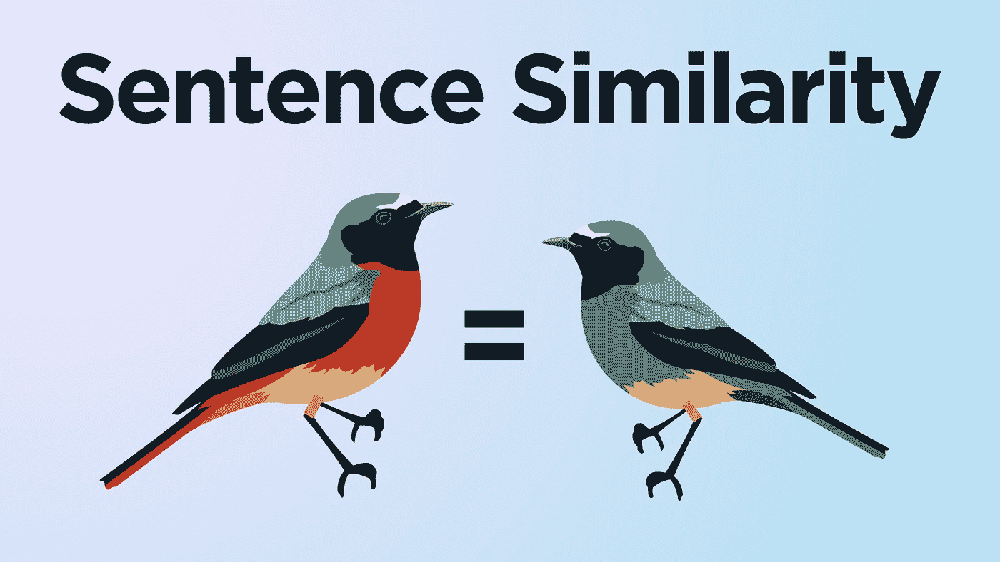
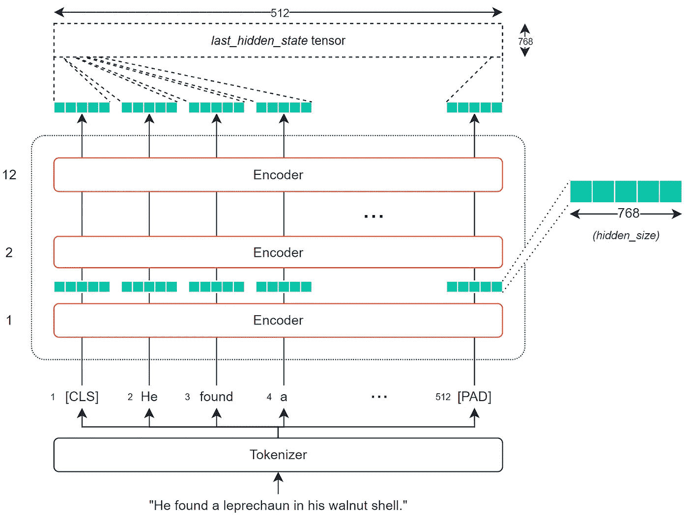

# 用于测量文本相似性的伯特

> 原文：<https://towardsdatascience.com/bert-for-measuring-text-similarity-eec91c6bf9e1?source=collection_archive---------1----------------------->

## 高性能的 BERT 语义相似度

作者形象

A 我们今天似乎要谈论的是 BERT 这个，BERT 那个。我想写点别的东西，但是伯特太*太*好了——所以这篇文章将是关于伯特*和*序列相似性的！

自然语言处理的很大一部分依赖于高维空间中的相似性。通常，NLP 解决方案会获取一些文本，对其进行处理以创建一个表示所述文本的大向量/数组，然后执行几个转换。

这是高度立体的魔法。

句子相似性是高度维度魔法有多强大的最明显的例子之一。

逻辑是这样的:

*   取一个句子，把它转换成一个向量。
*   取许多其他句子，并把它们转换成向量。
*   找到它们之间具有最小距离(欧几里德)或最小角度(余弦相似度)的句子——更多信息请参见这里的。
*   我们现在有了一个衡量句子之间语义相似度的方法——简单！

从更高的层面来说，它没有太多其他的东西。当然，我们想更详细地了解正在发生的事情，并在 Python 中实现它！让我们开始吧。

# BERT 为什么会帮忙

正如我们已经提到的，伯特是自然语言处理的最有价值球员。这在很大程度上归功于贝尔特将单词的意思嵌入到密集的向量中的能力。

我们称它们为*密集*向量，因为向量中的每个值都有一个值，并且有成为该值的原因——这与*稀疏*向量形成对比，例如单热编码向量，其中大多数值为 **0** 。

BERT 在创建这些密集向量方面非常出色，每个编码器层(有几个)都会输出一组密集向量。

BERT 基础网络-隐藏层表示以绿色突出显示。

对于 BERT 基，这将是一个包含 768 的向量。这 768 个值包含我们对单个标记的数字表示，我们可以将其用作上下文单词嵌入。

因为这些向量中有一个用于表示每个令牌(由每个编码器输出)，所以我们实际上看到的是大小为 768 的张量乘以*令牌的数量*。

我们可以得到这些张量，并对它们进行变换，以创建输入序列的语义表示。然后，我们可以采用我们的相似性度量，计算不同序列之间的相似性。

最简单和最常用的提取张量是 *last_hidden_state* 张量，它由 BERT 模型方便地输出。

当然，这是一个相当大的张量——在 512x768 处——我们想要一个向量来应用我们的相似性度量。

为此，我们需要将 *last_hidden_states* 张量转换为 768 维的向量。

## 创建矢量

为了将我们的 *last_hidden_states* 张量转换成我们的向量，我们使用了一个**均值池**运算。

这 512 个标记中的每一个都有各自的 768 个值。这种汇集操作将取所有标记嵌入的平均值，并将它们压缩到单个 768 向量空间中，从而创建一个“句子向量”。

同时，我们也不能只把平均激活当做一回事。我们需要考虑空填充标记(我们不应该包括它)。

# 用代码

这在过程背后的理论和逻辑上是很棒的——但是我们如何在现实中应用它呢？

我们将概述两种方法——简单的方法和稍微复杂一点的方法。

## 简单句子变形金刚

对我们来说，实现我们刚刚讨论的所有内容的最简单的方法是通过`sentence-transformers`库——它将这个过程的大部分封装到几行代码中。

首先，我们使用`pip install sentence-transformers`安装句子转换器。这个库在幕后使用了 HuggingFace 的*变形金刚*——所以我们实际上可以在这里找到*句子——变形金刚*模型[。](https://huggingface.co/sentence-transformers)

我们将利用`[bert-base-nli-mean-tokens](https://huggingface.co/sentence-transformers/bert-base-nli-mean-tokens)`模型——它实现了我们到目前为止讨论过的相同逻辑。

*(它也使用 128 个输入令牌，而不是 512 个)。*

让我们创建一些句子，初始化我们的模型，并对句子进行编码:

很好，我们现在有四个句子嵌入—每个包含 768 个值。

现在我们要做的是找出这些嵌入，并找出它们之间的余弦相似性。所以对于第 0 句:

> 三年后，棺材里仍然装满了果冻。

我们可以用下面的句子找到最相似的句子:

现在，这是一个更简单——更抽象的方法。七行代码来比较我们的句子。

## 参与—变形金刚和 PyTorch

在进入第二种方法之前，值得注意的是它和第一种方法做同样的事情——但是低了一个层次。

使用这种方法，我们需要执行到 *last_hidden_state* 的转换来创建句子嵌入。为此，我们执行平均池操作。

此外，在平均池操作之前，我们需要创建 *last_hidden_state* ，我们这样做:

在我们生成密集向量`embeddings`之后，我们需要执行一个*平均池*操作来创建一个单一的向量编码(嵌入的**句子)。**

为了进行这种平均池操作，我们需要将我们的`embeddings`张量中的每个值乘以其各自的`attention_mask`值——这样我们就可以忽略非实数标记。

一旦我们有了密集向量，我们就可以计算每个向量之间的余弦相似性，这与我们之前使用的逻辑相同:

我们返回几乎相同的结果——唯一的区别是索引**三**的余弦相似性已经从`0.5547`变为`0.5548` —由于四舍五入的原因，这是一个微小的差异。

以上是关于使用 BERT 测量句子语义相似性的介绍——同时使用了*句子转换器*和一个带有 *PyTorch* 和*转换器*的底层实现。

您可以在此处和[处](https://github.com/jamescalam/transformers/blob/main/course/similarity/03_calculating_similarity.ipynb)找到两种方法的完整笔记本。

我希望你喜欢这篇文章。如果您有任何问题或建议，请通过推特[或在下面的评论中告诉我。如果你对更多类似的内容感兴趣，我也会在 YouTube 上发布。](https://twitter.com/jamescalam)

感谢阅读！

# 参考

名词（noun 的缩写）Reimers，I. Gurevych，[句子-伯特:使用连体伯特网络的句子嵌入](https://arxiv.org/abs/1908.10084) (2019)，2019 年自然语言处理实证方法会议录

[🤖带变压器的 NLP 课程](https://bit.ly/nlp-transformers)

如果您有兴趣了解关于 NLP 相似性度量的更多信息(包括我们在这里使用的余弦相似性)，请查看我写的这篇解释最流行的度量的文章:

</similarity-metrics-in-nlp-acc0777e234c>  

**所有图片均由作者提供，除非另有说明*