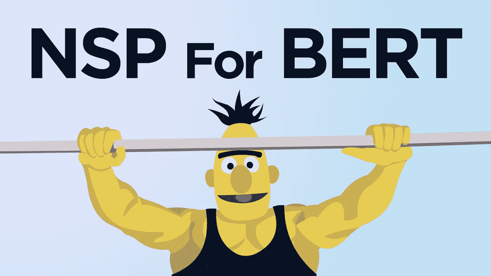

# 用于下一句预测的 BERT

> 原文：<https://towardsdatascience.com/bert-for-next-sentence-prediction-466b67f8226f?source=collection_archive---------9----------------------->

## 另一半用来训练伯特

胸部+三与伯特-图片由作者(抱歉)

NNext 句子预测(NSP)是 BERT 模型(另一个是掩蔽语言建模——MLM)背后的训练过程的一半。

MLM 教伯特理解单词之间的关系，NSP 教伯特理解句子之间的长期依存关系。

没有 NSP，伯特在每一个指标上都表现得更差——所以这很重要。

现在，当我们使用预训练的伯特模型时，与 NSP 和 MLM 的训练已经完成，那么我们为什么需要了解它呢？

嗯，我们实际上可以微调这些预训练的 BERT 模型，以便它们更好地理解我们特定用例中使用的语言。为此，我们可以利用 MLM 和 NSP。

因此，在本文中，我们将深入探讨什么是 NSP，它是如何工作的，以及我们如何用代码实现它。

# 下一句预测

NSP 给伯特两个句子，句子 A 和句子 B。然后我们说，“嗨，伯特，句子 B 是在句子 A 后面吗？”——伯特说要么是`IsNextSentence`要么是`NotNextSentence`。

假设我们有三个句子:

1.  找到神奇的绿色球体后，戴夫回家了。
2.  3.6 百万年前，坦桑尼亚北部拉托里的火山灰上留下了类似人类的脚印。
3.  回到家，戴夫吃完剩下的披萨，在沙发上睡着了。

如果我问你是否相信(逻辑上)那句 ***2*** 跟在句 ***1*** 后面——你会说是吗？大概不会。

句子 ***3*** 下面的句子 ***1*** 怎么样？似乎更有可能。

伯特从 NSP 那里学到的正是这种逻辑风格——句子之间的长期依存关系。

# 代码中的 NSP

让我们看看如何用代码演示 NSP。

我们将使用拥抱脸的变形金刚和 PyTorch，以及`bert-base-uncased`模型。因此，让我们首先导入并初始化所有内容:

注意，我们有两个单独的字符串——句子 A 的`text`和句子 b 的`text2`。将它们分开可以让我们的分词器正确地处理它们，我们稍后会解释这一点。

我们现在需要采取三个步骤:

1.  标记化
2.  创建分类标签
3.  计算损失

先说标记化。

1。 **标记化** —我们使用初始化的`tokenizer`来执行标记化，同时传递`text`和`text2`。

对于 NSP，有几件事我们应该知道。首先，我们的两个句子被合并到同一个张量集中——但是伯特有办法识别出它们实际上是两个独立的句子。

*   两句之间加一个*【SEP】*记号。这个分隔符由上面的 *input_ids* 张量中的 *102* 表示。
*   *token_type_ids* 张量包含段 id，用于识别各个令牌属于哪个段。A 句用 *0* 表示，B 句用 *1* 表示。

2。 **创建类标签**——下一步很简单，我们在这里需要做的就是创建一个新的*标签*张量来标识句子 B 是否跟在句子 a 后面

我们用一个值 *0* 来表示`IsNextSentence`，用 *1* 来表示`NotNextSentence`。另外，我们必须使用`torch.LongTensor`格式。

3。最后，我们开始计算我们的损失。我们从通过我们的模型处理我们的`inputs`和`labels`开始。

我们的模型将返回*损失*张量，这是我们将在训练期间优化的内容——我们很快将继续进行。

## 预言；预测；预告

我们可能也不需要训练我们的模型，而只是想使用模型进行推理。在这种情况下，我们将没有*标签*张量，我们将修改代码的最后一部分来提取 *logits* 张量，如下所示:

我们的模型将返回一个 *logits* 张量，它包含两个值——索引 *0* 中的`IsNextSentence`类的激活，以及索引 *1* 中的`NotNextSentence`类的激活。

从这里开始，我们所做的就是使用输出*逻辑*的 *argmax* 来返回我们模型的预测。在这种情况下，它返回 *0* —这意味着 BERT 相信句子 B **跟随句子 A(正确)。**

这就是伯特的这篇关于 NSP 基本面的文章。我们已经介绍了 NSP 是什么，它是如何工作的，以及我们如何使用 NSP 提取损失和/或预测。

我希望你喜欢这篇文章！如果你有任何问题，请通过 [Twitter](https://twitter.com/jamescalam) 或在下面的评论中告诉我。如果你想要更多这样的内容，我也会在 [YouTube](https://www.youtube.com/c/jamesbriggs) 上发布。

感谢阅读！

# 参考

[1] J .德夫林等人。艾尔。， [BERT:语言理解深度双向转换器预训练](https://arxiv.org/pdf/1810.04805.pdf) (2019)，NAACL

[🤖带变压器的 NLP 课程](https://www.udemy.com/course/nlp-with-transformers/?couponCode=MEDIUM)

如果你有兴趣了解更多关于使用 NSP 的另一半——MLM 来微调伯特的知识，请阅读这篇文章:

</masked-language-modelling-with-bert-7d49793e5d2c> [## 用 BERT 进行掩蔽语言建模

towardsdatascience.com](/masked-language-modelling-with-bert-7d49793e5d2c) 

**除另有说明外，所有图片均出自作者之手*