# 贝塔斯曼 Arvato 金融解决方案客户细分

> 原文：<https://towardsdatascience.com/bertelsman-arvato-financial-solution-customer-segmentation-c8528d5ac77a?source=collection_archive---------32----------------------->


[由 vectorjuice / Freepik 设计的照片](https://www.freepik.com/free-vector/audience-segmentation-abstract-concept-illustration_11667653.htm#page=1&query=segmentation&position=0)

如今，随着大数据成为现实，人们开始关注如何利用数据实现商业价值。更成熟的一个领域是如何描绘潜在客户或预测客户的行为，以更精确地瞄准市场或客户。

## 问题陈述

贝塔斯曼 Arvato 金融解决方案在 Udacity 提供了一个现实世界的挑战。Arvato 提供了四个人口统计数据集。它们是:

1.  德国一般人口的人口统计数据；891 211 人(行)x 366 特征(列)，命名为 azdias。
2.  邮购公司客户的人口统计数据；191，652 人(行)x 369 个特征(列)，命名为客户。
3.  作为营销活动目标的个人的人口统计数据；42 982 人(行)x 367(列)的响应，将其命名为 mailout_train。
4.  作为营销活动目标的个人的人口统计数据；42 833 人(行)x 366(列)，没有响应，命名为 mailout_test。

有了这些数据，

1.  你能进行客户细分，找出最能描述公司核心客户群的人群吗？有了这个，营销才能精准定位客户，提高客户转化率，降低成本。
2.  你能开发一个模型来预测哪些人会对某个活动做出反应吗？可以提高广告转化率，降低活动成本。

## 韵律学

考虑到问题的特征，提供了两种类型的解决方案:

对于问题 1，因为它没有标签，所以使用无监督的机器学习。这是一个高维数据集。首先使用 PCA(主成分分析 **)** 进行降维，然后使用肘形法为 KMeans 选择最佳的 K 个聚类对客户进行聚类，最后结合原始数据进行分析。

对于问题 2，因为在训练集中有一个标签，所以目标是预测测试数据集。这里采用有监督的机器学习。由于训练数据集中存在明显的类别不平衡，42962 个客户中有 532 个响应，只有%1 个正值。

应该选择哪个矩阵来评估模型？让我们来看看混淆矩阵。

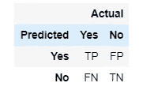

图 1:混淆矩阵

因为有一个很大的输出类不平衡，其中大多数个人没有回应邮寄。因此，预测单个类并使用准确性似乎不是一种合适的性能评估方法。相反，该项目将使用 AUC 来评估性能。AUC 是 ROC(受试者操作特征)曲线下的面积。该曲线绘制了不同阈值设置下的真阳性率(TPR)与假阳性率(FPR)的关系。

一些定义供您参考:

敏感性= TP/(TP+FN)
特异性=TN/(FP+TN)

TPR=敏感性= TP/(TP+FN)
FPR = 1-特异性= FP/(FP+TN)

(TP、TN、FP、FN:请参考图 1 混淆矩阵)

## **1。** EDA 和数据清理

对于这样一个超过 300 个特征的大文件，检查一列或一行中的数据是非常困难的。数据探索将有助于我们理解它和清理它。

图 3 以列的方式显示了一般人群的空值百分比。50%空值百分比为 0.12。

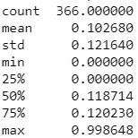

图 2:按列显示的总体空值百分比说明

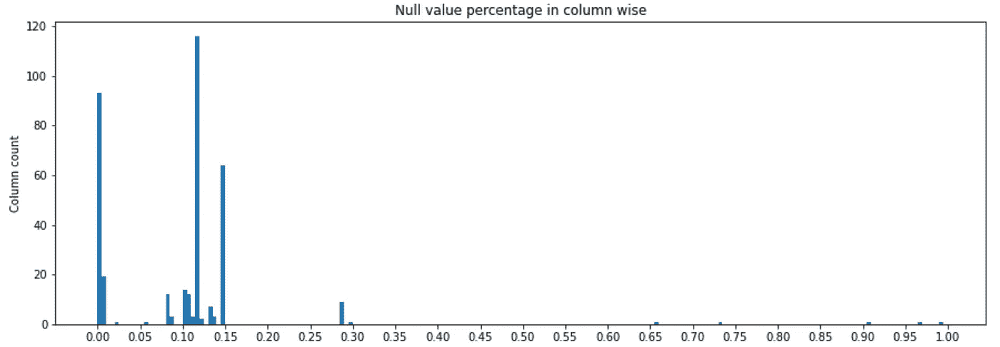

图 3:按列排列的总体空值百分比

图 5 以列的方式显示了一般人群的空值百分比。50%空值百分比为 0.27。

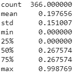

图 4:客户在列中的空值百分比

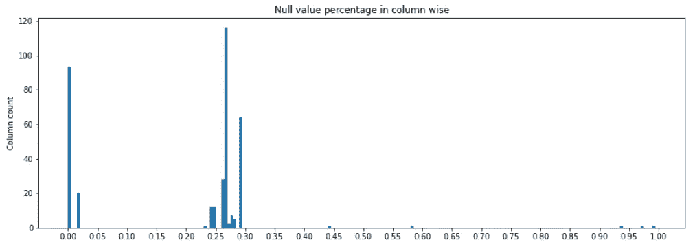

图 5:按列排列的客户空值百分比

经过调查，除了附加列之外，这四个数据集具有几乎相同的特征。以下数据清理过程是针对四个数据集开发的。

数据清理过程总结如下:

1.  把未知数据改成 Nan。未知有不同的来源，如数字数据-1，0 或字符串 X 或 XX。
2.  删除有大量缺失值的列。阈值设置为 90%，这意味着如果空值的百分比超过 90%，该列将被删除。
3.  删除不必要的列，例如，CMEO-DEU-2015 是 CMEO-德乌格-2015 的详细信息，可以用 CMEO-德乌格-201 表示，这些列将被删除。D19 _ LETZTER _ KAUF _ BRANCHE 是其他列信息的汇总，将被删除。
4.  分类数据的编码。这只是去 KZ 西部的。
5.  从数据时间数据中提取信息。仅从 EINGEFUEGT_AM 提取年份信息。
6.  用大多数频率数据替换空值。

## 2.客户聚类

从第一步开始，已经选择了 358 个特征。现在 PCA(主成分分析)来分解特征。提取主要特征后，将使用 KMeans 对数据进行聚类。

对于 PCA 加 KMeans，有两个重要的参数需要确定:PCA 成分的数量和 KMeans 的核。

选择 PCA 和 KMeans 的参数

**PCA**

屏幕下方的图显示了组件 358 和 15。

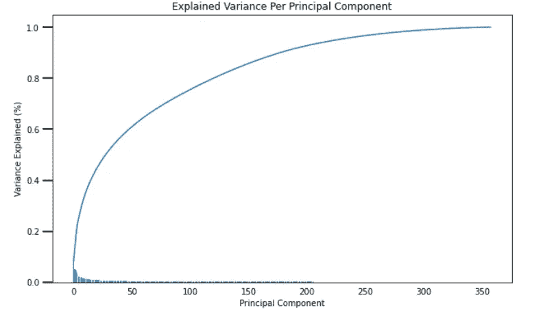

图 6:n _ components = 358 的 PCA 屏幕图

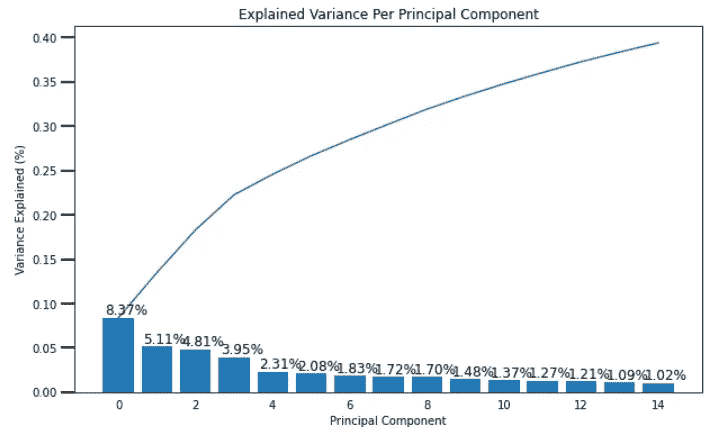

图 7:n _ component = 15 的 PCA 屏幕图

从图 6，我们可以看到，200 个组件将涵盖 90%的方差，这应该是一个很好的选择，理论上。但是，实际上，运行单个笔记本电脑，PCA 200 组件需要 6 分 56 秒，然后用 combine with KMeans 运行一个多小时仍然得不到结果。考虑到输入/输出平衡，从图 7 也可以看出，在元件 15 之后，其余元件的方差小于 1%，所以我决定选择 n_componenets 作为 15。

**k 表示**

下面是根据肘法绘制的图。从下面的图片 8，我不能很清楚地看到肘点，妥协的现实，这可以帮助分析和数据列，我选择的质心和集群的数量为 10。

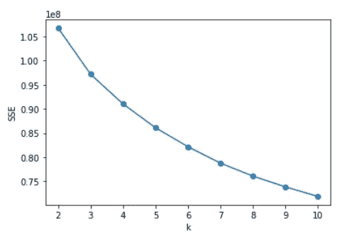

图 8:k 均值与 SSE(误差平方和)

现在选择的参数是:n_component=15，n_cluster=10。

使用拟合的模型来预测客户数据。现在我们得到了集群和客户的总体数据的概述。

**聚类分割分析**

现在回到主成分 0，其累积方差解释为 8.37%，如下图 7 所示。

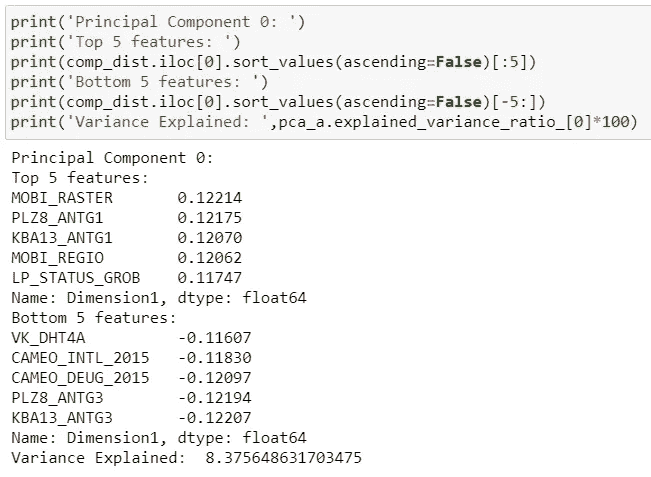

图 9:前 5 名和后 5 名组件

如图 9 所示，这 10 大特征来自不同的预测。有了这些，我们就可以分析出特征清晰的集群。

1.  **普通人群与客户的聚类比较:**

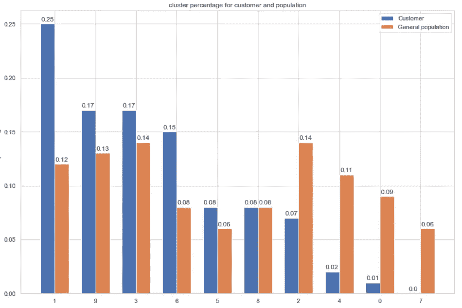

图 10:聚类与人口类型

从图 10 中，我们可以看到，与一般人群相比，集群 1、9、3 和 6 在百分比方面有显著变化(增加)，这表明这些集群的人群有更高的潜力成为客户。

**2。具有顶级特性的集群**

现在，我们检查一般人群和客户之间差异最大的分类 1。

比较 Cluster1 中组件 0 的前 5 个和后 5 个变量的 Customer 和一般人群的平均值。由于 CAMEO_INTL_2015 的平均值具有非常不同的范围，因此会单独显示。

其他顶部 5 和底部 4 特征的差异如下图 11 所示:

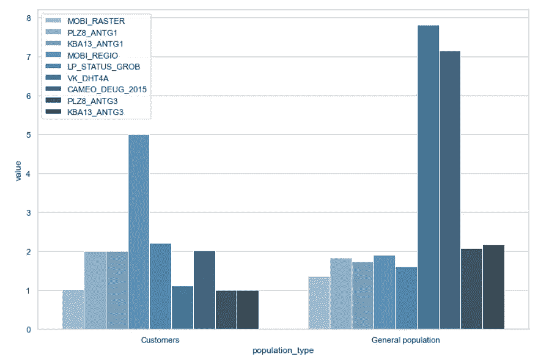

图 11:组件 0 的顶部 5 和底部 4 特征

CAMEL_INTL_2015 的平均值为 Pics12:

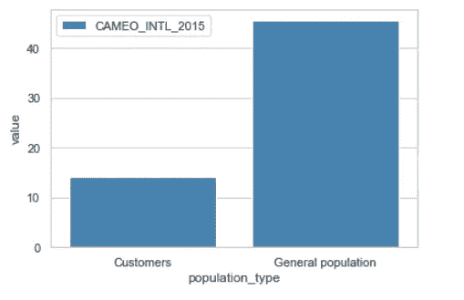

图片 12: CAMEO_INTL_2015

组件 0 的前 5 名和后 5 名功能已在之前发布。现在我想按绝对权重对它们进行排序。

1.  MOBI 栅格法:客户的平均值为 1.02，而普通人群的平均值为 1.35。此项在提供的属性文件中找不到解释。但 MOBI 是一种移动类别，1 左右的 MOBI 栅格具有更高的潜力。
2.  KBA13_ANTG3: 1.00 vs 2.2，对应客户 vs 一般人群。没有对应的属性，但是我们可以发现 KBA13 显示了汽车共享的水平。
3.  PLZ8_ANTG3: 1.00vs 2.09，对应客户 vs 一般人群。它显示了 PLZ8 中 6-10 户家庭住宅的数量。
4.  PLZ8_ANTG1:来自客户的平均值为 2.00，来自一般人群的平均值为 1.82。它显示了 PLZ8 中 1-2 户家庭住宅的数量。
5.  CAMEO_DEUG_2015: 2.02 vs 7.14。2 代表中上阶层，7 代表中下阶层。
6.  KBA13_ANTG1: 2.00 vs 1.74，对应客户 vs 一般人群。没有对应的属性，但是我们可以发现 KBA13 显示了汽车共享的水平。
7.  MOBI_REGIO: 4.99 对 1.91，对应客户对一般人群。这是一种移动模式，表明 4.99 附近的价值比 1.91 更有潜力。
8.  CAMEO_INTL_2015: 14.13 vs 45.49。14 表示 2 个富裕家庭——老年家庭和成熟夫妇，45 表示不太富裕的家庭——退休老人。
9.  LP_STATUS_GROB: 2.21 vs 1.62，对应客户 vs 一般人群。是社会地位，表明 2.2 左右的地位，比 1.62 有更高的潜力。
10.  VK_DHT4A: 1.11 vs 7.81。属性表中不存在 t。

所以，目标人群的图片是 MOBI_RASTER 在 1 左右，KBA13_ANTG3 在 1.0 左右，PLZ8_ANTG3 在 1.0 左右，PLZ8_ANTG1 在 2 左右(中上阶层)，KBA13_ANTG1 在 2 左右，MOBI_REGIO 在 5 左右，CAMEO_INTL_2015 在 14 左右(富裕家庭-年长家庭&成熟夫妻)，LP_STATUS_GROB 社会地位在 2.21 左右，VK_DHT4A 在 1 左右。

## 3.客户标签

这一部分是开发一个模型来预测哪些人会对一个活动作出反应。使用监督学习。

**集合模型**

三个估计器:RandomForestClassifier((n_estimators=1000)、xgb classifier((n _ estimators = 1000)和 LGBMClassifier(learning _ rate = 0.001，n _ estimators = 1000，lambda_l2 = 0.1)是整体。

ROC 曲线如下图 13，14，15:

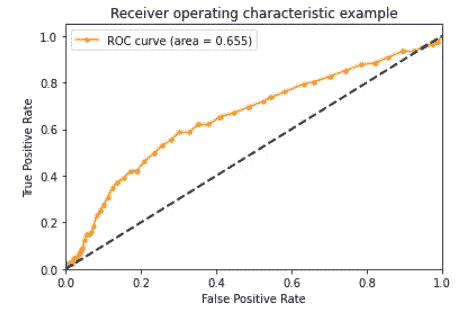

图 13: RandomForestClassifier

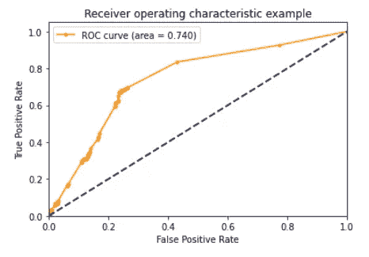

图 14: XGBClassifier

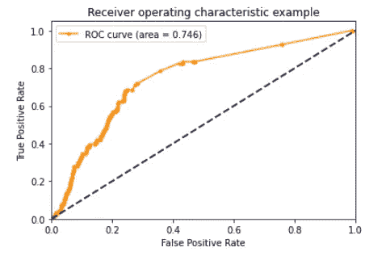

图 15: LGBMClassifier

三个评估者的分数和墙时间如下:

```
the roc_auc_score of RandomForestClassifier is 0.66, Wall time: 2min 46s
the roc_auc_score of XGBClassifier  is 0.74, Wall time: 3min 58s
the roc_auc_score of LGBMClassifier  is 0.75, Wall time: 49.9 s
```

根据分数，我选择 **LGBMClassifier** 作为进一步模型调整的估计器。

**模式调谐**

以 LGBMClassifier 为估计量，用 Gridsearch 进行 5 分裂 StratifiedKFold 交叉验证，学习率为 0.01 和 0.001，n_estimator 为 500，1000 和 2000，这里用来寻找最佳估计量。

最好的分数如下:

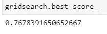

图 16:最佳成绩

最佳估计值是:

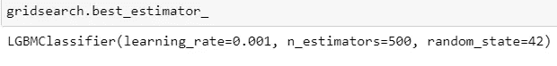

图 17:最佳估计值

gridsearch 结果如下:

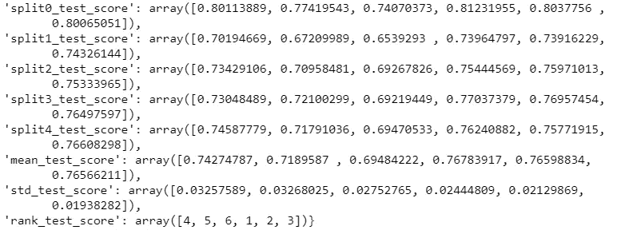

图 18:分割分数

用最佳估计量预测测试数据集的正概率，得到 Kaggle 评分为 0.79976。

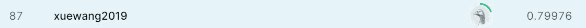

图 19: Kaggle 分数

**总结:**

我在这个项目中完成的工作总结如下:

1.  探索人口统计数据:德国的一般人口，邮购公司的客户，以及市场活动训练和测试数据集。
2.  清理数据集并选择要素。
3.  使用 PCA 和 KMeans 对人群进行聚类。
4.  分析高潜力聚类的前 10 个特征，以获得目标人群的相对清晰的图像
5.  集成模型以选择最佳性能估计器，然后通过 Gridsearch 交叉验证调整模型。

**可能的进一步测试和改进:**

这是一种迭代过程。在这个过程中，我了解并发现了新的问题，并不时地重复这些过程。仍有可以进一步改进的地方:

1.  优化特征选择过程，例如，部署统计技术来选择特征，检查异常值，测试删除值的不同阈值(目前使用 0.9 的列方式)
2.  部署 PCA 流程可用于监督模式
3.  如果重新采样，性能会如何变化

部分代码可以在[这里](https://github.com/XueWang2019/Arvato_customer_segmentation)找到。

感谢 Arvato 和 Udacity 提供如此有趣的项目，也感谢您抽出时间阅读。