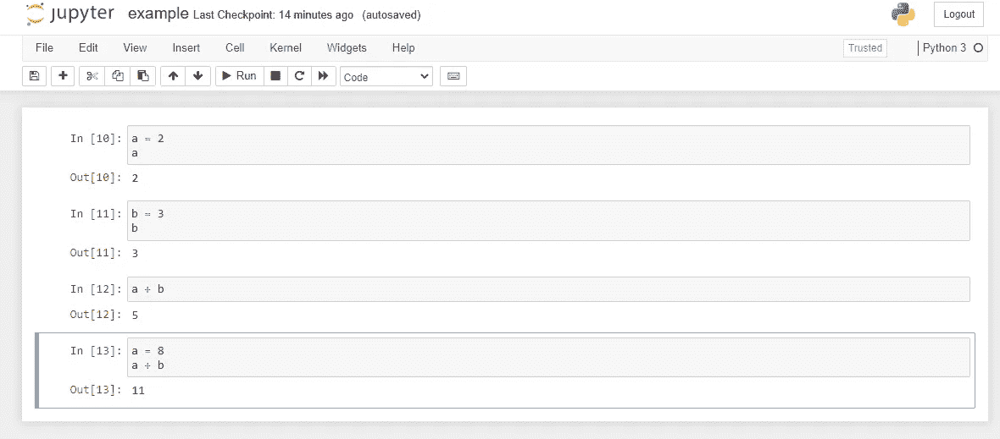

# 2021 年学术界最佳数据科学工具

> 原文：<https://towardsdatascience.com/best-data-science-tools-for-academia-in-2021-587d94b3541c?source=collection_archive---------31----------------------->

## 学术界数据科学家的三大工具

[活动发起人](https://unsplash.com/@campaign_creators?utm_source=medium&utm_medium=referral)在 [Unsplash](https://unsplash.com?utm_source=medium&utm_medium=referral) 上的照片

数据科学领域的发展速度与其他领域不同。机器学习在不断发展，像 [PyTorch](https://medium.com/u/ee766b3488b5?source=post_page-----587d94b3541c--------------------------------) 和 [TensorFlow](https://medium.com/u/b1d410cb9700?source=post_page-----587d94b3541c--------------------------------) 这样的库也在不断改进。像 Open AI 和 Deep Mind 这样的研究公司不断推进机器学习可以做的事情的边界(即: [DALL。E](/dall-e-explained-in-under-5-minutes-327aea4813dd) 和[夹住](https://openai.com/blog/clip/)。基本上，成为数据科学家所需的技能保持不变，即统计学、Python/R 编程、数据库、PyTorch/TensorFlow 和数据可视化。然而，数据科学家使用的工具总是在变化或更新。

我是学术界的一名研究员，我注意到学术界在实施行业中可用的最新工具方面落后。因此，本文将介绍 2021 年学术数据科学家的最佳工具。此外，这可能对数据科学领域的初学者或希望在工作场所实现一些数据科学技术的非程序员最有用。

## 1.来自谷歌云平台的 AutoML

机器学习即服务(MLaaS)在云上训练模型的选项有很多，比如亚马逊 SageMaker、微软 Azure ML Studio、IBM Watson ML Model Builder 和谷歌 Cloud AutoML。

就这些 MLaaS 供应商中的每一个所提供的服务而言，事情在不断变化。几年前，微软 Azure 可能是最好的，因为它提供异常检测、推荐和排名等服务，而当时亚马逊、谷歌和 IBM 都不提供这些服务。但是现在情况变了。找出哪个是最好的 MLaaS 提供商可能需要一篇完全不同的文章，但是，在 2021 年，很容易根据用户界面和用户体验选择一个最喜欢的。

目前，我正在开发一个用于算法交易的机器人，虽然一开始，我是在亚马逊网络服务(AWS)上工作的，但我发现了一些障碍，这让我尝试了一下谷歌云平台(GCP)。我过去用过 GCP 和 AWS，我倾向于使用任何在价格和易用性方面最方便的系统。

在使用 GCP 之后，推荐它的主要原因是他们在用户界面上做的工作，使它尽可能的直观。你可以在没有教程的情况下直接跳到上面，这样事情就变得有意义了，而且实现起来花费的时间也更少。因此，来自 GCP 的 AutoML 是 2021 年值得关注的事情。

贝娄，找一个 GCP 的视频解释 AutoML 是如何工作的:

## 2.IDEs: Jupyter 笔记本/ PyCharm / Visual Studio 代码

使用正确的 IDE 来开发您的项目绝对是需要考虑的事情。尽管这些工具在程序员和业余爱好者中是众所周知的，但是仍然有许多非专业程序员可以从这个建议中受益。举个例子，我发现学术界很大一部分在 Jupyter 笔记本的实现上落后了。事实上，学术界的研究项目是实施笔记本电脑以优化知识转移管理的最佳方案。

图片作者:Jupyter Notebook

如果需要更多关于 Jupyter 笔记本的信息，我会在这里留下几个链接和[这里](/beginners-guide-to-jupyter-notebook-8bb85b85085)，链接到更深入讨论 Jupyter 的其他文章。

像 PyCharm 和 Visual Studio 代码这样的工具几乎是 Python 开发的标准。PyCharm 是我的首选，也是最流行的 Python IDEs 之一。它兼容 Linux、macOS 和 Windows。它附带了大量的模块、包和工具来增强 python 开发体验。而且它有很棒的智能编码特性。

## 3.蟒蛇

Anaconda 是实现虚拟环境的一个很好的解决方案，它非常适合复制别人的代码。作为一名数据科学家，我总是试图创建一个 requirement.txt 文件，其中包含我的代码中使用的所有包。同时，当我要实现别人的代码时，我喜欢从头开始。用 Anaconda 启动一个虚拟环境并从 requirement 文件夹安装所有必需的包只需要两行代码。如果这样做之后，我不能实现我试图实现的代码，那么这是别人的错误。

在我开始使用 Anaconda 之前，我曾多次在尝试使用由特定版本的包(如 NumPy 和 pandas)开发的脚本时遇到各种各样的问题。例如，最近我发现了 NumPy 的一个 bug，而 NumPy 支持团队的解决方案正在退化到以前的 NumPy 版本(临时解决方案)。现在假设您想使用我的代码，而不安装我使用的 NumPy 的确切版本。我就是不工作。这就是为什么在测试别人的代码时，我总是使用 Anaconda。

在链接到[这里](/pipenv-vs-conda-for-data-scientists-b9a372faf9d9)、[的文章中，sou Maya mauthor](https://medium.com/u/5f1a6210aee1?source=post_page-----587d94b3541c--------------------------------)博士比较了 Anaconda 和 pipenv 创建 Python 虚拟环境的能力。正如在那篇文章中可以看到的，实现 Anaconda 有一个明显的优势(只是以防万一，您不确定这是不是最好的选择)。

## 结束语

总的来说，本文推荐实现像 Anaconda 和 Jupyter 这样的工具。虽然这和业内很多专业人士做的没什么区别，但这不是我在学术界发现的(有例外)。因此，我希望这篇文章能帮助学术数据科学家优化他们的工作流程。

来自 Google 云平台的 AutoML 提供了 MLaaS，绝对是值得考虑的，特别是对于小型研究团队，他们有足够的预算来覆盖 AutoML，但可能不足以购买大数据服务器。

感谢您的阅读，感谢您对本文的任何反馈。你可以在我的 [GitHub 页面](https://github.com/manuelsilverio)上看到我在机器学习方面的公开工作，并随时关注我或通过 [LinkedIn](https://www.linkedin.com/in/manuelsilverio/) 联系我。