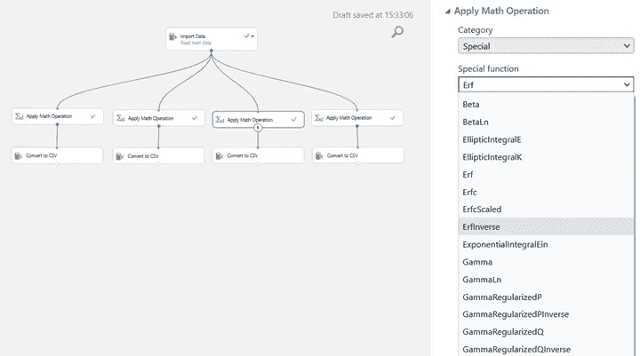
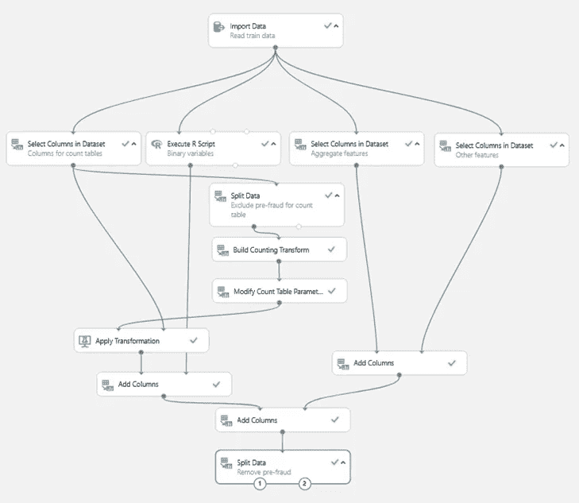

# 每个数据科学家都应该知道的最佳特性工程方法

> 原文：<https://towardsdatascience.com/best-features-engineering-methods-every-data-scientist-should-know-34011df40ee0?source=collection_archive---------27----------------------->

## 高级数据科学家用于快速特征工程的技巧和诀窍


由 [Sabrina Nedjah](https://unsplash.com/@sabrinandjh?utm_source=unsplash&utm_medium=referral&utm_content=creditCopyText) 在 [Unsplash](https://unsplash.com/s/photos/paris-sweet-pastry?utm_source=unsplash&utm_medium=referral&utm_content=creditCopyText) 上拍摄的照片

*文章合著者* ***s*** *作者:* @bonnefoypy 和@ emeric . chaize Olexya 的 CEO 们。

在大多数数据科学项目中，特性工程是探索性数据分析之后的自然步骤。该过程包括设计正确的特征以获得最佳预测。易于使用的特性工程方法包括 **Pycaret 和 Azure studio。**

要成为独角兽数据科学家，掌握最新的特征工程方法是一项必备技能。在本文中，我们将回顾 Kaggle winners 的特性工程方法，这些方法可以简单快速地实现。

1. **Pycaret**

PyCaret 是一个简单易用的顺序管道，包括一个很好的集成预处理功能，包括一步特征工程:

```
**#import libraries**!pip install pycaretfrom pycaret.regression import * **#open the dataset**df =  pd.read_csv('dog_data.csv')df
```


狗数据集**(作者提供**图片)

```
**#define feature engineering pipeline:**from pycaret.regression import *exp = setup(data = df, target = ‘breed’, feature_interaction = True)
```


Pycaret 特征工程操作 **(** 图片由作者提供)

所有预处理步骤都在 setup()中应用。用 20 多种特征工程方法为你的机器学习准备数据集，包括多项式、三角函数、算术运算。与目标相关的最佳特征被自动选择。


Pycaret 算术工程管道的新特性 **(** 图片由作者提供)

Pycaret 算术工程管道的新特性 **(** 图片由作者提供)

模型=设置(df，target = '品种'，多项式 _ 特征=真)

型号[0]


Pycaret 多项式工程管道的新特性 **(** 图片由作者提供)

更多关于 PyCaret 预处理能力的细节请点击这里。


由 [Slashio 摄影](https://unsplash.com/@slashiophotography?utm_source=unsplash&utm_medium=referral&utm_content=creditCopyText)在 [Unsplash](https://unsplash.com/t/food-drink?utm_source=unsplash&utm_medium=referral&utm_content=creditCopyText) 上拍摄

**2。蔚蓝工作室**

微软的这款免费工具(无需注册信用卡)可以通过模块化方法，使用带有完整数据导入选项的个性化数据工程管道，以简单快捷的方式自动创建功能。


Azure Studio 导入数据向导 **(** 图片由作者提供)

以下示例使用此方法从 139067 行 56 列的财务数据集中设计新功能。


Azure studio 功能工程管道(图片由作者提供)

例如，从数字“paymentInstrumentAgeInAccount”数字特征，框架可以在不到一分钟的时间内一步创建 300 多个新特征:


Azure studio 数学运算(图片由作者提供)

拥有 300 多种操作和功能的完整列表:



蔚蓝工作室特别行动 **(** 图片由作者提供)

通过将 R、SQL 和 python 脚本相结合，可以从一系列预配置选项中创建一个更复杂的框架，如下所示:



Azure studio 以使用 R 脚本的工程管道为特色

关于 Azure 预处理能力的更多细节[点击这里](https://docs.microsoft.com/en-us/azure/architecture/data-science-process/create-features)。

**总结一下**

这个简短的概述提醒我们在数据科学中使用工程方法的几个特征的重要性。这篇文章涵盖了快速简单的工程方法，并分享了有用的文档。

# 结论

如果你有空闲时间，我建议你看看这个:

[](/4-tips-for-advanced-feature-engineering-and-preprocessing-ec11575c09ea) [## 高级特征工程和预处理的 4 个技巧

### 创建新要素、检测异常值、处理不平衡数据和估算缺失值的技术。

towardsdatascience.com](/4-tips-for-advanced-feature-engineering-and-preprocessing-ec11575c09ea) [](/exploratory-data-analysis-feature-engineering-and-modelling-using-supermarket-sales-data-part-1-228140f89298) [## 使用超市销售数据进行探索性数据分析、特征工程和建模。第一部分。

### 深入探索数据探索、特征工程和建模的神奇世界。

towardsdatascience.com](/exploratory-data-analysis-feature-engineering-and-modelling-using-supermarket-sales-data-part-1-228140f89298) 

**希望你喜欢，继续探索！**


照片由 [Ozgu Ozden](https://unsplash.com/@ozgut?utm_source=unsplash&utm_medium=referral&utm_content=creditCopyText) 在 [Unsplash](https://unsplash.com/s/photos/macaron-laduree?utm_source=unsplash&utm_medium=referral&utm_content=creditCopyText) 上拍摄