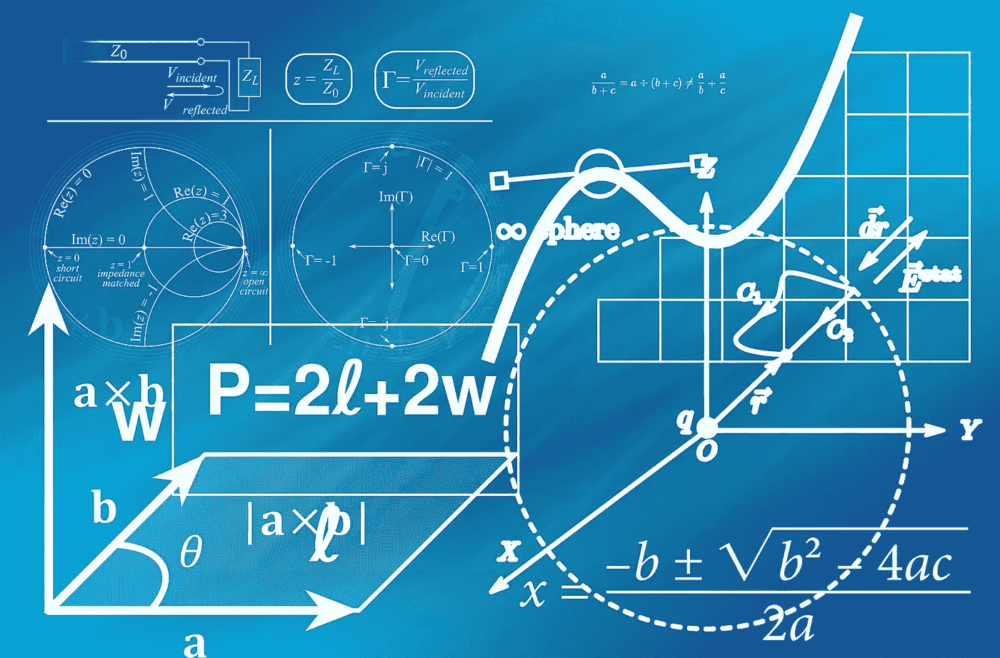
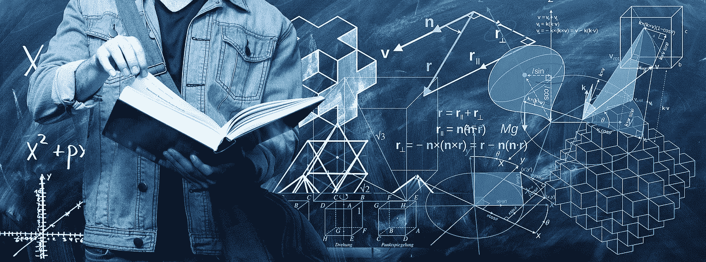

# 为机器学习简化数学的最佳库

> 原文：<https://towardsdatascience.com/best-library-to-simplify-math-for-machine-learning-ed64cbe536ac?source=collection_archive---------14----------------------->

## 使用 sympy Python 库简化用于机器学习的微积分



图片由[皮克斯拜](https://pixabay.com/?utm_source=link-attribution&utm_medium=referral&utm_campaign=image&utm_content=1044090)的 Gerd Altmann 提供

> 没有数学，你什么也做不了。你周围的一切都是数学。你周围的一切都是数字。 **—夏琨塔拉·戴维**

数学是机器学习的一个重要方面。虽然有些人可能绝对崇拜数学，但有些人可能不喜欢它。然而，要成功解决机器学习任务，至少要有一些数学知识，并理解概率、统计和微积分的概念。

在这篇文章中，我们将重点放在微分和积分。这两个概念是学习机器学习概念的重要方面。虽然积分学在你的机器学习之旅开始时可能没有太大用处，但当你对这门学科有了更深入的了解时，它会变得更有意义。

另一方面，微分学和微分在实现机器学习的许多目标中起着至关重要的作用。在通过神经网络或其他类似结构的反向传播中，可以注意到分化的一个最重要的用例。为了验证输出的结果或在训练期间产生有效的结果，微分和反向传播起着至关重要的作用。

在这篇文章中，我们将保持一切简单和容易。我们将学习更多关于 sympy 库的知识，我们将利用它来简化区分和整合。在理解了这个库的基本概念之后，我们将最终构建一个简单的差分计算器。事不宜迟，让我们从探索这些主题开始吧。

# ***什么是 sympy？***



图片由 [Gerd Altmann](https://pixabay.com/users/geralt-9301/?utm_source=link-attribution&utm_medium=referral&utm_campaign=image&utm_content=4126483) 来自 [Pixabay](https://pixabay.com/?utm_source=link-attribution&utm_medium=referral&utm_campaign=image&utm_content=4126483)

我们已经讨论过，积分和微分被认为是理解多种机器学习概念(如反向传播)的先决条件。幸运的是，python 还提供了一个免费的、轻量级的、基于 python 的库，名为 **sympy** 。这是一个符号数学的 python 库。

在您的系统上安装 sympy 库之前，有一些先决条件。其中一个主要要求是，您需要在您的环境中安装 mpmath Python 库。推荐的安装方法是在 Anaconda 环境的帮助下进行，因为大多数先决条件都是在这里安装的。

Anaconda 是来自 Continuum Analytics 的免费 Python 发行版，包括 SymPy、Matplotlib、IPython、NumPy 和许多更有用的科学计算软件包。应该使用以下命令来更新 Sympy 库。

```
conda update sympy
```

对于普通安装，一旦您满足了要求，包括 Python 版本高于 3.5，您就可以用下面的命令安装这个库。

```
pip install sympy
```

在安装了这个库之后，您可以继续用几行代码执行数学演算操作，比如积分和微分。让我们首先用一些具有差异性和集成性的代码块进行实验。在学习了一些基本功能之后，我们将继续构建一个简单的差分计算器。

# 通过 Sympy 轻松实现差异化:

在本文的这一部分，我们将了解一些与 sympy 差异相关的基本功能和操作。首先，我们将导入这个库，然后按照步骤轻松区分一个特定的函数。建议您在 Jupyter 笔记本上并排跟随，以获得每个代码示例的最佳结果。

```
import sympy
```

我们将继续分析 sympy 库的一些基本功能和操作。首先，我们需要为它将携带的符号类型定义一个变量。这里的“x”是我们选择的象征。一旦你设计好了符号，你就可以开始执行微分操作了。在这个例子中，我对下面的函数做了一个简单的计算——5x。您可以随意尝试该库并探索更多内容。

```
x = sympy.Symbol('x')
deriv = sympy.diff(5*(x**2))
deriv
```

## 结果:

> 10𝑥

要了解构建更多独特项目所需的所有差异化规则，我建议查看以下链接[这里](https://www.mathsisfun.com/calculus/derivatives-rules.html)。

# 与 Sympy 轻松集成:

在本文的这一部分，我们将了解与 sympy 集成相关的一些基本功能和操作。首先，我们将导入库，然后按照步骤对几个函数进行集成。要了解构建更多独特项目所需的所有整合规则，我建议查看以下来自[的链接](https://www.mathsisfun.com/calculus/integration-rules.html)。

```
from sympy import *
```

在接下来的几个代码块中，我们将继续执行一些基本的集成操作。这些函数非常简单，不言自明，对集成有基本的了解。

```
x = Symbol('x')
limit(sin(x)/x, x, 0)
```

## 结果:

> 1

```
integrate(1/x, x)
log(x)
```

## 结果:

> log(𝑥)

有了这些关于 sympy 的基本知识，让我们在本文的下一节中继续构建一个简单的差分计算器项目。

# 简单项目:

现在，我们将为一个基本的微分计算器构建一个简单的项目。为了理解构建这个计算器所需的所有微分规则，我建议从[这里](https://www.mathsisfun.com/calculus/derivatives-rules.html)查看以下链接。我将只提供一个小的代码片段类型的差分计算器，我试图建立。你可以使用你自己的创新思想，执行更有效的差分计算器。下面是一个简单的代码块，展示了导数计算器的一些可能的函数。

```
class Derivative_Calculator:
    def power_rule(*args):
        deriv = sympy.diff(*args)
        return deriv
    def sum_rule(*args):
        derive = sympy.diff(*args)
        return deriv
```

我已经利用导数计算器类编写了一系列带有*args 注释的函数，因为我们不知道将通过该函数传递的元素数量。这个概念对于构建差分计算器很有用。我只利用了这些微分法则中的一些。我鼓励用户多尝试这些。下面的文章是理解 Python 中的高级函数的指南，并附有代码和示例。

</understanding-advanced-functions-in-python-with-codes-and-examples-2e68bbb04094>  

在下一个代码块中，我们将允许用户选择一个他们想要执行特定操作的选项。这些选项的选择范围包括不同类型的区分规则。你可以自由地试验并构建一个你喜欢的差分计算器。

```
print("""
Enter The Type of Operation to be Performed: (Choose the number of your choice -)
1\. Power Rule
2\. Sum or Difference Rule
3\. Product Rule 
4\. Chain Rule
""")
Operation = int(input())
Derivative = input("Enter your derivative: ")
```

上面的代码块将产生下面的结果。在这里，我通过选项选择“1”来激活幂规则，并对函数 3x 执行计算。

## 结果:

```
Enter The Type of Operation to be Performed: (Choose the number of your choice -)
1\. Power Rule
2\. Sum or Difference Rule
3\. Product Rule 
4\. Chain Rule

1
Enter your derivative: 3*x**2
```

最后，我将激活下面的代码块，这将使我的类和幂规则函数能够输入正确的答案。

```
differentiatie = Derivative_Calculator
differentiatie.power_rule(Derivative)
```

## 结果:

> 6𝑥

我们可以注意到，提供了微分后的准确答案。虽然这是一个简单的项目，但我鼓励你们所有人把它变得更加复杂和创新！

# 结论:


由 [Alexandru Acea](https://unsplash.com/@alexacea?utm_source=medium&utm_medium=referral) 在 [Unsplash](https://unsplash.com?utm_source=medium&utm_medium=referral) 上拍摄的照片

> 纯数学，就其本身而言，是逻辑思想的诗歌。
> **—阿尔伯特·爱因斯坦**

数学知识对于理解机器学习的复杂细节和成为该领域的专家至关重要。只有对数学有了详细的了解，你才能解释一些关键概念，这是深入特定主题所必需的。大多数机器学习算法需要数学，微积分的学习是机器学习进一步发展的重要因素之一。

在本文中，我们了解了为什么数学对于任何追求机器学习的爱好者来说都是必不可少的。然后，我们继续了解与 sympy 库相关的基本元素，以及如何将它用于微积分。最后，我们构建了一个简单的导数计算器项目，可以对其进行改进以适合您的目的，并用于简化您的实际计算。

你可以从[这里](https://docs.sympy.org/latest/index.html)查看官方文档，了解如何使用这个模块的更多细节。但是，如果您对本文讨论的主题还有任何困惑，请随时告诉我。我会尽可能快地回复你。

看看我的其他一些文章，你可能会喜欢读！

</6-best-programming-practices-f2605c5b469c>  </5-essential-skills-to-develop-as-a-data-scientist-16442f094c09>  </5-nlp-topics-and-projects-you-should-know-about-65bc675337a0>  </ai-in-chess-the-evolution-of-artificial-intelligence-in-chess-engines-a3a9e230ed50>  </7-tips-to-crack-data-science-and-machine-learning-interviews-38b0b0d4a2d3>  

谢谢你们坚持到最后。我希望你们都喜欢这篇文章。祝大家有美好的一天！