# arXiv 精选—2021 年 2 月阅读

> 原文：<https://towardsdatascience.com/best-of-arxiv-january-2021-59863785b729?source=collection_archive---------17----------------------->

## ML 论文每月精选。

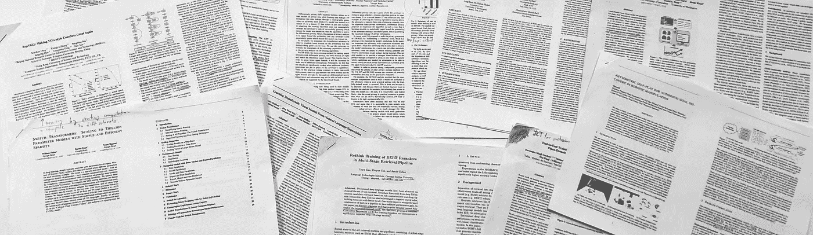

在你的阅读清单上保持领先是很难的，而找到哪些论文应该在阅读清单上更难。在 [Zeta Alpha](https://search.zeta-alpha.com) 我们总是密切关注最新的 ML 研究，所以我们认为每月分享一次最近的论文精选会很有用，以展示我们认为会有影响力的出版物，主要基于每部作品的贡献和作者的声誉。不要把这个列表看得太全面:像其他人一样，我们也有自己的偏见，但是你能从 2000 多篇论文中选择的就这么多了。尽情享受吧！

## 1.[从自然语言监督中学习可转移的视觉模型(OpenAI CLIP)](https://cdn.openai.com/papers/Learning_Transferable_Visual_Models_From_Natural_Language.pdf) | ✍️ [博文](https://openai.com/blog/clip/) |👾[代码](https://github.com/openai/CLIP)

*亚历克·拉德福德、琼·金旭等人*

🎖 **为什么→** OpenAI 论文总是在社区中制造很多噪音，大多数时候是有充分理由的。结果部分的广泛性和令人印象深刻的零射击性能使这部作品成为对 CV 和 NLP 感兴趣的人的必读之作。

💡**关键见解→** 这部作品的主旨遵循了 OpenAI 的*剧本*，并再次证明了[萨顿的惨痛教训](http://www.incompleteideas.net/IncIdeas/BitterLesson.html):

1.  为任务策划有史以来最大的同类最佳数据集；在这种情况下,(图像、文本)对从网络上爬取(4 亿个样本🤯).
2.  精心设计大规模和大型计算机培训。
3.  展示如何**一个简单的任务就是你所需要的全部**如果你扩展数据和计算足够的话。

在这种情况下，他们从网络上创建了一个 4 亿(文本，图像)对的数据集，没有任何人工标记，并在对比设置中共同学习文本和图像的表示；其中该模型最大化正面(文本、图像)对的相似性，并且*推开*负面对。实验的广度确实令人惊叹，在这些结果中，也许最有趣的是那些**零镜头分类、**在顶级 ResNet-50 特征上的性能可与完全监督的线性分类器相媲美(见下图)。

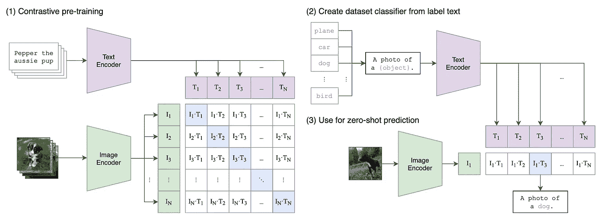

剪辑(左)和零镜头分类方法的对比预训练框架。来源:[https://cdn . open ai . com/papers/Learning _ Transferable _ Visual _ Models _ From _ Natural _ language . pdf](https://cdn.openai.com/papers/Learning_Transferable_Visual_Models_From_Natural_Language.pdf)

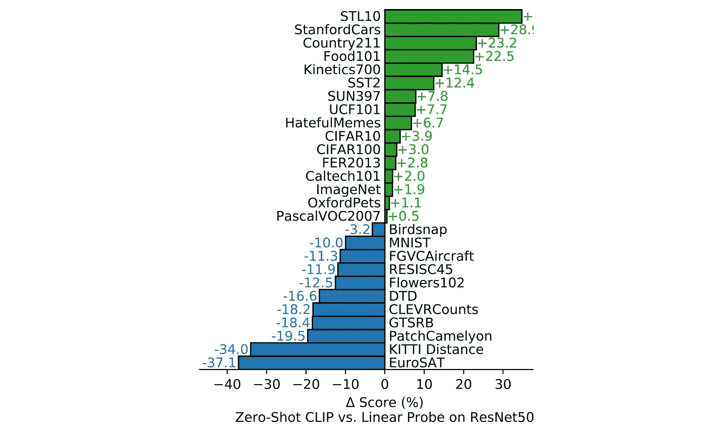

CLIP vs ResNet50 的零射击性能+微调线性分类器。来源:[https://cdn . open ai . com/papers/Learning _ Transferable _ Visual _ Models _ From _ Natural _ language . pdf](https://cdn.openai.com/papers/Learning_Transferable_Visual_Models_From_Natural_Language.pdf)

## 2. [RepVGG:让 VGG 式的网络再次伟大起来](https://arxiv.org/abs/2101.03697)👾[代码](https://github.com/megvii-model/RepVGG)

*丁小寒等著*

🎖 **为什么→** SOTA 不是一切，这项工作证明了它回到了图像分类的鲁棒快速 CNN 的基础，同时保留了分支 resnets 的最新技巧的性能，实现了速度-性能的平衡。

💡**关键见解→** 随着计算机视觉领域的成熟，效率、速度和可定制性变得越来越重要，因为研究希望与现实世界的应用相关。这项工作背后的主题是“让我们回到基础并擅长于此”:他们*吹嘘*没有分支，只使用 3x3 卷积+ ReLUs，不使用架构搜索、复合缩放或任何其他“繁重的设计”。

本文的主要贡献是作者所谓的**结构重新参数化。**该方法允许训练具有剩余连接的模型，然后将它们转换成*单路径模型拓扑*，这使得推理非常快。ImageNet Top-1 的性能仍然在 80%左右(远远低于 SOTA 的 90%)，但单个 GPU 上每秒示例的真实速度远远领先于竞争对手。

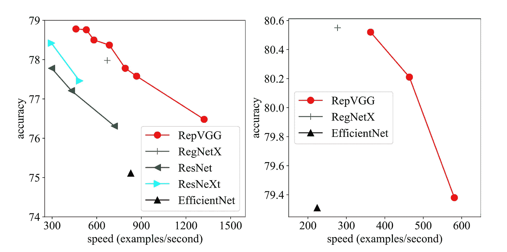

与其他现有模型相比，ImageNet top-1 精度和推理速度的权衡。来源:[https://arxiv.org/abs/2101.03697](https://arxiv.org/abs/2101.03697)

## 3.[让预先训练的语言模型成为更好的一次性学习者](https://arxiv.org/abs/2012.15723) |👾[代码](https://github.com/princeton-nlp/LM-BFF)

高天宇、亚当·费舍尔和陈。

🎖 **为什么:**我们不会很快部署 *GPT-3* 大小的型号，因为它需要资源，但我们都在为更小的型号带来令人惊讶的少量拍摄能力！

💡**关键见解:**可以说，GPT-3 的主要贡献是令人惊讶的少数和零射击性能以及“提示范式”，其中不是在任务上微调模型，而是找到提示，使模型成功执行任务，而无需任务特定的标签。在这项工作中，作者研究了我们如何训练更小的语言模型来显示类似的少数镜头能力。论文的相关工作部分是类似研究方向的相关参考文献的金矿，如 Schick 和 Schütze 的《小语种模型也是少镜头 Learners"⁴》。

本文考虑了几个镜头学习设置，其中我们假设有一个预训练的模型 L，我们希望用每类 K 个训练示例的有限集合对新任务 D 进行微调。为此，他们研究了基于提示的微调，这种微调不是用来自任务 D 的监督信号来更新模型参数，而是将训练样本与提示连接起来，这将使模型通过分类来完成句子。例如，给出一个电影评论"*没有理由看它。*”，模型提示“无理由观看。**果然是**【面具】”该模型预测掩码标记，我们将掩码标记与情感标签相关联。

他们通过手动和自动提示以及“演示”来探索微调，这将标记的示例连接到模型提示的输入。结果表明，使用这些技术，小语言模型可以在少数镜头设置上表现得非常好。

不同提示和微调策略的结果。来源:[https://arxiv.org/abs/2012.15723](https://arxiv.org/abs/2012.15723)

## 4.[开关变压器:通过简单有效的稀疏性扩展到万亿参数模型](https://arxiv.org/abs/2101.03961) |👾[代码](https://github.com/tensorflow/mesh/blob/master/mesh_tensorflow/transformer/moe.py)

威廉·费杜斯、巴雷特·佐夫和诺姆·沙泽尔。

🎖 **为什么→** 我们经常把更多的参数与需要更多的计算联系在一起，但事实并非如此。放大模型是一种趋势，将在未来几年保持相关性，这项工作是一个很好的例子，推动模型大小的边界。

💡**关键见解** →题目中的**万亿**这个词需要一些说明，这些万亿参数是**稀疏**，这意味着它们中的大部分在计算一次向前传球时都没有用到。每个转换器层都是专家的混合体，在推理时进行硬路由，这样，当您添加专家时，每次向前传递的操作数保持不变，尽管内存占用和计算节点之间的通信开销会增加。

这篇论文有太多的内容要在几个段落中浓缩，但我要强调的是，最有趣的发现之一是如何通过向每一层添加专家来扩大变压器的规模，从而大大加快学习速度，同时保持其他变量不变。

从结果来看，在最大参数数量时，性能仍然没有接近收敛，因此我们可以期待在变得更大时发现更多有趣的现象。这在现实世界的设置中很重要，因为较小的模型可以从较大的模型中[提炼](https://en.wikipedia.org/wiki/Knowledge_distillation)或[删减](/pruning-deep-neural-network-56cae1ec5505)，而较大的模型优于从零开始训练的等效模型；这是一种可能在未来几年成为主导的学习模式。

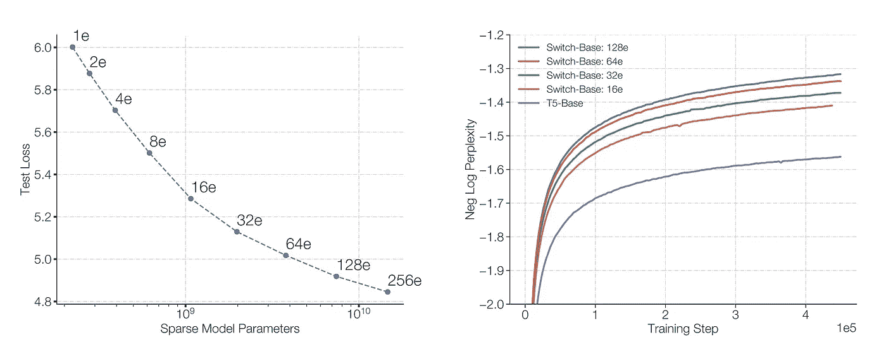

作为稀疏模型参数(左)和训练步骤(右)的函数的性能增益。对于所有显示的情况，推断中的失败次数都是相同的。来源:[https://arxiv.org/pdf/2101.03961.pdf](https://arxiv.org/pdf/2101.03961.pdf)

## 5.[论随机鹦鹉的危险:语言模型会不会太大？](http://faculty.washington.edu/ebender/papers/Stochastic_Parrots.pdf)

*作者:艾米莉·本德、t·格布鲁、a·麦克米兰·梅杰和 Ss·什米切尔。*

**🎖Why →** 作为我们刚刚分享的关于大变形金刚的工作的对比，这里有一篇论文指出了语言模型现状的危险。2020 年 12 月初，关于这项工作初步版本的争议引发了谷歌人工智能伦理研究员蒂姆尼特·格布鲁(Timnit Gebru)的解雇，这成为了人工智能内部伦理和谷歌在 2010 年可疑地位的公开辩论的中心。

**💡关键见解→** 在这份立场文件中，作者回顾了语言模型的现状及其带来的更广泛的危险，如环境和财务成本，这是一个长期存在负面社会偏见的训练数据集，与从业者缺乏问责制有关。作者提出的建议是在建立语言模型时权衡这些因素，并超越语言研究中越来越大的模型，而是专注于诸如管理和记录更高质量数据集的领域。虽然[这篇论文背后的整个故事使其内容比实际更重要](https://twitter.com/timnitGebru/status/1353117276359286784?s=20)，但这是一篇有趣的阅读，有许多相关参考资料，捕捉了截至 2021 年 1 月的语言模型快照。

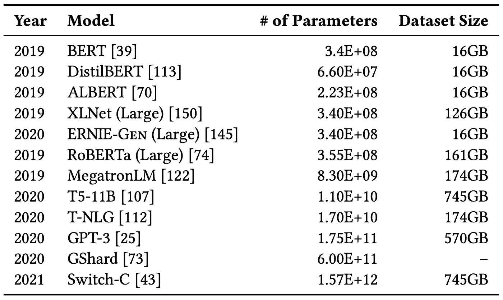

突出的语言模型及其参数计数和预训练数据集大小。来源:[http://faculty . Washington . edu/e bender/papers/random _ parrots . pdf](http://faculty.washington.edu/ebender/papers/Stochastic_Parrots.pdf)

## 6.[反思多级检索管道中 BERT 重排序器的训练](https://arxiv.org/abs/2101.08751)👾[代码](https://github.com/luyug/Reranker)

*高鲁豫、戴、杰米卡兰。*

🎖 **为什么** →我们发现这项工作在 [MS-Marco 排行榜](https://microsoft.github.io/msmarco/)上名列前茅，这是最受欢迎的信息检索基准之一，尽管边缘非常粗糙，但这篇论文基于神经检索损失函数的一个非常简单的变化，结果很有希望。

💡**关键见解→** 现代神经重排序器分两步工作，以减轻运行完整神经网络来计算每个文档查询对的相关性的高计算成本。

1.  初始检索器(M)从整个文档集 d 中选择候选库 C
2.  一个神经模型——re-ranker(R)——获得每个文档-查询对作为输入，并对它们的相关性进行评分。该过程通常依赖于查询文档相关性的人工注释，其中重分类器最小化所有候选 C 中的二进制交叉熵损失，将它们分类为正样本或负样本。

人们通常会期望，当第一模型 M 变得更好时，系统的整体性能将会提高，因为重新排序器得到了更好的样本可供选择，并且工作人员已经试图改进这个第一检索阶段。然而，实验表明，当检索器 M a 选择更好的文档池时，重新排序器 R 通常更难区分相关文档和不相关文档。本文针对这种现象提出了一种非常简单的解决方案，该解决方案包括用对比损失来代替 BCE 损失(其中所有文档被分类为相关或不相关),其中一次仅考虑一个正面文档，并且负面文档通过 M 在排名靠前的文档中进行采样，这比 BCE 对假阳性的征税更强:

这个巧妙简单的改变足以让这部作品达到 MS-MARCO benchmark 的巅峰。然而，如果你查看这篇论文，你会发现这仍然是非常粗略的初步工作，结果非常有限:顶级性能依赖于技巧和启发(正如所有领先的 IR 方法一样)，并且需要更多的消融实验来真正理解在重新排序中使用这种对比损失的好处。我们期待着那一天！

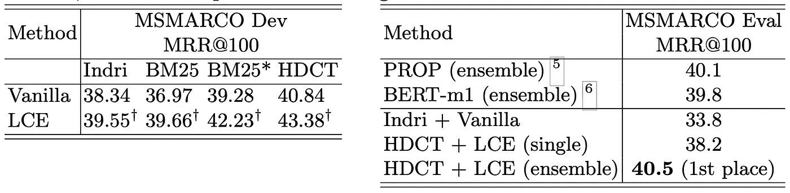

与之前最先进的 [PROP](https://arxiv.org/abs/2010.10137) 相比，建议模型的性能。来源:https://arxiv.org/abs/2101.08751

## 7.[用于开放领域问题回答的神经检索器的端到端训练](https://arxiv.org/abs/2101.00408)👾[代码](https://github.com/NVIDIA/Megatron-LM)

*Devendra Singh Sachan 等人*

**🎖为什么→** 与之前的论文不同，这项工作对开放式问题回答(QA)的预训练任务进行了详细的系统研究，它与我们刚刚讨论的文档排序和重新排序任务有很多共同之处。它很好地介绍了在 QA 排行榜上占主导地位的最新实践，由来自 MILA、麦吉尔和英伟达的知名研究人员撰写。

**💡关键见解→** 在这种情况下，开放式问题回答的神经管道也包括第一阶段检索器，它选择一组*上下文、*和读者提出的问题“ *q* 和*上下文*“*K”的集合，*对它们进行编码，然后基于这两部分输入对答案“*a”*进行解码。作为读者模型，他们使用预先训练的 T5 模型。

与开关变压器论文类似，在一个段落中要总结很多内容。为检索者研究的两个主要的训练前任务是逆向完形填空任务(ICT)和掩蔽显著跨度:

*   逆向完形填空任务(ICT):提取文档的片段，并在对比设置中学习片段和文档的表示，该表示将片段与它们原来所属的文档相匹配。
*   掩蔽显著跨度:预测标记(如命名实体)的掩蔽显著跨度。

此外，这项工作比较了将*上下文*纳入答案生成的两种方法:

*   单个 top-k:答案的可能性被分解为上下文集合的边际总和 *K* 。
*   联合 top-k:答案的可能性是直接在上下文集合上计算的 *K.* 在实践中，这意味着上下文被连接起来作为读者模型的输入，问题可以同时关注所有文档以生成答案。

这项工作为第一个检索阶段以及自然问题和 TriviaQA 数据集的“端到端”QA 提供了最先进的技术。

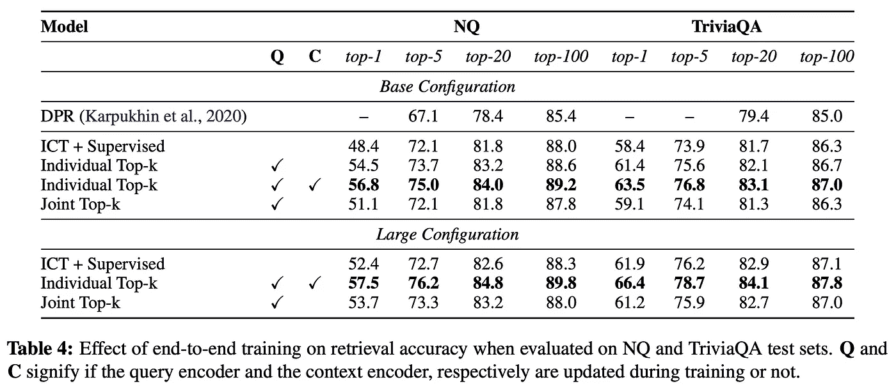

只检索自然问题和繁琐问题的结果。来源:[https://arxiv.org/pdf/2101.00408.pdf](https://arxiv.org/pdf/2101.00408.pdf)

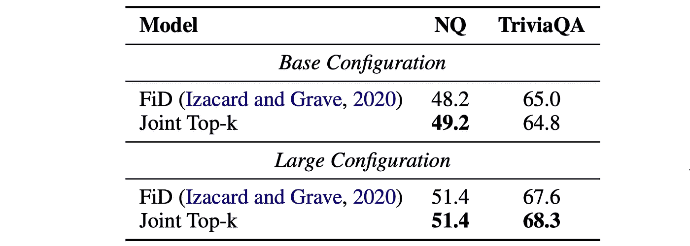

与之前的 SOTA 相比，端到端 QA 性能。来源:[https://arxiv.org/pdf/2101.00408.pdf](https://arxiv.org/pdf/2101.00408.pdf)

## [8。对手实例化:差分私有机器学习的下限](https://arxiv.org/abs/2101.04535)

*米拉德·纳斯尔等人*

🎖 **为什么→** 差分隐私(DP)的机器学习实践仍然不是主流，部分原因是进入门槛高，研究阶段相对较早。不要让标题中的花哨词汇吓到你，这项工作提供了对 DP 的广泛介绍，并研究了在现实约束下实例化*对手*时可以保留多少隐私。

💡**关键见解→** 假设您想要在医院托管的机密医疗数据上训练一个模型。您使用这些数据定义一个用于训练模型的计算，对于训练的每一次迭代，您将模型的权重发送给医院，医院计算一些权重更新并将其发送给您。现在，如果你是一个非常聪明的坏演员——一个*对手—* ,在给定权重更新的情况下，你能从训练数据集中推断出任何个人数据吗？差分隐私负责给你收到的数据添加*足够的噪音*，这样你就无法从中恢复任何有意义的数据(这是一种极端的过度简化，但你已经明白了要点)。

现在，差分隐私通常研究隐私的正式上限(即最坏的情况)，例如，假设的*对手*可以完全访问每个中间权重更新。但是在真实的环境中，我们可以将这些约束进一步细化为更现实的约束。例如，*的对手*只能访问最终模型，或者只能通过 API 访问其预测，等等。本文考察了隐私保护如何在这些更现实的案例中发挥作用。结果表明，当这些现实的约束被强加时，隐私界限是如何大大增加的，这是这些技术的现实世界适用性的一个有希望的结果。

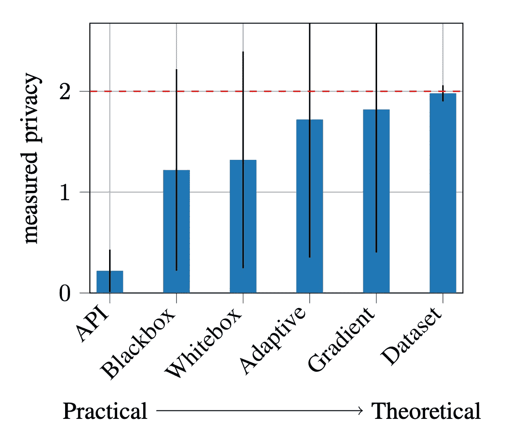

现实对手约束下的差分隐私保护综述。来源:[https://arxiv.org/pdf/2101.04535.pdf](https://arxiv.org/pdf/2101.04535.pdf)

## 9. [GENIE:文本的人在回路评估排行榜](https://arxiv.org/abs/2101.06561) |👾[代码](https://github.com/allenai/amti) |🌐[网站](https://genie.apps.allenai.org)

*丹尼尔·哈沙比等人*

🎖 **为什么:**如果当今的 ML 进展都是关于排行榜的，那么这些就不应该局限于完全自动评估的领域。文本生成就是这样一个任务，完全自动的评估是非常困难的:BLEU，ROUGE 分数在一定程度上与人类的判断相关，一旦它们成为优化目标，这种相关性就会消失。

提出了一种结合经典自动评测和众包便捷人工评测的评测基准。这里做了大部分繁重的工作:人工评估基准已经使用了几十年，但是从来没有像 GLUEbenchmark 这样的自动基准那样大规模和方便。现有的人在回路评估框架，如 HYPE⁵、ChatEval⁶或 HUME⁷，每个都只专注于一项任务，所以看看 GENIE 作为一个更通用的基准在社区中获得多少牵引力将是有趣的。

🔗**哪里可以找到:**你可以在 https://leaderboard.allenai.org/genie-mt/submissions/public[找到更多关于它以及如何提交你的模型的信息](https://leaderboard.allenai.org/genie-mt/submissions/public)

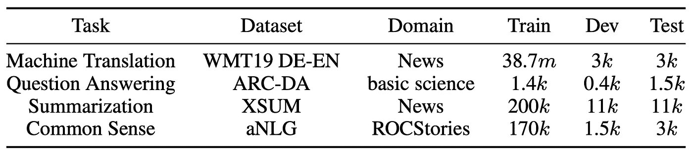

GENIE 目前支持的任务。来源: [GENIE
文本生成的人在回路评估排行榜](https://arxiv.org/pdf/2101.06561.pdf)

## 10.[机器人操作中自动发现目标的不对称自我游戏](https://arxiv.org/abs/2101.04882) |📺[演示](https://robotics-self-play.github.io/)

*作者 OpenAI 等人(要求论文引用格式)*

🎖 **为什么→** 自我游戏适用于机器人操作。尽管由于缺乏实验深度(即所有实验都只是模拟)而被 ICLR 2021 拒绝，但其背后的想法是非常有前途的，毫无疑问将产生坚实的影响。

💡**关键见解→** 本文介绍了机器人操纵的任务，这实质上意味着让机器人学习操纵给定指令或特定目标的对象。在这种情况下，他们探索机器人如何学习操纵物体来实现目标，只给定最终目标，没有指令。

解决这个问题的想法很简单:我们考虑两个机器人，爱丽丝和鲍勃。Alice 创建对象的配置，Bob 需要复制它们。Alice 因提出 Bob 无法创建的配置而获得奖励，Bob 因能够复制 Alice 的状态而获得奖励。假设 Alice 需要为 Bob 生成配置，我们确信 Bob 呈现的状态是可行的。在这种情况下，爱丽丝和鲍勃都不需要被贴上标签的监督，并且鉴于爱丽丝和鲍勃都是在这种对立的情况下从头开始，爱丽丝提出的配置自然会变得越来越困难，模仿课程学习的概念，其中任务变得越来越困难，但没有明确地管理一组按复杂程度分级的任务。

要使这一过程稳定并在实践中发挥作用，还需要许多额外的细节，但正如模拟实验所指出的那样，自我游戏似乎比教会鲍勃成为操纵表面上的物体的专家的课程学习更有效和更强大。

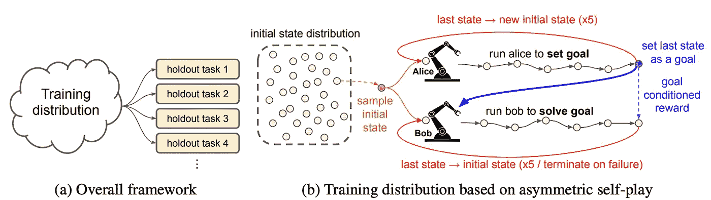

机器人操作的自我游戏框架。来源:https://arxiv.org/pdf/2101.04882.pdf

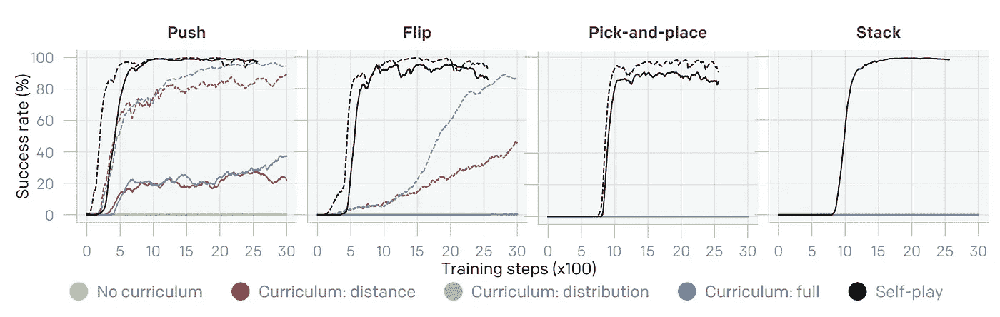

不同简单任务上自我游戏与课程学习的比较。来源:https://arxiv.org/pdf/2101.04882.pdf

我们的每月精选到此结束，但我们才刚刚开始。如果你想了解最新的研究，请在推特上关注我们 [@zetavector](https://twitter.com/ZetaVector) 。我已经在期待分享二月份的下一个选择；回头见！

*参考文献:*

[1]“[弱监督开放领域问答的潜在检索](https://arxiv.org/abs/1906.00300)”Kenton Lee 等 2019。

[2][领域:检索-增强语言模型预训练](https://arxiv.org/abs/2002.08909)Guu 等 2020。

[3] " [用统一的文本到文本转换器探索迁移学习的极限](https://arxiv.org/abs/1910.10683)" Colin raff El 等人，2020。

[4] " [小语种模特也是很少出手的学习者](https://arxiv.org/abs/2009.07118)" Schick 和 Schütze 2020。

[5][HYPE:生成模型的人眼感知评价基准](https://arxiv.org/abs/1904.01121)Sharon Zhou 等 2019。

[6] " [ChatEval:一个聊天机器人评测的工具](https://www.aclweb.org/anthology/N19-4011.pdf)" joo Sedoc 等人 2019。

[7]“[统一人工和统计评价的自然语言生成](https://www.aclweb.org/anthology/N19-1169.pdf)”Tatsunori Hashimoto 等人 2019。