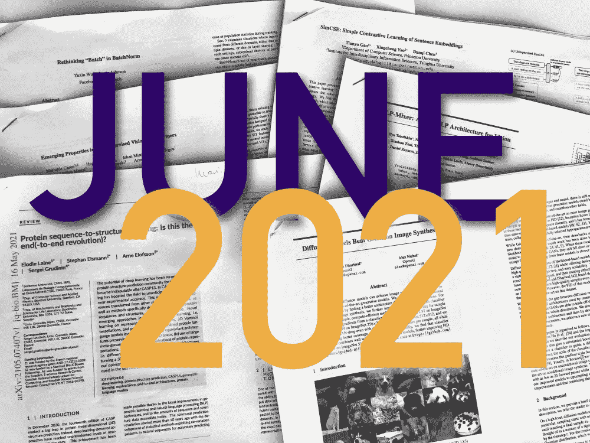
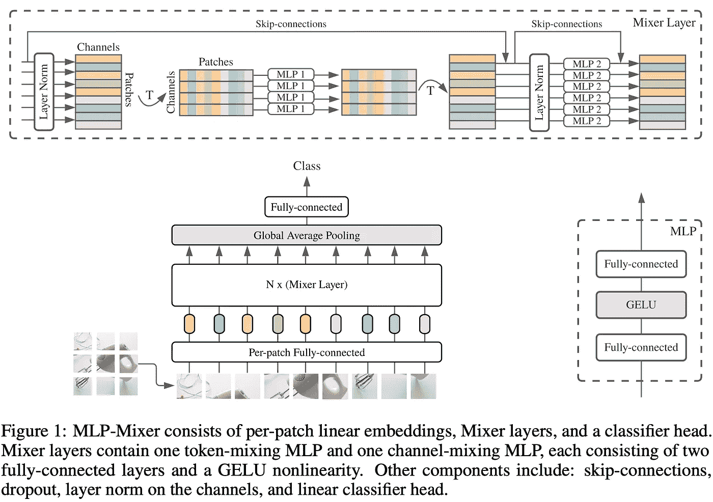
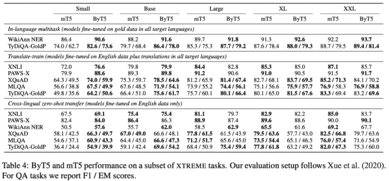
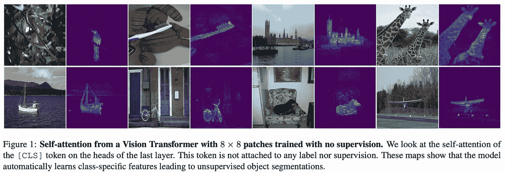
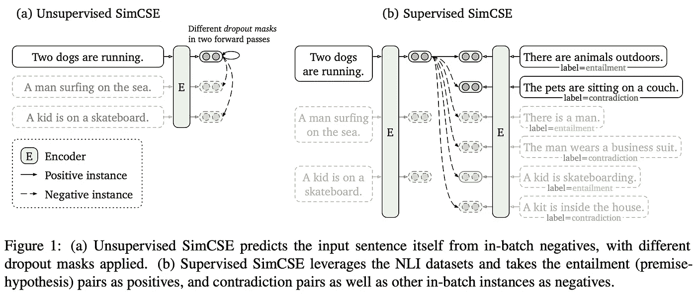
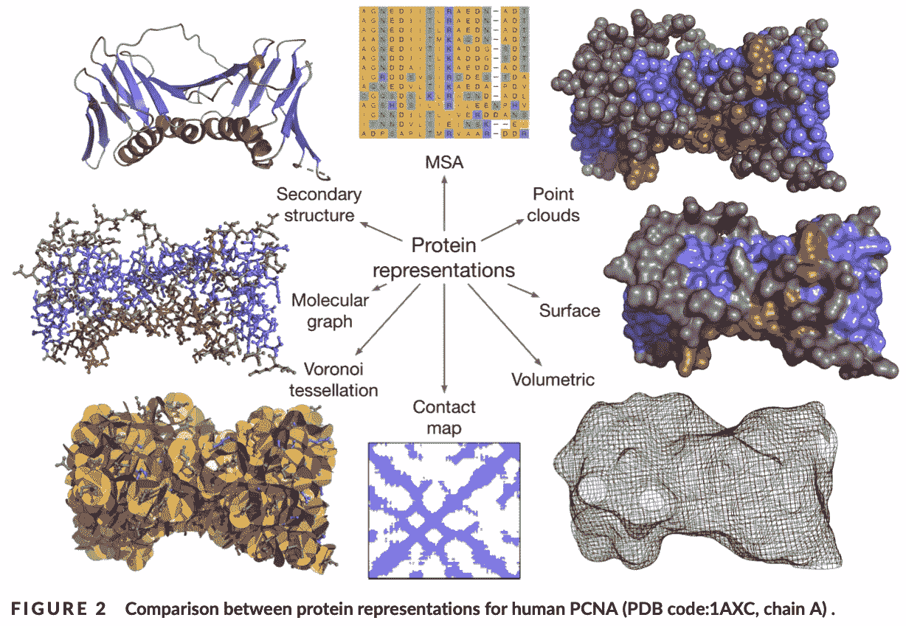
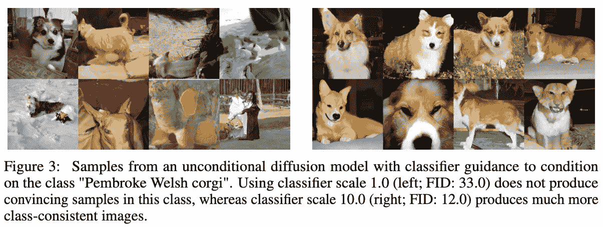
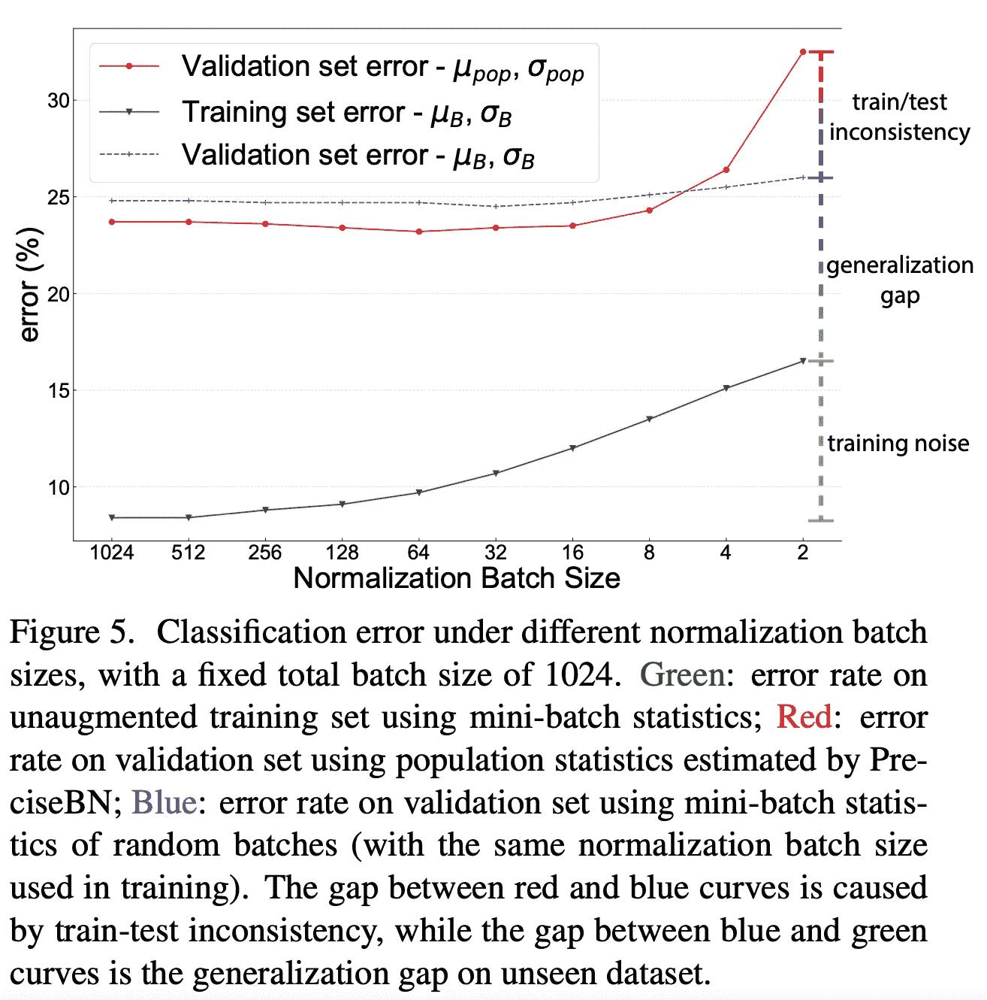

# arXiv 精选—2021 年 6 月阅读

> 原文：<https://towardsdatascience.com/best-of-arxiv-june-2021-dcd3aa48a66d?source=collection_archive---------33----------------------->

## 最近的 ML 论文每月精选:MLPs 回归，无令牌语言模型，视觉变形金刚上的 SSL 等等。

图片作者。

在过去的一个月里，ML 研究文献带来了令人惊讶的结果，例如 MLPs 作为计算机视觉的竞争性架构的复兴，或者对批处理规范化作为一种完全无害的层的质疑。变形金刚也(当然)在盘子上:用于视觉上的自我监督学习，以及句子表示技术和字符级语言建模。

这是每月一次的最新 ML 研究文献精选，由 [Zeta Alpha](https://search.zeta-alpha.com/) 支持，我们总是密切关注最新的论文。尽情享受吧！

## [MLP 混合器:一个全 MLP 架构的愿景](https://arxiv.org/abs/2105.01601)👾[代号](https://github.com/google-research/vision_transformer)

*作者:伊利亚·托尔斯泰欣、尼尔·霍尔斯比、亚历山大·科列斯尼科夫、卢卡斯·拜尔等人*

**❓Why →** 非常简单的基于 MLP 的架构突然比它们应该的工作得更好，这具有有趣的含义，并推进了我们关于深度学习工作原理的知识。

**💡关键见解→** 你或许可以通过扩大规模来解决 *ML* 问题。好吧，好吧，这是一个过于简化和夸张的说法，但是里奇·萨顿的惨痛教训似乎比好酒更容易陈酿。

本文构建了一个既不使用注意力也不使用 CNN 的架构，其工作方式如下:

*   将图像分割成小块，展平成矢量并叠加。
*   转置堆栈，并对所有面片的每个要素应用 2 层 MLP。
*   转置回原始形状，并在每个面片的所有要素上应用 2 层 MLP。
*   重复前面的块 N 次。

结果并不十分 SOTA，但足以引起一些眉毛和引发讨论。虽然 CNN 目前还没有走向任何地方，但这加强了一个想法，即架构选择不是引入所需归纳偏差(如平移不变性/等方差)的必要条件，这些可以通过增强等技术仅从数据中学习，尽管效率较低。

非常有趣的是，就在这篇论文被上传到 arXiv 之后，其他几篇显示非常相似结果的文章也被上传，如注意 MLPs， [RepMLP:将卷积重新参数化为完全连接的图像识别层](https://arxiv.org/abs/2105.01883)， [ResMLP:具有数据高效训练的图像分类前馈网络](https://arxiv.org/abs/2105.03404)和[你甚至需要注意吗？一堆前馈层在 ImageNet](https://arxiv.org/abs/2105.02723) ⁴.上表现惊人的好

来源:[https://arxiv.org/pdf/2105.01601.pdf](https://arxiv.org/pdf/2105.01601.pdf)

## [字节 5:通过预先训练的字节到字节模型走向无令牌的未来](https://arxiv.org/abs/2105.13626)👾[代码](https://github.com/google-research/byt5)

*作者薛阿迪蒂亚·巴鲁阿、诺亚·恒、拉米·阿尔-Rfou 等人*

**❓Why →** 大多数 NLP 语言模型(LM)都是在几万个标记的固定词汇或子词单元上操作的。虽然这种方法在大多数时候都很有效，但它仍然会遇到诸如打字错误、大写变化或形态变化等问题。无令牌 LMs 是解决这些问题的一个很有前途的方向。

**💡关键见解→** 本文的主要目标是展示如何在不牺牲性能的情况下，通过最少的修改，使现有的基于令牌的语言模型(mT5⁹)适用于字符或字节级操作。事实上，作者几乎没有改变主干 T5 架构:他们只是简单地去掉了原来的句子片段标记器，并把文本作为 UTF 8 字符的原始序列，这相当于 256 的“词汇表”大小。训练前的目标-最初屏蔽大约 3 个标记的范围并预测它们-被调整为大约 20 个字符的平均屏蔽范围长度。最后，作者还发现，byT5 受益于编码器和解码器之间的不均匀参数分布:与常规 T5 不同，以较轻的解码器为代价获得“沉重”的编码器是有益的。

来源:[https://arxiv.org/pdf/2105.13626.pdf](https://arxiv.org/pdf/2105.13626.pdf)

这篇文章最令人惊讶的方面是，byT5 几乎不需要任何调整就可以达到与其原始版本相当的性能。此外，byT5 具有几个优点，例如对噪声的鲁棒性更强，并且在拼写和发音很重要的任务中表现更好。这为现有的转换器适应字节级序列输入描绘了一个充满希望的未来，尽管有许多警告适用:训练和推理效率仍然明显较差。

## [自监督视觉变压器的新兴特性](https://arxiv.org/abs/2104.14294) (DINO)👾[代号](https://github.com/facebookresearch/dino)

*作者玛蒂尔德·卡隆等人*

**❓Why →** 成熟的自我监督视觉变形金刚是迟早的事，现在它们来了。虽然这只是 vision transformers 和 SSL 的第一步，但这项技术将在接下来的几个月里变得更加实用。

**💡关键洞察力→** 视觉变形器可以使用 Bootstrap Your Own Latent 方法训练，其中图像的不同视图由*教师*和*学生*编码，输出的相似性最大化。该方法通过使一个网络是另一个网络的指数平均值来避免崩溃(即，对所有图像输出相同的嵌入)。

然而，与 BYOL 不同的是，他们在模拟分类器上使用交叉熵作为输出之间的相似性度量，而不是内积相似性，这允许他们在 softmax 中设置“温度”正则化，这有助于训练稳定性。

这种方法最引人注目的结果是，在没有任何监督的情况下，transformer 中深层的注意力图形成了令人惊讶的高性能对象分割，并且对学习表示的 k-NN 检索也显示了将该技术应用于图像检索的有希望的结果。

资料来源:https://arxiv.org/pdf/2104.14294.pdf

*你可能也会喜欢* : [用 Swin 变形金刚进行自我监督学习](https://arxiv.org/abs/2105.04553)

## 简单的句子嵌入对比学习👾[代码](https://github.com/princeton-nlp/SimCSE)

由王彤宙和菲利普·伊索拉创作

**❓Why →** 在无监督的句子表征学习上取得了令人印象深刻的进步，这是一种非常简单的方法，有可能用于其他领域。

**💡关键见解→** 在计算机视觉中，生成输入的*两个视图*就像获取图像的两种不同作物一样简单，但由于语言的离散性，这种简单的增强不能直接应用于语言，这使得对比学习有点棘手。

在这项工作中，作者建议简单地将同一个句子输入到 transformer encode 两次，但在前馈层和注意力层中绘制不同的随机丢失。令人惊讶的是——至少对我来说——添加任何其他以前使用过的增强功能，如“删除一个单词”或“裁剪句子的一部分”,都会降低性能。类似地，添加以前研究过的目标，如“下一句预测”，也会降低性能。

虽然最令人印象深刻的结果是针对仅无监督的训练，但作者也扩展了他们的方法，通过使用正面和负面句子对分别作为正面和硬负面样本来利用标记的数据。

结果不仅包括标准的句子级基准，如 STS⁵，还包括对表征的*对齐*和*一致性*的分析，最近被提议作为表征 quality⁵.的预测代理

来源:[https://arxiv.org/pdf/2104.08821.pdf](https://arxiv.org/pdf/2104.08821.pdf)

## [蛋白质序列到结构的学习:这是终点(-端到端的革命)](https://arxiv.org/abs/2105.07407)？

*作者:埃洛蒂·莱恩、斯蒂芬·艾斯曼、阿恩·埃洛夫松和谢尔盖·格鲁丁宁*

**❓Why →** 几个月前，DeepMind 的 AlphaFold 进行了一轮展示，展示了变形金刚和 SSL 如何跳过被称为蛋白质折叠的任务，蛋白质的 3D 结构仅由它们的线性氨基酸结构构建而成。我没有必要的背景来理解这到底有多有影响力，但这篇论文帮助奠定了事态的发展，并提供了关于蛋白质结构领域深度学习未来的知情意见。

**💡关键见解→** AlphaFold 2 确实走在了时代的前面，这是 it 计算资源的一个重要原因，它越来越成为研究的一个区分因素。这再一次将学术研究团体置于一个困难的位置，与资金雄厚的公司支持的实验室竞争。

结构生物学精确预测的影响在很大程度上仍然是未知的。虽然蛋白质结构的确在很大程度上决定了它的性质，但还有更多变量在起作用。从乐观的方面来看，*计算机模拟*结构蛋白预测将会以比以前更快的数量级实现一致、深刻和新颖的生物学见解；但在悲观的一端，这些不足以成功地模拟更现实的蛋白质行为，如复杂的动力学，灵活性和相互作用，这种方法只会在少数情况下有用。

来源:https://arxiv.org/pdf/2105.07407.pdf

## [扩散模型在图像合成上击败甘斯](https://arxiv.org/abs/2105.05233)👾[代码](https://github.com/openai/guided-diffusion)

Prafulla Dhariwal 和 Alex Nichol

**❓Why →** GANs⁶自从引入以来，多年来一直是无可争议的图像生成方法。然而，在过去的几年里，越来越多的基于可能性的替代方法正在出现，以取代它们。他们会变得一样受欢迎吗？

**💡关键见解→** 一个月前，我们在 ICLR 强调了一篇扩散模型论文，这篇论文的主旨大部分是相似的，尽管需要额外 8 个月的工作来完善。扩散模型的要点如下:你可以将图像转换成“噪声”作为“扩散过程”。想想单个水分子是如何在流动的水中运动的:有一些确定性的水流遵循一个梯度，并伴随着一些额外的随机抖动。你可以对像素图像做同样的事情，*扩散它们*，这样它们最终就像一个易于处理的概率分布中的噪声。现在，这个过程实际上是可逆的，所以同样的“反向”扩散过程可以用来从噪声中生成图像。

作者展示了一个良好调整的模型如何在许多图像生成基准上达到 SOTA，超越甘斯。然而，仍然有警告。

来源:[https://arxiv.org/pdf/2105.05233.pdf](https://arxiv.org/pdf/2105.05233.pdf)

有一些权衡仍然是不可避免的:GANs 仍然是图像生成任务中最受欢迎的技术，并且速度很快，但它们通常缺乏多样性，并且没有覆盖图像的整个领域，这使得它们更难扩展和应用到新的领域。另一方面，基于可能性的模型——如 VQ-VAE、扩散模型或自回归生成——以速度和图像保真度为代价提供了更好的覆盖范围，由人类(或其他代理指标)来判断。

## [重新思考 BatchNorm](https://arxiv.org/abs/2105.07576) 中的“批处理”

*吴雨欣和贾斯廷·约翰逊*

**❓Why →** 自从 batchnorm⁷被提出以来，它已经成为 DL 工具箱中无处不在的工具。然而，它具有不可忽视的含义，而这些含义往往被经验驱动的研究所忽视。

**💡关键见解→** 这里有很多东西需要解开，但我要强调的是，BatchNorm 并不像乍看上去那样无害。

首先，BatchNorm 是唯一一个对组而不是对单个输入进行操作的层，这意味着它在训练和推理过程中必然会有不同的行为。而且，BatchNorm 会导致批内信息泄露。该论文给出了以下有见地的例子:设想通过具有 16 个不同类别的 32 个图像，每个类别 2 个图像，一致地构造训练批；该模型将通过至少“成对地”而不是单独地为每个样本生成标签来学习利用这种批量模式。在对比 learning⁸.中可以观察到类似的“欺骗”现象

训练-测试的不一致性也无意中损害了用 BatchNorm 训练的模型的性能:指数移动平均(EMA)技术——最常用于估计用于推断的总体统计数据——导致有偏差的估计，损害了测试集中的性能。

那么我们能从这一切中得到什么呢？您可能应该继续使用 BatchNorm，并受益于它在最常见的设置下的良好工作(从训练集中提取固定大小的批处理 i.i.d ),并使用从同一数据分布中提取的测试集)；但在其他情况下使用时要格外小心。

来源:[https://arxiv.org/pdf/2105.07576.pdf](https://arxiv.org/pdf/2105.07576.pdf)

我们的月度评选到此结束；如果你想了解最新的研究，请在 Twitter 上关注我们。如果你想了解更多关于 ML 代码、实现和库的最新进展，请查看我们的其他博客系列 [*最佳 ML 工具和软件*](/best-of-ml-code-and-software-june-2021-486dcf6f461b) *。*下集再见！

*参考文献:*

[1] [*关注 MLPs*](https://arxiv.org/abs/2105.08050)*——*作者，戴子航，David R. So，Quoc V. Le，2021。

[2] [*RepMLP:将卷积重新参数化为全连通层，用于图像识别*](https://arxiv.org/abs/2105.01883)*——丁小寒，，韩，丁桂光，2021 .*

*[3] [*ResMLP:数据高效训练的图像分类前馈网络*](https://arxiv.org/abs/2105.03404) — Hugo Touvron 等 2021。*

*【4】[*你甚至需要关注吗？一堆前馈层在 ImageNet*](https://arxiv.org/abs/2105.02723)——Luke Melas-Kyriazi，2021。*

*[5] [*通过超球面上的对齐和一致理解对比表征学习*](https://arxiv.org/abs/2005.10242)*——*王彤宙和菲利普·伊索拉，2020。*

*[6] [*生成对抗网络*](https://arxiv.org/abs/1406.2661)——作者 Ian J. Goodfellow 等人 2014。*

*[7] [*批量归一化:通过减少内部协变量移位加速深度网络训练*](https://arxiv.org/abs/1502.03167)*——*作者[谢尔盖·约夫](https://arxiv.org/search/cs?searchtype=author&query=Ioffe%2C+S)，[克里斯蒂安·塞格迪](https://arxiv.org/search/cs?searchtype=author&query=Szegedy%2C+C)*

*[8] [*采用对比预测编码的数据高效图像识别*](https://arxiv.org/abs/1905.09272) *—* 作者 Oliver Henaff，2020。*

*[9][*【mT5:一个大规模的多语种预训练文本到文本转换器*](https://arxiv.org/abs/2010.11934)——由薛、诺亚康斯坦、等人 2020。*