# arXiv 精选——2021 年 4 月阅读:GPT 反击战，视频变形金刚等等

> 原文：<https://towardsdatascience.com/best-of-arxiv-readings-for-april-2021-gpt-strikes-back-video-transformers-and-more-d620e1cec82?source=collection_archive---------15----------------------->

## ML 论文每月精选

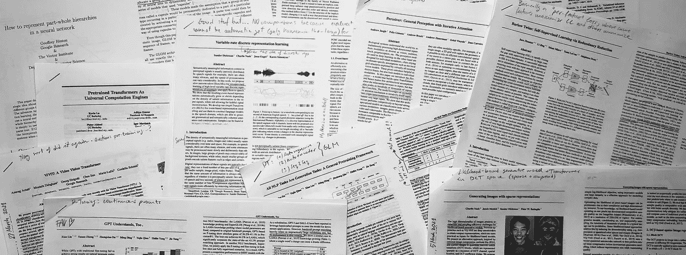

图片作者。

在你的阅读清单上保持领先是很难的，而找到哪些论文应该在清单上就更难了。在 [Zeta Alpha](https://search.zeta-alpha.com/) 我们总是密切关注最新的人工智能研究，所以我们每月都会分享一些最近的论文，以展示我们认为会有影响力的出版物，主要基于每部作品的贡献和作者的影响力。不要把这个列表看得太全面:像其他人一样，我们也有自己的偏见，但是你能从 4000 多篇论文中选择的就这么多了。尽情享受吧！

## [1。所有 NLP 任务都是生成任务:一个通用的预训练框架](https://arxiv.org/abs/2103.10360) |👾[代号](https://github.com/THUDM/GLM)

*作者:杜，钱玉洁，小刘，，，邱，，杨，。*

**🎖Why →** 本文是现有的三种主要语言预训练方法的地图:自回归(例如，擅长文本生成的 GPTs)，掩蔽语言建模(又称填空，如 BERT，擅长 NLU 分类任务)和 seq2seq(针对 T5 等编码器-解码器模型，擅长翻译或摘要等条件文本生成)。这三种技术各有优缺点，所以如果我们能得到最好的结果，那不是很好吗？这里有一个尝试。

**💡关键见解→** 下表总结了三种主要语言预处理方法的主要用途。提醒一下，NLU 是基准测试中的分类任务，比如 [SuperGLUE](https://super.gluebenchmark.com) (情感分析，自然语言推理等。)，条件生成是文本生成任务，其中输入和输出序列之间存在特定的关系(如翻译或总结文本)，而无条件生成是自由生成文本的任务。

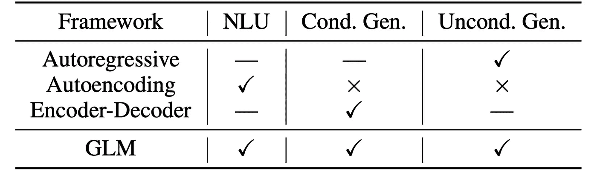

其中\003; =擅长；—=可以适应；✕=cannot 被直接应用到。资料来源:https://arxiv.org/pdf/2103.10360.pdf

作者提出了一种*统一的*预训练技术，他们称之为通用语言模型(GLM)，并在图描述中进行了精确总结。

来源:[https://arxiv.org/pdf/2103.10360.pdf](https://arxiv.org/pdf/2103.10360.pdf)

部分 A 和 B 的这种分离背后的动机是迫使同一模型学习双向编码器(A)和单向解码器(B)。以前基于跨度的模型(如 spanBERT)之间的一个区别是，跨度的长度现在对模型来说是未知的。这项技术需要一些技巧和细节来解决，比如位置编码，这在本文中有详细说明。

说到结果，与 RoBERTA 的比较可能是最有趣的比较之一，其中采用这种新的预训练方法的相同模型优于原始实现。在某些情况下，把最初的 MLM 训练目标和 GLM 混合起来更好，这表明 GLM 并不是普遍优越的。对于 seq2seq 评估，他们执行抽象概括，与类似大小的模型相比，它表现良好。

## [2。GPT 也明白了👾](https://arxiv.org/abs/2103.10385)[代号](https://github.com/THUDM/P-tuning)

【作者:】刘潇、延安郑、杜、、钱玉洁、杨、。

🎖Why → 我可以自信地把这篇文章放在我过去一个月的首要任务中。这个想法既聪明又简单，结果看起来非常惊人，论文非常清晰，充满了真知灼见。它挑战了来自同一个研究小组的前一篇论文提出的一个既定事实:自回归预训练对 NLU 没有好处。好吧，拿着你的纸！继续阅读……他们提出的技术 *p-tuning* ，有可能成为少量学习和微调大型 LMs 的标准技术，对于这些技术，传统的微调效果不是很好，或者成本太高。

**💡关键见解→**2020 年 5 月，GPT-3 让最持怀疑态度的人感到惊讶，它展示了一个简单的生成性预训练如何扩展到数千亿个参数，只需通过用描述任务的自然语言和/或给它一些例子来“提示”模型，就可以显示出令人印象深刻的零击球和少击球性能。这激发了一些深入探究“提示”艺术的作品，如 PET⁴.甚至有人提出了自动为模型寻找好的提示来解决任务的技术，而不需要像 AutoPrompt 那样更新任何模型参数。

在这项工作中，作者有一个绝妙的想法，不再将提示限制为固定词汇表中的实际单词。相反，他们学习固定数量的**连续嵌入，可以通过梯度下降**进行优化，他们称之为 *p-tuning* 。这意味着所有的原始模型参数可以保持冻结，只有提示嵌入被更新。把这想象成某种*差异化编程 2.0* 很有趣，在这里你**学会解释一个冻结的预训练**模型做什么。

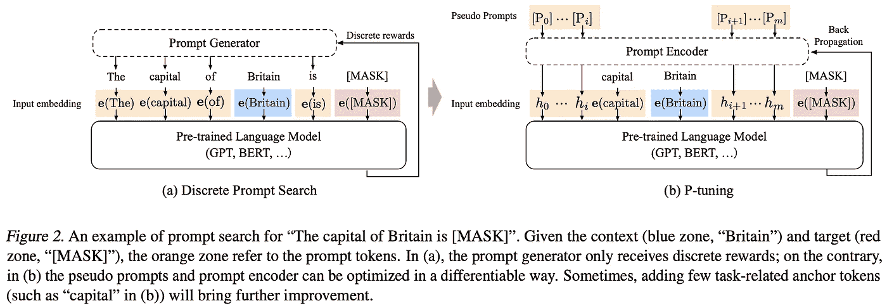

来源:[https://arxiv.org/pdf/2103.10385.pdf](https://arxiv.org/pdf/2103.10385.pdf)

在微调、p-tuning 和手动提示之间的比较中，结果是最有趣的。特别是对于知识探测(从一个冻结的预训练模型中提取仿真陈述)，p-tuning 比其他方法表现得好得多。在 SuperGLUE 基准测试中，虽然 p-tuning 不能与其他 SOTA 相提并论(但考虑到那里巨大的模型大小差异，这不是一个公平的比较)，但与标准微调或手动提示相比，p-tuning 显示出非常强的性能。

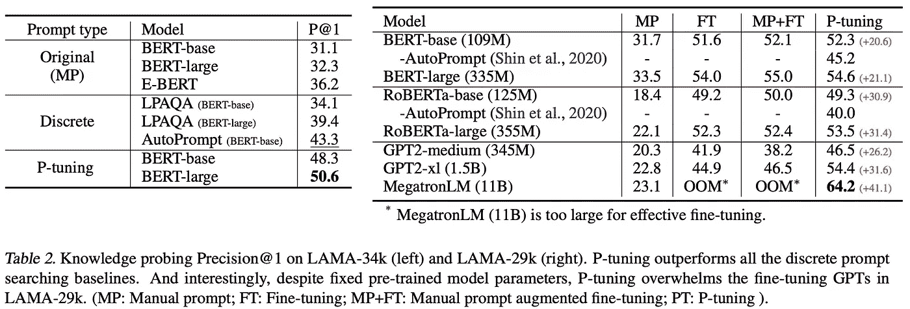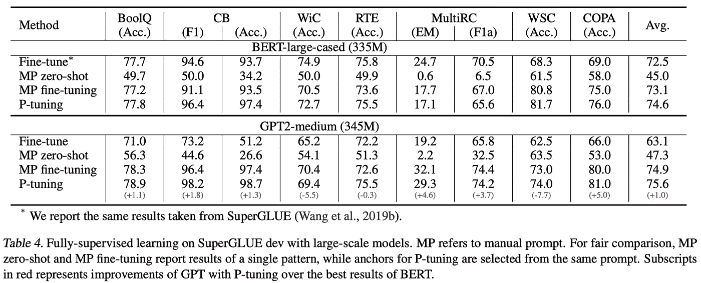

来源:[https://arxiv.org/pdf/2103.10385.pdf](https://arxiv.org/pdf/2103.10385.pdf)

## [3。作为通用计算引擎的预训练变压器](https://arxiv.org/abs/2103.05247) |👾[代号](https://github.com/kzl/universal-computation) | ✍️ [博客](https://bair.berkeley.edu/blog/2021/03/23/universal-computation/)

凯文·卢、阿迪蒂亚·格罗弗、彼得·阿贝耳和伊戈尔·莫达奇。

🎖Why → 尽管在我看来，这篇论文的核心主张仍未确定(细节决定成败),但将预先训练好的变形金刚理解为“计算引擎”的想法很有意思——给出适当的指令，它可以计算出任何东西。在我看来，这与“GPT 也理解”的论文有很好的联系，在这篇论文中，学习了任务的模型输入，而不是模型参数。

**💡关键见解→** 作者探索了变形金刚如何执行各种不同寻常的任务，特别是计算任务:位存储(重复损坏的位串)、位异或(计算两个位串的元素异或，这是 NNs 历史上很难执行的事情)、ListOps(给定一系列预测结果位的操作)、MNIST(手写数字数据集)和 CIFAR-10(图像分类基准)。

更有趣的是，他们声称有一些关于语言的预训练，使它学习所有这些其他任务的普遍性(这些任务事先与语言无关)。为了研究这一假设，他们获得了一个预训练的语言转换器，**冻结了除层归一化和输入和位置嵌入之外的所有权重，**称之为冻结预训练转换器(FPT)。

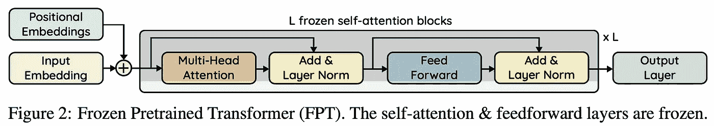

来源:https://arxiv.org/pdf/2103.05247.pdf

问题出在细节上，因为允许规范化层中的微调仍然会影响自我注意力在未来层中的行为，尽管自我注意力被冻结，但这种微调还是会隐式地优化它们(参见表 11 中它对性能的影响)。此外，通过微调嵌入、输出和层范数参数，随机初始化的转换器已经在许多任务上表现得非常好。

无论如何，尽管论文关于变压器是通用计算引擎的核心主张仍有争议，但论文充满了消融研究——如下表所示——这些研究很新颖，并提供了深刻的结果，以了解它们擅长什么，不擅长什么。

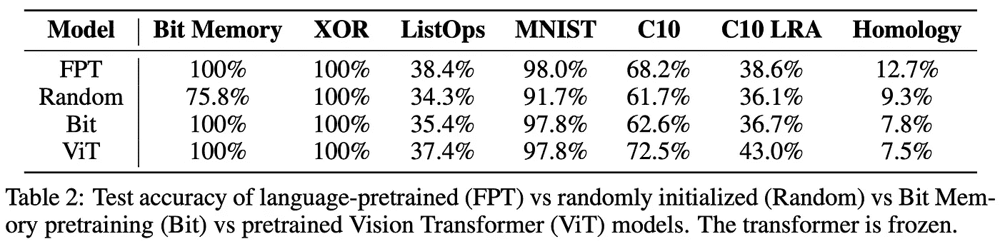

来源:https://arxiv.org/pdf/2103.05247.pdf

## [4。生成具有稀疏表示的图像](https://arxiv.org/abs/2103.03841)

*作者:查理·纳什、雅各布·梅尼克、桑德·迪勒曼和彼得·w·巴塔格利亚*

**🎖Why →** 提醒您，用于压缩的离散余弦变换(DCT)图像处理等经典众所周知的技术可以增强图像生成等 ML 任务。

**💡关键见解→** 部分受最近基于可能性的图像生成模型(如 OpenAI 或 VQ-VAE⁶的达尔·e⁵)的成功启发，本文探索了稀疏表示在任务中的应用。与 GANs 相比，基于似然性的生成模型的优点之一是，它们训练起来更稳定，并且也没有陷入没有覆盖图像分布的整个空间的模式的风险。使用稀疏表示的动机是它们易于压缩(有很多 0！)，研究神经网络在这种表示空间中的表现非常有趣，与常见的图像网格结构形成对比。

我个人不知道 JPEG 压缩中使用的 DCT 变换，它真的很酷。以手动方式，您可以将图像分割成几个像素(即 8×8)的块，然后将所有像素值拟合到 2D 中基于余弦的函数中，8×8 = 64 个自由度。这将图像块表示为由 64 个系数加权的 64 个“频率”函数的叠加。这些系数中的大部分可以在不影响感知图像质量的情况下被移除(我们人类不会看到很多小的高频信息)，这导致了易于压缩的稀疏表示(这就是为什么它被用于 JPEG 文件压缩)。看完[这段精彩的 DCT 介绍视频](https://www.youtube.com/watch?v=Q2aEzeMDHMA)后，这篇论文会更有意义。

本文构建的图像表示由一个来自这个 DCT 变换的所有非零稀疏系数的**列表(经过一些特殊的量化技巧，但您可以得到它的要点)以及它们的通道和位置信息组成。该模型被训练为自回归预测这些元组，考虑它们的值分类，以自我监督的方式最大化可能性。**

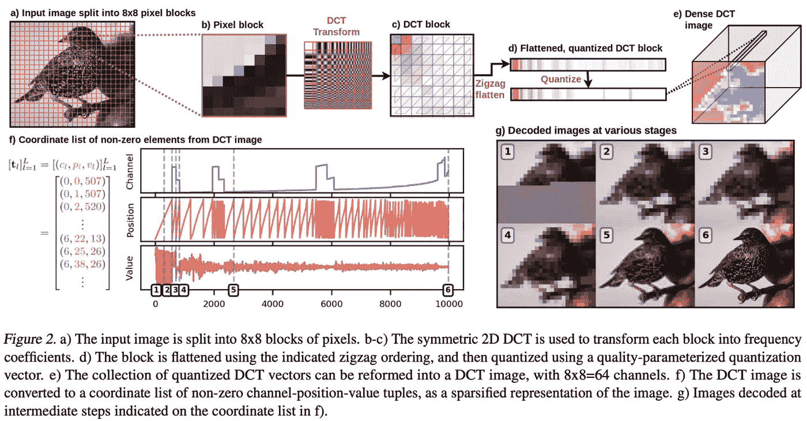

来源:https://arxiv.org/pdf/2103.03841.pdf

就结果而言，它们总体来说非常好；即使没有超过 SOTA，也可以与之相提并论(除了在比根仍然统治的阶级条件下)。然而，让我们不要忘记，这些指标只是人类判断质量的代理，所以用你自己的眼睛检查结果！

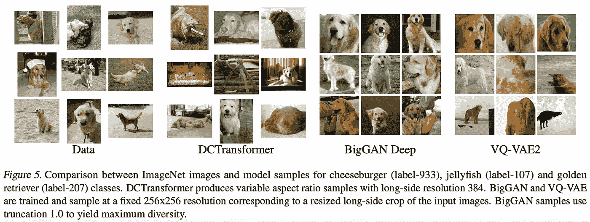

来源:[https://arxiv.org/pdf/2103.03841.pdf](https://arxiv.org/pdf/2103.03841.pdf)

## [5。ViViT:视频视觉转换器](https://arxiv.org/abs/2103.15691)

*作者:阿努拉格·阿纳、穆斯塔法·德赫加尼、格奥尔格·海戈尔德、孙辰、马里奥·卢奇奇和科迪莉亚·施密德。*

**🎖Why →** 变形金刚*征服*的又一个任务(这可能是一个独立的部分)。给定足够的参数和数据(以及适当的扩充)，似乎没有变压器不能破解的任务。

**💡关键见解→** 本文基于现有的视觉转换器(ViT ),例如“一幅图像相当于 16x16 words"⁷”,并尝试使用不同的策略来同时表示空间和时间维度。这项工作最有趣的一个方面是概述不同的策略来标记视频并对它们应用变形层。首先，在对视频进行标记时，他们解释了统一帧采样与小管嵌入，见下图。

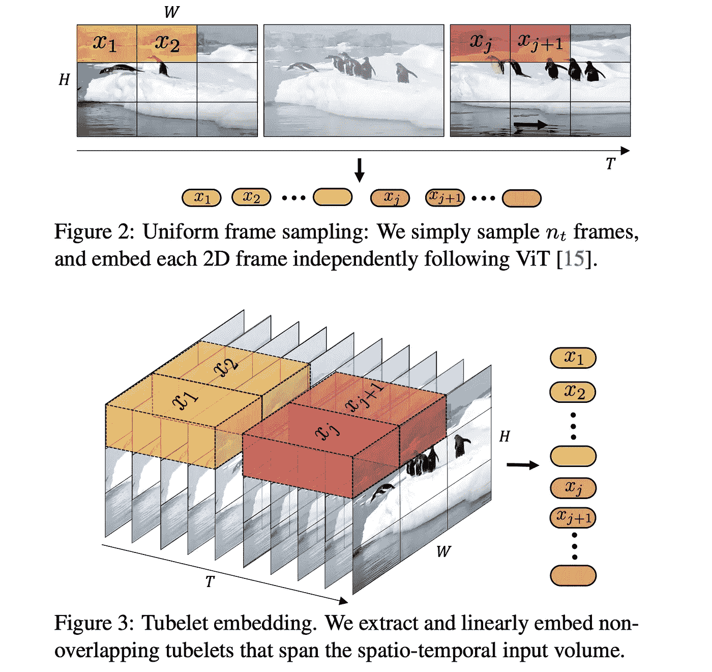

来源:https://arxiv.org/pdf/2103.15691.pdf

其次，在计算跨空间和时间的注意力时，他们提出了 4 种替代方案:时空注意力(一切关注一切)、因式分解的编码器(首先仅空间变换器，然后时间)、因式分解的自我注意力(每个变换器块具有空间然后时间的自我注意力块)、因式分解的点积注意力(一个具有空间头部和时间头部的自我注意力随后被连接)。

他们的消融显示，如果训练良好，4 种不同的模型并没有*那么*不同，并且在图像数据集上利用预先训练的变压器很有帮助。事实上，他们并没有真正详细地披露他们是如何预先训练他们的模型的，只是说他们是在 ImageNet 或 JFT 数据集上进行的。他们在多个视频分类基准测试中取得了一流的性能，包括 Kinetics 400 和 600、Epic Kitchens、Something-Something v2 和 Moments in Time。标签平滑、混合和随机深度等增强和技巧仍然是实现这一性能的关键，正如它们的消融所示。

## [6。感知者:具有重复注意的一般感知](https://arxiv.org/abs/2103.03206)

安德鲁·耶格尔、菲利克斯·吉梅诺、安德鲁·布洛克、安德鲁·塞斯曼、奥里奥尔·维尼亚尔斯和若昂·卡雷拉。

**🎖Why →** 对数据进行尽可能少的假设是有趣的，因为它有潜力很好地转移到许多领域。在这种情况下，*感知者*是一个关注可伸缩性(消除自我关注的讨厌的 N 次方),并对数据结构做最小假设的架构。

**💡关键见解→** 感知者架构包括重复以下架构模块，包括:

*   潜在表示(大小为 NxD，长度为嵌入大小)和数据的原始表示(大小为 MxC，长度为通道)之间的交叉关注步骤。这使得交叉注意力具有 NxM 而不是 MxM 的复杂度，这在 N<
*   A transformer layer that maps a latent representation to another latent representation of the same shape (see figure below).

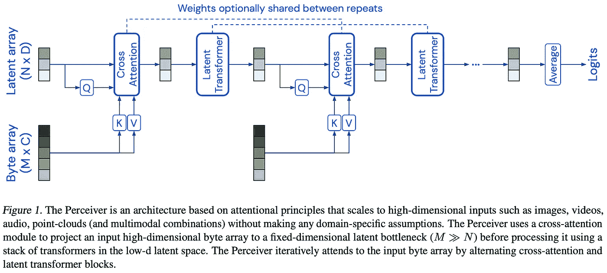

Source: [https://arxiv.org/pdf/2103.03206.pdf](https://arxiv.org/pdf/2103.03206.pdf)时是相当大的

这可以被认为是将原始表示重复缩小为潜在表示。假设在该实现中，块共享它们的权重，则可以认为是展开的 RNN。实际上，在附录中我们可以看到重量共享和非重量共享之间的比较，其中前者达到更好的性能，因为它不像非重量共享那样过度拟合；这种重量分担导致 44M 参数模型。

作者对各种形式进行了实验:图像、原始音频、视频、原始音频+视频和点云。虽然结果部分不是很全面，但性能与现有模型相当或更好，特别是与现有的多模态模型相比(例如，ImageNet top-1 上的 85.7%)。结果令人印象深刻，但我们不能忘记细节:虽然架构对所有模态保持相同，但需要一些**模态特定的扩展和位置嵌入**来实现它(裁剪、特殊位置编码等)。)

顶级 ImageNet 性能。红色的方法利用了特定领域的“图像*网格结构”,而蓝色的结果则没有。来源:*【https://arxiv.org/pdf/2103.03206.pdf】T4

## [7。注意力并不是你所需要的全部:纯粹的注意力会随着深度成倍地下降👾](https://arxiv.org/abs/2103.03404)[代码](https://github.com/twistedcubic/attention-rank-collapse)

*作者董一禾、让·巴普蒂斯特·科多尼尔和安德烈亚斯·卢卡斯。*

**🎖Why →** 偶尔一篇理论论文不会要了我们的命，有时它们会提供有价值的见解，而不仅仅是到处都是可怕的核心数学。这就是一个这样的例子:为什么这些跳跃连接如此重要？

**💡关键见解→** 感谢上帝，我们有这些跳过连接。注意**和跳过连接**是你需要的全部*。

好吧，让我们扩展一下，你可能听说过跳过连接(或残差)有助于通过更深的网络传播梯度稳定训练。这篇论文提供了一个理论基础，解释了为什么这在变形金刚中如此重要:没有变形金刚，自我注意力输出可以证明会非常快速地退化——通过 SGD*成双指数级——*，这意味着它会变成一个秩 1 矩阵，其中*会杀死流经它的*信息(即，想象一个嵌入序列，其中所有嵌入都是彼此的倍数)。

这篇论文的主要观点与其说是惊人的见解，不如说是对现有怀疑的确认。一些工作已经根据经验展示了如何将注意力矩阵分解成对性能影响最小的低秩矩阵，例如“Linformer"⁸.”

## [8。可变速率离散表示学习](https://arxiv.org/abs/2103.06089) |⏯[演示](https://vdrl.github.io)

*作者:桑德·迪勒曼、查理·纳什、杰西·恩格尔和卡伦·西蒙扬。*

🎖Why → 可变利率表示法的想法令我着迷。直觉上，听和理解口语，信息并不是均匀分布的，我们的表征又何必如此呢？这提出了许多挑战，但很高兴看到研究解决了这个问题。

**💡关键见解→** 这项工作构建了基于*事件的*表示，涉及随时间量化的编码器解码器架构，经过训练后，解码器输出的对数似然性最大化，以适应量化的潜在表示。“慢度惩罚”激励潜在表示保持与前一时间步相同的值；这种惩罚是由明确强加容量瓶颈的想法所激发的。他们使用的另一个技巧是*施密特触发量化*:由于噪声，量化值可能会跳跃太多，因此 STQ 会施加一个记忆量化，只有当变量变化超过一定量时才会跳跃。

给定这种设置，直觉是量子化的潜在表示应该只在有*事件时改变。*例如，如果有 2 秒钟的沉默，表征可能会保持不变，但如果有人在说话，平均事件发生率(AER，潜在表征的变化)应该会更高。将编码器和解码器参数化的神经网络是一个“鼓形变压器”,要完成这项工作，还需要本文中详述的更多技巧。

关于结果，最有趣的部分是关于所有超参数的烧蚀，如慢度、AER、量子化水平等。与现有工作的比较不像人们所希望的那样广泛，但这主要是因为口语建模的自动评估不是非常可靠。

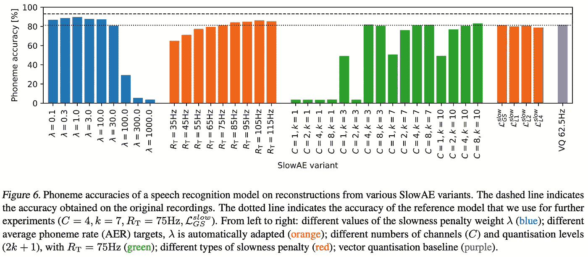

来源:[https://arxiv.org/pdf/2103.06089.pdf](https://arxiv.org/pdf/2103.06089.pdf)

## [9。巴洛双胞胎:通过减少冗余进行自我监督学习](https://arxiv.org/abs/2103.03230) |👾[代号](https://github.com/facebookresearch/barlowtwins)

作者:Jure Zbontar、李静、Ishan Misra、Yann LeCun 和 Stéphane Deny。

**🎖Why →** 这是一个新的自我监督的损失！它非常简单，可与其他 SOTA 表示学习技术(SimCLR，BYOL)相媲美，并呈现了一些有趣的特性，值得进一步研究…

**💡关键见解→** 我喜欢将它概念化的方式是在“每个特征”的基础上进行某种对比学习(但是不要做太多的类比，因为这是不正确的)。您有一个图像的两个视图(假设两个作物)，您最大化每个特征的相关性，同时最小化其余特征之间的相关性。您也可以将此视为计算两个表示的外积(估计两个表示的互相关)，对整个批次求和并归一化，并使其尽可能接近一个单位矩阵。

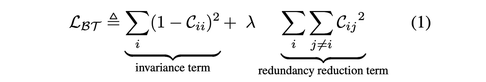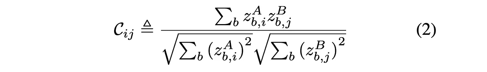

巴洛双胞胎损失函数。

这一目标的理论依据可以追溯到 1961⁹的神经科学家 H. Barlow，他假设处理感官信息的目标是将其重新编码为*阶乘代码*，这意味着具有令人满意的独立成分的表示。巴洛孪晶损失函数受这一想法的启发，因为它鼓励表示只与每个分量**相关，而不是全局相关。**

其结果可与现有的表示学习技术相媲美，如 BYOL 和 SimCLR，但它有几个有趣的特性。首先，与 BYOL 不同，它对较小的批量(小= 256，512)似乎很稳健；对于大批量(2048，4096)，它实际上会降级！我们就此询问了作者，他们告诉我们他们也很困惑。第二，表示维度似乎没有饱和，与比较的方法不同，它不断改进下游性能。

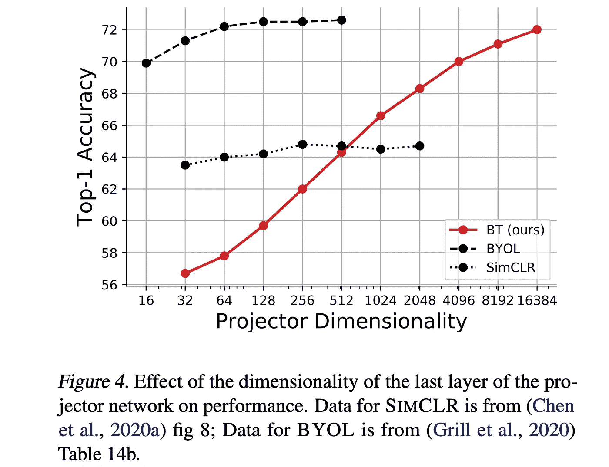

来源:[https://arxiv.org/pdf/2103.03230.pdf](https://arxiv.org/pdf/2103.03230.pdf)

## [10。如何在神经网络中表示部分-整体层次](https://arxiv.org/abs/2102.12627)

杰弗里·辛顿。

**🎖Why →** 深度学习的创始人之一押注于计算机视觉的关键挑战是什么以及如何解决这些挑战。但是没有提供一个工作系统。(还没？).

**💡关键见解→** 论文提出的第一点是，人类将视觉场景解析为*部分-整体层次*，并在元素之间建立视点不变的空间关系。换句话说，我们将图像的一部分表示为一个层次结构，即什么东西属于什么东西(或者对象的子部分等等)，并且这些是视点不变的(我们将铅笔和纸建模为当我们四处移动时仍然是相同的*)。这项工作似乎是他的胶囊网络⁰想法的自然延伸，也试图捕捉不同层次的表现。*

*根据 Hinton 的说法，这里的主要问题是，当前的端到端神经网络不允许我们动态构建这些解析树，并动态分配神经元组来表示其中的节点。他设想的解决方案——GLOM——最好理解为处理一系列图像(或视频)。它由代表不同层次视觉结构的向量列迭代表示图像的块组成(即每个块约 5 个向量)。在每个时间步，这些列以不同的贡献进行更新:自下而上的预测(L-1 到 L)，自上而下的预测(L+1 到 L)，相同级别的预测，以及补丁邻域中嵌入的注意力加权平均。理想情况下，对其进行训练将在不同级别产生相同向量的*岛，对应于表示其部分-整体层次的图像的解析树。**

*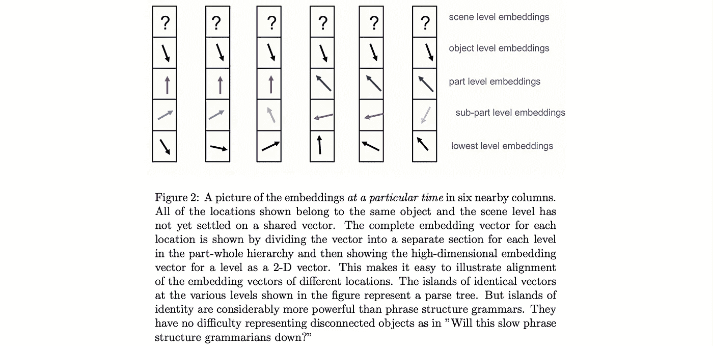*

*来源:[https://arxiv.org/pdf/2102.12627.pdf](https://arxiv.org/pdf/2102.12627.pdf)*

*论文继续用生物学、数学和神经网络的观点来推动这一点；以及描述关于该系统如何以及为什么工作的许多考虑，这些考虑太长了，无法在此进行总结。*

*最后，尽管这篇文章没有描述一个工作系统，但是有些人已经[实现了它](https://github.com/lucidrains/glom-pytorch)，所以来看看吧！*

*我们的每月精选到此结束；如果你想了解最新的研究，请在 Twitter 上关注我们。我已经在期待着分享五月的下一个选择；回头见！*

**参考文献**

*[1] " [SuperGLUE:通用语言理解系统的更具粘性的基准](https://arxiv.org/abs/1905.00537)"作者 A. Wang，Y. Pruksachatkun，N. Nangia，A. Singh 等人 2019。*

*[2] " [SpanBERT:通过表示和预测跨度来改善预训练](https://arxiv.org/abs/1907.10529)" Mandar Joshi，Chen 等人 2019。*

*[3]“[RoBERTa:稳健优化的 BERT 预训练方法](https://arxiv.org/abs/1907.11692)”，作者刘，Myle Ott，Naman Goyal，杜等，2019。*

*[4]“[重要的不仅仅是规模:小型语言模型也是很少尝试的学习者](https://arxiv.org/abs/2009.07118)”Timo Schick 著，Hinrich Schütze，2020 年。*

*[5]“[零镜头文本到图像生成](https://arxiv.org/abs/2102.12092)”作者 Aditya Ramesh、Mikhail Pavlov、Gabriel Goh、Scott Gray、Chelsea Voss、Alec 拉德福德、陈唐山和 Ilya Sutskever 等人，2021。*

*[6] " [神经离散表征学习](https://arxiv.org/abs/1711.00937)" Aaron van den Oord，Oriol Vinyals，Koray Kavukcuoglu 等人 2017。*

*[7][《一幅图像抵得上 16x16 个字:大规模图像识别的变形金刚](https://arxiv.org/abs/2010.11929)》阿列克谢·多索维茨基、卢卡斯·拜尔、亚历山大·科列斯尼科夫、德克·韦森博恩、翟晓华等人 2020。*

*[8]“[林前者:线性复杂性的自我注意](https://arxiv.org/abs/2006.04768)”，作者:王思农、李贝琳达、马迪安·卡巴萨、和，2020。*

*[9] " [感官信息转换的潜在原则](https://mitpress.universitypressscholarship.com/view/10.7551/mitpress/9780262518420.001.0001/upso-9780262518420-chapter-13)" Horace Barlow，1961。*

*[10] " [胶囊间的动态路由](https://arxiv.org/abs/1710.09829)" Sara Sabour，Nicholas Frosst，和 Geoffrey E. Hinton，2017。*

*[11]“自动提示:通过自动生成的提示从语言模型中获取知识”T19，作者:Taylor Shin，Yasaman Razeghi，Robert L. Logan IV，Eric Wallace 和 Sameer Singh，2020 年。*