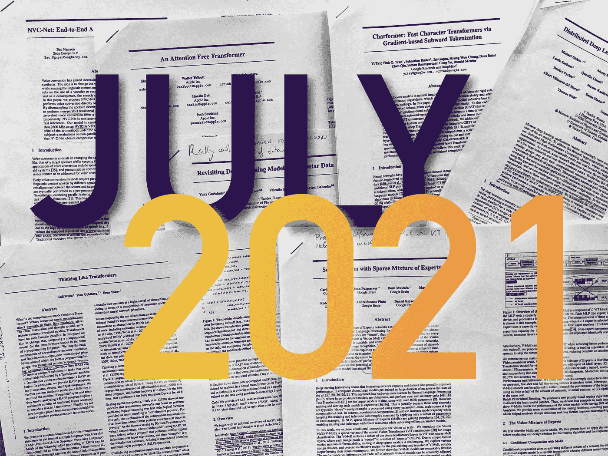
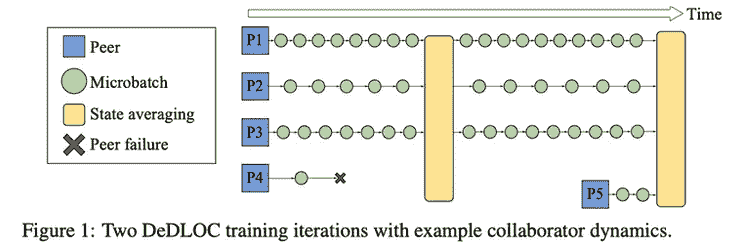
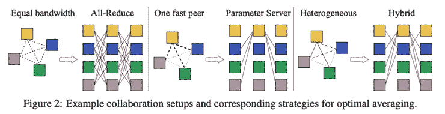
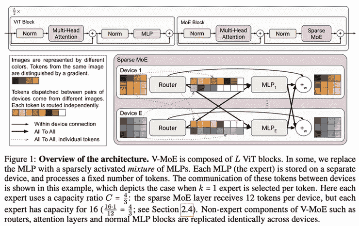
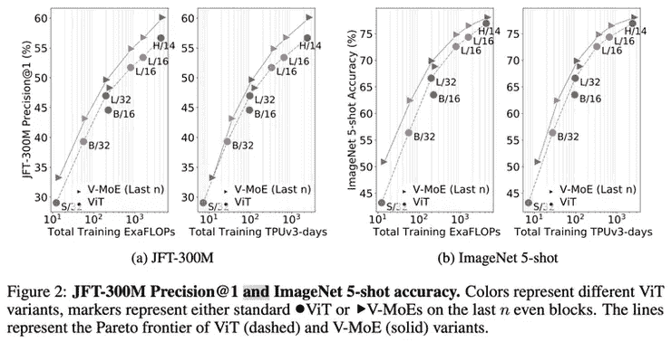
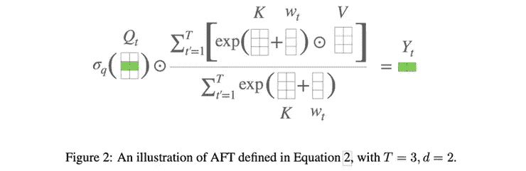
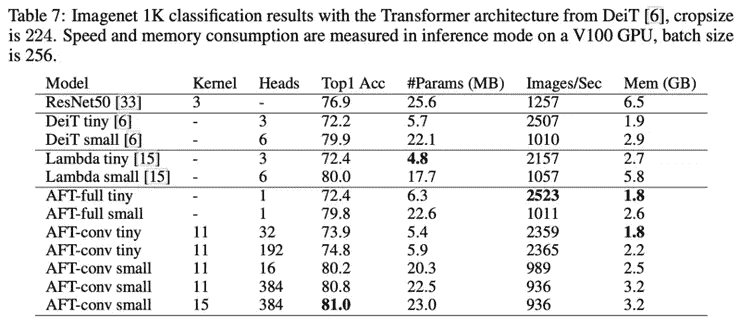
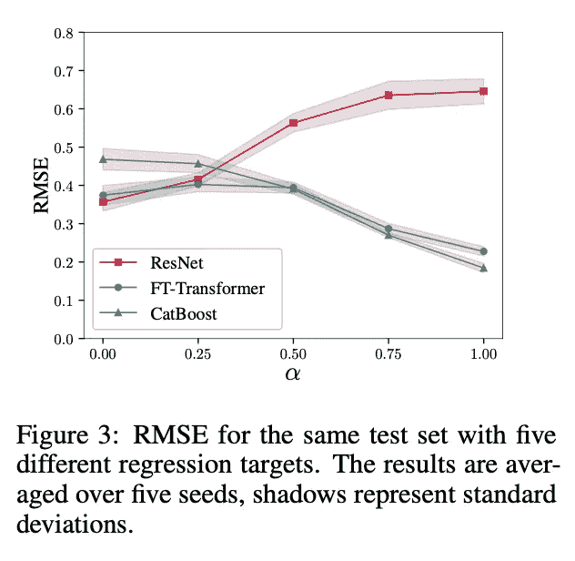
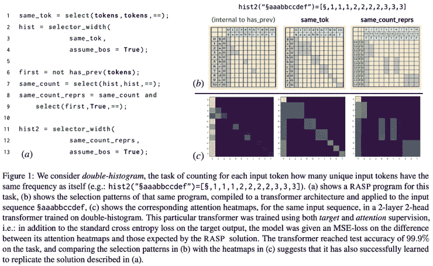
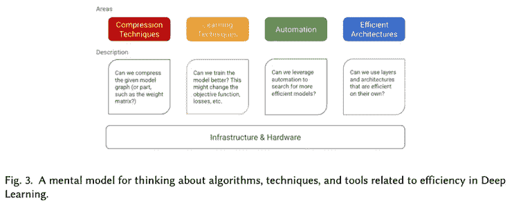

# arXiv 精选—2021 年 7 月阅读

> 原文：<https://towardsdatascience.com/best-of-arxiv-readings-for-july-2021-d09a192d7fd8?source=collection_archive---------15----------------------->

## 最近的 ML 论文每月精选:专家的回归，注意力可能没有那么特别，像变形金刚一样思考是什么感觉？

图片作者。

在你的阅读清单上保持领先是很难的，而找到哪些论文应该在清单上就更难了。在 [Zeta Alpha](https://search.zeta-alpha.com/) 我们总是密切关注最新的人工智能研究，所以我们每月都会分享一些最近的论文，以展示我们认为会有影响力的出版物，主要基于每部作品的贡献和作者的影响力。不要把这个列表看得太全面:像其他人一样，我们也有自己的偏见，但是你能从 4000 多篇论文中选择的就这么多了。

这个月，我们将志愿者计算带到了最前沿，更多的变形金刚，专家的组合等等。尽情享受吧！

## [开放协作中的分布式深度学习](https://arxiv.org/abs/2106.10207) |👾[代号](https://github.com/yandex-research/DeDLOC)

*迈克尔·迪斯金、阿列克谢·布克蒂亚罗夫、马克斯·里亚宾等人*

**❓Why →** 汽车几乎一生都在停放，同样，世界上很大一部分计算在大部分时间处于闲置状态。这篇论文展示了志愿者计算——不同团体自愿提供计算资源——如何成功地训练大型语言模型。

**💡关键见解→** 志愿者计算(VC)是一种范式，其中各方通过为一种通用算法提供计算资源来进行合作(例如，人们在睡觉时让他们的个人计算机为其他人运行东西)。尽管前景看好，但风险投资并不是免费的午餐:要让它在实践中发挥作用，需要许多考虑因素和谨慎的设计决策，因为你可以从参与者那里假设很少:他们的互联网可能有不同的速度和延迟，硬件可能从移动芯片到高端多 GPU 节点。您希望能够使用一个异质的志愿者团队，为需求设置一个低标准，但是您也希望避免使用最小公分母来平衡所有资源。

本文出色地展示了现有的分布式计算范例，同时讨论了它们的主要权衡，例如节点通信与计算。基于这一分析，作者提出了 DeLOC，其中对等体独立且异步地对*微批次*执行训练步骤，存储网络一小部分的权重梯度，并以一定的频率聚合它们，以更新整个模型的状态。实际上，这相当于在非常大的批量上训练整个模型。节点进行通信以同步模型的全局状态的方式介于“参数服务器”和“全简化”模型之间(即，一个中心节点进行聚合，或者所有节点自己进行聚合)。所有这些*超参数*，比如多长时间一次以及哪些节点互相通信，都被巧妙优化，以最大化训练吞吐量。

来源:https://arxiv.org/pdf/2106.10207.pdf

实现是通过 [Hivemind](https://github.com/learning-at-home/hivemind) 完成的，这是一个专门从事志愿者计算的 PyTorch 库(下面将更深入地描述)。

## [利用专家的稀疏混合来缩放视觉](https://arxiv.org/abs/2106.05974)

*作者:卡洛斯·里克尔梅、琼·普伊格韦尔、巴兹尔·穆斯塔法等人*

**❓Why →** 混合专家正在成为将模型扩展到惊人规模的首选技术:关键优势是增加模型参数的可能性，同时保持推理计算成本不变。

**💡关键见解→** 简而言之，专家的混合是一个模型，其中输入在推理时被路由到不同的子模型:推理的计算成本将由*使用的计算路径*决定，而模型表达能力将由参数的总数决定；有点儿两全其美。

专家的混合先前已经表明对于语言模型转换器(例如开关转换器)和系统(例如 FastMoE)是有效的，但是还没有在这种规模上应用于图像。该模型几乎与原始 ViT 相同:将图像分成小块，线性投影到小块嵌入中，并作为序列通过转换器。然而，在这种情况下，常规 ViT 层与 MoE ViT 层交错，其中 MLP 前馈层由一组 *k* MLP 专家取代，在此之前有一个路由器，该路由器根据输入*的值通过不同的*专家*发送每个图像补丁。*专家和路由器都通过梯度下降进行训练，并精心设计损失函数，以激励训练中的各种专家，避免崩溃模式，例如只有一个活跃的专家。

来源:[https://arxiv.org/pdf/2106.05974.pdf](https://arxiv.org/pdf/2106.05974.pdf)

也许 MoE 应用于大型神经网络的最令人惊讶的结果是，相对于原始 ViT，学习效率(即，将模型训练到特定性能所需的计算量)得到了显著提高。

来源:[https://arxiv.org/pdf/2106.05974.pdf](https://arxiv.org/pdf/2106.05974.pdf)

最近的其他工作比较了计算机视觉的 CNN 和 Transformers:[VOLO:视觉识别的 Vision outlook er](https://arxiv.org/abs/2106.13112)及其在 GitHub 上的[流行实现。](https://github.com/sail-sg/volo)

## [无注意力变压器](https://arxiv.org/abs/2105.14103)

*翟双飞等人*

**❓Why →** 加入上个月基于 MLP 的 CV 架构的热潮，越来越多的证据表明*注意力*本身并没有多少特别之处。只要网络以某种方式模拟其输入的相互作用，在给定足够的参数和数据的情况下，梯度下降将*恰好*找到它的方式。

**💡Key insights →** 作者提出了一种简单的学习成对偏差 *w* 添加到关键字矩阵，而不是将注意力计算为查询和关键字矩阵之间的传统矩阵乘积，该偏差通过以下表达式形式的指数进行转换，其中 *t* 是序列元素，所有乘积都是元素式的，而不是点积。

当计算完整的*注意力-自由-注意力*时，计算成本并没有减少(只在内存空间中)，在我看来，最有趣的一点是这样的事实:结果不是 SOTA，但它们足够高，足以引起一些人的注意。实验在图像(使用图像自回归建模)和文本(自回归语言建模)上进行，显示了该机制的通用性。

来源:https://arxiv.org/pdf/2105.14103.pdf

你可能还会喜欢… [Charformer:通过基于梯度的子词标记化的快速字符变形器](https://arxiv.org/abs/2106.12672)，它与上个月发布的字符级 T5 语言模型 byt⁵⁶[有相似的精神。](https://arxiv.org/abs/2105.13626)

## [重新审视表格数据的深度学习模型](https://arxiv.org/abs/2106.11959)

*尤里·戈里什尼、伊万·鲁巴切夫、瓦伦丁·赫鲁尔科夫和阿尔特姆·巴奔科。*

**❓Why →** 表格数据可能是学术研究和行业应用之间利益差距最大的形式之一，学术研究如今很少受到关注，而行业应用则无处不在。也许是因为深度学习的最新和最棒的在这里做得不太好…？无论如何，这篇文章是我很久以来看到的最好的表格数据直接比较方法！

**💡关键见解→** 梯度推进决策树(GBDTs)自 200 年⁴以来就已经存在，诸如 [XGBoost](https://github.com/dmlc/xgboost) ⁷等流行的实现被广泛使用是有充分理由的:深度学习方法仍然没有在稳健和全面方面胜过它。

这项工作提出了许多表格数据集和几种算法的详细数值结果，重要的是，没有对神经网络进行额外的优化和技巧；然而，它们开箱即用。在我看来，最有见地的一点是他们使用合成数据进行的实验。作者使用适应 GBDTs 风格决策规则或神经网络回归的试探法生成合成表格数据集。当混合到不同程度时，结果是一系列数据集，其中两种技术有望优于另一种。在下图中，最左侧是神经网络友好数据集的误差，最右侧是 GBDT 友好数据集的误差。正如预期的那样，ResNet 和 CatBoost 在两者之间表现出明显的权衡，但基于 Transformer 的分类器似乎是一个*万事通，不精通*。

来源:https://arxiv.org/pdf/2106.11959.pdf

另见:[表格数据:深度学习不是你需要的全部](https://arxiv.org/abs/2106.03253)。

## [像变形金刚一样思考](https://arxiv.org/abs/2106.06981)

盖尔·维斯、约夫·戈德堡和埃兰·亚哈夫。

**❓Why →** 这篇论文与众不同，很有趣。用新的方式思考和谈论已知的东西对于发展新的想法是必不可少的，这是一个很好的例子。作为一个奖励，[魔鬼在细节中](https://openreview.net/forum?id=HyGBdo0qFm)，看起来[注意力是图灵完全的](https://jmlr.org/papers/v22/20-302.html) ⁸(有点像？).

**💡关键见解→** 受限访问序列处理语言(RASP)是一种编程语言，能够自然地表达转换器执行的计算。要点如下，RASP 将转换器建模为处理长度为 n 的序列和大小为 n×n 的矩阵的任意算法。输入序列可以通过逐元素操作和/或通过*选择*和*聚合*元素来转换，这些元素的关系通过*类*注意力矩阵(聚合器)来建模。差不多就是这样，您可以通过只使用本文中显示的这些原语来解决许多任务，这些原语可以很好地映射到 Transformer 计算中，并且可以相互编译。

来源:[https://arxiv.org/pdf/2106.06981.pdf](https://arxiv.org/pdf/2106.06981.pdf)

最有趣的见解之一是如何在 RASP 形式中表达受限注意力转换器(例如，高效转换器)(例如，通过在某些区域将*聚合器*矩阵设置为假)必然削弱其计算表达能力。作者在综合任务中展示了这一点，如排序，只有完全转换才能成功。

用于展示 RASP 及其预测和理解转换器如何执行计算的其他综合任务包括反转字符串、制作直方图、双直方图、按字母顺序排序、返回最频繁的令牌以及识别 Dick-k 语言。

## [高效深度学习:关于让深度学习模型更小、更快、更好的调查](https://arxiv.org/abs/2106.08962)

*作者高拉夫·蒙哈尼。*

**❓Why →** 虽然没有任何新颖的贡献，但这是一篇从工程师角度出发的精彩介绍，涵盖了每个从业者都应该知道的高效数据挖掘的相关技术。

**💡关键见解→**DL 的效率有很多方面。也许最重要的区别在于学术研究花费最多资源的**训练**和大规模应用花费最多资源的**推理**；这项调查涵盖了这两种情况。

例如，这项工作向读者介绍了数据扩充、提炼或迁移学习等技术，这些技术对培训效率有着积极的影响。同时，其他解释的技术，如量化或剪枝，通常用于提高推理效率。

涵盖的其他主题包括超参数优化、高效架构和关于框架的基础设施考虑事项，如 [PyTorch Mobile](https://pytorch.org/mobile/home/) 或 [TensorFlow Lite](https://www.tensorflow.org/lite) ，它们是生态系统的关键要素。调查中最有用的部分之一是在每一部分末尾推荐的经验法则和方法，它们有助于将每种技术与其用例联系起来。

来源:[https://arxiv.org/pdf/2106.08962.pdf](https://arxiv.org/pdf/2106.08962.pdf)

调查可能是了解你不是专家的研究领域发生了什么的最好方法。以下是其他最近的调查，作为进入这些领域的一个极好的切入点:[自然语言处理的图形神经网络:一项调查](https://arxiv.org/abs/2106.06090)、[一项关于变形金刚的调查](https://arxiv.org/abs/2106.04554)、[一项关于在低资源情况下自然语言处理的最近方法的调查](https://www.aclweb.org/anthology/2021.naacl-main.201/)

我们的月度评选到此结束；如果你想了解最新的研究，请关注我们的 Twitter [@zetavector](https://twitter.com/ZetaVector) *。*下集再见！

*参考文献*

[1] [*开关变压器:以简单有效的稀疏性缩放至万亿参数模型*](https://arxiv.org/abs/2101.03961)——William Fedus、Barret Zoph 和 Noam Shazeer，2021。

[2] [*FastMoE:一种快速的专家混合训练系统*](https://arxiv.org/abs/2103.13262) —何家傲等，2021。

[3] [*一幅图像抵得上 16x16 个字:大规模图像识别的变形金刚*](https://arxiv.org/abs/2010.11929)——作者阿列克谢·多索维茨基、卢卡斯·拜尔、亚历山大·科列斯尼科夫、德克·韦森博恩、翟晓华等 2021。

[4] [*贪婪函数逼近:一个梯度推进机*](https://projecteuclid.org/journals/annals-of-statistics/volume-29/issue-5/Greedy-function-approximation-A-gradient-boostingmachine/10.1214/aos/1013203451.full)—j . h . Friedman 著，2001。

[5] [*从大型语言模型中提取训练数据*](https://arxiv.org/abs/2012.07805)*—*Nicholas Carlini 等人 2020。

[6] [*ByT5:用预先训练好的字节到字节模型走向无令牌的未来*](https://arxiv.org/abs/2105.13626)*——作者:*薛、阿迪蒂亚·巴鲁阿、诺亚·康斯坦特、拉米·阿尔-Rfou 等人 2021。

[7] [*XGBoost:一个可扩展的树提升系统*](https://arxiv.org/abs/1603.02754) —陈天琦，Carlos Guestrin，2016。

[8] [*XCiT:互协方差图像变形器*](https://arxiv.org/abs/2106.09681)*——*Alaaeldin El-Nouby 等人 2021。

[9] [*注意力是图灵——完成*](https://jmlr.org/papers/v22/20-302.html)*——*豪尔赫·佩雷斯、巴勃罗·巴塞洛和哈维尔·马林科维奇，2021。

[10] [*通过内容自适应多分辨率合并将单目深度估计模型提升到高分辨率*](https://arxiv.org/abs/2105.14021) *—* 作者:S. Mahdi H. Miangoleh，Sebastian Dille，龙脉，Sylvain Paris 和 Ya yaz Aksoy，2021。