# arXiv 精选—2021 年 3 月阅读

> 原文：<https://towardsdatascience.com/best-of-arxiv-readings-for-march-2021-c707263b2778?source=collection_archive---------20----------------------->

## ML 论文每月精选。

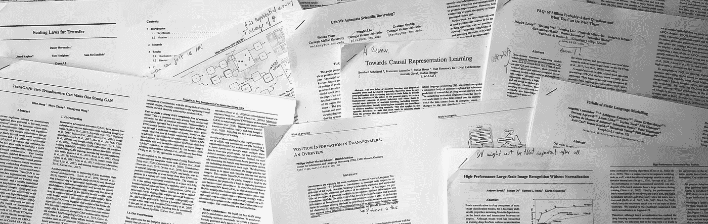

在你的阅读清单上保持领先是很难的，而找到哪些论文应该在清单上就更难了。在 [Zeta Alpha](https://search.zeta-alpha.com/) 我们总是密切关注最新的人工智能研究，所以我们每月都会分享一些最近的论文，以展示我们认为会有影响力的出版物，主要基于每部作品的贡献和作者的影响力。不要把这个列表看得太全面:像其他人一样，我们也有自己的偏见，但是你能从 4000 多篇论文中选择的就这么多了。尽情享受吧！

## [TransGAN:两个变形金刚可以组成一个强大的 GAN](https://arxiv.org/abs/2102.07074) 👾[代号](https://github.com/VITA-Group/TransGAN)

*由、畅&由王。*

**🎖Why →** 变形金刚*征服*的又一个任务。事实上，我很惊讶地听说，以前没有人成功地建立了完全基于变压器的 GANs 但是它们很难做好，需要一些技巧，本文将对此进行探讨。主要作者江一帆告诉我们，⁴之前曾与甘斯广泛合作，这对我们帮助很大，因为魔鬼在细节中，很可能许多人在这次尝试之前已经尝试过，但没有成功。

**💡关键见解→** GANs 向来以训练不稳定著称，TransGAN 更是如此。一个完全基于 Transformer 的 GAN 不能开箱即用，它需要一些技巧来使它的性能与它的成熟的 CNN 兄弟相当。

实现这一点的 3 个主要技巧是:

*   数据扩充是强大性能的关键(对于基于 CNN 的 GANs 来说，这一点并不突出)。
*   作为均方误差的辅助自监督重建损失。
*   在训练中动态增加注意感受野，从仅局部注意开始，逐渐增加到全局注意。这可能是最有争议的技巧，因为局部注意力是对像素邻域的线性操作，这与卷积核的操作非常接近。

这最后一点并没有使研究无效，但是证实了归纳偏差在 ML 中的重要性。此外，最新的结果令人印象深刻，需要在这个方向上进一步研究。

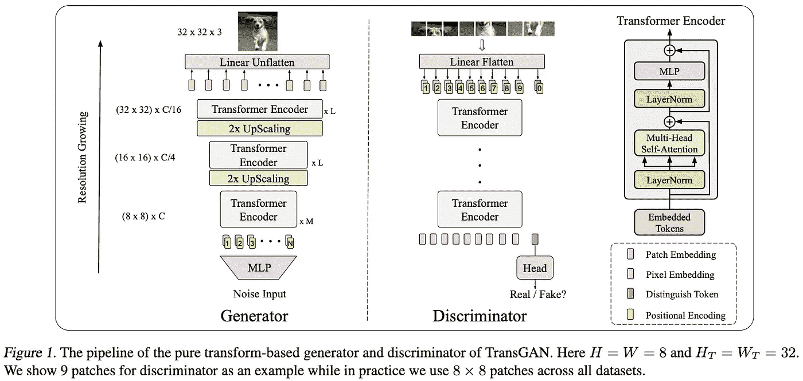

资料来源:https://arxiv.org/pdf/2102.07074.pdf

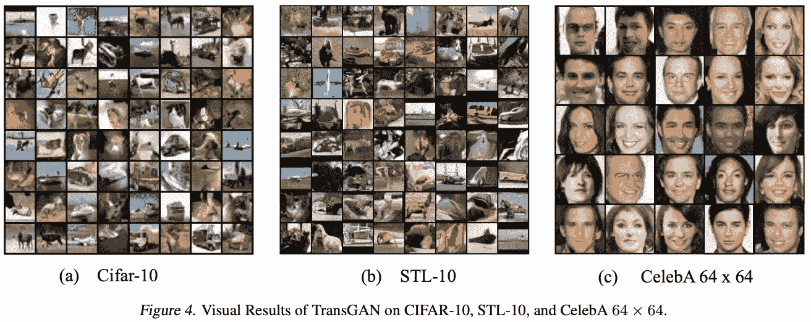

来源:[https://arxiv.org/pdf/2102.07074.pdf](https://arxiv.org/pdf/2102.07074.pdf)

## [转移的标度律](https://arxiv.org/abs/2102.01293)

*来自 OpenAI 的 Danny Hernandez 等人*

**🎖Why →** 迁移学习正变得越来越重要，因为自我监督的预训练和特定任务的微调是许多任务实现 SOTA 的主导范式。本文从 OpenAI 的大规模实验中得出经验法则，量化迁移对语言建模的帮助。

**💡关键见解→** 传输的有效数据被定义为从头开始的模型需要匹配传输的模型性能的数据量。这种有效的数据传输遵循以下形式的幂定律:

其中 *D_F* 为微调数据大小，N 为模型参数个数。令人印象深刻的是，这个经验法则适用于从文本到 python 数据的转换实验，而不是从头开始训练；对于模型大小在 4 个数量级以内、目标数据集大小在 3 个数量级以内的语言建模任务。

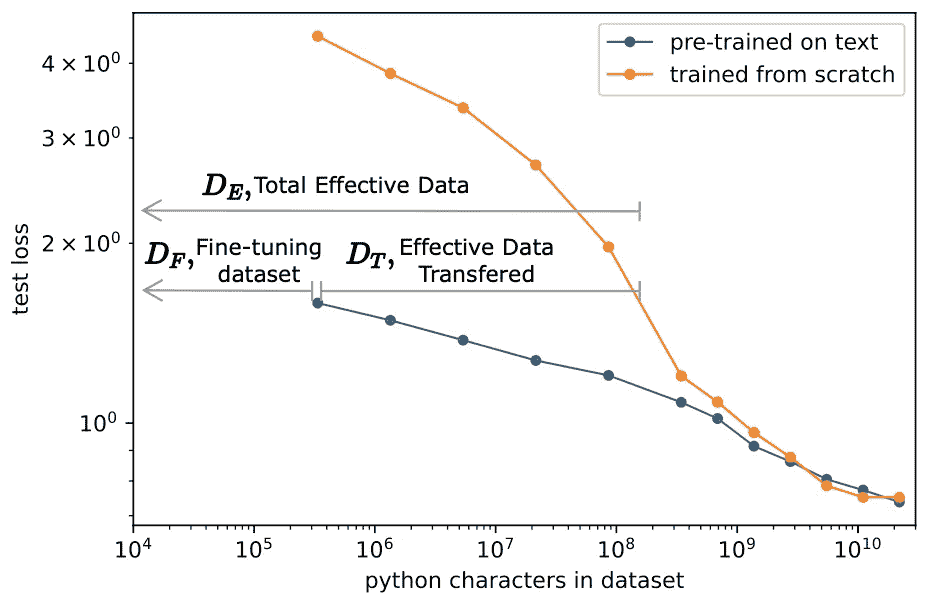

有效数据、有效数据传输和微调数据集等关键概念的可视化解释。来源:[https://arxiv.org/pdf/2102.01293.pdf](https://arxiv.org/pdf/2102.01293.pdf)

这篇论文仍然有许多局限性，例如，实验只关注英文文本和 python 代码之间的转换，但在模型和数据集不断增加的时代，比例定律将是相关的。最有趣的结果之一是，即使在微调数据集“很小”的情况下，根据文本预训练的模型也不会受到“数据约束”，这与从头开始训练不同(见下图)。

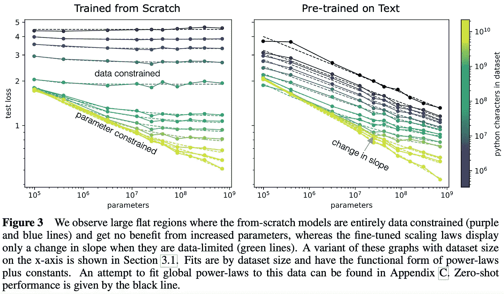

来源:[https://arxiv.org/pdf/2102.01293.pdf](https://arxiv.org/pdf/2102.01293.pdf)

## 我们能自动化科学审查吗？(没有，但是……)|👾[代码](https://github.com/neulab/ReviewAdvisor) | 🕹 [演示](http://review.nlpedia.ai)

*作者袁，&格雷厄姆纽比格。*

🎖 **为什么→** 这个挑衅性的标题背后隐藏着一项关于科学审查自动化的细致而严肃的研究。有趣的是，问这个问题的行为暗示了对当前复习状态的某种程度的怀疑…

**💡关键见解→** 本文提出使用 NLP 模型为科学论文生成第一轮同行评审。作者收集了机器学习领域的论文数据集，用每篇评论中涵盖的内容的不同方面对它们进行注释，并训练有针对性的摘要模型，该模型接收论文以生成评论。他们进行了大量的实验，以表明系统生成的评论往往比人工撰写的评论触及更多的论文方面，但生成的文本在所有方面的建设性都较低，除了对核心观点的解释，这些观点在很大程度上是事实上正确的。(第一段完全是由本文介绍的系统生成的。)

该论文的结论是，**评论生成在当前状态下不能取代人工评论者**，但是作为一个辅助过程可能是有帮助的。为了证明这一立场，作者定义了一组可以在一定程度上客观衡量的定量研究人类评论的方面:

*   果断性—以推荐准确度(RAcc)衡量
*   全面性——用方面覆盖率(ACov)和方面召回率(ARec)来衡量
*   调整—以信息含量(Info)衡量，如
*   准确性——以汇总准确性(SAcc)衡量

生成的评论非常令人印象深刻，但它**在关键的事实陈述**中出现，因为这是文本生成模型经常出现的情况，这在科学评论环境中是不可接受的。数据集的收集和评估非常广泛和复杂，因此值得一试。这项工作提出了一个有趣的问题:如果自动审查模型比人好得多(如果可以正确定义的话)，它应该被使用吗？古德哈特定律“当一个指标成为一个目标，不再是一个好的指标”会对它造成更严重的影响吗？

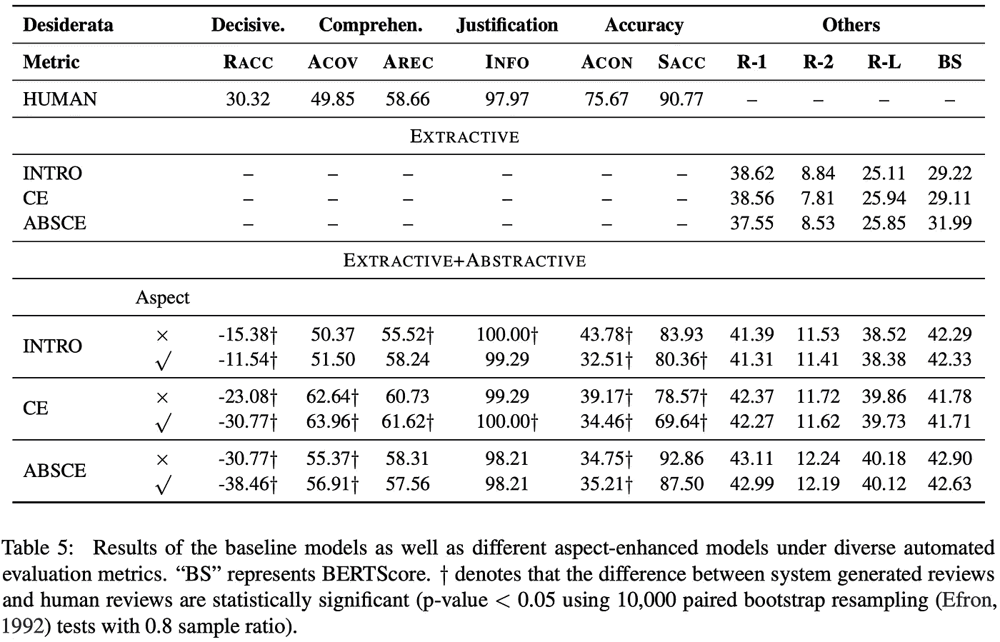

来源:[https://arxiv.org/pdf/2102.00176.pdf](https://arxiv.org/pdf/2102.00176.pdf)

## [挖掘自己的观点:通过跨样本预测进行自我监督学习](https://arxiv.org/abs/2102.10106) |👾[代码](https://nerdslab.github.io/myow/)

*迈赫迪·阿扎布等人*

**🎖Why →** 这项工作令人惊讶，因为在硬负挖掘的背景下，人们经常使用最近邻嵌入，假设它们是需要在对比损失中“推开”的负样本。然而，这篇论文恰恰相反。这很有效。

**💡重要见解→** 有趣的是，这篇论文来自神经科学背景，人们可以通过实验部分直观地感受到这一点。Mehdi aza bou——主要作者——告诉我们这个项目是如何通过尝试使用自我监督来解码神经脉冲数据开始的，结果非常好，他们决定将这项技术应用到图像上！这是相近田地间异花授粉的极好例子。

这项工作是 BYOL 的自然延伸，其中通过仅使用正样本进行对比学习来学习表示，并且将同一图像的增强表示一起推送到，并且通过使用两个编码器，一个*在线*编码器和一个*平均*编码器(其参数是在线编码器的移动指数平均值)，该模型避免了崩溃。然而，在这种情况下，作者更进了一步；他们不是只使用图像的增强作为正样本，而是通过从嵌入空间中最近的邻居采样来挖掘不同的视图，并将这些视图视为图像的挖掘正视图。

这种方法如此有效的事实非常令人震惊，并且挑战了一些关于成功的表征学习的假设。它轻松实现了 MNIST、CIFAR-10 和 100 的最先进表现；它能够比以往任何时候都更好地代表神经记录，而且它肯定会激发类似方向的进一步工作。

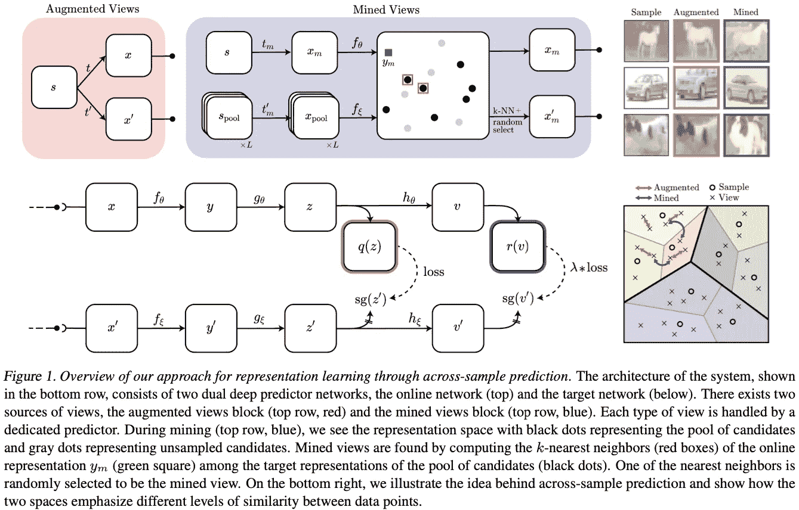

来源:[https://arxiv.org/pdf/2102.10106.pdf](https://arxiv.org/pdf/2102.10106.pdf)

## [零截图文本到图像生成](https://arxiv.org/abs/2102.12092) | ✍️ [博客](https://openai.com/blog/dall-e/) |👾[代码](https://github.com/openai/DALL-E)

*由 OpenAI 等人撰写*

**🎖Why →** 大规模再印象，可以创建以字幕为条件的引人注目的图像生成 *ala* 语言建模，以自监督自回归模式训练。这项工作在文本到图像的生成方法上取得了进展，并且一定会产生影响。

**💡关键见解→** 将图像的标题编码成标记，并将它们与表示图像的标记连接起来。表示图像的记号是对图像训练离散 VAE 的结果，该离散将图像表示为 32×32 记号的网格，其中该记号的词汇大小是 8192。您可以将这种表示方式想象成每幅图像是 8192 个词汇中的 32×32 = 1024 个单词。这个技巧大大减小了图像空间的大小，使其类似于语言符号，即字典中的离散符号。

该记号序列可以被大规模地自回归训练，这在推理时可以用图像的标题来提示，这将由具有图像记号的模型自回归完成，该图像记号又可以由 dVAE 解码到像素空间中。

像往常一样，制作这个大规模模型所需的工程是令人震惊的，结果是真正的赏心悦目。

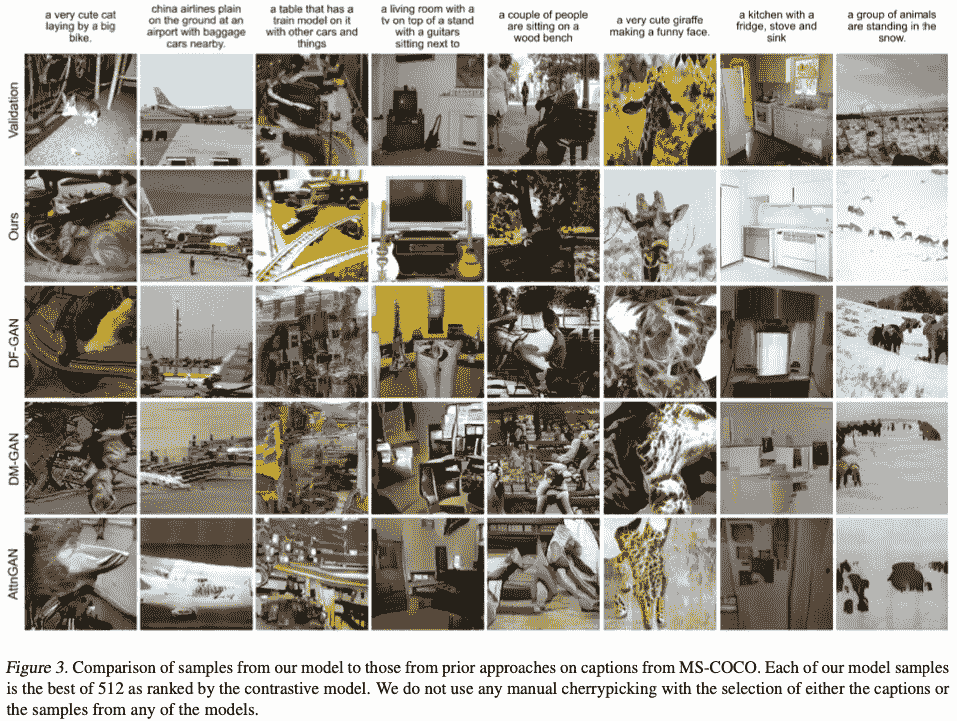

来源:https://arxiv.org/pdf/2102.12092.pdf

## [走向因果表征学习](https://arxiv.org/abs/2102.11107)

作者:b . schlkopf，F. Locatello，S. Bauer，N. Rosemary Ke，N. Kalchbrenner，A. Goyal & Y. Bengio。

**🎖why→**2021 年机器学习和因果关系的状态。虽然还不是最突出的，这一领域的研究有一个充满希望的潜力，以克服经典的 ML 限制分布外推广；最终放弃著名的 *i.i.d .假设*。

**💡关键见解→** 本文可作为对 ML 因果关系感兴趣的从业者和研究人员的切入点。世界模型的一个有用和简单的分类被提出，其中每个类的能力被仔细考虑(见下表)。

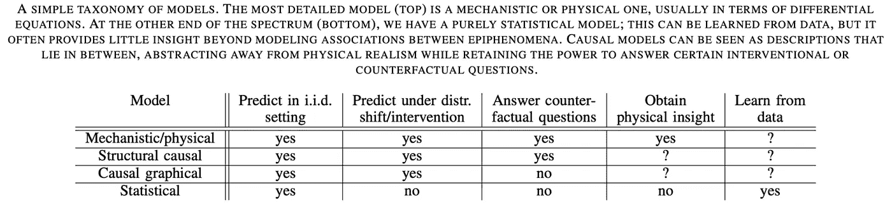

资料来源:https://arxiv.org/pdf/2102.11107.pdf

不可能在一个段落中涵盖论文的全部内容，但它涉及的一些相关主题是 i.i.d .假设的脆弱性、观察数据和干预数据之间的差异、因果图模型和结构因果模型之间的差异(只有后者可以进行反事实推理)以及独立因果机制等基础原则。

最后，作者回顾了因果表征学习对半监督学习、对抗性脆弱性、鲁棒性和泛化、自我监督、数据扩充、强化学习、多任务学习和一般科学应用等方法的影响。

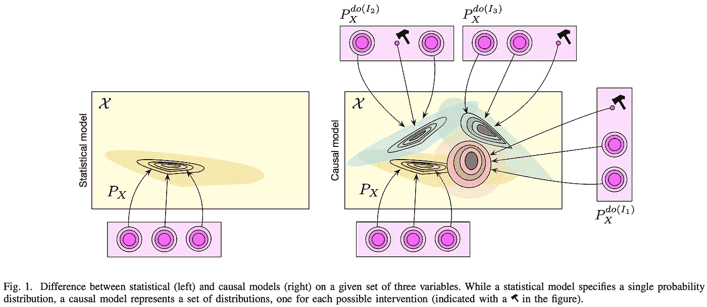

来源:https://arxiv.org/pdf/2102.11107.pdf

## [无需归一化的高性能大规模图像识别](https://arxiv.org/abs/2102.06171)

*作者:安德鲁·布洛克，索哈姆·德，塞缪尔·l·史密斯&卡伦·西蒙扬。*

**🎖Why →** 分层和批量归一化已经成为深度学习工具集中的标准方法有一段时间了。本文通过展示大规模图像识别如何在没有任何标准化的情况下工作，对这种技术的重要性提出了挑战；仅使用渐变剪辑。

**💡关键见解→** 通常，普通梯度裁剪将梯度向量的范数限制为固定的超参数*λ。*虽然这种技术可防止梯度爆炸，并允许在训练中进行更大批量，但该程序对超参数 *lambda 的调整非常敏感。*为了规避这个问题，作者提出了“自适应梯度裁剪”(AGC)，它基于权重梯度和权重值之间的比率来裁剪梯度:

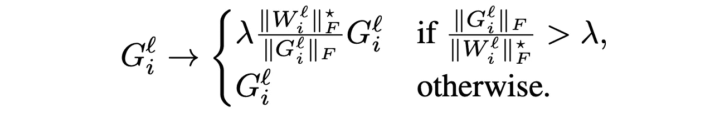

自适应渐变剪辑。资料来源:https://arxiv.org/pdf/2102.06171.pdf

抛弃规范化的最大吸引力之一是它的计算效率低下；将批量标准化转换为自动增益控制可以为同等大小的模型提供更快的训练。此外，如下所示，限幅超参数是稳健的，并且该技术允许训练中更大的批量。

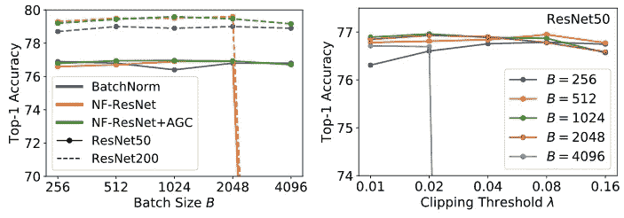

(左)AGC 缩放至更大批量；(右)跨越限幅阈值的性能。

主要结果部分似乎只提供了与其他工作相比有利的精选案例，因此有必要进行进一步审查。尽管如此，在没有任何规范化的情况下训练端到端模型是使 DL 模型更有效的一个有希望的方向。

## [变压器中的位置信息:概述](https://arxiv.org/abs/2102.11090)

*菲利普·杜弗特、马丁·施密特、辛里奇·舒茨。*

🎖 **为什么→** 变形金刚中的编码顺序——它不会因自我关注的设计而改变——似乎总是一种事后想法，让我们面对现实吧，它们无处不在！这篇论文阐明了这个话题，并解释了所有的变化。然而，问题仍然是这在多大程度上是相关的…！

💡**关键见解→** 变形金刚中位置信息的编码方式尚未统一，存在大量不同的研究想法。本文的作者提供了一个分类，可用于绘制这项研究的状态图(见下表)。

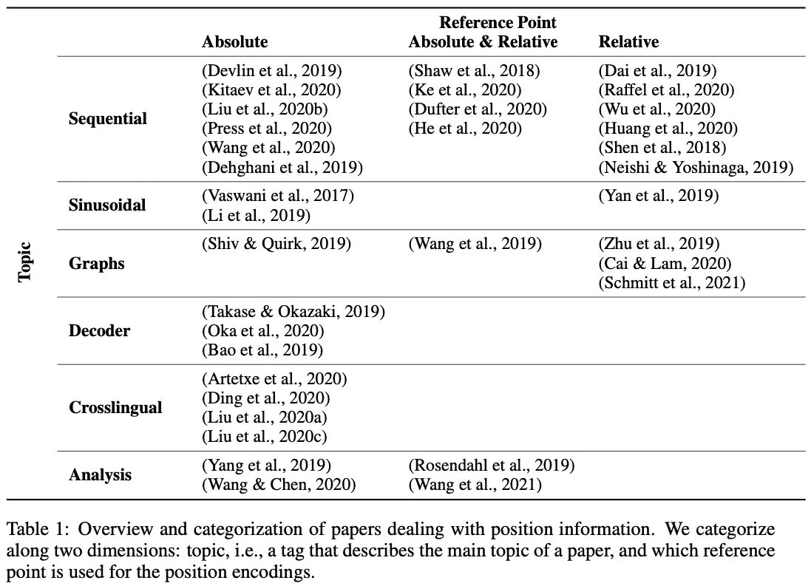

来源:https://arxiv.org/pdf/2102.11090.pdf

作者还提供了一个全面的理论框架来比较不同的方法:添加位置嵌入与修改注意屏蔽，顺序与基于图的排序，或对跨语言学习的影响。

虽然这篇论文没有向读者提供任何新颖的结果，但它是一个关于变形金刚动物园研究的*的极好例子，因为变形金刚无处不在。这类研究的另一个最近的例子是"[变压器的修改会在实现和应用之间转移吗？](https://arxiv.org/abs/2102.11972)”，作者在其中探索了对核心变压器架构的大量小修改是否真的产生了有意义的差异(剧透:不尽然)。*

## PAQ:6500 万个可能被问到的问题以及你可以用它们做什么👾[代码](https://github.com/facebookresearch/PAQ)

*帕特里克·刘易斯等人*

**🎖Why →** 从语料库中自动生成问答方法的令人印象深刻的结果:如果你能想出所有可能的问题及其答案，你只需要记住它们！

**💡关键见解→** 现有技术开放领域问题回答模型通常遵循两步检索器和读者方法，其中对于给定的问题，检索器检索问题答案可能所在的证据段落，读者通过联合处理问题和段落来提取答案。实际上，这意味着每个单个答案所需的计算量很高。

在这项工作中，作者提出了一种仅检索器的方法，该方法与检索器-读取器模型的性能相匹配，速度快几个数量级。这种方法在概念上很简单:从维基百科语料库中，找到看起来像答案的片段，并生成人类可能会问的与之匹配的问题。这导致了大规模的、自动生成的 6500 万个问答对，其在 TriviaQA 和自然问题上表现得很有竞争力，因为它已经有了许多答案。此外，问答检索器非常擅长确定答案的可信度，因此当问题看起来不像任何现有的 PAQ 时，适合添加一个后备的完整检索器-阅读器模型。

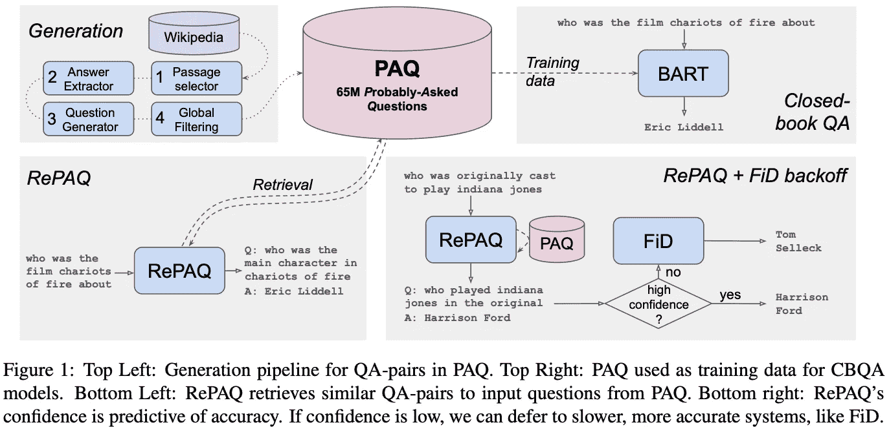

来源:https://arxiv.org/pdf/2102.07033.pdf

我们的每月精选到此结束；如果你想了解最新的研究，请在推特上关注我们 [@zetavector](https://twitter.com/ZetaVector) 。我已经很期待分享四月份的下一个选择了；回头见！

*参考文献*

[1] [引导你自己的潜能:自我监督学习的新方法](https://arxiv.org/abs/2006.07733)，作者 [Jean-Bastien Grill](https://arxiv.org/search/cs?searchtype=author&query=Grill%2C+J) 等人，2020 年。

[2][Transformer 的修改会在实现和应用之间转移吗？](https://arxiv.org/abs/2102.11972)，由[莎兰纳朗](https://arxiv.org/search/cs?searchtype=author&query=Narang%2C+S)等人 2021。

[3] [EnlightenGAN:无需配对监督的深度光线增强](https://arxiv.org/abs/1906.06972)，江一帆等人 2019。

[4] [AutoGAN:生成对抗网络的神经架构搜索](https://arxiv.org/abs/1908.03835)，新宇龚等 2019。