# arXiv 精选—2021 年 11 月阅读

> 原文：<https://towardsdatascience.com/best-of-arxiv-readings-for-november-2021-bb3ad901e6b?source=collection_archive---------14----------------------->

## ML 论文、新闻和代码月刊

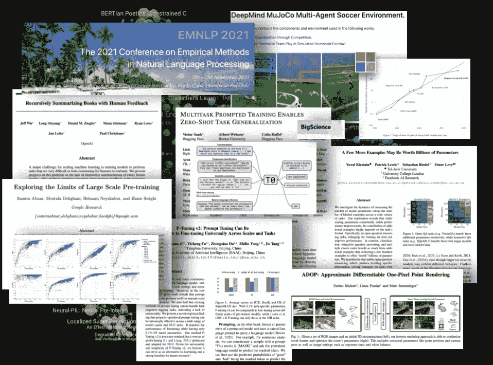

图片作者。

在经历了一个缓慢的暑假之后，人工智能世界在过去的一个月里全速回归:会议回到了面对面的形式，新的参数计数记录，Deepmind 成为了强化学习的罗宾汉，或者像现在已经出版和开源的 GPT-3 模型(T-0)一样的 T2-3。

尽管如此，当我们接近 2021 年底时，AI arXiv 上的出版物增长首次出现放缓:经过几年的持续指数增长(每年约 30-40%)后，2021 年的出版物数量似乎只会略微超过 2020 年(约 10%以上)。我们会看到 NeurIPS 和 ICLR 的强劲增长吗？还是人工智能研究已经成熟了？

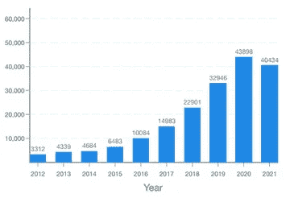

与人工智能相关主题的年度 arXiv 出版物。

# 新闻

让我们从过去几周的一些热点新闻开始:

*   [自然语言处理会议](https://2021.emnlp.org/) (EMNLP)将于 11 月 7 日至 11 日以混合形式举行:同时在线和在多米尼加共和国的 Punta Cana 举行。正式的公开会议将很快在 ACL 选集中发表。
*   [Deepmind 收购了 MuJoCo 并开源](https://deepmind.com/blog/announcements/mujoco)。这是一件大事，因为 MuJoCo 是机器人学和 RL 中使用最广泛的物理模拟软件之一，它曾经很贵。虽然大型大学为他们的学生和员工购买了许可证，但费用使得贪玩好奇的人进入门槛更高。
*   [微软的威震天 530B 参数模型](https://www.microsoft.com/en-us/research/blog/using-deepspeed-and-megatron-to-train-megatron-turing-nlg-530b-the-worlds-largest-and-most-powerful-generative-language-model/)。但是等等…它仍然只是一个手波浪的博客帖子！他们声称这是迄今为止最大的单片变压器；你可能会想，单片到底是什么？这是使用所有参数的一种方式，不像混合专家(MoE)类型的模型，如吴导的 1，750 万亿或 Switch Transformer 的万亿，在每个推理/训练步骤中只有一个较小的子集被激活。虽然庞大的规模看起来令人难以置信，但我们必须等到他们分享更深入的作品。说到参数计数，我们会停止关心它们吗？
*   人工智能投资者[内森·贝纳奇](https://www.twitter.com/nathanbenaich)和[伊恩·霍加斯](https://www.twitter.com/soundboy)最近发布了 2021 年人工智能状况报告。它从鸟瞰的角度提供了关于人工智能的有用的年度执行摘要:研究、工业、人才、政治和预测。绝对值得一读！

# 密码

*   如果你想尝试大型的基于注意力的计算机视觉架构，这是你的幸运日，因为最近发布了[Scenic](https://github.com/google-research/scenic)【4】:一个运行计算机视觉 JAX 模型的代码库(有很多样板代码和例子)，包括几个流行的，像最初的 Vision Transformer【6】，ViViT【7】等等。
*   如果你对图像的生成模型感兴趣，可以看看 [VQGAN-CLIP](https://github.com/nerdyrodent/VQGAN-CLIP) ，这是一个运行流行的生成模型的 repo，可以将自然语言句子转换成图像。
*   最后，我们建议您检查 [Dagster](https://github.com/dagster-io/dagster) 一个“用于开发、生产和观察**数据资产**的编排平台”。

# 🔬研究

最后，这是一些有影响力的近期论文。

## [递归总结有人类反馈的书籍](https://arxiv.org/abs/2109.10862)

*作者 OpenAI 等人*

**❓Why →** 超长文档摘要(例如书籍规模)对机器来说是一项艰巨的任务，主要是因为标注数据非常耗时:为了标注一个实例或例子，一个人需要阅读一本书并得出它的摘要，这需要几个小时。

**💡关键见解→** 长期摘要可以(在某种程度上)成功地分解成注释成本更低的分级摘要任务:将一本书分成几大块，然后将每个块汇总成摘要。把那些摘要串联起来，进行总结。递归地应用该过程，直到达到期望的整本书摘要长度。

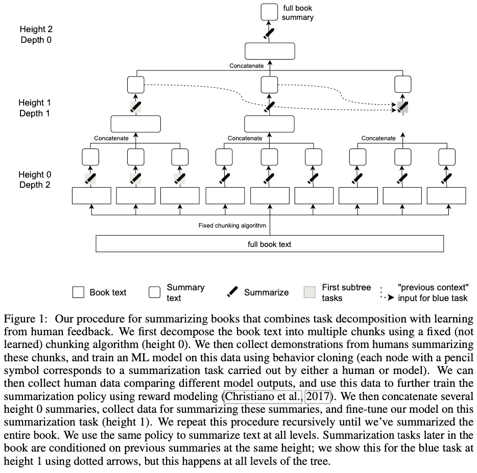

来源:[https://arxiv.org/pdf/2109.10862.pdf](https://arxiv.org/pdf/2109.10862.pdf)

让我们了解一下所涉及的数据规模:使用了 40 本书，平均 10 万个单词，大部分是虚构的，每个摘要子任务的压缩率大约为 5–10:1。

这个过程的结果离人类质量还很远，只有 5%的摘要达到可比较的质量。有趣的是，模型大小似乎起着重要的作用，因为来自最大模型的摘要明显优于来自遵循相同训练程序的较小模型的摘要。

总之，这又是一次令人印象深刻的大规模、复杂的人在回路中训练大模型的努力。这离产生“哇，这太棒了”的感觉还很远，但这是一个开始。我在想接下来，如何将这转化为一些镜头设置，其中只需要很少或很少的人类注释？

## [多任务提示训练使零射击任务普遍化](https://arxiv.org/abs/2110.08207)

*作者维克多·桑，艾伯特·韦布森，科林·拉弗尔，斯蒂芬·h·巴赫。等人*

**❓Why →** 超大型模型研究大多局限于预算庞大的公司。这是拥抱脸大科学研讨会的第一篇论文，提出了一个合作努力，使大规模的 ML 对较小的机构如大学可行。平心而论，这不是第一个开源的大型 GPT-3 模型(例如，查看 [GPT-J](https://6b.eleuther.ai/) )，但这肯定会有影响。

**💡关键见解→** 我们正在谈论一个 110 亿参数模型，完全开源，可通过🤗拥抱脸。

```
model = AutoModelForSeq2SeqLM.from_pretrained("bigscience/T0pp")
```

您可以在[论坛上查看项目](https://huggingface.co/bigscience)、 [GitHub repo](https://github.com/bigscience-workshop/bigscience) 的所有详细信息，其中包括对模型的每个变体的训练的详细描述。

该模型是 T5 风格的编码器-解码器转换器(不同于 GPT-3 的仅解码器架构),其在自回归语言建模上被训练以预测下一个令牌。然而，现在训练集被更仔细地管理:除了使用通用语言的大型网络抓取之外，作者建议包括用自然语言提示表达的带标签的 NLP 任务。例如，对于带有如下注释的电影评论的句子分类任务

```
The film had a superb plot, enhanced by the excellent work from the main actor. | Positive
```

使用模板转换为:

```
The film had a superb plot, enhanced by the excellent work from the main actor. It was <great/amazing/fantastic...>.
```

为了避免对一组狭窄的模板进行过度优化，这些模板来自多个人(36)以最大化多样性，最终形成几十个模板供许多 NLP 任务交替使用。

结果是，即使比 GPT-3 小 16 倍，T0 在大多数任务中也优于它，即使这些任务的训练集在训练期间没有被看到。

以下是主要结果的总结。T0 的不同变型反映了在训练期间包括哪些数据集:T0 排除了 GPT-3 用于评估的所有数据集，T0+添加了在评估中使用的数据集(仅训练分裂，仍然保证对测试集盲化)，T0++在 T0+之上添加了强力胶中的数据集[2]。

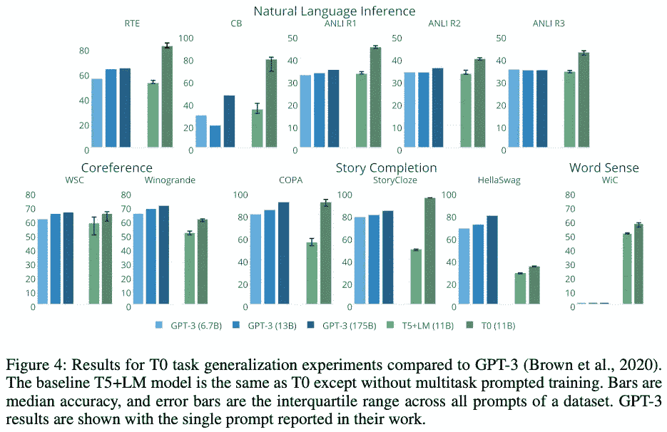

来源:https://arxiv.org/pdf/2110.08207.pdf

如果你读了我们上个月的博客，你可能已经注意到这种方法与谷歌几周前发布的 FLAN [1]非常相似。作者彻底解决了这项工作，T0 仍然有很多优势:T0 和+/+++变体具有相当或更好的性能，同时小 10 倍(137B 对 11B 参数！！！).这两部作品的主要区别在于:

*   T0 使用在 MLM 和仅解码器 FLAN 上训练的编码器-解码器(MLM 已经证明是更有效的预训练方法，尽管它不适合自回归生成，因此编码器-解码器策略使用 MLM 预训练表示)
*   更多样的提示
*   一次完成多项任务，而不是一次完成一项任务。

## [P-Tuning v2:即时调优可以与跨规模和任务的通用微调相媲美](https://arxiv.org/abs/2110.07602)

*由小刘、纪凯旋、傅毅成等创作*

**❓Why →** 连续 p 调优/即时调优/前缀调优被提出还不到一年[3]，它已经成为许多任务中微调的可行替代方案，成为 ML 研究的一个热点。这是它的最新修订版，显示了 p-tuning 在以前苦苦挣扎的任务中的优势。

**💡关键见解→** 如果任何人对即时调整仍有疑问，这篇文章应该消除他们的疑虑(例如，对小型冷冻模型不太适用，或者对某些特定任务(如硬序列标记)不太适用)。对于那些迟到的人来说，p-tuning(也称为前缀调整、软或连续提示调整)是一种在不改变预训练参数模型的情况下，针对特定任务微调预训练模型的技术。相反，它包括通过一些连续嵌入的梯度下降来学习提示，这些连续嵌入是任何输入的固定前缀。这已经显示出对于在自回归语言建模上训练的变压器执行得非常好，并且参数效率更高(即，与完全微调相比，对于特定任务，只需要学习非常少量的参数)。

作者们在这项工作中采取的进一步措施是给提示增加“深度”。也就是说，向转换器的不同层添加各种提示。虽然这增加了可训练参数的数量，但它提高了性能，同时将总模型参数与可训练提示的比率保持在 0.1–3%的范围内。这些在夹层中彼此独立(它们在每一层独立训练，而不是来自变压器层向前传递)。

下面是主要结果的总结，期望在不久的将来看到 p-tuning 应用于其他任务！

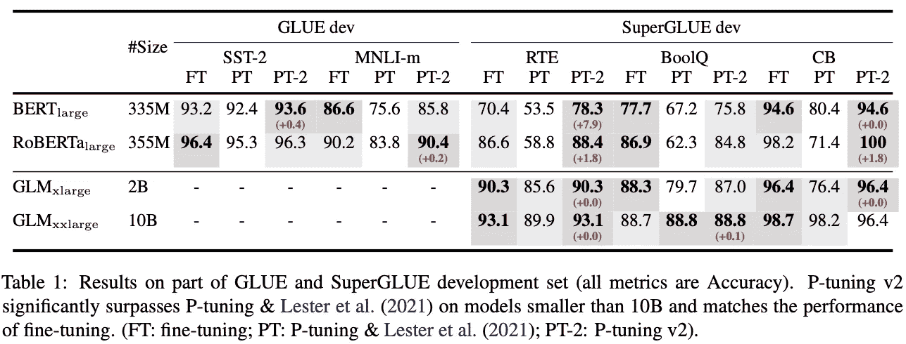

来源:https://arxiv.org/pdf/2110.07602.pdf

## [探索大规模预训的极限](https://arxiv.org/abs/2110.02095)

*作者:周欣宇·阿布纳尔、穆斯塔法·德赫加尼、贝南·奈沙布尔和哈尼·塞德吉。*

❓Why → 规模一直是 ML 圈子里讨论的话题。几个月来，我们一直在收录关于这个主题的论文，因为这绝对是这个领域必须努力解决的重要问题之一:添加参数和数据在哪里会不再有用？继续读。

**💡关键见解→** 类似于“随着我们提高上游精度，下游任务的性能会饱和”。

好了，这篇论文的主旨很简单，他们研究了上游(US)任务(例如大规模 imagenet 标签)的预训练性能如何转移到下游(DS)性能(例如鲸鱼检测)。然后对很多架构和规模做这个实验:“对视觉变压器、MLP 混频器和 ResNets 进行 4800 次实验，参数数量从一千万到一百亿，在最大规模的可用图像数据上进行训练”🤑💸

这些有趣的图表比较了上游绩效(US)和下游绩效(DS ),前者是指预训练任务的绩效，后者是指评估任务的绩效。几乎是全面的，它最终会饱和。尽管如此，对于计算机视觉来说，跨架构的差异还是非常有趣的！

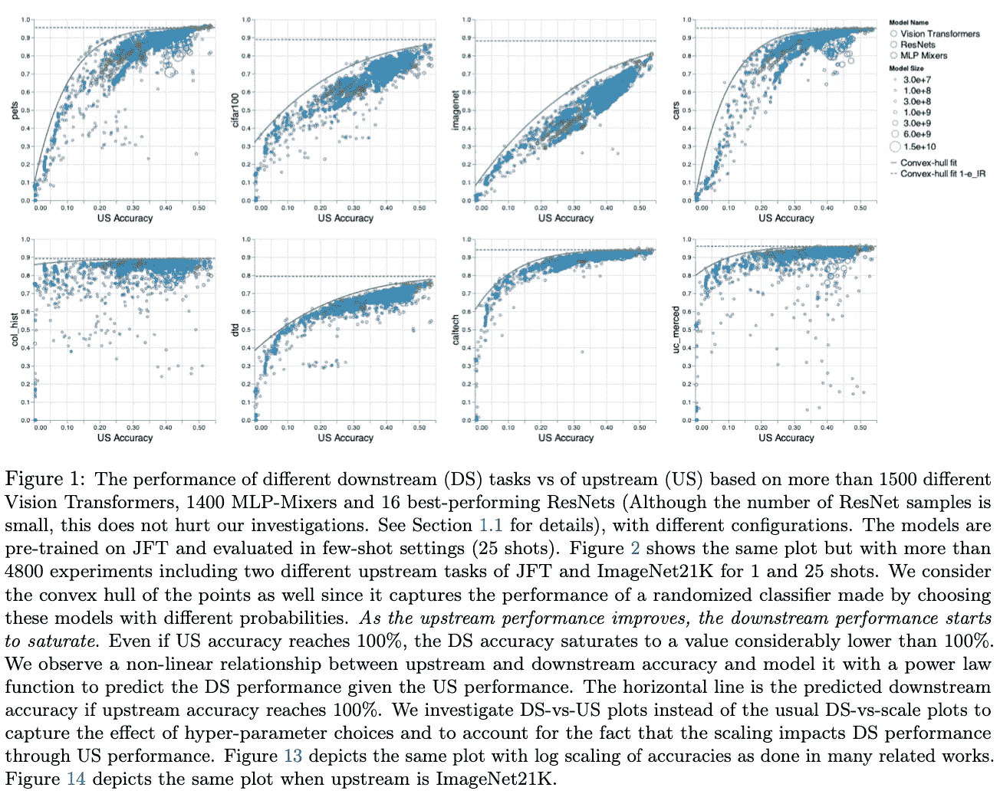

资料来源:https://arxiv.org/pdf/2110.02095.pdf

作者声称，他们的观察总体上看起来对诸如上游数据的大小或训练*次数*以及架构选择等选择是稳健的。他们还探索了超参数选择的影响:一些超参数对我们非常好，但不能很好地转化为 DS 吗？是啊！他们在第 4 节中深入研究了这一现象，并发现，例如，重量衰减是一个特别显著的超参数，它以不同的方式影响着我们和 DS 的性能。

在*没有人*真正从头开始训练模型，而是选择预先训练的模型来引导他们的应用的背景下，这项研究是关键。这篇论文不仅仅是几段话就能概括的，如果你想深入研究，它绝对值得一读！

## [多举几个例子可能就值几十亿参数](https://arxiv.org/abs/2110.04374)

*尤瓦尔·克尔斯坦，帕特里克·路易斯，塞巴斯蒂安·里德尔和奥默·利维。*

**❓Why →** 注解还是成长？这可能是 ML 从业者在决定如何分配资源时的一个常见困境:更大的预训练模型还是注释更多的数据。看情况！

**💡关键见解→** 主要观点是，在 NLP 任务的环境中，缩放参数始终能提高性能，但是，额外注释的贡献高度依赖于任务。例如，在开放式问答数据集中，添加注释不会显著提高性能，而在句子分类或抽取式问答中，却可以。这是这篇论文的发现的最佳总结图，人们可能会期望热图沿着对角线有一个梯度:大小和注释都会产生性能改进，但事实并非如此。

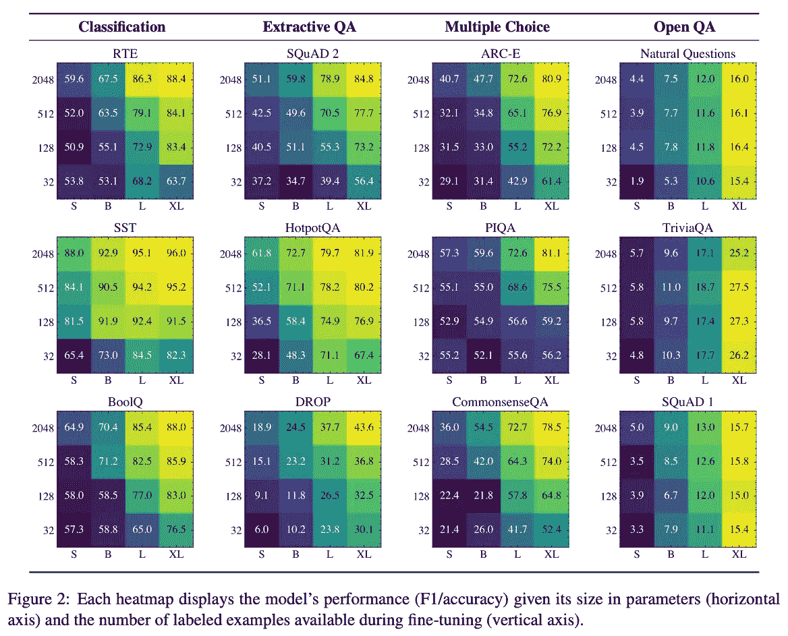

来源:[https://arxiv.org/pdf/2110.04374.pdf](https://arxiv.org/pdf/2110.04374.pdf)

差不多就是这样了！公平地说，它并不是那么全面，我们将不得不看看这些在其他模式上的可复制性如何，但是，正在解决的问题无疑是相关的。

## [演讲 5:用于口语处理的统一模态编解码器预训练](https://arxiv.org/abs/2110.07205)

*由敖俊逸、、等创作*

**❓Why →** 自然语言处理几乎经常被用作文本处理的同义词，但是自然语言不仅仅是文本！口语不仅仅使用文字，还使用更多的表达方式。这里有一种方法，通过利用过去几年在 NLP 中非常成功的现有技术来对所有这些进行建模。

**💡关键见解→** 通过向模型输入音频和文本来共同学习文本和语音表示，并在自我监督的环境中训练自己，其任务类似于应用于声音的双向掩蔽语言建模。但是将 MLM 应用于音频并不像应用于文本那样简单，它涉及将音频预处理为一种称为 [log-Mel filterbank](https://haythamfayek.com/2016/04/21/speech-processing-for-machine-learning.html) 的适当表示，并在这种表示状态下应用量化目标，在这种状态下可以执行分类任务。重要的是，音频和文本表示被组合在一起并被共同提供给模型，从而允许跨模态建模。

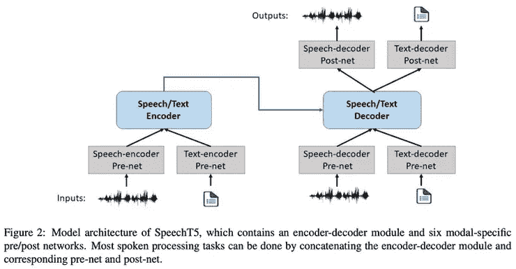

来源:https://arxiv.org/pdf/2110.07205.pdf

对于语音转换(VC)、自动语音识别(ASR)等任务来说，其结果是最先进的，并且在应用于文本到语音和语音到类别(SID)时表现出竞争力。

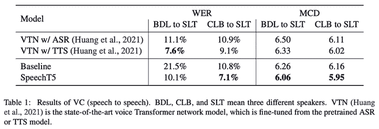

来源:[https://arxiv.org/pdf/2110.07205.pdf](https://arxiv.org/pdf/2110.07205.pdf)

## [ADOP:近似可微分单像素点渲染](https://arxiv.org/abs/2110.06635)

*作者:大流士·吕克特、莱纳斯·弗兰克和马克·斯塔明格。*

**❓Why →** 与传统技术相比，使用神经网络以更低的计算成本改善渲染是一件非常令人兴奋的事情，尤其是在 VR 和 AR 领域缓慢但稳步起飞的时候(hello [Meta](https://about.fb.com/news/2021/10/facebook-company-is-now-meta/) )。毕竟，深度学习可能在渲染元宇宙方面发挥关键作用…

**💡关键见解→** 渲染场景视图(例如在视频游戏或模拟中)是一个令人印象深刻的复杂过程:3D 对象可以用多种方式定义，照明、遮挡、纹理、透明、反射以复杂的方式交互，将东西光栅化到像素网格中，等等。强制执行这些任务对于低延迟应用程序来说是不可能的；相反，人们必须聪明地不去计算不需要计算的东西，比如遮挡其他物体的不透明物体。

事实证明，渲染中涉及的大多数过程都可以由可微分模块来执行，这意味着可以使用梯度下降来优化它们，给定适当的损失函数。渲染场景的新视图所涉及的主要模块是光栅化器、渲染器和色调映射器，如下图所示。

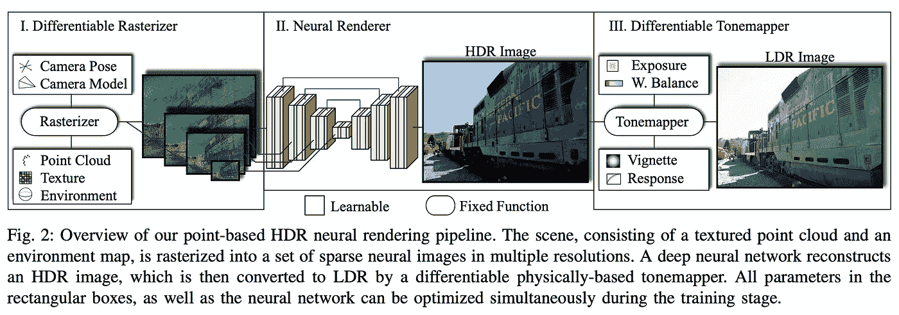

来源:https://arxiv.org/pdf/2110.06635.pdf

我们不能说得太详细，因为老实说，这个话题有点超出我们的理解范围。尽管如此，他们提供的[视频演示](https://www.youtube.com/watch?v=WJRyu1JUtVw)还是令人印象深刻，我们迫不及待地希望这种技术被主流渲染技术广泛采用。

在人工智能的伦理方面，在过去的一个月里，我们也看到了一些我们想要强调的论文

*   [德尔福:走向机器伦理和规范](https://arxiv.org/abs/2110.07574)是一次勇敢的尝试，旨在教会机器错综复杂的是非曲直。虽然这项任务的复杂性几千年来一直没有达成哲学共识，但这项工作是向将伦理判断引入算法迈出的切实一步。
*   [语言技术在全球语言中表现的系统性不平等](https://arxiv.org/abs/2110.06733)介绍了一个评估语言技术“全球效用”的框架，以及它如何涵盖全球语言的多样性。

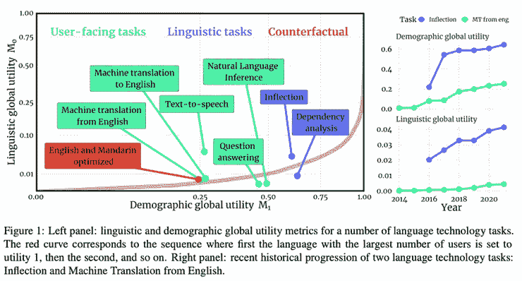

来源:[https://arxiv.org/pdf/2110.06733.pdf](https://arxiv.org/pdf/2110.06733.pdf)

在信息检索的主题上，[用于密集文本检索的对抗性检索器-排序器](https://arxiv.org/abs/2110.03611)是一种令人兴奋的新方法，用于为两阶段检索设置模拟检索器和排序器之间的交互，其中检索器试图用“看起来相关”但实际上不相关的文档来欺骗排序器，排序器试图显示最相关的标记文档。

我们的月度评选到此结束；如果你想了解最新的研究，请在 Twitter 上关注我们。下一集再见！

*参考文献:*

*【1】*微调过的语言模型是零射击学习者。Jason Wei，Maarten Bosma，Vincent Y. Zhao，Kelvin Guu 等人 2021

SuperGLUE:通用语言理解系统的一个更具粘性的基准。作者:王敬实，Yada Pruksachatkun，Nikita Nangia，Amanpreet Singh，Julian Michael，Felix Hill，Omer Levy，Samuel R. Bowman，2019。

*【3】*调前缀:优化连续提示生成。向，佩西梁，2021。

SCENIC:JAX 的一个图书馆，用于计算机视觉研究及其他领域。Mostafa Dehghani，Alexey Gritsenko，Anurag Arnab，Matthias Minderer，Yi Tay，2021。

[6]一幅图像相当于 16x16 个字:大规模图像识别的变形金刚。阿列克谢·多索维茨基等人 2020 年。

[7] ViViT:视频视觉转换器。作者:Anurag Arnab，Mostafa Dehghani，Georg Heigold，孙辰，Mario Lu CIC，Cordelia Schmid，2021。