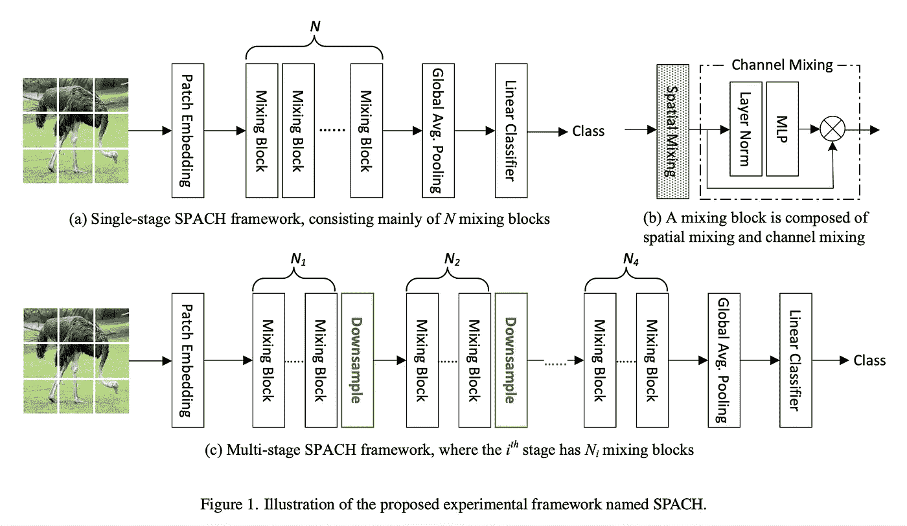

# arXiv 精选—2021 年 10 月阅读

> 原文：<https://towardsdatascience.com/best-of-arxiv-readings-for-october-2021-3d5ed04b44a5?source=collection_archive---------18----------------------->

## ML 论文每月精选

图片作者。

在你的阅读清单上保持领先是很难的，而找到哪些论文应该在清单上就更难了。在 [Zeta Alpha](https://search.zeta-alpha.com/) 我们总是密切关注最新的人工智能研究，所以我们每月都会分享一些最近的论文，以展示我们认为会有影响力的出版物，主要基于每部作品的贡献和作者的影响力。不要把这个列表看得太全面:像其他人一样，我们也有自己的偏见，但是你能从 4000 多篇论文中选择的就这么多了。尽情享受吧！

让我们从我想强调的一些趋势开始:

*   大型语言模型不再与较小的模型在同一类别中竞争(如预训练+使用监督数据的微调)。为什么？它不再有意义，因为每个人都知道当更大的模型在像强力胶这样的监督基准上微调时会发生什么:它们只会变得更好。相反，我们认为这些模型探索了以前不可行的问题空间，例如零/少镜头和/或多模态学习。
*   度量和基准——我们如何量化我们关心的东西——需要不断地重新思考和发明，以使进展有意义。MNIST 是一些计算机视觉研究的好地方，但你不会在数据集上找到吹嘘新 SOTA 的头条新闻。幸运的是，学者们经常关注这一点，传统上大多数揭露性的论文来自大学，就像我们马上要看到的这一篇。
*   我们经常讨论事物的建模方面——模型的架构、损失函数、优化器等。——因为它们很性感，但不断有证据表明，如果你想解决一个新问题，你的大脑时间最好花在处理数据上。安德烈斯·吴(Andres Ng)已经花了数年时间倡导这一观点，它就像美酒一样陈年。

事不宜迟，下面是 arXiv 最近的一些亮点！

## [网络结构之战:CNN、Transformer 和 MLP 的实证研究](https://arxiv.org/abs/2108.13002)

*作者:赵玉成、王光庭、唐传新、、曾文军、查正军。*

**❓Why？→** 这篇论文的缺点也是它的优点:谦逊的范围和*的努力*投入到进一步优化他们的实验中。当一个社区通过数百次迭代来优化某项技术时，很难以一种*公平*的方式将其与一项新技术进行比较:现有方法的成功有多少可以归功于其基本思想，而有多少是小的优化和技术诀窍的纯粹积累，这是理所当然的？这是过去十年统治计算机视觉的 CNN 的情况，也是变形金刚统治语言的情况。

**💡关键见解→** 作者提出了一个相当简单的策略来直接比较这三种架构:将网络架构定义为嵌入、空间混合和下采样块的组合，并且只交换不同架构的空间混合。一个重要的警告是**所有架构共享一个初始补丁嵌入层**，它实际上是原始图像上的卷积(即共享权重的每个补丁的线性投影)，因此所有技术都包含一个第一类卷积层。

来源:[https://arxiv.org/pdf/2108.13002.pdf](https://arxiv.org/pdf/2108.13002.pdf)

我们可以从这些实验中得出的结论是有限的:在最初的补丁嵌入之后，当有足够的数据时， **MLPs 表现得令人惊讶地好**，尽管 CNN 仍然在数据受限的状态下统治，并且**变压器缩放得更好，**如在中，当你继续增大它们时，它们不会饱和。总结:今天你可能仍然会使用 CNN，但是一定要在一年后再来询问。这些发现与常识相一致，即架构中的强归纳偏差有助于提高学习效率，但在某些时候对图像不再重要，因为等方差可以学习而不是先验注入(尽管这种推理并不适用于所有数据形态，并且模型等方差可能是从组合爆炸(如大图)的数据中学习所必需的)。

来源:[https://arxiv.org/pdf/2108.13002.pdf](https://arxiv.org/pdf/2108.13002.pdf)

其他类似著作:[稀疏 MLP 用于图像识别:自我关注真的有必要吗？](https://arxiv.org/abs/2109.05422)

## [稀疏标签浅池](https://arxiv.org/abs/2109.00062)

*作者:Negar Arabzadeh、Alexandra Vtyurina、Xinyi Yan、Charles L. A. Clarke。*

> 引用作者的话:“我们对这些观察的结果感到不安。”

**❓Why？→**MARCO 女士是最受欢迎的信息检索(IR)基准之一。本文揭示了现有基准的一些缺点，并就如何评估 IR 提出了更广泛的改进建议。

**💡关键见解→** IR 基准通常以如下方式标注:给定一个查询，语料库中的一段被标记为与该查询相关。大多数查询只有一个段落被标注为相关，尽管事实上语料库中可能有更多的段落——标注所有的查询-文档对在大多数情况下是不可行的——因此我们可以说标签是*稀疏的*。然后使用平均倒数排名(MRR)评估退休模型，其中注释为相关的段落应排在第一位，但不“惩罚”未注释的段落为不相关(记住，尽管缺乏注释，它们可能实际上是相关的)。

这种设置的问题是:如果检索模型将没有注释但实际上比注释段落更相关的段落排在第一位，会怎么样？这部作品恰恰回答了这个问题。

给定 Marco 女士的查询子集，他们运行查询，并要求注释者回答以下问题:哪一段与查询最相关，注释为相关的那一段，或神经排序模型的顶部结果？当然，只有当注释和模型在排名靠前的段落中不同时，注释者才不知道哪个是哪个。事实证明，来自神经排序器**的结果比注释**更受欢迎(见下图)。换句话说，有人可能会说这些模型比 perfect 更好*，因为与 perfect run 相比，它们的结果更受注释者青睐，perfect run 中检索到的顶部段落总是被标记为相关的段落。*

来源:[https://arxiv.org/pdf/2109.00062.pdf](https://arxiv.org/pdf/2109.00062.pdf)

这个结果非常相关，因为它表明流行排行榜可能不再反映 IR 的任何改进，而是注释的过度拟合。作为解决这个问题的一个建议，作者建议移动到一个非静态的标注数据集，其中顶部相关性段落用成对标签连续标注(例如，两个段落中的哪一个与给定查询最相关？).

## [训练短，测试长:注意线性偏差，可推断输入长度](https://arxiv.org/abs/2108.12409) |👾[代码](https://github.com/ofirpress/attention_with_linear_biases)

*迈克·刘易斯，诺亚·史密斯，奥菲尔出版社。*

**❓Why？→** 变压器是天生的集对集神经网络，这意味着该架构是顺序不变的，这就是为什么研究人员尝试了不同的方式将位置信息编码到模型中。本文提出了一种新的超简单的、非可学的编码相对位置信息的方法，这种方法在比训练更大的上下文中进行推理时是鲁棒的。这会成为新的标准吗？

**💡关键见解→** 变形金刚中的位置编码长期以来一直有点泛滥，因为它看起来像“任何事情都可以发生”:给定一种编码位置的方法，变形金刚和梯度下降将找到一种性能良好的方法。我们甚至需要一个调查来解释它！[2]但是像正弦位置嵌入或固定学习绝对嵌入这样的普通技术有什么隐藏的陷阱呢？**当他们用比在**所受训练更长的时间进行推理时，他们不能很好地概括。

这里提出的方法简单地依赖于**向注意力矩阵**(在 softmax 之前)添加一个偏差，该偏差与中心令牌与其邻居之间的距离成比例(见下图)。这些偏差**是固定的，不需要学习**，比例因子 *m* 被设置为超参数。

来源:[https://arxiv.org/pdf/2108.12409.pdf](https://arxiv.org/pdf/2108.12409.pdf)

令人惊讶的是，变形金刚很好地学习了这种位置编码，并与类似大小的等效模型进行了竞争。有趣的比较发生在当模型对比其训练长度更长的序列执行推理时(见下图)。虽然现有的模型难以概括(即，随着序列越长，困惑急剧增加)，但不在场证明的情况并非如此。

然而，有一个重要的警告在本文中没有彻底解决:注意力矩阵中的偏差通过一个 softmax 运行，该 soft max 抑制了远处标记的贡献，这就像有一个注意力的“软窗口”:我们不是只关注 N 个相邻的标记，而是关注递减的权重。实际上，这意味着在位置偏差足够负的某个点上，该标记将不会有任何有意义的贡献，使得*有效上下文*的大小总是有限的，而不管推断时的输入长度。

来源:[https://arxiv.org/pdf/2108.12409.pdf](https://arxiv.org/pdf/2108.12409.pdf)

## [微调过的语言模型是零射击学习者](https://arxiv.org/abs/2109.01652)

*作者:Jason Wei、Maarten Bosma、Vincent Y. Zhao、Kelvin Guu 等人*

**❓Why？→** 尽管有了很大的进步，NLP 中的提示仍然不是很健壮:在不应该的地方添加逗号，输出可能会完全改变。本文展示了在自回归语言建模预训练期间包括标记数据如何使模型在零触发设置中更稳健地学习并更好地转移到新任务。

**💡关键见解→** 零镜头学习是机器学习中最有前途的发展领域之一。梦想是清晰的:找到一个模型，并让它在第 0 天就在你的领域中工作，而不需要数据收集、标记、培训、维护、监控漂移等。

大型自我监督语言模型目前是最终实现这一梦想的主要候选对象(尽管有许多障碍需要克服)。特别是自从 GPT-3(现在一岁多了！)，**提示已经成为一项关键技术**，而且还会持续下去。本文研究了如何训练大型语言模型，使其像 GPT-3 一样对零镜头自然语言提示更加鲁棒和准确。尽管将它与 GPT-3 进行比较是不公平的:该模型包括预训练期间的标记数据，但他们不是直接在其上微调模型，而是使用模板来创建该任务的自然语言表达(见下图)；而 GPT-3 不包括任何训练数据——原则上，一些数据集意外泄露到预训练数据中，使其暴露给预训练中的模型[3]。

来源:[https://arxiv.org/pdf/2109.01652.pdf](https://arxiv.org/pdf/2109.01652.pdf)

结果是一个在许多任务上表现得比 GPT-3 更好的模型，并且在没有包括在预训练中的任务上表现出良好的泛化能力，尽管它仍然远不是一个完全监督的模型。

来源:[https://arxiv.org/pdf/2109.01652.pdf](https://arxiv.org/pdf/2109.01652.pdf)

## [使用冻结语言模型的多模态少量学习](https://arxiv.org/abs/2106.13884)

*Maria Tsimpoukelli、Jacob Menick、Serkan Cabi、S. M. Ali Eslami、Oriol Vinyals 和 Felix Hill。*

**❓Why？→** 更多提示:现在多模式和*异步。*您能否利用预训练语言模型中的信息完成视觉任务，而无需重新训练？嗯，有点…继续读。

**💡关键见解→** 本文提出的想法相当简单:训练一个语言模型，*冻结它*，使其参数保持固定，然后**训练一个图像编码器将图像编码成提示，让语言模型**执行特定任务。我喜欢将其概念化为“为模型学习一个图像条件提示(通过神经网络的图像)来执行任务”。

来源:[https://arxiv.org/pdf/2106.13884.pdf](https://arxiv.org/pdf/2106.13884.pdf)

这是一个很有前途的研究方向，但结果并不令人印象深刻？)就绝对性能而言。然而，比较使用多模态数据完全微调的模型(冻结微调)和保持语言模型冻结的模型(冻结 VQA 盲)是有趣的:只有后者显示出从训练数据集(概念标题[4])到目标评估数据集(VQAv2 [5])的良好概括，仍然远离完全监督的模型。

[https://arxiv.org/pdf/2106.13884.pdf](https://arxiv.org/pdf/2106.13884.pdf)

## 关于大型变压器和自我监督学习的其他工作

[Rishi Bommasani 著《论基金会模式的机遇与风险》](https://arxiv.org/abs/2108.07258), Percy Liang 等人在 8 月发布时引起了不小的轰动。这本书有很多内容:对新兴领域的大型神经模型的概述、介绍和立场文件，这些模型是在大量数据的基础上不受监督地训练的，他们为此创造了基础模型的名称。虽然这是一个令人信服的全面概述，涵盖了这些模型的技术和社会影响，但似乎还不清楚它们是否需要一个新的术语。

[Primer:Searching Efficient Transformer for Language Modeling](https://arxiv.org/abs/2109.08668)作者 David R. So 等人提出了一种方法来搜索效率最高且性能良好的转换器架构，与普通架构相比，实现了大约 2 倍的加速。与标准变压器相比，最终的*发现*架构有两个主要修改:平方 ReLU 激活和在自我关注中的每个 Q、K 和 V 投影后添加深度方向卷积层。

## [谷歌地图中用图形神经网络进行 ETA 预测](https://arxiv.org/abs/2108.11482)

*作者:Austin Derrow-Pinion、Jennifer She、David Wong、Petar Velič ković等人*

**❓Why？→** 有没有想过当谷歌地图计算你从 A 点到 B 点需要多少时间时，幕后发生了什么？以下是它的一瞥…

**💡关键见解→** 同样，大规模的高质量数据是您最需要的。本文描述了完全用神经网络估计某物从 A 点到 B 点所需时间的问题设置和形式化。他们基本上:

*   收集庞大的数据集(你好，谷歌)。
*   将道路地图表示为带有线段和交叉点的图形。
*   应用图形神经网络(GNN)来学习每个节点的嵌入，并使用它们来进行推理，使用监督数据以及一些辅助损失来训练，以使训练规范化。GNN 由边、节点和全局超段表示(嵌入)组成，它们通过聚合函数(神经网络)组合在一起，聚合函数将以前的表示作为输入，并输出可用于进行预测的新表示。例如，给定先前的节点、边和超段表示，边表示将用于估计每个段经过的时间。

来源:https://arxiv.org/pdf/2108.11482.pdf

谷歌地图在现有生产基线上的收益是巨大的，像悉尼这样的城市预计到达时间的准确性提高了 40%。本文的另一个有趣的方面是详细介绍如何部署这样的模型，同时满足延迟需求，这涉及到预计算和缓存对几个超分段的预测。

来源:https://arxiv.org/pdf/2108.11482.pdf

## [眼睛告诉一切:不规则的瞳孔形状揭示了 GAN 生成的脸](https://arxiv.org/abs/2109.00162)

*作者:郭辉、胡舒立、王欣、张铭清和吕思伟。*

**❓Why？→** 这是一个好玩的。Deepfakes 的挑战是，在必要时能够有效地检测到它，以防止错误信息的传播。deep fakes 是一种计算机生成的内容，对于普通人来说，它与原始来源没有什么区别。事实证明，瞳孔是一张人脸非常具有揭示性的一面！

**💡关键见解→** 仔细观察一张脸的瞳孔:人类的瞳孔碰巧一直都很圆，但生成性对抗网络(GAN)生成的人脸并没有很好地捕捉到这一特征。结果是 GAN 生成的人脸通常显示出略微不规则的瞳孔，这使得有可能通过观察它们来检测图像何时是人工生成的。

资料来源:https://arxiv.org/pdf/2109.00162.pdf

通过分割瞳孔并将其拟合为椭圆形状，这项工作显示出令人惊讶的良好的 ROC 曲线，用于检测虚假的面部图像。

来源:https://arxiv.org/pdf/2109.00162.pdf

你可能喜欢的类似论文:[用精心制作的自然妆容躲避攻击](https://arxiv.org/abs/2109.06467)，作者[尼赞·古埃塔](https://arxiv.org/search/cs?searchtype=author&query=Guetta%2C+N)等人。

# 🐍代码和流行的实现

## 👾 [RL-VIG/LibFewShot](https://github.com/RL-VIG/LibFewShot) |📄[论文](https://arxiv.org/abs/2109.04898) ⭐️ 176

*作者李文斌等人*

LibFewShot 是一个为少数镜头学习提供的综合库。随着少数镜头学习的成功越来越多，这个新的图书馆可以帮助你开始。它包括太多的方法在这里命名，所有这些方法都是在过去 4 年的研究中提出的，分为微调方法，元学习方法和度量学习方法。

来源:[https://github.com/RL-VIG/LibFewShot](https://github.com/RL-VIG/LibFewShot)

## 👾景云亮/斯温尼尔📄[论文](https://arxiv.org/abs/2108.10257) ⭐️ 490

*梁景云等*

SwinIR 是一种使用 Swin Transformer 的图像恢复方法，Swin Transformer 是几个月前由微软[1]提出的计算机视觉(CV)的模型主干。他们的方法在三个基准上达到了 SOTA，老实说，计算摄影在过去十年里带给我们的进步令人印象深刻。你也可以玩他们的 [colab 笔记本](https://colab.research.google.com/gist/JingyunLiang/a5e3e54bc9ef8d7bf594f6fee8208533/swinir-demo-on-real-world-image-sr.ipynb)。

来源:[https://github.com/JingyunLiang/SwinIR](https://github.com/JingyunLiang/SwinIR)

## 👾Facebook research/mask former📄[论文](https://arxiv.org/abs/2107.06278) ⭐️ 619

*作者:郑博文、亚历山大·g·施维因、亚历山大·基里洛夫*

现代语义分割通常被构建为*每像素分类*任务(即，将每个像素分配一个类别，作为属于汽车、道路或鸟的类别)，但随后执行实例级分割(即，在每张图片中找到选择人脸的遮罩)被建模为二进制遮罩分类任务。MaskFormer 提出直接学习一组二进制掩模(就像在实例级分割中一样)，然后对每个掩模进行分类步骤，在不显式进行逐像素分类的情况下显示出很好的结果。

来源:https://github.com/facebookresearch/MaskFormer

我们的月度评选到此结束；如果你想了解最新的研究，请在推特上关注我们 [@zetavector](https://twitter.com/ZetaVector) 。下一集再见！

*参考文献*

*[1] Swin 变换器:使用移位窗口的分级视觉变换器。由***[*林语桐*](https://arxiv.org/search/cs?searchtype=author&query=Lin%2C+Y)***[*韩虎*](https://arxiv.org/search/cs?searchtype=author&query=Hu%2C+H)*[*【奕譞】魏*](https://arxiv.org/search/cs?searchtype=author&query=Wei%2C+Y)*[*张铮*2021**](https://arxiv.org/search/cs?searchtype=author&query=Zhang%2C+Z)*******

**【2】*变压器中位置信息:概述。由[菲利普·杜特尔](https://arxiv.org/search/cs?searchtype=author&query=Dufter%2C+P)、[马丁·施密特](https://arxiv.org/search/cs?searchtype=author&query=Schmitt%2C+M)、[辛里奇·舒茨](https://arxiv.org/search/cs?searchtype=author&query=Sch%C3%BCtze%2C+H)； *2021。**

**【3】语言模型是很少出手的学习者。由 OpenAI 等人完成；2020.**

**【4】概念 12M:推送网页级图文预训练，识别长尾视觉概念。由*[*Soravit Changpinyo*](https://arxiv.org/search/cs?searchtype=author&query=Changpinyo%2C+S)*[*Piyush Sharma*](https://arxiv.org/search/cs?searchtype=author&query=Sharma%2C+P)*[*Nan Ding*](https://arxiv.org/search/cs?searchtype=author&query=Ding%2C+N)*[*Radu Soricut*](https://arxiv.org/search/cs?searchtype=author&query=Soricut%2C+R)*；2021.*****

***【5】让 VQA 的 V 字发挥作用:提升图像理解在视觉问答中的作用。由* [*亚什·戈亚尔*](https://arxiv.org/search/cs?searchtype=author&query=Goyal%2C+Y)*[*特哈斯·Khot*](https://arxiv.org/search/cs?searchtype=author&query=Khot%2C+T)*[*道格拉斯·萨默斯-留斯*](https://arxiv.org/search/cs?searchtype=author&query=Summers-Stay%2C+D)*[*德茹夫·巴特拉*](https://arxiv.org/search/cs?searchtype=author&query=Batra%2C+D)*[*德维·帕里克*2016.](https://arxiv.org/search/cs?searchtype=author&query=Parikh%2C+D)******