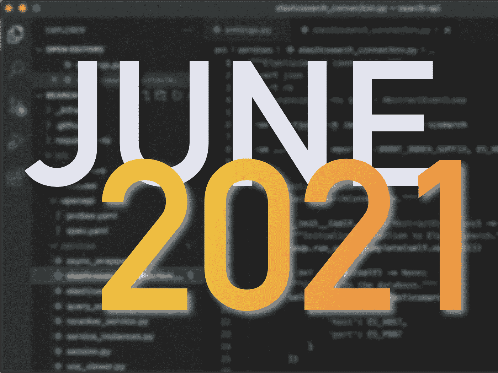
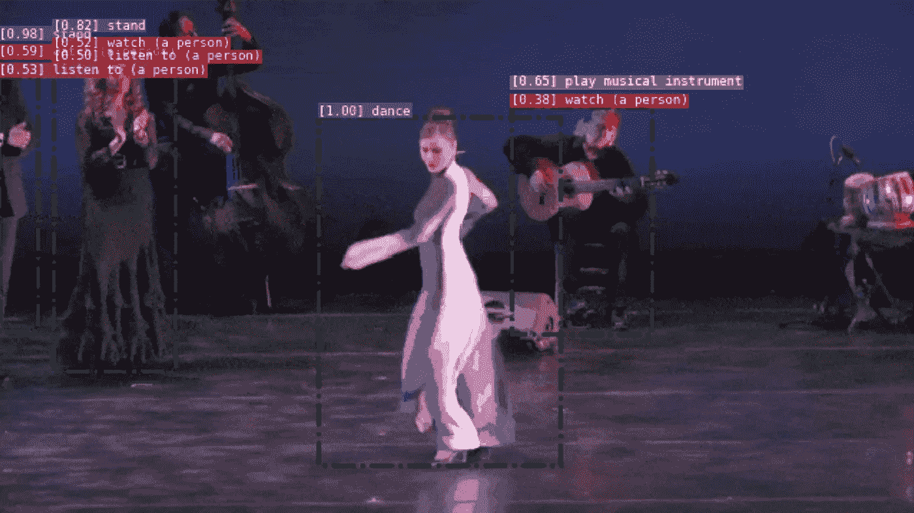
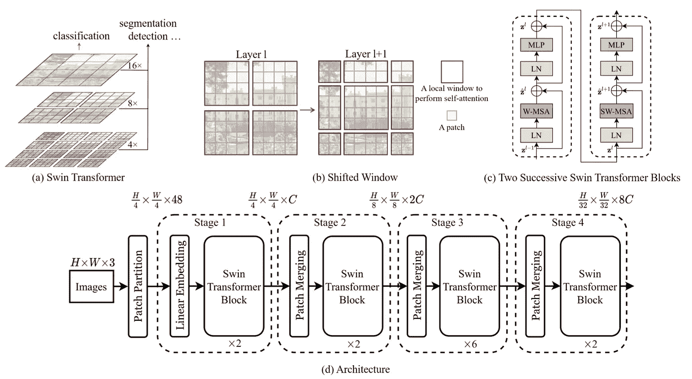
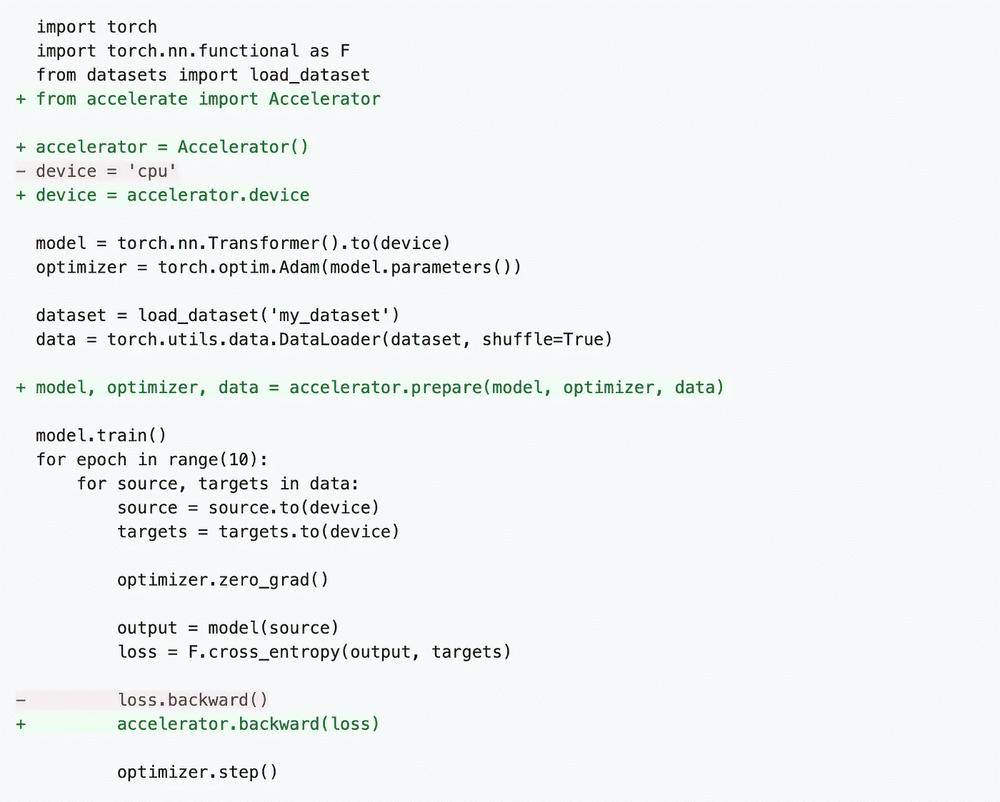
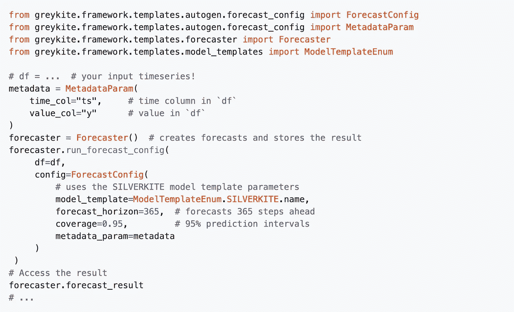
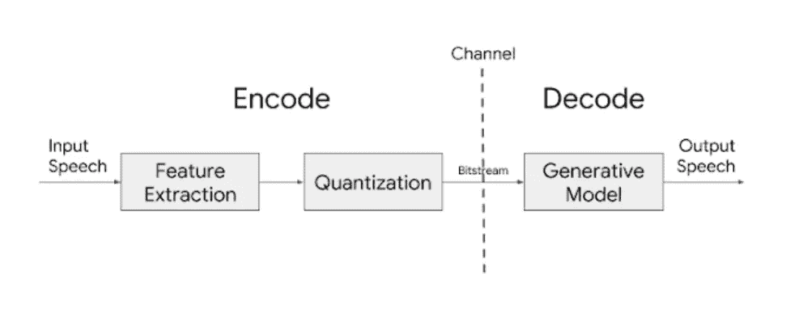

# 最佳 ML 代码和软件—2021 年 6 月

> 原文：<https://towardsdatascience.com/best-of-ml-code-and-software-june-2021-486dcf6f461b?source=collection_archive---------35----------------------->

## 每月精选的最近实现、工具和软件正在 ML 领域获得牵引力:Google 的 Vertex AI、PyTorch Vision、HuggingFace Accelerate 等等。

图片作者。

构建 ML 软件并从研究跳到生产并不是一件容易的事，即使当资源的海洋是巨大的:很难跟上。确切地说，当我们努力将最新的模型投入生产并找到最佳的纸面实现时，我们经常在 [Zeta Alpha](https://search.zeta-alpha.com/) 遇到这个问题，因此我们希望通过分享我们每月在最新的存储库、工具、库和软件新闻中的发现来做出贡献。尽情享受吧！

# ⚙️ MLOps 亮点

ML Operations (MLOps)的空间正在以令人眼花缭乱的速度移动，这可能会使它变得混乱:在过去的几年里，数百家公司和产品已经出现，以更可靠和更强大的方式帮助 ML 投入生产，但结果是一个非常拥挤，尚未确定的市场，仍然很难导航。当我们自己试图理解它的时候，我们密切关注着最新的新闻和发展。这里有一个选择:

*   [谷歌发布 VertexAI](https://cloud.google.com/blog/products/ai-machine-learning/google-cloud-launches-vertex-ai-unified-platform-for-mlops) :一个“MLOps 的统一平台”。大型云提供商([微软的 Azure](https://azure.microsoft.com/en-us/services/machine-learning/mlops/) ，[亚马逊的 AWS](https://aws.amazon.com/solutions/implementations/aws-mlops-framework/) )正在快速构建与他们的技术集成的 ML 工具——可能是为了锁定更多的客户——而像 DataBricks 这样的公司，凭借新的 [DataBricks ML](https://databricks.com/blog/2021/05/27/introducing-databricks-machine-learning-a-data-native-collaborative-full-ml-lifecycle-solution.html) ，或者像 MLFlow 或 Kubeflow 这样的框架，继续推动一个不可知的未来，即你在哪里运行你的 ML 项目。我们将看到内置或第三方解决方案是否会在未来几年内得到更广泛的采用，以及端到端 MLOps 产品是否会赢得特定功能工具的海洋，如带有[通气管](https://snorkel.ai)的标签、带有[海王星](https://neptune.ai)的跟踪实验以及带有[气流](https://airflow.apache.org)的协调。
*   Huggingface 将变压器推向大众，加速了这些架构在生产中的应用。随着变形金刚几个月前在解决计算机视觉任务的研究方面取得进展， [Huggingface 最近发布了第一个完整的“视觉版本”](https://github.com/huggingface/transformers/releases/tag/v4.6.0)，其中包括 CLIP、ViT 和 Deit。工业中使用的模型总是比研究中使用的模型落后几个月，因为性能/ *简单性*的权衡适用于不同的情况。因此，尽管 ViTs 最近取得了成功，我们仍然想知道:变形金刚会在不久的将来取代 CNN 吗？
*   [吴恩达的新 coursera“生产中的人工智能”](https://www.coursera.org/specializations/machine-learning-engineering-for-production-mlops):Andrew 的原创[机器学习课程](https://www.coursera.org/learn/machine-learning)通过将人工智能介绍给数百万从业者，成为人工智能迅速崛起的催化剂。如果这是一个指标的话，这个新课程有可能通过教育成千上万的工程师和研究人员来缩小研究和生产之间的差距。

# 同时，在 GitHub 上

一系列最近发布的库、框架和实现。

## 👾[Facebook research/pytorchvideo](https://github.com/facebookresearch/pytorchvideo)⭐️1.4k |📄[文档](https://pytorchvideo.readthedocs.io/en/latest/) |🌐[网站](https://pytorchvideo.org)

👉 *Pytorch Video 提供了加速视频理解研究所需的可重用、模块化和高效的组件。PyTorchVideo 是使用*[*PyTorch*](https://pytorch.org/)*开发的，支持不同的深度学习视频组件，如视频模型、视频数据集和视频特定变换。*

🚀非常适合构建定制视频处理研究模型并进行基准测试。功能和特点:

*   一个“模型动物园”,包含现有模型的几个实现，以及最常见数据集的数据加载器。
*   高效的视频组件:组件针对视频进行了优化，并支持硬件上的加速推理。

来源:[https://github.com/facebookresearch/pytorchvideo](https://github.com/facebookresearch/pytorchvideo)

## 👾微软/swin-transformer ⭐️ 3.4k |📄[论文](https://arxiv.org/abs/2103.14030)

*👉如果你想玩视觉变形金刚，这里有你现在可能需要的支柱。*

❓此报告是[“swin transformer:使用移位窗口的分层视觉转换器”](https://arxiv.org/pdf/2103.14030.pdf)的正式实现，它还包括以下论文和任务的代码:

*   *对象检测和实例分割:参见*[*Swin Transformer for Object Detection*](https://github.com/SwinTransformer/Swin-Transformer-Object-Detection)*。*
*   *语义分割:参见* [*Swin Transformer 进行语义分割*](https://github.com/SwinTransformer/Swin-Transformer-Semantic-Segmentation) *。*
*   *自监督学习:参见*[*Transformer-SSL*](https://github.com/SwinTransformer/Transformer-SSL)*。*

如果你想玩一个立体的视觉变形器迭代，这个实现将是有用的。

来源:[https://github.com/microsoft/Swin-Transformer](https://github.com/microsoft/Swin-Transformer)

## 👾[拥抱脸/加速](https://github.com/huggingface/accelerate) ⭐️1.4k |📄[文档](https://huggingface.co/docs/accelerate/)

*👉在不同的硬件加速配置(单个/多个 GPU 和单个/多个节点上的 TPU)上运行 PyTorch 的非常简单的方法，无需特定于硬件的样板代码。*

🚀一次定义，随处训练。很快。accelerate 的用途和用途:

*   Accelerate 让您可以在分布式环境(即跨计算节点或许多其他配置)中运行训练脚本，而不会放弃对训练循环的控制。
*   Accelerate 不会让你从训练循环本身中抽象出来，不像 PyTorch 之上的其他高级框架，比如 [pytorch/ignite](https://github.com/pytorch/ignite) 。

来源:https://github.com/huggingface/accelerate

## 👾 [open-mmlab/mmocr](https://github.com/open-mmlab/mmocr) ⭐️ 1.2k |📄[文档](https://mmocr.readthedocs.io/en/latest/)

👉*一个基于* [*PyTorch*](https://github.com/pytorch/pytorch) *和*[*mm detection*](https://github.com/open-mmlab/mmdetection)*的开源工具箱，用于文本检测、文本识别，以及包括关键信息提取在内的相应下游任务。*

🚀非常适合构建图像或视频处理管道。主要特性和组件:

*   一个**综合管道**，包括下游信息提取任务。
*   用于文本检测和识别的各种最先进的模型
*   一个模块化的设计来定义你自己的优化器，数据预处理，模型骨干或损失函数。
*   几个可视化工具，地面纹理和预测边界框等等。

来源:[https://mmocr.readthedocs.io/en/latest/demo.html](https://mmocr.readthedocs.io/en/latest/demo.html)

## 👾[LinkedIn/grey kite](https://github.com/linkedin/greykite)⭐️939 |📄[文档](https://linkedin.github.io/greykite/docs)

👉Greykite 库通过其旗舰算法 Silverkite 提供灵活、直观和快速的预测。Silverkite 算法适用于大多数时间序列，尤其适用于趋势或季节性变化点、事件/假日效应以及时间相关性。它的预测是可解释的，因此有助于可信的决策和洞察力。

🚀非常适合快速现成的时序应用。主要特性和特征:

*   灵活的设计:提供基本的回归检测趋势和季节性，假期和变化点；以及最先进的 ML 型号可供选择。同一管道支持所有模型的预处理、交叉验证、回溯测试、预测和评估。
*   直观的可视化界面、适用于特定数据特征的模板，以及可生成可解释输出以检查每个回归变量贡献的 it。
*   使用网格搜索进行模型选择的快速培训、基准测试和原型制作。

来源:[https://github.com/linkedin/greykite](https://github.com/linkedin/greykite)

## 👾[谷歌/天琴座](https://github.com/google/lyra) ⭐️ 2.6k | [博文](https://ai.googleblog.com/2021/02/lyra-new-very-low-bitrate-codec-for.html) |📄[论文](https://arxiv.org/abs/2102.09660)

*👉一种高质量、低比特率的语音编解码器，即使在最慢的网络上也能进行语音通信。为此，它应用传统的编解码器技术，同时利用机器学习(ML)的进步，通过数千小时的数据训练模型，创建一种压缩和传输语音信号的新方法。*

🚀这项工作在精神上类似于 [Nvidia 基于 GAN 的极低比特率视频压缩](https://blogs.nvidia.com/blog/2020/10/05/gan-video-conferencing-maxine/)。该方法的工作原理是每 40 毫秒提取语音特征，基于心理声学特性进行量化(即去除人耳对其敏感度低的方面)，并通过信道传输该信号。解码器是一个生成模型，它接收语音特征作为输入，并输出音频波形。这对于构建带宽受限的移动应用程序非常有用。主要功能和特点包括:

*   极低比特率语音编解码(3kbps)。
*   易于集成基于 Android 和 Linux 的应用程序。

来源:[https://ai . Google blog . com/2021/02/lyra-new-very-low-bitrate-codec-for . html](https://ai.googleblog.com/2021/02/lyra-new-very-low-bitrate-codec-for.html)

如果你对 MLOps 的广阔世界更感兴趣，我怎么推荐都不为过，你可以看看迟虎燕在她的博客上的[工具诊断摘要，以及](https://huyenchip.com/2020/12/30/mlops-v2.html)[ml-ops.org](https://ml-ops.org)网站和他们在 GitHub 上的[资源列表。](https://github.com/visenger/awesome-mlops)

这就是这个月的内容，如果你想跟上 ML 世界的最新发展，请在 Twitter 上关注我们。要了解更多有趣的近期研究，请查看其他月度博客系列 [*和 arXiv*](/best-of-arxiv-june-2021-dcd3aa48a66d) 精选，它们主要关注学术文献。下个月见！

*【所有 GitHub 回购星级统计截至 2021 年 6 月 1 日】。*

*参考文献*

[1] [*从自然语言监督中学习可转移的视觉模型*](https://arxiv.org/abs/2103.00020)——亚历克·拉德福德、琼·金旭等 2021。

[2] [*一幅图像抵得上 16x16 个字:大规模图像识别的变形金刚*](https://arxiv.org/abs/2010.11929)——作者阿列克谢·多索维茨基、卢卡斯·拜尔、亚历山大·科列斯尼科夫、德克·韦森博恩、翟晓华等 2021

[3] [*训练数据高效的图像转换器&通过注意力的升华*](https://arxiv.org/abs/2012.12877?fbclid=IwAR0g4j0LEcHzO67FGGNMLTg1ksFymSOmuCAAkIbemlU2r5XhIuJyargTbpc)——Hugo Touvron 等人 2020