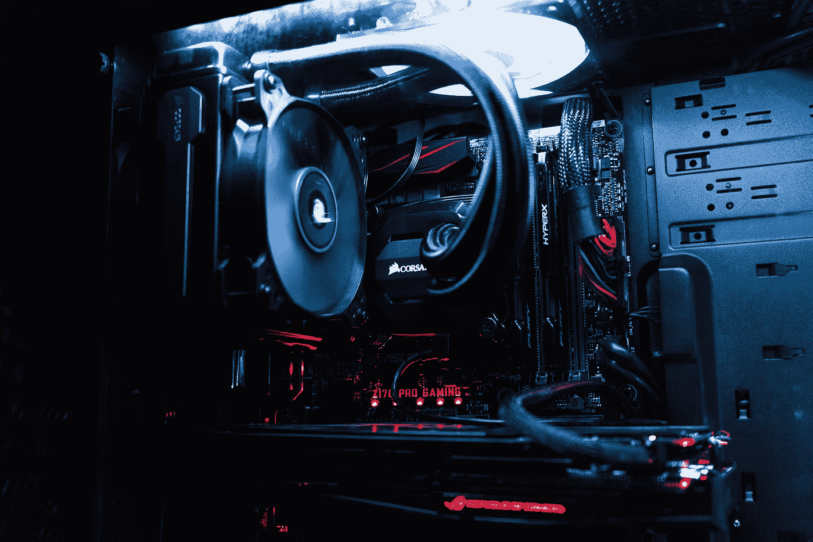

# 在各种预算范围内，最适合深度学习的电脑

> 原文：<https://towardsdatascience.com/best-pc-builds-for-deep-learning-in-every-budget-ranges-3e83d1351a8?source=collection_archive---------2----------------------->

## 意见

## 探索在每个预算范围内执行深度学习计算的最佳 PC 构建平台

[6 9](https://unsplash.com/@cia69?utm_source=medium&utm_medium=referral) 在 [Unsplash](https://unsplash.com?utm_source=medium&utm_medium=referral) 上拍照

随着人工智能的所有现代发展，深度学习的普及程度已经上升到了顶峰。深度学习的崛起和广泛的应用前景非常可观。随着对许多感兴趣的主要主题进行深入研究，深度学习的革命必将在未来几年继续下去。

如果你的目标是精通深度学习，你最终需要一个强大的系统。一个系统，你可以用它来处理各种各样的具有挑战性的任务，这些任务可以在互联网上进行深度学习。虽然旨在实现这一目标，你可能有一定的预算限制。你可能对你期望构建和实现的构建类型没有最好的想法。

请记住，本文中提到的所有构建都是针对机器学习的，特别是针对那些对深入研究和探索深度学习感兴趣的人。但是，在我们直接进入我们的 PC 构建之前，让我们了解一些核心要求，这些要求对于加快我们在深度学习过程中会遇到的一些任务是必不可少的。

在您继续阅读本文之前，我想向所有感兴趣的读者提一下几个先决条件。确保您完全愿意花费指定的金额，这取决于它是低端、普通还是高端版本。更重要的是，确保你想要追求深度学习，作为你未来的一个重要部分。

如果你不太确定你是否想在这上面投入时间，或者如果你想追求你的梦想，但目前没有购买 PC 的最佳预算，我强烈建议读者查看本文的下一部分。

在你深入研究这篇文章之前，我建议你检查一下你是否真的需要 GPU 来进行深度学习。本文将帮助您了解图形处理单元、CUDA 内核和其他基本概念。

 [## 深度学习真的需要 GPU 吗？

### 获得一个 GPU 是深度学习的必备条件吗？了解 GPU 及其优势，并探索…

towardsdatascience.com](/do-you-really-need-a-gpu-for-deep-learning-d37c05023226) 

# 不确定该做什么？

照片由[阿卜杜勒·巴里](https://unsplash.com/@abdulbarie_91?utm_source=medium&utm_medium=referral)在 [Unsplash](https://unsplash.com?utm_source=medium&utm_medium=referral) 上拍摄

如果您有以下问题之一，该怎么办？—

1.  降低预算限制。
2.  还是不确定深度学习。
3.  你不喜欢在技术上花钱(或者你觉得技术很无聊)。
4.  其他类似原因。

从每个人的角度来看，上述理由绝对有效。对于以上四点所提到的情况，我主要有几个建议。首先，我强烈推荐检查一下 Google Colab 环境，因为它为初学者和专家提供了许多奇妙的功能。

如果你是数据科学、人工智能和深度学习的初学者，Google Colab 是一个类似于 Jupyter 笔记本的环境，它为用户提供了一个难以置信的平台，只需登录你的电子邮件 ID 就可以执行任何类型的复杂任务。你也可以安装带有数据集的 Google Drive，并在旁边执行计算。

我想建议第一次观看的人，甚至那些完全不确定自己对深度学习的兴趣或定位的人，开始使用谷歌 Colab，花时间做他们的项目，探索他们的兴趣。请随意尝试您想要的新东西，因为云环境为您提供了一种利用其 GPU 以及与他人轻松共享 Jupyter 笔记本内容的方式。

在我之前的一个作品中，我在 Jupyter 笔记本上写了一个完整的入门指南。查看下面提供的文章，了解 Jupyter 笔记本的几乎所有信息。

 [## 关于 Jupyter 笔记本你需要知道的一切！

### 分解 Jupyter 笔记本的所有内容，从菜单到运行电池，以及各种…

towardsdatascience.com](/everything-you-need-to-know-about-jupyter-notebooks-10770719952b) 

你应该考虑的另一个选择是利用各种公司为人工智能提供的众多云平台。其中包括亚马逊的 AWS、微软的 Azure、IBM 的 Watson Studio 等等。使用这些云环境，您不仅可以按照自己的意愿构建有效的模型，还可以将它们部署到云环境中，以获得更广泛的受众。

随着这些初始问题的解决，让我们开始探索在各种预算范围内，深度学习的最佳 PC 构建是什么。

# 各种预算范围内深度学习的最佳 PC 构建:

在 [Unsplash](https://unsplash.com?utm_source=medium&utm_medium=referral) 上由[娜娜杜瓦](https://unsplash.com/@nanadua11?utm_source=medium&utm_medium=referral)拍摄的照片

在我们深入探讨哪种 GPU 最适合您的构建之前，让我们分析一下构建您的最终 PC 构建所需的其他基本组件。首先，数据集将需要大量存储来执行复杂的应用程序。如果你想做更大的项目，大容量硬盘是必须的。我还会推荐一个更小的固态硬盘(SSD)来加快您的操作速度。固态硬盘可以存储您的操作系统，各种任务将更快、更高效。

下一个基本组件是随机存取存储器(RAM)。系统上的 RAM 对于处理电脑上某些任务的执行速度非常重要。拥有相当高的 RAM 对于提高工作效率来说通常是必不可少的。另一个需要考虑的基本因素是您所使用的处理器类型。您可以选择英特尔或 AMD 的 CPU。两者都有自己的好处，我强烈建议观众去研究它们。

最后，让我们探索深度学习的核心，即 GPU 的最佳选项。最好的公司选择 GPU 的明显选择是英伟达，主要是因为一个首要原因。英伟达提供了一种叫做计算统一设备架构(CUDA)的东西，这对于深度学习模型的计算极其有益。

CUDA 是 Nvidia 创建的并行计算平台和应用编程接口模型。这些 CUDA 核心在人工智能领域是高度有益和进化的。与 AMD 等其他公司相比，在这些 CUDA 模块上投入的研究和时间要多得多。

虽然其他一些图形卡可能功能强大，但它们没有 CUDA 对某些关键操作的完全支持。因此，出于深度学习的目的，英伟达 GPU 优于其他同行。英伟达的 CUDA 支持多种深度学习框架，如 TensorFlow、Pytorch、Keras、Darknet 等。

选择处理器时，尽量选择没有集成 GPU 的处理器。因为我们已经单独购买了一个 GPU，所以您不需要在 CPU 中预先构建集成 GPU。遵循这一步骤将帮助你节省更多的钱。我对 Intel CPUs 比较有经验，对这个话题的评论会比 AMD 多。

其他重要组件，如主板、电源单元(PSU)和 CPU 外壳，将不在本文中详细讨论。无论是英特尔还是 AMD，都应该相应地研究和购买适合您的 CPU 分支的主板。配备显卡的 PSU 版本通常在 450 瓦以上的低预算版本中表现最佳，在 750 瓦以上的高预算版本中表现最佳。CPU 外壳是舒适的选择。选择最适合你的。

## 低预算构建:

在低预算的个人电脑中，您应该寻找能够轻松处理一些复杂操作的处理器，例如 Jupyter 笔记本电脑。英特尔的建议将是 I3-I3–10100 F 或任何其他 I3–9 代 F 系列。这些处理器没有集成 GPU，可以以较低的预算最佳地执行大多数任务。我会推荐研究 AMD 的 CPU，因为我听说它们在较低的价格预算下，具有更高的内核和线程，性能会好得多。

你至少应该寻找 8GB 的内存。但是，如果其他组件没有到位，4GB RAM 应该暂时足够了。但是，请尽快升级它们。如果可以，尝试获得 128 GB 的固态硬盘，以及 1TB 的硬盘，用于执行像样的深度学习项目。最后，对于显卡，我的主要建议是 GTX 1050 或低于这个范围的任何东西。

## 平均预算构建:

在普通预算的电脑中，您应该寻找像 i5–9400 f 这样的处理器，也就是说，一个不需要集成 GPU 就可以支持大多数任务的处理器。请研究各自的 AMD 公司的同行也彻底。根据我的研究，AMD 锐龙 5 (6 核，3.4 GHz)似乎是一个合适的选择。

您应该寻找 8GB 到 16GB 的内存范围，最好是 16 GM 的内存。尽量购买 256 GB 到 512 GB 大小的 SSD，用于安装操作系统和存储一些至关重要的项目。以及 1TB 到 2TB 的 HDD 空间，用于存储深度学习项目及其数据集。对于显卡建议，请查看任何类似的 GPU，如 GTX 1650、GTX 1660、GTX 1660 Ti、RTX 2060、GTX 1070 以及该范围内的其他类似 GPU。

我要说的是，我的第一台定制 PC 也是一台普通预算的 PC，由以下组件组成，即 i5–9400k、2 TB 硬盘、256 MB 固态硬盘和 GPU GTX 1660。对于大多数较小的深度学习任务来说，这些构建构成了显著的性能。然而，某些更高复杂性的问题，如 GANs 上的项目，可能会有点问题。

## 高预算构建:

在高预算构建中，您应该寻找的组件是带有或不带有集成 GPU 的 AMD 或英特尔处理器。在这些价格范围内，这些 CPU 通常都带有集成的 GPU。我的英特尔建议是 i7–10700k、i9–9900k 或 i9–10900 x。至于磁盘空间，我会推荐 512 GB 到 1 GB 或更多的 SSD 和至少 4 TB 的 HDD。尝试以 16–32 GB DDR 4 的高频率 RAM 为目标。

这些范围的最佳显卡通常有多种选择，包括购买多个显卡。一些最好的选择是 GTX 1080 钛，RTX 2080，RTX 2080 钛，RTX 3080 和 RTX 3090，以及许多其他神话般的选择。

如果你有一个较高的预算，那么请随意花费你的资源来建立最好的设备。你也可以看看其他元素，比如 RGB 风扇，或者更酷的 CPU 外壳。你也可以包括液体冷却的元素，以防止你的高强度引擎表现良好。

# 结论:

照片由 [Artiom Vallat](https://unsplash.com/@virussinside?utm_source=medium&utm_medium=referral) 在 [Unsplash](https://unsplash.com?utm_source=medium&utm_medium=referral) 上拍摄

> “艾温特斯不是由于想象力陷阱，而是由于缺乏想象力。想象力从混乱中带来秩序。具有深度想象力的深度学习是通往 AI 春天和 AI 秋天的路线图。”
> — ***阿密特雷***

作为一个额外的提示，我建议观众关注这些 GPU 在你们各自国家的价格范围。每当价格大幅或小幅下降时，将是您购买这些设备的最佳时机。继续自己研究，在你的价格范围内寻找更好的选择。

本文涵盖了查看您的 PC 构建的大多数基本方面，以便在您期望的价格范围内获得有史以来最好的深度学习设置。请随意研究和探索，直到你最终决定什么是最适合你的选择。顺便说一句，我个人的建议是，如果你有足够的预算，那就去做吧。

最糟糕的情况是，如果你买了一台 PC，然后决定深度学习可能不是你的最佳选择，因为它不适合你当前的兴趣，你仍然可以将它用作游戏、编辑、流媒体等等的设备。所以，如果你买得起，那就去买吧！这个选择带来的遗憾将会很少。

如果你对这篇文章中提到的各点有任何疑问，请在下面的评论中告诉我。我会尽快给你回复。

看看我的其他一些文章，你可能会喜欢读！

 [## 数据科学和机器学习的 7 个最佳免费工具

towardsdatascience.com](/7-best-free-tools-for-data-science-and-machine-learning-3e630125f87e)  [## 为机器学习简化数学的最佳库！

### 使用 sympy Python 库简化用于机器学习的微积分

towardsdatascience.com](/best-library-to-simplify-math-for-machine-learning-ed64cbe536ac)  [## 6 个最佳编程实践！

### 每个程序员和数据科学家都应该遵循的六个编程技巧

towardsdatascience.com](/6-best-programming-practices-f2605c5b469c)  [## 成为数据科学家的 5 项必备技能！

### 探索每个成功的数据科学家必须具备的五项重要软技能！

towardsdatascience.com](/5-essential-skills-to-develop-as-a-data-scientist-16442f094c09)  [## 你应该知道的 5 个 NLP 主题和项目！

### 应该添加到简历中的五个高级自然语言处理主题和项目想法

towardsdatascience.com](/5-nlp-topics-and-projects-you-should-know-about-65bc675337a0) 

谢谢你们坚持到最后。我希望你们都喜欢这篇文章。祝大家有美好的一天！