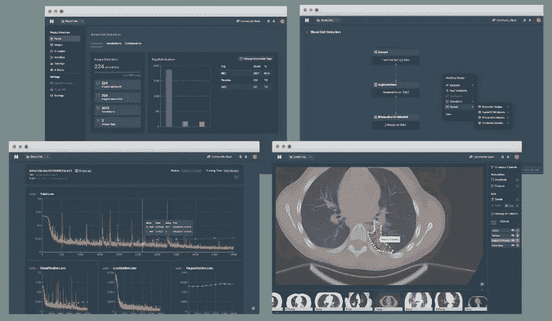
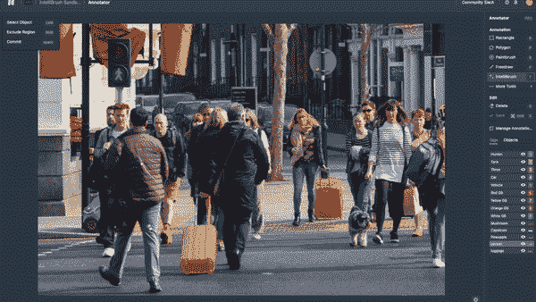
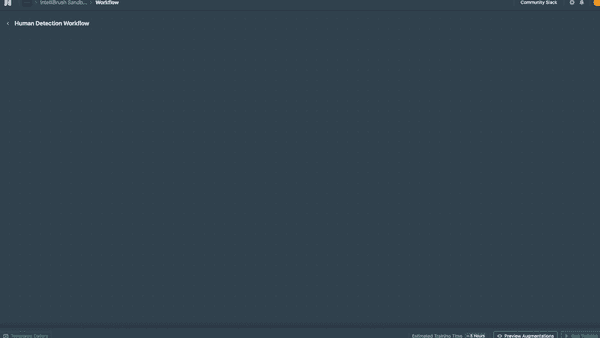
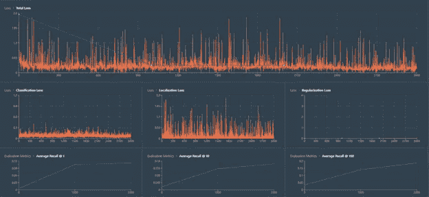
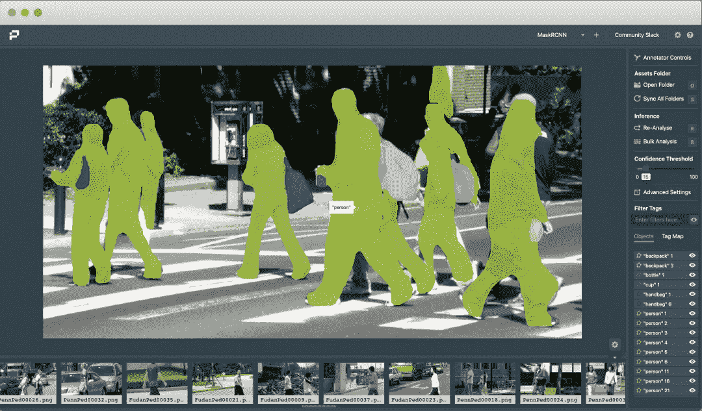
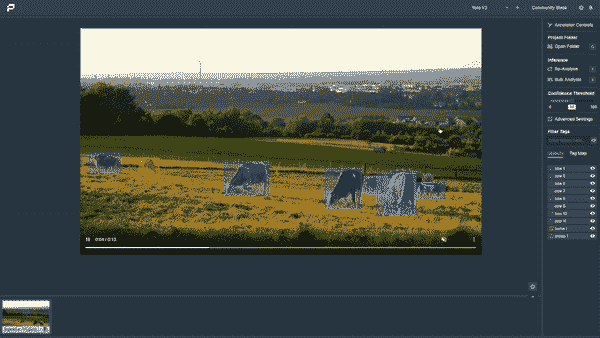

# 为计算机视觉任务构建深度学习模型的最佳平台

> 原文：<https://towardsdatascience.com/best-platform-to-build-deep-learning-models-for-computer-vision-tasks-1c3cf2e0e303?source=collection_archive---------22----------------------->

## 查看用于构建和建立自己的深度学习模型以解决计算机视觉任务的最佳平台选项

卡尔·海尔达尔在 [Unsplash](https://unsplash.com?utm_source=medium&utm_medium=referral) 上拍摄的照片

自从深度神经网络在分割神经元网络方面赢得 ISBI 挑战赛以来，构建深度学习模型来解决众多计算机视觉项目的技术已经获得了巨大的欢迎。在过去的十年里，大多数重大的计算机视觉比赛都被深度学习成功征服。

随着深度学习领域的快速发展，每年都有新的方法和技术被发现，跟上这些大规模趋势变得至关重要。虽然大多数数据科学爱好者和有志之士可能希望用最好的深度学习工具构建一些独特的计算机视觉应用和项目，但不幸的是，他们可能无法利用最好的机会。

在本文中，我们将讨论几个重要的计算机视觉任务，即对象分类和检测，以及实例分割。一旦我们理解了这些主题的基础，我们将讨论如何在这些任务的最佳平台的帮助下完成这些项目。实现大多数深度学习任务的一个主要贡献因素是 GPU。要了解和探索更多关于 GPU 的重要性，请通过下面提供的链接查看下面的文章。

 [## 深度学习真的需要 GPU 吗？

### 获得一个 GPU 是深度学习的必备条件吗？了解 GPU 及其优势，并探索…

towardsdatascience.com](/do-you-really-need-a-gpu-for-deep-learning-d37c05023226) 

# 重要的计算机视觉应用:

安妮·斯普拉特在 [Unsplash](https://unsplash.com?utm_source=medium&utm_medium=referral) 上的照片

随着深度学习和计算机视觉领域的每一项进展，计算机视觉的光芒开始闪耀，现代世界需要几个现代计算机视觉项目。猫狗分类、人脸识别、情感和手势识别、对象检测和分割任务等项目都非常有名。

在本文的这一部分，我们将了解并涵盖计算机视觉的三个主要应用，它们被认为是最重要的应用，即分类任务、对象检测和实例分割。事不宜迟，让我们探索这些基本概念，并了解以下概述。

[图像来源](https://commons.wikimedia.org/wiki/File:Detected-with-YOLO--Schreibtisch-mit-Objekten.jpg)

## 1.分类:

图像分类是执行的最显著的计算机视觉操作之一。常见的分类图像处理任务可以包括简单到在狗或猫之间进行分类或者在许多狗品种之间进行分类。图像分类是我们倾向于对图像甚至视频执行的最基本的任务。大多数图像分类任务可以用卷积神经网络、迁移学习模型和其他类似的项目来执行。

## 2.物体检测:

目标检测是计算机视觉最重要的任务之一。几十年来，一直在开发几种算法来解决以下问题。然而，直到最近(大约十年前)，这项任务才获得了更多的关注。简单地说，目标检测的目的是在期望的目标位置周围创建边界框。

## 3.实例分段:

我们将在文章的这一部分讨论的最后一个重要的计算机视觉操作是分割。分割用于推断图像中的单个实体。在分段技术的帮助下，您可以相应地分离基本元素。语义分割试图识别给定特定图像中每个像素的作用，而实例分割倾向于识别每个类别的标签。

# 讨论完成这些任务的最佳平台:

作者图片

实现上一节中提到的这些任务并获得最佳结果的最佳平台之一是[数据仓库](https://datature.io/)。为了解决这些问题，构建各自的深度学习模型并从零开始构建它们所需的时间相当长。然而，在这个端到端平台的帮助下，您可以成功地注释、训练和部署您的模型，而不会招致任何技术债务。

进入 Nexus 网站后，您可以注册一个免费计划，这足以开始您的计算机视觉之旅。该免费计划非常适合探索 MLOps 工具的团队、学生、研究人员和希望深入研究计算机视觉的数据科学爱好者。免费计划的一些亮点包括:(I)访问增强库;( ii)基于 web 的注释器;( iii)免费的 GPU 计算时间。

## 数据预处理:

作者图片

登录后，您可以使用拖放编辑器上传您的图像和注释，轻松地从头开始创建一个新项目。注释支持多种格式，所以从 OpenCV 导入数据集没有问题。然后，您可以使用基于 web 的注释器对图像进行注释，该注释器支持绘制边界框、多边形和遮罩。

## 训练您的神经网络模型:

注释完图像后，只需点击几下鼠标，您就可以开始构建工作流程了。

作者图片

该平台为您提供了许多选项来构建不同类型的模型。您可以构建的一些模型示例有 RetinaNet、fast R-CNN、Mask R-CNN 和 EfficientDet 模型，它们也支持超参数调整。您可以从他们的四种可用 GPU 模型中选择一种，然后继续训练网络。一旦神经网络被初始化，您就可以在神经监视器上快速监视进度。根据数据集的大小，训练模型可能需要 20 分钟，一旦生成模型，您就可以执行预测任务了。

作者图片

# 可视化模型推理:

作者图片

大多数开发人员在构建任何深度学习项目以解决计算机视觉任务的过程中面临的一个关键问题是他们需要编写的大量代码。一旦你成功地完成了一个模型的训练，你就必须编写更多的代码来确保这个模型能够做出正确的预测并且能够被成功地部署。

对于大多数开发人员来说，这个过程可能非常乏味，因为他们每次构建新的深度学习模型时都必须处理这些情况。然而，Datature 提供了自己的开源门户[库，有助于克服数据科学爱好者面临的大多数常见困难。Portal 是游戏规则的改变者，因为它允许开发人员以最快的方式加载和可视化模型。](https://datature.io/blog/inspect-model-inferences-on-images-and-videos-with-portal)

对于大多数初级开发人员来说，Portal 也很容易使用。只需几个步骤，您就可以执行所有需要的操作。Portal 目前支持 TensorFlow 和 DarkNet 模型，而 PyTorch 支持计划在不久的将来发布。安装门户库后，使用门户库的基本步骤是相应地注册和加载所需的模型。完成这些步骤后，您可以添加图像或视频，并轻松地做出适当的预测。

作者图片

使用 Portal 可视化预测的步骤总结如下:

*   [启动门户](https://github.com/datature/portal)
*   注册模型(本地或使用数据关系)
*   加载资产(图像/视频)
*   实时观察模型推理

其他功能如下:

*   类别过滤
*   设置 IoU 阈值
*   运行视频推理
*   选择视频帧间隔

# 结论:

设计生态学家在 [Unsplash](https://unsplash.com?utm_source=medium&utm_medium=referral) 上拍摄的照片

深度学习和计算机视觉在现代的兴起是无可争议的。虽然有几种方法可以解决各种计算机视觉任务，但开发人员在试图找到最佳方法时经常会面临几个问题。拥有一个合适的 MLOps 管道允许团队在从头构建模型和部署模型时有效地启动和迭代他们的模型。在本文中，我们讨论了相对容易地实现这两个任务的最佳平台。

对于大多数重要的计算机视觉项目来说，Datature 平台是一个非常棒的地方。除了允许您在不需要编码和可视化工作流的情况下构建大量模型之外，注释还可以完全在线监控和管理。培训过程在云上完成，无法访问 GPU 支持的用户可以从这些功能中受益匪浅。

该平台最棒的部分是，您不仅可以构建和训练模型，还可以使用他们的开源门户库来注册和加载您构建的模型，以便对您的图像或视频内容进行适当的预测。这样做将大大减少开发人员所需的计算工作，并使他们能够更有效地执行任务。想开始吗？看看这个 [5 分钟视频](https://datature.io/blog/five-minutes-datature-demo)，今天就启动你的第一个计算机视觉项目吧！

如果你对这篇文章中提到的各点有任何疑问，请在下面的评论中告诉我。我会尽快给你回复。

看看我的其他一些文章，你可能会喜欢读！

 [## 每个人都必须知道的 10 个计算机视觉术语！

### 十个基本的计算机视觉术语，每个人都应该学习，以更加精通计算机视觉…

towardsdatascience.com](/10-computer-vision-terms-everyone-must-know-about-687a98845fc8)  [## 5 个最好的 Python 项目，代码可以在一小时内完成！

### 用完整的代码构建五个很酷的 Python 项目，开发人员可以在一个小时内构建这些项目，并添加到您的…

towardsdatascience.com](/5-best-python-projects-with-codes-that-you-can-complete-within-an-hour-fb112e15ef44)  [## CBAM 天气模式的数据科学和可视化

### 了解如何使用数据科学可视化和 CBAM 解释大量天气模式

towardsdatascience.com](/data-science-and-visualizations-of-weather-patterns-with-cbam-41ec6380ed97)  [## 每个数据科学家都必须知道的 14 个熊猫操作！

### 关于 14 种最基本的熊猫手术的完整指南

towardsdatascience.com](/14-pandas-operations-that-every-data-scientist-must-know-cc326dc4e6ee)  [## 7 款面向 Python 开发人员的最佳 UI 图形工具，带入门代码

### Python 中用于开发酷用户界面技术的七个最佳 UI 图形工具

towardsdatascience.com](/7-best-ui-graphics-tools-for-python-developers-with-starter-codes-2e46c248b47c) 

谢谢你们坚持到最后。我希望你们都喜欢这篇文章。祝大家有美好的一天！