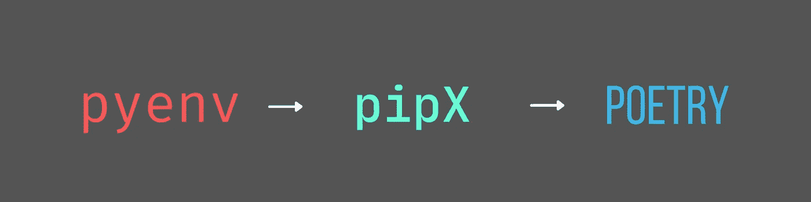

# 设置 Python 环境的最佳实践

> 原文：<https://towardsdatascience.com/best-practices-for-setting-up-a-python-environment-d4af439846a?source=collection_archive---------2----------------------->

## 面向数据科学家的 PYTHON-DEV

## pyenv-> Pipx-> poem，python 工具链的三大支柱



作者图片

你是一个数据科学家，刚刚构建了一个 ML 模型，却不能让它在 docker 容器上工作吗？你是否害怕尝试新的 python 版本，因为你不想搞乱你的本地 python 开发环境？您是否同时从事多个副业项目，并希望分别用沙箱保护每个环境？您是否不清楚如何管理您的 python 应用程序从开发到发布的生命周期？

> 您一直在错误地设置您的 python 环境！

与 python 开发人员不同，数据科学家很少关心他们代码的开发环境和可移植性。代码大部分存在于 jupyter 笔记本上，交给负责部署的开发人员。当您的机器上只有一个版本的 python，并且一直在一个项目上工作时，这种方法非常有效。但是，一旦您开始在需要不同环境的多个 python 版本或多个项目上工作，就越来越难以保护这些环境。

一旦您用沙箱保护了您的环境，您就开始向您的项目添加包，每个包都有它自己的依赖项列表。您需要管理您的依赖关系图，并确保您的合作者能够获得完全相同的依赖关系。

掌握新的 python 版本和开发是提高 python 技能的必要条件。当你开始一个新项目时，你不想成为你的团队中的一个人，这个人对 f 弦感到不舒服，害怕 T2 异步，不理解 T4 海象操作符，并且把你的本地开发环境搞得一团糟。

下面是设置 python 环境来处理这些棘手情况的工具和步骤列表。

## Pyenv

> 每当你有一个全新的操作系统安装，首先安装 pyenv 开始。Pyenv 是一个命令行工具，不依赖于 python 的安装。

您可以为每个项目设置一个全局 python 版本和一个本地 python 版本。例如，您可以拥有 python 的全球版本 3.8.2，但仍然可以在您的项目中试用 python 3.9.2 或 3.10。使用 [pyenv](https://github.com/pyenv/pyenv) ，您可以设置 python 安装的范围。您有一个全局 python 版本，它应该是 python 的一个稳定版本，您应该将它作为大多数项目的基础，然后您可以根据项目需要使用较新或较旧的 python 版本。对于 Windows，有一个可用的端口 [pyenv-win](https://pyenv-win.github.io/pyenv-win/#get-pyenv-win) 。

## Pyenv Cheatsheet

1.  **列出可用版本并安装:**

这将给出可以使用 pyenv 安装的 python 版本列表。该列表可能因操作系统而异。

```
# List all available python versions
>pyenv install -l
:: [Info] :: Mirror: [https://www.python.org/ftp/python](https://www.python.org/ftp/python)
2.4-win32
2.4.1-win32
2.4.2-win32
…
3.9.0a3
3.9.0a4-win32
3.9.0a4# Install a specific python version
>pyenv install 3.9.0a4# Rehash your new installables. Needed to update pyenv shims.
>pyenv rehash
```

2.**全球和本地版本:**

既然安装多个 python 版本很简单，那么您可以在多个 python 版本之间切换。即使您的机器上可能有多个 python 版本，您也需要将 1 个版本设置为全局版本。您可以检查您的全局 python 版本，

```
# Set global python version
>pyenv global 3.9.0a4# Check global python version
>pyenv global
3.9.0a4
```

与全局版本不同，您可以为特定项目设置特定的 python 版本。比如，你有一个项目在 python 3.8.2 中运行；您可以首先安装 python 版本，然后为该项目设置一个本地 python 版本。这将覆盖全局 python 版本。

```
# Install other verion of python
>pyenv install 3.8.2# Change directory to your project
>cd DreamProject# Set local python version inside your project
DreamProject>pyenv local 3.8.2# Check your local python version
DreamProject>pyenv local
3.8.2
```

这将在您的项目中创建一个包含 python 版本的`.python-version`文件。Pyenv 将使用这个来[巧妙地](https://mungingdata.com/python/how-pyenv-works-shims/#:~:text=Shims%20are%20lightweight%20executables%20that,the%20beginning%20of%20your%20PATH)设置 python 版本，只要你在这个目录的范围内。现在您已经设置了 python 版本，您可以打开一个新的终端并进行验证。

## Pipx

> 使用 pipx 安装全局 python 工具。mypy、flake8、black 和 poem 可以使用 pipx 安装一次，然后跨项目重用*。*

保持干燥。当您跨项目重用 python 工具时，最好是全局安装一次，然后跨项目重用。 [Pipx](https://pypa.github.io/pipx/installation/) 用于全球安装 python 工具。像 [mypy](https://mypy.readthedocs.io/en/stable/) 、 [flake8](https://flake8.pycqa.org/en/latest/) 这样的林挺工具，像 [black、](https://github.com/psf/black)这样的格式化工具，以及像[poems](https://python-poetry.org/)这样的依赖管理工具，都可以在全局范围内安装一次，然后跨项目重用。这有助于只保留这些工具的一个版本，并避免不同项目之间的版本不匹配。如果需要覆盖这个全局版本，您也可以在您的虚拟环境中安装它。

例如，您可以在您的计算机上安装一次`black`格式化程序，并在多个项目中重用它。

```
# Verify global python version is active
>pyenv global
3.9.0a4# Install pipx
>pip install pipx# Make sure pipx is added to the path
>pipx ensurepath# Install black globally
>pipx install black# Check if install is successful
>black --version
black, version 20.8b1
```

现在您已经安装了 black，您可以在您的 IDE 中设置这个路径，以便开始跨项目使用它。

在 vscode 中，可以通过在用户`settings.json`文件中添加下面一行来设置它，

```
# Set path for the python executable
“python.formatting.blackPath”: “C:\\Users\\username\\.local\\pipx\\venvs\\black\\Scripts\\black.exe”,
```

## 诗意

> 对于 python 应用程序的整个生命周期来说，诗歌是一个完美的工具。从创建虚拟环境、设置开发环境、安装包、解决依赖性、分发代码、打包和发布代码。

[诗歌](https://python-poetry.org/)在项目的整个生命周期中帮助开发者。通常，一个项目从创建一个虚拟环境开始，添加项目所需的包，然后以将应用程序打包给最终用户或在 PyPI 中发布它结束。我们将在下面的诗歌中看到你如何做到这一切。

## 使用诗歌的 Python 项目生命周期

1.  **启动诗歌:**这将在您的目录中创建一个`pyproject.toml`文件，其中包含与您的项目相关的元信息。您可以打开该文件，稍后再进行编辑。

```
# Create a directory and setup python version
DreamProject>pyenv local 3.8.2# Initiate poetry. This will ask meta info related to the project. DreamProject>poetry init
This command will guide you through creating your pyproject.toml config.Package name [DreamProject]:
Version [0.1.0]:
Description []:
Author [aspiring_dev <[aspiring_dev@gmail.com](mailto:mak.adi55@gmail.com)>, n to skip]:
License []:
Compatible Python versions [^3.8]:
```

**2。创建一个虚拟环境:**注意到目前为止我们只创建了一个 toml 文件，我们必须从创建一个虚拟环境开始。这可以如下进行，

```
# Create virtual environment
DreamProject>poetry shell
Creating virtualenv DreamProject-hJUIGXBx-py3.8 in C:\Users\username\AppData\Local\pypoetry\Cache\virtualenvs
Spawning shell within C:\Users\username\AppData\Local\pypoetry\Cache\virtualenvs\DreamProject-hJUIGXBx-py3.8
Microsoft Windows [Version 10.0.19043.1165]
(c) Microsoft Corporation. All rights reserved.
```

**3。安装开发/生产包:**对于一个数据科学项目，我们将从安装 pandas 和 ipython 开始。这里需要注意的一点是，并不是所有的包都是平等的。有些是开发包，有些是生产包。您可以在开发和测试时使用 ipython 和 jupyter 笔记本，但是当您将应用程序作为脚本部署在`main.py`文件中或者公开`class`或`function`时，您就不需要它了。这种隔离避免了将开发工具打包到最终版本中，最终版本将交付给最终用户或被部署。

```
# Add prod packages, will be included in final build
DreamProject>poetry add pandas
Using version ^1.3.1 for pandasUpdating dependencies
Resolving dependencies...Writing lock filePackage operations: 5 installs, 0 updates, 0 removals• Installing six (1.16.0)
  • Installing numpy (1.21.1)
  • Installing python-dateutil (2.8.2)
  • Installing pytz (2021.1)
  • Installing pandas (1.3.1)# Add dev packages, will not be included in final build
DreamProject>poetry add ipython --dev
poetry add ipython --dev
Using version ^7.26.0 for ipythonUpdating dependencies
Resolving dependencies...Writing lock filePackage operations: 13 installs, 0 updates, 0 removals• Installing ipython-genutils (0.2.0)
  • Installing parso (0.8.2)
  • Installing traitlets (5.0.5)
    .......
  • Installing pygments (2.9.0)
  • Installing ipython (7.26.0)
```

`poetry add`比`pip install`强大多了。Pip install 只是从 PyPi 安装软件包，不做任何依赖解析。poem 解决依赖性并为您安装正确的包版本。

> 每当你的项目增长并开始依赖几个包时，依赖地狱就出现了。您安装的每个软件包都有自己的依赖关系，所以每当您安装或升级一个软件包时，解析这个依赖关系图会变得越来越困难。

例如，假设您为依赖于 request ≤ v2.24.0 的项目安装了包 x，而为依赖于 request >v2.25.0 的项目安装了包 y，即使 x 和 y 包都依赖于 requests，但它们在版本上不兼容，也没有重叠。诗歌会发现并标记这些问题，而匹普不会。随着您不断添加越来越多的包，依赖图呈指数级增长，这变得很困难。但是 poem 确保每次你添加一个包时，它都会为你解决依赖性并安装正确的包版本。

**4。与您的代码和环境协作:**一旦您完成了开发或者您想要与您的团队成员协作，您需要开始使用版本控制和中央存储库。其他人现在可以克隆你的回购协议，并开始工作。传统上,`requirements.txt`用于建立一个环境并安装所有的包。但是有了 poem，一旦你在本地克隆了 repo，你就可以运行`poetry install`来安装所有的包和依赖项，安装的顺序和在你的机器上安装的顺序完全一样，从而消除了跨机器设置环境的任何差异。诗歌为你的工作环境和依赖树提供了一个可重复的、精确的副本。

```
# After cloning the repo run poetry install
DreamProject>poetry install
```

这将在虚拟环境中安装此项目所需的所有包。

**5。打包并分发您的代码:**在开发和测试之后，是时候打包并分发您的代码了。帮助构建 python 项目。它可以生成`package.tar.gz`和`package.whl`两种格式。

> 最佳实践是使用 wheel 格式而不是 tarballs(源代码分发)。对于 wheel 格式，源代码已经由开发人员构建好了，并且可供用户使用。使用 tarballs，用户获得源代码，并需要将其构建为 wheel 格式，然后安装它。当你没有开发工具并且你的代码库包含多种语言如 c，c++时，从源代码构建是很困难的。与 tarballs 相比，Wheel 文件也更小，非常适合 PyPi 包装和分发。

```
# Build the project
>poetry build

Building DreamProject (1.0.0)
- Building sdist
- Built dreamproject-1.0.0.tar.gz

- Building wheel
- Built dreamproject-1.0.0-py2.py3-none-any.whl
```

**6。发布您的代码:**基于开发的类型，您可以将您的代码发布到 PyPi 或者使用私有的存储库。默认情况下，会将您的代码发布到 PyPi

```
$ poetry publish

Publishing dreamproject (1.0.0) to PyPI

- Uploading dreamproject-1.0.0.tar.gz 100%
- Uploading dreamproject-1.0.0-py2.py3-none-any.whl 58%
```

## **备注:**

**1。**正如评论中的 [Duncan McRae](https://medium.com/u/a32383de4416?source=post_page-----d4af439846a--------------------------------) 所指出的，如果 python 版本不兼容，有时包安装会失败。

例如，假设您有一个 3.9 的本地 python 版本。poem 将 python 版本初始化为^3.9，这意味着该环境兼容任何高于 3.9 的 python 版本。但是如果你安装了一个包，比如说`scipy`，它的依赖项是> =3.9，< 3.10，那么诗歌安装失败。如果出现这种情况，您可能需要打开`pyproject.toml`文件，并将 python 版本更改为> = 3.9，< 3.10。此行为自版本 1.1.6 起有效，将来可能会改变。

2.[弗朗西斯科·帕多瓦尼](https://medium.com/u/9b90fec5ff41?source=post_page-----d4af439846a--------------------------------)在评论里问了一个极好的问题，*不知道，康达不就是类似于诗歌吗？而且 conda 不是数据科学界用的吗？因此，数据科学家比 python 开发人员更关心代码的可移植性，因为许多 python 开发人员都使用 pip。我错过了什么？*

以上是我个人用诗代替康达的原因。

1.  Conda 不使用 PyPI，有自己的包索引器。官方渠道是几个版本落后于几个软件包，但也有其他渠道有最新版本可用。但是你必须小心你从哪里得到你的软件包的作者。

2.由 Anaconda Inc .拥有，不像 poems 是一个开源项目。

3.Conda 可以访问系统，并可以更改系统二进制文件，不像 poems 那样在虚拟环境中沙箱化，这使它非常适合码头工人。

4.诗与康达兼容。所以您仍然可以使用 conda 来设置复杂的包。