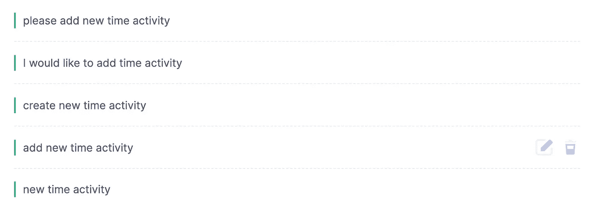
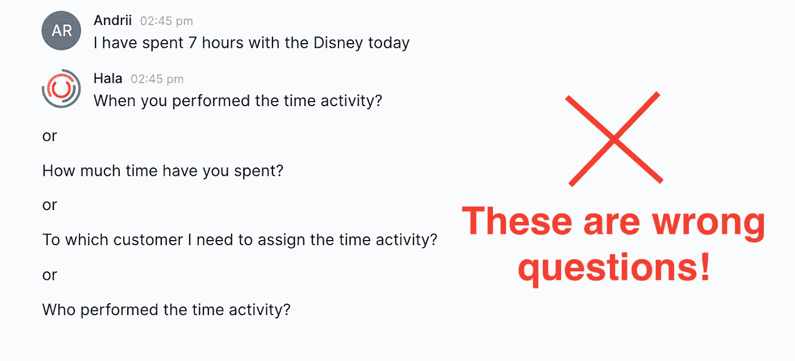
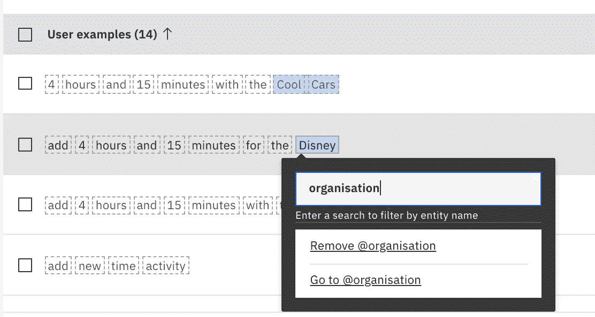
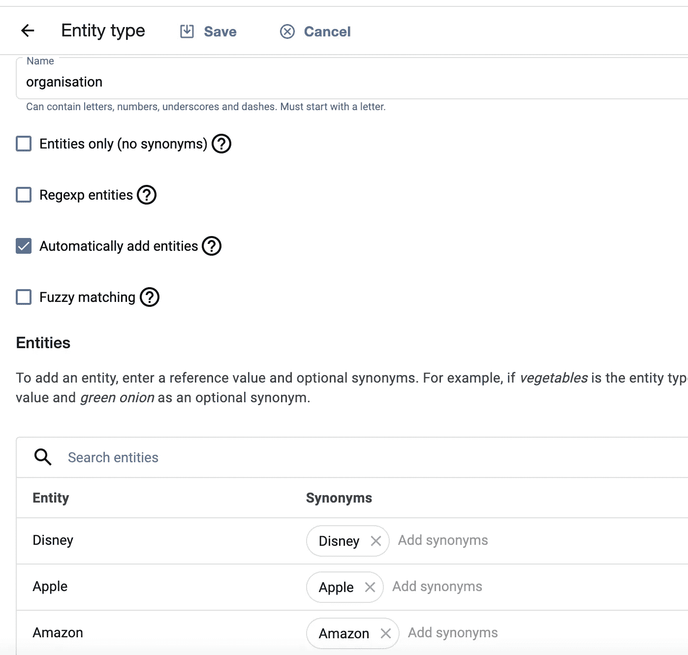
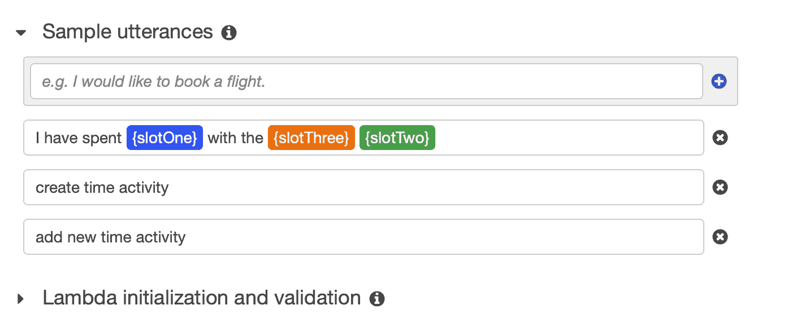
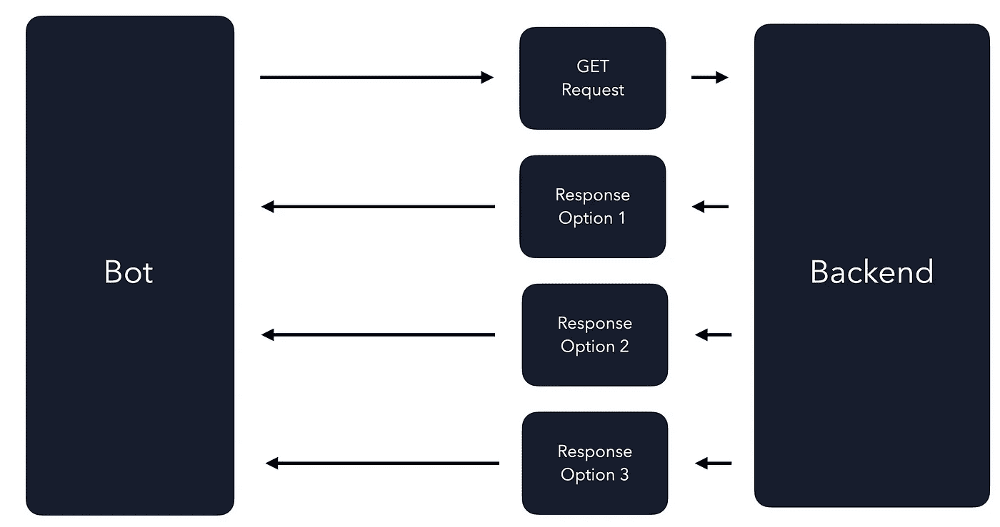
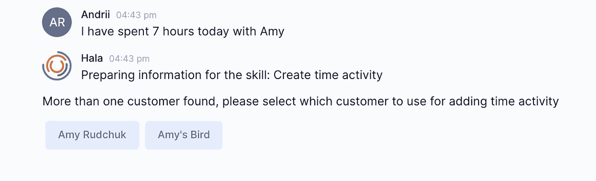
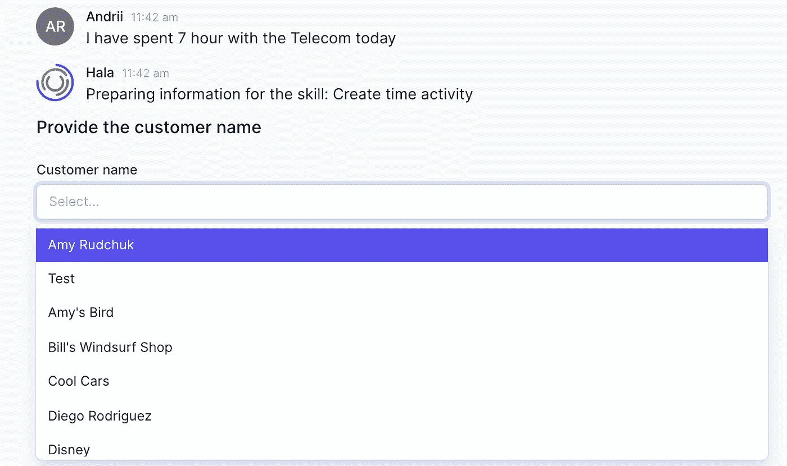

# 设计与商业软件集成的对话式人工智能的最佳实践

> 原文：<https://towardsdatascience.com/best-practices-in-design-conversational-ai-in-integration-with-business-software-d59db176fef9?source=collection_archive---------41----------------------->

作者图片

# 介绍

在这篇文章中，我将尝试描述设计与后端软件集成的对话式人工智能。

真实的例子:创建一个由雇员添加时间活动的机器人。使用时间活动，您可以指定日期、在某项任务上花费的时间、将其分配给项目或客户，此外，还可以指定每小时的费率以及是否计费。

# 步骤 1 —定义意图

在许多情况下，为了设计意图，我试图与机器人的未来用户沟通。您可以写一个故事，解释您请求的目的，以提供不同的话语(意图)示例，他们可以在 bot 中使用这些示例来添加新的时间活动。这一步骤旨在获得来自用户的实时示例，这不仅是为了训练意图和获得更高的置信度，也是为了以最合适的方式设计机器人。

当然，您可以自己设计话语，并开始设计流程，但最终，这可能会导致额外的工作，因为您需要重新构建一切。

例如，你可以设计接下来的话语(意图):

作者图片

而当用户开始使用你的 bot 的时候，你会发现他们会尝试使用其他的话语，很多时候不会像你设计的那么简单。它们可能看起来像这样:

作者图片

上面的例子给了我们很多启示。首先，我们发现这些话语包括像“今天”、“我”、“7 小时”和客户“迪士尼”这样的上下文变量。如果这个人想在最初的信息中提供所有需要的信息，我们需要自动处理它们。在这种情况下，我们不需要要求用户提供关于时间活动的日期、谁执行了时间活动、花费的时间和客户的信息。

当我说我们不需要问额外的问题时，我的意思是:

作者图片

你需要自动识别所有的上下文变量，不要问不必要的问题，因为这会导致糟糕的用户体验。

所以现在，当你有了不同话语的例子，你可以开始设计实体，命名实体识别，对话流，以及与第三方软件的集成。

# 步骤 2-定义实体

基于用户的话语实例，我们可以起草实体的第一个版本来自动识别上下文变量。有些我们可以轻松处理，有些需要更多的工作。

几乎所有提供开发机器人功能的平台( [IBM Watson Assistant](https://cloud.ibm.com/docs/assistant?topic=assistant-system-entities) 、 [Google Dialogflow](https://cloud.google.com/dialogflow/es/docs/reference/system-entities) 、 [Amazon Lex](https://docs.aws.amazon.com/lex/latest/dg/howitworks-builtins-slots.html) )都包括识别日期、数字、时间、货币等的系统实体。

你需要激活它们，你的机器人会识别下一个数据:“今天”、“7 小时”，可能还有“迪士尼”最后一个不太清楚，因为它是一家知名公司，有些平台有识别组织名称的功能，有些没有。此外，您需要考虑到世界上有许多不同的公司名称，可能看起来像“Freezman sporting goods”或“Amy Rudchuk Company”等，在这种情况下，系统实体将不会识别它们或以错误的方式识别它们。

同样，如果我们想一想来自用户的这样的话语:“约翰·史密斯今天和艾米·鲁楚克公司呆了 7 个小时”。

其中“John Smith”是执行时间活动的公司的员工，“Amy Rudchuk company”是客户。这是一个更复杂的例子，因为系统实体可以返回几个对象，例如， *entity.person-John Smith* 和 *entity.person-Amy Rudchuk* 。

这是你可以用不同的选择来解决的挑战。这也取决于你用于 bot 开发的平台。

例如，在 IBM Watson Assistant 中，您可以找到实体注释的功能。例如，如果你想让沃森理解所有的名字，你至少要在十个例子中标注名字。这些句子可能包括“我的名字是玛丽·史密斯”，或者“他们叫我约瑟夫·琼斯”。选择每个名称将其高亮显示，然后从弹出菜单中创建或选择一个名为“name”的实体。从现在开始，沃森将理解它以前从未见过的名字，但这些名字被用在相似的句子中。你可以在这里阅读更多关于注释[的内容。](https://cloud.ibm.com/docs/assistant?topic=assistant-entities#entities-annotations-overview)

作者图片| IBM Watson 助手的用户界面

在 Google Dialogflow 中，您可以使用[自动扩展的功能](https://cloud.google.com/dialogflow/es/docs/entities-options#expansion)，这可以为自定义实体类型启用自动扩展。启用后，您的代理可以识别尚未明确提供的值。除此之外，您还可以应用模糊匹配和正则表达式实体。

图片作者| Google dialog flow 的用户界面

而有了 Amazon Lex，你可以使用[槽](https://docs.aws.amazon.com/lex/latest/dg/howitworks-custom-slots.html)的默认功能。除此之外，你可以尝试使用[亚马逊理解](https://aws.amazon.com/comprehend/)服务。

图片作者|亚马逊 Lex 的用户界面

尽管如此，您会发现在定义实体时存在一些限制，并且识别的可信度会有所不同。这里的要点是，您可以在一些简单的情况下预定义所有可能的实体，并且您的 bot 可以以最高的置信度识别它们。但是在某些情况下，当您不能预测实体的所有可能的例子时，您需要找到一种方法来利用每个平台的功能进行自动识别。还有一些独立的服务可以帮助您在非结构化文本中识别您所在行业特有的实体和关系。其中一项服务是 [IBM 沃森知识工作室](https://www.ibm.com/cloud/watson-knowledge-studio)。

如果您还记得一些上下文变量(实体值)在默认情况下是被验证的，那将会很有帮助。例如，如果它是一个日期，默认情况下会进行验证，这意味着您不需要执行额外的步骤来验证您是否可以使用该上下文变量中的值。对于客户名称案例，我们需要执行额外的验证，这不是强制性的，但是为了构建更好的用户体验，我们在所有的项目中都执行了这个步骤。

# 步骤 3-验证实体(可选)

为什么我们需要这一步？在我们的例子中，用户可以提供任何客户名称，我们需要在后端验证它是否存在。假设您正在使用一些企业软件，其中有所有客户的注册信息。因此，在与用户进行对话之前，您需要获取客户名称的上下文变量的值，并在后端检查它。

如果您不执行此操作，您将引导用户直到对话结束，当您试图在您的后端软件中创建时间活动时，您将得到这样一个错误:这样一个客户不存在。对于用户来说，这意味着他或她需要再次重复所有的过程。他们还需要访问企业软件，检查客户的准确姓名，然后重试。这个不适用！这是你在设计机器人时可能面临的最糟糕的情况。

所以现在您需要将 API 发送到后端来验证客户是否存在。如果您感兴趣，我将在另一篇文章中描述通过 API 与后端进行技术集成的选项。尽管如此，我还是想描述一下您在将数据发送到后端时可能面临的挑战。

作者图片

当您将 API 发送到后端以验证客户的名称是否存在于后端时，您将需要评估至少三种不同的响应类型，并设计对话流来处理每一种类型。

选项 1 —一对一匹配。你找到了一个顾客。一切都好。您确信客户存在，并且您可以与用户一起创建时间活动。

选项 2 —存在一对多匹配。你找到了不止一个顾客。在这种情况下，我们建议用户选择应该选择哪个客户。我们可以这样做，因为你将获得关于那些客户的信息，并且你可以向用户显示快速回复按钮。之后，用户可以选择客户，您可以继续。

作者图片

选项 3 —您可以得到空响应，这意味着没有客户匹配上下文变量值。现在，您可以建议用户从整个客户列表中选择客户。

作者图片

此外，您可以评估来自后端的更多响应:情况 1 —当我们从后端接收到错误时，以及情况 2 —当与后端的集成离线时。

未完待续…